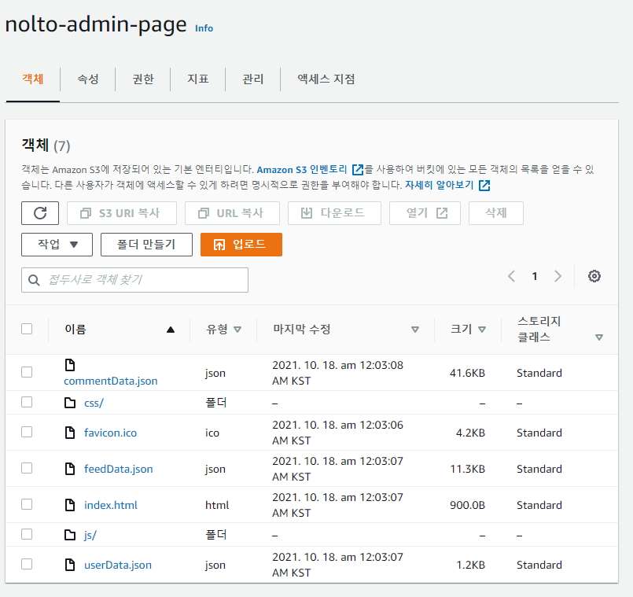
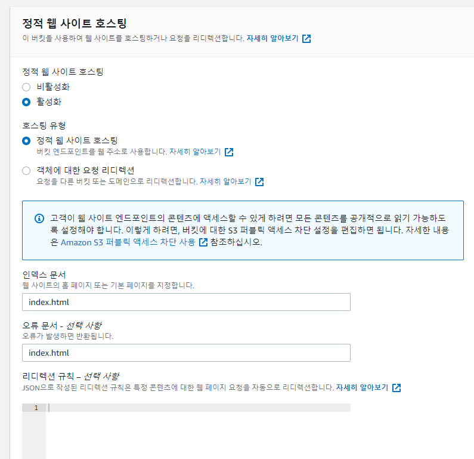
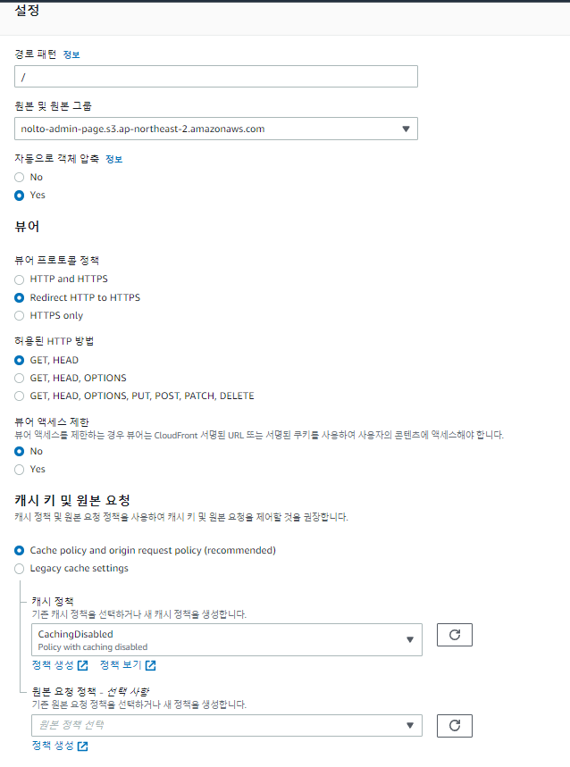
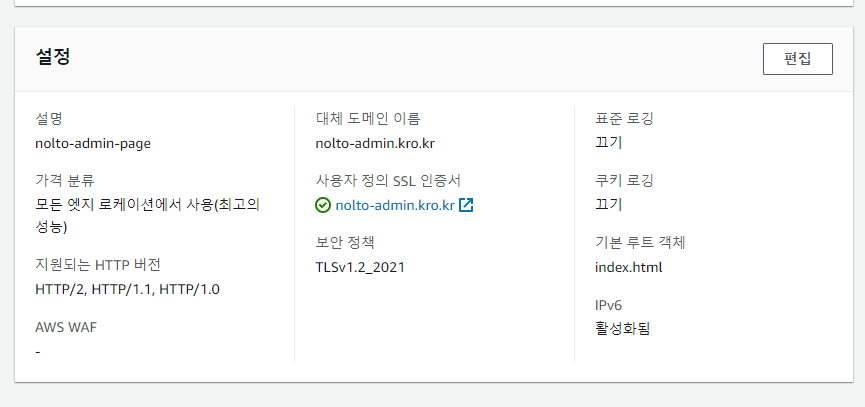
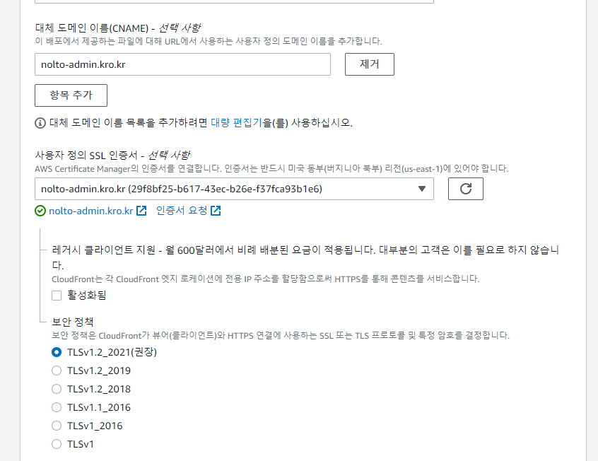
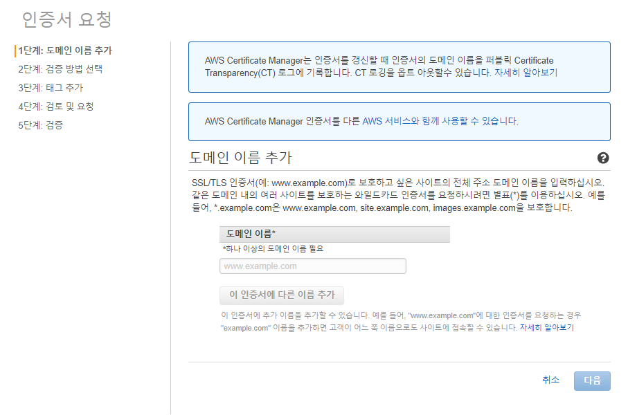
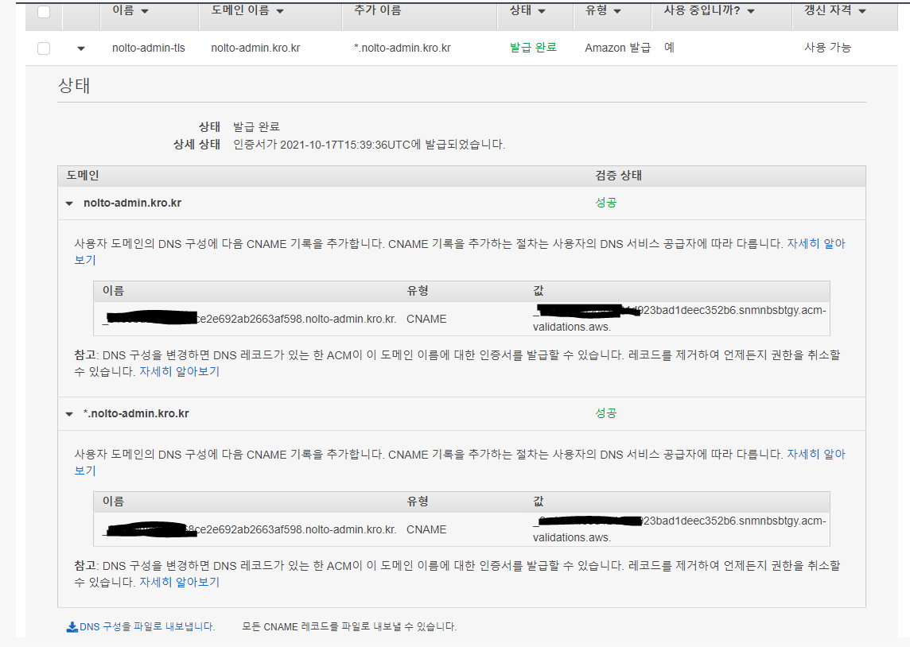
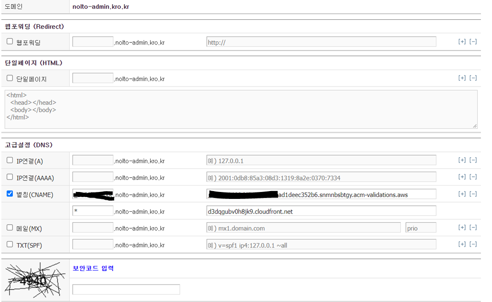
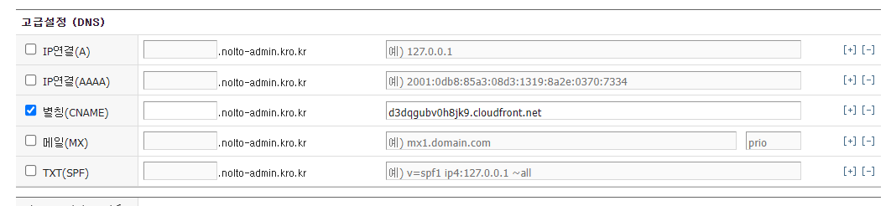

### 2021-10-18

## vue.js s3+cloudfront 배포
1. **vue.js npm run build**
    - dist 폴더에 지금까지 작업한 것 html/css/js로 만들어줌

2. **퍼블릭 액세스가 금지된 s3 버킷 하나 만들고, dist 폴더의 내용물 업로드**
    - 

3. **s3 속성 들어가서 정적 웹사이트 호스팅 편집 클릭**
    - 

4. **cloudfront에서 해당 s3 버킷에 접속할 수 있게 만들자**
    - OAI 만들어서 s3 정책 업데이트 하는 옵션으로 만들기

5. **cloudfront 동작 추가**
    - 경로패턴 "/" 으로 가도록 경로 추가
    - 뷰어 프로토콜 정책은 ssl 인증서 추가할거니까 redirect http to https로 설정!
    - 

6. **cloudfront - 일반 - 설정을 바꿔주자**
    - ssl 인증서 등록해주고, 기본 루트 객체 index.html 등록해주고
    - 
    
7. **cloudfront 설정을 조금 더 자세히 들여다보면,,,**
    - CNAME으로 별명 도메인 하나 등록해주고
    - ssl 인증서 발급 받은 것을 등록해주자
    - 

8. **저는 ssl 인증서 발급받은 적이 없는데요?**
    - 인증서 요청 버튼 클릭하시고 과정 거쳐서 하세요
    - 
    
9. **ssl 인증서 등록하는 과정에서 DNS CNAME 등록하는 과정이 있어**
    - ssl 인증하는 거 txt로 했던 거 기억나지?
    - 그런거 처럼 cname으로 코드 인증해서 ssl 인증서 받더라고
    - 
    - 

10. **ssl 인증서 이제 등록했으니 cname에 진또배기 도메인만 남기면 등록 끝!**    
    - 

