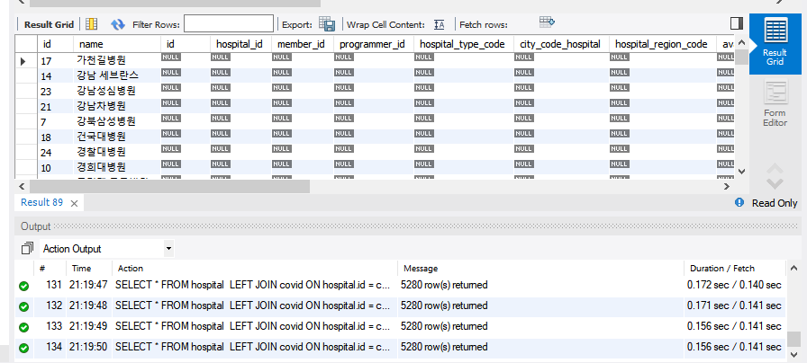

### 2021-10-20

## SQL 최적화 미션 피드백
- **레코드의 문자열은 대소문자를 구분하지 않는다!**
    - *참고: https://stackoverflow.com/questions/5629111/how-can-i-make-sql-case-sensitive-string-comparison-on-mysql/56283818*
    - 구분하려면 `BINARY` 키워드를 사용해라!
    - ex. SELECT * FROM `table` WHERE BINARY `column` = `value`

- **쿼리에서 대소문자를 통일할 것**
    - 예약어 같은 경우 대문자로!
    - 테이블과 칼럼은 소문자로!

- **인라인뷰란?**
    - SELECT 절의 결과를 FROM 절에서 하나의 테이블처럼 사용하고 싶은 경우

- **미리 where 조건을 판별한 후 JOIN vs 우선 JOIN을 끝내고 WHERE 판**
    - `미리 WHERE 조건을 판별하고 JOIN`의 장점으로는, 정말 조회 쿼리에서 필요한 필드만 가져와 사용할 수 있다는 것에 있다고 생각해요.  
    - `우선 JOIN을 모두 끝낸 후 WHERE 조건을 판별하는 것`은 제가 느끼기엔 쿼리문 자체의 가독성이 좋다고 판단했어요. (조건을 한번에 보여줘서...?)
    
    - 사실 모수를 줄여 테이블을 조인시키라는 CU의 강의를 토대로 `미리 WHERE 조건을 판별하고 JOIN`를 기반으로 쿼리 작성도 해봤는데, 생각보다 둘의 시간이 차이가 별로 없더라고요,,,   
        내가 인덱스를 잘 구축을 못했나 싶기도한데...  
        아니면 mysql에서 알아서 쿼리를 최적화 시켜 필요한 필드만 가져와서 조인하고 그러나 싶더라고요 (Driving & Driven 테이블은 쿼리에 쓴 순서와 상관없이 mysql이 알아서 효율적일 수 있도록 테이블들으르 배치해서 조인시키더라고요)   
        우선 제 생각은 그렇습니다!  
        (mysql에서 알아서 쿼리를 최적화 시켜 필요한 필드만 가져와서 조인하고 그러나) => 이건 조금 더 찾아볼게용

## JOIN ON + AND vs JOIN ON + WHERE
- *참고: https://stackoverflow.com/questions/354070/sql-join-where-clause-vs-on-clause*
- left/right join의 경우, 둘의 결과값은 다르다. 
    - 두 가지 쿼리의 결과를 비교해보자. 
        ```SQL
        SELECT * FROM hospital 
            LEFT JOIN covid ON hospital.id = covid.hospital_id
              WHERE hospital.id = 1;
        ```
        - 
        - 테이블의 왼쪽 id, name이 hospital의 테이블, 그 뒤가 covid 테이블
        - hospital_id 가 1인 레코드들이 where절에서 필터링되어 결과값으로 보여준다 (총 5249 row 반환)
        ```SQL
        SELECT * FROM hospital 
            LEFT JOIN covid ON hospital.id = covid.hospital_id
              AND hospital.id = 1;
        ```
        - 
        - hospital을 기반으로 left join을 진행한다. 
            - hospital의 해당 id가 hospital.id = 1이 아닌 hospital 튜플들은 covid 테이블이 null인 튜플들로 join된다. (총 hospital.id=1 인 5249 row + hospital.id=1아닌 31 row 반환)
- 왜 이러지...?
    - 나의 생각
        - 우선 WHERE과 AND의 용도 자체가 다르다고 생각
            - WHERE는 조인해놓은 테이블을 조건걸어 필터링할 때 사용
            - AND는 JOIN의 조건인 ON 절에서 조건을 더 걸어준 것이라 생각
        - 근거로는 괄호로 묶었을때 하나는 에러나고, 하나는 에러나지 않는 쿼리들!!
        ```sql
        SELECT * FROM (hospital 
            LEFT JOIN covid ON hospital.id = covid.hospital_id)
                WHERE hospital.id = 1;
        
        SELECT * FROM (hospital 
            LEFT JOIN covid ON hospital.id = covid.hospital_id)
                AND hospital.id = 1; => syntax error!
        --------------------------------------------------------
        SELECT * FROM hospital 
            LEFT JOIN covid ON (hospital.id = covid.hospital_id
                WHERE hospital.id = 1); => syntax error!
        
        SELECT * FROM hospital 
            LEFT JOIN covid ON (hospital.id = covid.hospital_id
                AND hospital.id = 1); 
        ```
- inner join 이라면 같은 결과값을 받아볼 것이다.
    - 두 테이블의 교집합만 살아남으니 교집합으로 join 후 테이블 필터링을 하던, 조건을 걸어 이를 바탕으로 join을 하던 같은 결과값!

## 다시 한 번 SQL 공부
- **커버링 인덱스란?**
    - *참고: https://gywn.net/2012/04/mysql-covering-index/*
    - 원하는 데이터를 인덱스에서만 추출할 수 있는 인덱스
        - BTree 스캔만으로 원하는 데이터를 가져올 수 있다. 
        - 굳이 칼럼 읽기 위해 데이터 블록 볼 필요 X
        - 인덱스만으로 원하는 데이터를 추출!
            - 데이터 추출을 인덱스에서만 수행하는 것!
    - Explain의 Extra를 보면 어떻게 데이터를 추출해오는지 알 수 있다!    
        - Using where: Range 검색 이후 데이터는 직접 데이터 필드에 접근하여 추출
        - Using index: 인덱스 만으로 원하는 데이터 추출
    - 블로그 예시
        - 테이블 생성
        ```sql
        create table usertest (
         userno int(11) not null auto_increment,
         userid varchar(20) not null default '',
         nickname varchar(20) not null default '',
         .. 중략 ..
         chgdate varchar(15) not null default '',
         primary key (userno),
         key chgdate (chgdate)
        ) engine=innodb;
        ```
        - 커버링 인덱스 (select)
        ```sql
        select chgdate , userno
        from usertest
        limit 100000, 100
        ```
            - Extra 필드: Using index
            - 인덱스만으로 원하는 데이터 추출하였음을 뜻함
        - 커버링 인덱스 (where)
        ```sql
        select *
        from usertest
        where chgdate like '2010%'
        limit 100000, 100
        ```
            - Extra 필드: Using where
            - Range 검색 이후 직접 데이터 필드에 접근하여 추출
        - 커버링 인덱스 쿼리
        ```sql
        select a.*
        from (
              select userno
              from usertest
              where chgdate like '2012%'
              limit 100000, 100
        ) b join usertest a on b.userno = a.userno
        ```
            - Extra 필드: Using where; Using index
            - Where로 처리된 결과 셋이 일정 범위 추출되나, 추출되는게 pk값인 userno
                - innodb에서는 모든 인덱스값에는 pk를 값으로 가짐
        - 커버링 인덱스 (order by)                
            - 이미 정렬되어 있기에 full scan 방지 가능
            1. 일반 쿼리
            ```sql
            select *
            from usertest
            order by chgdate
            limit 400000, 100
            ```
                - 인덱스 태워서 거기서 블록 읽는 것 보다, 무지성 풀스캔이 더 빨라!
            2. 커버링 인덱스 쿼리
            ```sql
            select a.*
            from (
                  select userno
                  from usertest
                  order by chgdate
                  limit 400000, 100
            ) b join usertest a on b.userno = a.userno
            ```
                - 이렇게 진짜 인덱스의 정보만 요청할 경우 뚝딱 커버링 인덱스로 커버 가능

- **InnoDB는 뭐야?**
    - MySQL을 위한 데이터베이스 엔진
    - 경쟁자인 MyISAM 보다 더 많은 기능 지원
        - MVCC 지원
        - ACID 트랜잭션 처리
        - FK 지원
        - row level lock 등
    - 특징
        - 대용량의 데이터 컨트롤하는 경우
        - 트랜잭션의 관리가 필요한 경우
        - 복구가 필요한 경우
        - 정렬등의 구문이 들어가는 경우
        - 높은 퍼포먼스가 필요한 대용량 사이트에 적합
    - 장점
        - 데이터 무결성 보장
        - 동시적 제어 가능
        - 제약 조건, FK 생성 가능
        - Row Level Lock (행 단위 Lock) 사용하여 INSERT, UPDATE, DELETE 속도 빠름
        - 트랜잭션을 지원해 transaction-safe 테이블 관리
    - 단점
        - 복구 방법이 어려움
        - 데드락 가능성 O
        - 여러기능 존재하기에 모델 디자인 시간 Up
        - 시스템 자원 많이 차지함
        - Full-text 인덱싱이 불가능 => 그래서 text를 varchar(255)로 바꿔서 인덱스 걸어준거구나

- **Query Cost가 무엇인지?**
    - Execution plan의 cost는 얼마나 많은 CPU와 I/O 자원들이 쿼리 수행에 들어갈지를 뜻함
        - 다만 추정치라 틀릴 수도 있다. 

- **Explain의 filtered가 무엇인지?**
    - *참고: https://dba.stackexchange.com/questions/164251/what-is-the-meaning-of-filtered-in-mysql-explain*
    - `filter`란 row의 set에 조건을 적용해, 해당 조건을 만족시키는 row만 남기는 것
        - MySQL은 인덱스를 먼저 쓸 거고 range 스캔등을 통해 해당 조건을 만족시키는 row를 추출할 거야
    - `filtered`란 추출된 row들에 where 절등의 최종 조건을 통해 찐으로 남은 것의 비율이야 
        - (where 통해 찐으로 남은 것/인덱스로 추출된 row)
        - 그니까 인덱스 태워서 range scan으로 174 row 뽑고, where 절 적용시켜 32 row가 남았어. 
            - 32/174 = 18%가 filtered 인것이지
    - 좋은 인덱스 탐색은 찐으로 필요한 것만 쭉 뽑아오는 거겠지? 
        - `filtered=100%`
    - 그렇다코 filtered가 100%라고 최고의 쿼리 최적화란건 아니야
        - filesort를 없애는 것이 나을수도
        - 제약 조건을 거는것이 나을수도

- **Extra: Using Index Condition**
    - 배경 지식
        - 
        - MySQL에서는 내부적으로 MySQL 엔진과 스토리지 엔진(InnoDB)로 구성
            - 스토리지 엔진이 데이터 넘겨주면 <= 얘가 인덱스 담당
            - MySQL 엔진이 필터링 혹은 체크 조건으로 확인 <= 얘가 where 담당
    - 예시와 함께    
        ```sql
        ALTER TABLE temp_ad_offset ADD INDEX idx_temp_ad_offset_2 (customer_id, offset_type);
        
        select *
        from temp_ad_offset
        where customer_id = 7 and offset_type like '%LIST';
        ```     
    - Using Index Condition
        - Extra: Using where
            - 이렇게 스토리지 엔진 & MySQL 엔진을 둘 다 타게되면 
            - customer_id = 7인 데이터를 테이블에서 모두 찾아 MySQL 엔진에 줌 <= by InnoDB
            - MySQL 엔진에서 하나하나 `offset_type like '%LIST'` 확인
        - `ALTER TABLE temp_ad_offset ADD INDEX idx_temp_ad_offset_2 (customer_id, offset_type);`
            - 근데 customer_id = 7를 통해 인덱스 읽은 상태인데 offset_type 비교를 테이블에서 또하는거 좀 비효율적이자나?
        - Extra: Using Index Condition
            - 인덱스 혜택을 못보더라도 InnoDB한테 조건 넘겨!
            - 최대한 InnoDB에서 걸르고 걸러 MySQL 엔진에게 전달되도록 개선되었음
            - 이게 인덱스 푸시 다운
            - MariaDB 5.3 이상, MySQL 5.6 이상 부터 돔
            - MariaDB 10.x 버전이면 기본 옵션 ON
   