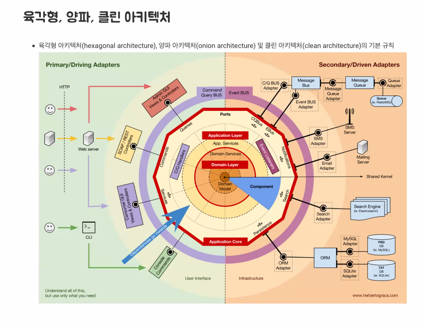

### 2021-10-26

## 제이슨 Domain Driven Development 수업
- **Junior가 DDD를?**
    - 정해진 걸 제대로 구현하는 Junior에서 어떻게 큰 그림을 구현해낼지 Senior가 되는 과정!
    - DDD 공부하다보면 다양한 패턴과 규칙들이 나오는데, 여기에 매몰되면 본질을 잃어버려!
    - 중요한 것은 구성원들이 비즈니스 문제를 잘 정의하고 동일한 비즈니스 용어를 사용하면서 소통하는 것!
        - SW의 가치는 정해진 사용자의 문제를 해결하기 위함에 있음을 기억하자!

- **Data Driven 개발은 안 좋아요?**
    - DB부터 짠다 == 내가 개발하는 산업의 특징에 큰 관심이 없다로 이어짐

- **Domain?**
    - SW로 풀고자하는 문제
    - ex. 요구사항: 센터 매니저가 재고 부족 시 부족한 품목을 확인할 수 있도록 보고서를 인쇄해달라!
        - 제고를 자동으로 주문하는 시스템을 만드는게 낫지 않을까?

- **Domain Model**
    - Model: 내가 보여주고 싶은 기능만 보여주는 기능!
        - Point Of Interest
    - 추상화된 무엇 (Domain 추상화)
        - 기획/UI,UX/코드에도 모두 등장함!

- **유비쿼터스 언어**
    - Domain modeling을 하면서 기획자/PM/이해관계자들 다 들어와
    - 영업하는 사람들도 이해할 수 있는 언어를 만들자!

- **Bounded Context**
    - Model이란 것도 특정한 Context에서 완전한 의미를 갖는다
        - 피자가 레스토랑에 있으면 음식
        - 피자가 쓰레기통에 있으면 쓰레기
    - Context 단위로 잘라서 생각하자
    - Context Map
        - 이렇게 만든 컨텍스트는 각각 다른 컨텍스트들과 약한 결합으로 소통
    - 후임자의 도메인에 대한 이해도를 위해,,,
        - Domain Legacy를 알아먹게 하기 위해서 miro나 github wiki 등으로 잘 기록해두자. 
        - 해당 도메인이 어떤 절차를 거쳐 어떻게 프로세스가 진행되는지        

- **Aggregate**
    - 관련 객체 하나로 군집: 내가 다루고자 하는 비즈니스와 규칙의 묶음
    - Context가 멀리서 바라보는 관점이었다면, Aggregate는 조금 더 자세히 들어가서!
    - Aggregate 중 핵심은 Root Entity!
        - Root Entity끼리만 소통하는 것이 좋아보임
    - 불변성(일관성)을 지키는 것이 좋다!

- **Repository**
    - Aggregate 단위를 조회/저장 할 수 있음
    - 대신 Repository로 조회시, 온전한 Aggregate를 가져와야함!

- **육각형/양파/클린 아키텍쳐**
    - 
    - 자연스럽게 도메인을 잘 감싸서 보호하는 육각형 아키텍쳐로 진화!
    