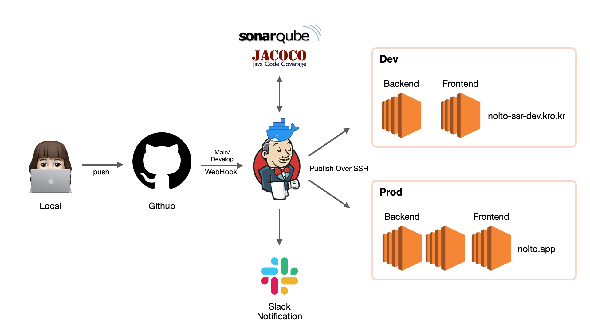
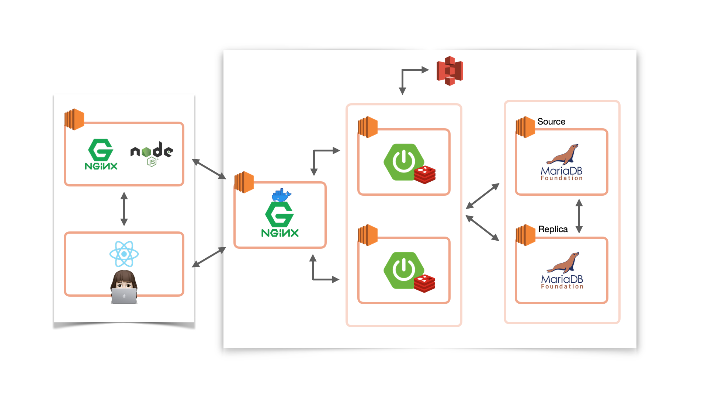

### 2021-10-29

## 놀토 CI/CD

- 도커 위에 젠킨스를 띄워서 사용 중
- Freestyle Job으로 배포 프로세스 구성
- 깃헙 웹훅을 활용하여, 지정한 브랜치에 커밋 발생 시 젠킨스에서 해당 브랜치 Pull 땡겨서 자동 빌드하도록 구성
    - 사용자의 깃헙이 맞다는 것을 인증하기 위해, 깃헙 ID/PW를 사용하거나, token등을 발급받아 인가 과정을 거칠 수 있음
- 빌드가 끝난 배포 파일은 지정된 인스턴스로 `publish over ssh`를 통해 전달
    - 빌드 파일 전달 후, 지정된 shell script를 돌려 배포 자동화
- 슬랙과 연동하여 젠킨스 빌드 성공 여부를 전달

## 놀토 로그인 과정
- **최초 로그인 과정**
    1. 클라이언트가 구글/깃헙 로그인 버튼을 누름
    2. 클라이언트는 구글/깃헙 OAuth 창으로 이동
        - 이동된 URL 예시: https://accounts.google.com/o/oauth2/v2/auth?client_id=277965090927-qqsrt756196gpb9h1a2ehp1gfc3hm21n.apps.googleusercontent.com&redirect_uri=https%3A%2F%2Fnolto.app%2Fgoogle%2Fcallback&scope=profile&response_type=code
            - 쿼리 파라미터로 놀토의 client_id, 로그인 성공 이후 redirect할 redirect_uri, 어느 정도의 정보를 받아올지 scope, code를 통해 추후 사용자 검증을 처리할 것을 명시하고 있다.
        - 구글/깃헙에서 로그인 후에 백엔드에 다음과 같이 요청 
            - 요청 예시: https://nolto.app/google/callback?code=4%2F0AX4XfWhsIyMhhfeXAYm_66uxcxG4ri3PU9cqa3zfW9F5BuCCUeO8pL6jqD7ooDks5Ap1xg&scope=profile+https%3A%2F%2Fwww.googleapis.com%2Fauth%2Fuserinfo.profile
                - 구글로 부터 받아온 코드를 백엔드로 넘겨준다
    3. 백엔드에서 구글 측에 해당 코드를 담아 토큰 발급 요청을 보낸다.
        - 구글측에서 코드의 유효성을 검사하고, access_token을 발급해줌
    4. 백엔드에서 구글 측에 access_token을 담아 유저 정보 요청을 보낸다
    5. 구글에서 받아온 유저 정보를 DB에 저장한다.
    6. 백엔드에서 AccessToken(만료기간 2시간) 과 RefreshToken(만료기간 2주) 을 발급한다.
        - RefreshToken을 발급하면서, 클라이언트의 Ip와 함께 레디스에 저장한다.
    7. 클라이언트 측에서 이를 응답받아 RefreshToken은 쿠키에, AccessToken은 변수에 저장한다. 

- **2주 이내로 다시 방문한 클라이언트**
    1. AccessToken은 만료되었지만, 아직 브라우저 쿠키에 RefresToken은 남아있음
    2. 최초 놀토 페이지에 접속하면서 쿠키에 RefreshToken을 담아 SSR 서버에 요청
    3. SSR 서버에서 RefreshToken의 유효성을 백엔드 서버에 질의
    4. 백엔드의 Redis에서 RefreshToken에 대응되는 ClientIp를 꺼내옴
    5. 해당 ClientIp가 요청된 ClientIp가 맞는지 확인
    6. 둘이 일치한다면 새로운 AccessToken과 RefreshToken을 발급해줌
        - 만약 다르다면 로그인 풀어버림
        - 로그인 하세요 HTML을 SSR에서 내려주게됨
    7. 클라이언트 측에서 RefreshToken은 쿠키에, AccessToken은 변수에 저장한다.

- **RefreshToken도 쿠키에 없는 사용자**
    1. 그냥 SSR 서버에서 로그인 요청 HTML 내려줌

## 놀토 인프라 구조

- **프론트**
    - 클라이언트가 최초로 페이지 접속 시 SSR된 HTML 페이지를 내려받음
        - HTML 태그에서 요청한 CSS/JS/Image 정적 자원들을 네트워크 요청으로 내려받음
    - 이후 클라이언트의 페이지 이동은 ReactJS 기반으로 페이지 이동없이 처리됨

- **백엔드**
    - [Web Server]
        - 주소: https://nolto.kro.kr 
        - 도커 위의 nginx로 구성된 웹서버
        - 리버스 프록시의 역할수행
        - ssl termination
        - `ip_hash` 옵션을 사용하여, 클라이언트의 ip에 따라 할당된 WAS로 `proxy_pass`를 하게됨
        - `$http_referer`, `$remote_addr` 를 활용하여 요청을 허락하는 주소에 대해서만 WAS로의 처리를 요청
    - [WAS]
        - SpringBoot 2.5.2 버전 사용 중
        - 현재 두 개의 WAS를 구동 중
        - `ec2-s3 deploy` 권한을 부여하여 S3 버킷으로 이미지 업로드를 가능하게 지원
        - 레디스를 설치하여, refreshToken을 사용중인 clientIp를 저장하고 있음
            - 만약 refreshToken을 통한 재로그인 요청이 저장되지 않은 clientIp로 부터 온다면, 로그인 폐기
        - JPA를 통해 DB와 연결
            - Flyway를 통해 DB 형상 관리
            - Source에는 삽입/수정/삭제에 대한 요청을, Replica에는 조회에 대한 요청을 보냄
        - 로깅
            - ERROR 레벨 이상의 로그를 저장하는 nolto-error.log
                - Error 레벨의 로그가 출력된다면 지정한 slack 채널에 메시지를 보내도록 구성
            - INFO 레벨 이상의 로그를 저장하는 nolto-info.log 
            - 해당 로그 파일들은 하루가 지나면 datelog 디렉토리에 날짜와 함께 저장 
    - [DB]
        - MariaDB 10.5.12 버전 사용 중
        - DB Replication 도입
            - Source 1대, Replica 1대
