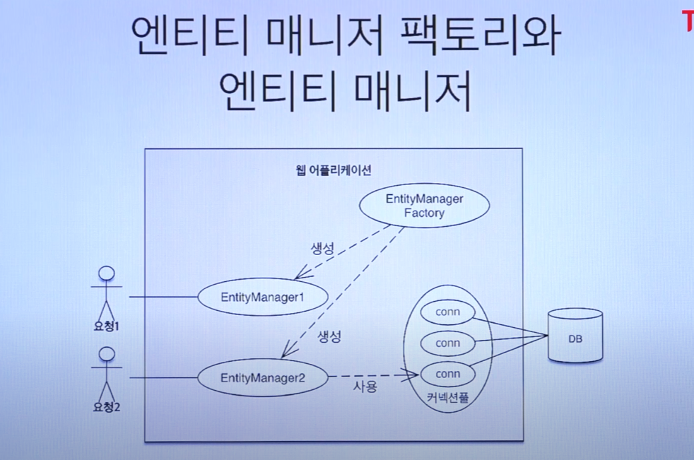
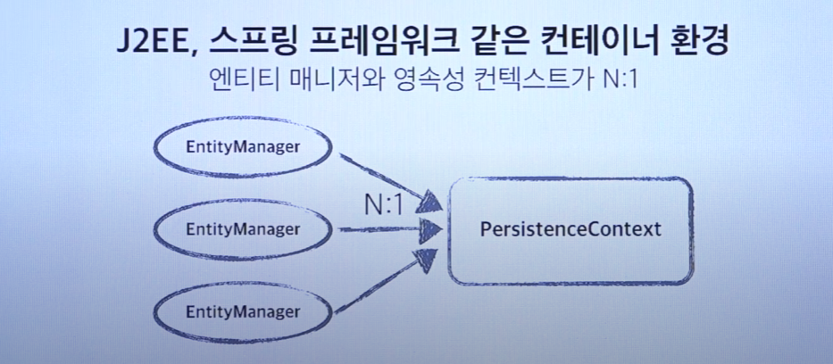

### 2021-10-31

## JPA 외래키 관리자 (미션 뇌절 기록)
- 우선 내가 하고 싶은 것: 테스트 코드에서 테이블_그룹1에 주문_테이블1, 주문_테이블2 연관관계 매핑
    ```sql
    CREATE TABLE order_table (
        id BIGINT(20) NOT NULL AUTO_INCREMENT,
        table_group_id BIGINT(20),
        number_of_guests INT(11) NOT NULL,
        empty BIT(1) NOT NULL,
        PRIMARY KEY (id)
    );

    CREATE TABLE table_group (
        id BIGINT(20) NOT NULL AUTO_INCREMENT,
        created_date DATETIME NOT NULL,
        PRIMARY KEY (id)
    );

    ALTER TABLE order_table
        ADD CONSTRAINT fk_order_table_table_group
            FOREIGN KEY (table_group_id) REFERENCES table_group (id);
    ```

- CASE1. 우선 오더테이블 만들고 저장하고, 테이블그룹에서 오더테이블의 테이블그룹 지정해주면 알아서 변경감지 되서 뚝딱 처리되겠지?
    ```java
    주문_테이블1.setNumberOfGuests(4);
    주문_테이블1.setEmpty(true);
    주문_테이블1.setTableGroup(null);
    orderTableRepository.save(주문_테이블1);

    주문_테이블2.setNumberOfGuests(2);
    주문_테이블2.setEmpty(true);
    주문_테이블2.setTableGroup(null);
    orderTableRepository.save(주문_테이블2);

    테이블_그룹1 = new TableGroup.Builder()
            .createdDate(LocalDateTime.now())
            .orderTables(Arrays.asList(주문_테이블1, 주문_테이블2))
            .build();
    tableGroupRepository.save(테이블_그룹1);
    ```

- CASE2. 어라 변경감지가 안되네? 이런식으로 수동으로 바꿔준 다음에 다시 저장해야하나?
    ```java
    주문_테이블1.setNumberOfGuests(4);
    주문_테이블1.setEmpty(true);
    주문_테이블1.setTableGroup(null);
    orderTableRepository.save(주문_테이블1);

    주문_테이블2.setNumberOfGuests(2);
    주문_테이블2.setEmpty(true);
    주문_테이블2.setTableGroup(null);
    orderTableRepository.save(주문_테이블2);

    테이블_그룹1 = new TableGroup.Builder()
            .createdDate(LocalDateTime.now())
            .orderTables(Arrays.asList(주문_테이블1, 주문_테이블2))
            .build();
    tableGroupRepository.save(테이블_그룹1);

    주문_테이블1.setTableGroup(테이블_그룹1);
    orderTableRepository.save(주문_테이블1);

    주문_테이블2.setTableGroup(테이블_그룹1);
    orderTableRepository.save(주문_테이블2);
    ```
    - 사실 이러면 되긴함.
    - 다만 주문_테이블.setTableGroup()은 굳이 할 필요 없음 (테이블_그룹1의 생성로직에 setTableGroup(this) 해줘서)
    - 쨋든 테이블 그룹을 만들고, save를 한번 더 해주면 되긴함.

- CASE3. 그러면 이런식으로 저장하면 괜찮지 않을까?
    ```java
    주문_테이블1.setNumberOfGuests(4);
    주문_테이블1.setEmpty(true);

    주문_테이블2.setNumberOfGuests(2);
    주문_테이블2.setEmpty(true);

    테이블_그룹1 = new TableGroup.Builder()
            .createdDate(LocalDateTime.now())
            .orderTables(Arrays.asList(주문_테이블1, 주문_테이블2))
            .build();
    tableGroupRepository.save(테이블_그룹1);
    orderTableRepository.save(주문_테이블1);
    orderTableRepository.save(주문_테이블2);
    ```
    - 여기서 외래키 관리자는 OrderTable임.
        - 이말인 즉슨, OrderTable에서만 table_group_id 필드 속성을 가지고 놀 수 있다는 뜻
        - TableGroup에서는 해당 외래키를 그냥 조회해올때만 쓸 수 있음.
    - 따라서 TableGroup을 만들면서 OrderTable들의 tableGroup을 지정해주고,
        - 테이블_그룹1을 저장, 이후에 주문_테이블1/2를 저장하는 순서가 맞음
    - TableGroup의 경우 쿼리가 이렇게 밖에 안나가
        - (이 테이블이 OrderTable에 대해 알 길이 없음)
        - 왜냐하면 OrderTable이 외래키를 담당하는 관리자라서!
        ```
        Hibernate:
            insert
            into
                table_group
                (id, created_date)
            values
                (null, ?)
        2021-10-31 11:10:34.351 TRACE 18148 --- [    Test worker] o.h.type.descriptor.sql.BasicBinder      : binding parameter [1] as [TIMESTAMP] - [2021-10-31T11:10:34.290]
        ```

## JPA 변경 감지 (미션 뇌절 기록)
- 근데 왜 변경 감지가 안 일어나지...?
    ```java
    @DisplayName("테이블 그룹 관련 기능")
    @Transactional
    class TableGroupAcceptanceTest extends AcceptanceTest {

        TableGroup 테이블_그룹1;
        OrderTable 주문_테이블1 = new OrderTable();
        OrderTable 주문_테이블2 = new OrderTable();

        Order 주문1 = new Order();
        Order 주문2 = new Order();

        @Autowired
        EntityManager em;

        @BeforeEach
        void setUp() {
            주문_테이블1.setNumberOfGuests(4);
            주문_테이블1.setEmpty(true);
            주문_테이블1.setTableGroup(null);
            orderTableRepository.save(주문_테이블1);

            주문_테이블2.setNumberOfGuests(2);
            주문_테이블2.setEmpty(true);
            주문_테이블2.setTableGroup(null);
            orderTableRepository.save(주문_테이블2);

            테이블_그룹1 = new TableGroup.Builder()
                    .createdDate(LocalDateTime.now())
                    .orderTables(Arrays.asList(주문_테이블1, 주문_테이블2))
                    .build();
            tableGroupRepository.save(테이블_그룹1);

            주문1.setOrderTable(주문_테이블1);
            주문1.setOrderStatus(OrderStatus.COMPLETION);
            주문1.setOrderedTime(LocalDateTime.now());
            orderRepository.save(주문1);

            주문2.setOrderTable(주문_테이블2);
            주문2.setOrderStatus(OrderStatus.COMPLETION);
            주문2.setOrderedTime(LocalDateTime.now());
            orderRepository.save(주문2);

            em.flush();
            em.clear();
        }
    ```
    - 드디어 나온 반가운 변경감지 엉엉
    - em.flush(), em.clear()를 하면서 해당 엔티티 매니저를 플러쉬해주면 변경감지가 일어나서 update 쿼리가 날라간다.
    - 아마 **하나의 영속성 컨텍스트** 를 사용해야 변경감지가 일어날텐데 그 전 코드에서는,,,
        - 매번 엔티티 save해버리고, 트랜잭션 끝내고, 영속성 컨텍스트 폐기되어서 발생하는 일이 아닌가 싶음

## 트랜잭션, 엔티티매니저, 영속성 컨텍스트
- *참고: https://www.youtube.com/watch?v=PMNSeD25Qko&t=852s*


- **엔티티 매니저 팩토리와 엔티티 매니저**
    - *참고: https://ultrakain.gitbooks.io/jpa/content/chapter3/chapter3.1.html*
    - 엔티티매니저는 쓰레드별로 공유할 수 없음
    - 각 쓰레드별로 DB 연결 필요할 때 고유한 엔티티매니저를 얻는다
    - 데이터베이스 연결이 필요한 시점까지 커넥션을 얻지 않는다.
    - 스프링에서는 트랜잭션 수행할 때 생성
    - 엔티티 매니저 내부가 DB connection 씀

- **하나의 트랜잭션은 언제 생성되는가?**
    - 데이터베이스에 접속할 때 생기지!
    - 고로 트랜잭션 어노테이션이 없다면 save메서드 때려버릴때 마다 하나의 트랜잭션 생겼다 닫혔다 하는겨
        - 트랜잭션 어노테이션 붙었으면 스프링에서 해당 트랜잭션의 커넥션을 위해 공간을 하나 파뒀다가, 그 커넥션으로 다 DB 요청 때리고 close 하겠지?

- **하나의 트랜잭션당 하나의 영속성 컨텍스트?**
    - 같은 트랜잭션이라면, 하나의 영속성 컨텍스트에 접근하게 됩니다.
    - 영속성 컨텍스트의 기본값은 Transaction-scoped 영속성 컨텍스트
    - 트랜잭션이 끝나면, 영속성 컨텍스트에 있던 엔티티는 DB에 저장됨
    - 트랜잭션 안에서 operation이 수행되면, 엔티티매니저는 영속성 컨텍스트를 사용

- **하나의 엔티티매니저 == 하나의 트랜잭션?**
    - *참고: https://stackoverflow.com/questions/28620419/spring-transactions-entitymanager-lifecycle*
    - 각 트랜잭션 별로 엔티티매니저가 생성될 듯
    - 트랜잭션을 생성해야한다면, 엔티티매니저팩토리로 부터 엔티티매니저 할당받아 해당 쓰레드에서 트랜잭션 처리

- **하나의 엔티티 매니저당 하나의 영속성 컨텍스트?**
    - J2SE 환경에서는 엔티티 매니저와 영속성 컨텍스트가 1:1
    - J2EE, 스프링 프레임워크 같은 컨테이너 환경에서는 엔티티 매니저와 영속성 컨텍스트가 N:1
        - 내가 프로덕션 코드에 `@Autowired EntityManager` 를 안해봐서 느낌이 안오는 듯...
        - 하... 이해가 안되네. 1:1 아니야?
        - 기본적으로 트랜잭션별로 엔티티매니저, 영속성 컨텍스트 생기는 것 같은데...
    - 우선 `@Transactional` 붙이면
        - 트랜잭션 한개, 엔티티매니저 한개, 영속성 컨텍스트 한개인듯

## `@Transactional`의 쓰임
- 선언적 트랜잭션
- 우선 하나 오류나면 전체 롤백하는데 쓰임 (무결성 보호)
    - 로직상 싹다 알맞아야 커밋
- JPA 같은 경우, 여러가지 액션을 하나의 트랜잭션으로 묶어놓음으로써 영속성 컨텍스트에 대한 활용도를 높일 수 있음
    - 가령 변경감지.
    - 같은 트랜잭션이라면, 하나의 영속성 컨텍스트에 접근하게 됩니다.
- readOnly 속성줘서 DB Datasource 갈아끼우는 코드도 쓴적 있고

## 엔티티매니저란?
- *참고: https://www.baeldung.com/hibernate-entitymanager*
- **개요**
    - 엔티티매니저란 JPA의 부분으로, JPA 2.0 스펙을 따르는 프로그래밍 인터페이스이자 라이프사이클 규칙을 담당
    - 엔티티매니저의 API들을 통해 영속성 컨텍스트에 접근할 수 있음

- **두 가지 종류의 엔티티매니저가 있음**
    - Container-Managed (Spring Framework)
        - 컨테이너가 엔티티매니저를 컴포넌트에 주입
        - 컨테이너가 엔티티매니저팩토리로부터 엔티티매니저를 생성하여 이를 주입
        - 실제 트랜잭션 단위 수행할 떄 마다 생성
        - 컨테이너가 트랜잭션 시작을 담당하고, 커밋/롤백까지 다 담당
        - 엔티티매니저 Close까지 담당
    - Application-Managed
        - 수동으로 엔티티매니저 생성하고, 관리까지 해야해
        - 엔티티매니저팩토리 생성하고, 수동으로 열고/닫기까지해야함

- **쓰레드 세이프?**
    - 엔티티매니저팩토리는 Thread-Safe
    - 엔티티매니저는 Thread-Safe 하지 않음
        - 이말인 즉슨, 각 쓰레드별로 엔티티매니저를 할당받아야해
        - 그러고 쓰레드에서 다 쓰면 엔티티매니저 close 해야해
    - Application-Managed에서는 그냥 각 쓰레드별로 선언적으로 엔티티매니저 생성해서 쓰면 됨
        ```java
        EntityManagerFactory emf = // fetched from somewhere
        EntityManager em = emf.createEntityManager();
        // use it in the current thread
        ```
    - Container-Managed에서는 직관에서 조금 벗어남
        ```java
        @Service
        public class MovieService {

            @Autowired
            private EntityManager entityManager;
        }
        ```
        - 어라...? 쓰레드별로 entityManager있는거 아니였누?
        - 사실 Spring에서는 EntityManger 대신 특별한 프록시를 넣어줘.
            - SharedEntityManagerCreater 타입의 프록시임
        - 즉, 엔티티매니저 쓸 때마다, 이 프록시가 존재하는 엔티티매니저를 재사용하거나 (쓰레드풀 갬성이네), 혹은 새로운 엔티티 매니저 생성
        - 어떤 방법으로든, 컨테이너는 하나의 쓰레드별로 하나의 엔티티매니저 할당하도록 함

- **엔티티매니저 API는 영속성컨텍스트/DB에 접근 가능**
    1. em.persist()
        - DB에 저장
    2. em.find(), em.getReference()
        - DB에서 조회
        - 뒤에껀 참조만 가진 프록시로 반환
    3. em.detach(movie)
        - 준영속 상태로 넘겨!
    4. em.merge(movie)
        - 많은 어플리케이션에서 엔티티가 트랜잭션들을 크로스하면서 변경이 일어남
        - 준영속된 엔티티에 변경사항을 반영하도록 할 수 있음
    5. em.createQuery()
        - JPQL의 내부동작이 이런식으로 일어남
        - 쿼리 만들어서 DB에 쏠 수 있음
    6. em.remove(movie)
        - DB에서 해당 엔티티 지워!

## 영속성 컨텍스트란?
- *참고: https://www.baeldung.com/jpa-hibernate-persistence-context*
- **개요**
    - 하이버네이트와 같은 JPA 벤더는, 영속성 컨텍스트를 통해 엔티티의 라이프사이클을 관리

- **정의**
    - 엔티티매니저 인스턴스는 영속성 컨텍스트와 연관이 됨
    - 영속성 컨텍스트는 모든 영속화된 엔티티 ID에 대해 고유한 엔티티 인스튼스 집합
    - 영속성 컨텍스트를 통해 엔티티 인스턴스의 라이프사이클이 관리된다
    - 엔티티매니저 API는 영속화된 엔티티를 생성/삭제/조회/쿼리 하도록 지원한다.

- **정리하자면**
    - 영속성 컨텍스트는 first-level 캐시로서, DB에서 fetch하고, save하는 주체
    - 영속성 컨텍스트는 우리가 관리중인 엔티티의 변화를 예의주시중
    - "트랜잭션"에서 변경이 감지되면 더티체킹 후 변경사항 저장
    - 엔티티매니저를 통해 영속성 컨텍스트와 인터랙트 할 수 있음
        - 엔티티매니저를 쓰는거라면, 사실 영속성 컨텍스트를 쓰는 것과 같음

- **두가지 타입의 영속성 컨텍스트**
    1. Transaction-scoped 영속성 컨텍스트
        - 트랜잭션이 끝나면, 영속성 컨텍스트에 있던 엔티티는 DB에 저장됨
        - 트랜잭션 안에서 operation이 수행되면, 엔티티매니저는 영속성 컨텍스트를 사용
        - 이게 기본적인 영속성 컨텍스트의 타입임
           - PersistenceContextType.TRANSACTION
    2. Extened-Scope 영속성 컨텍스트
        - 여러개의 트랜잭션에 펴져 있을 수 있음
        - 트랜잭션 없이 영속화 가능. 하지만 flush는 트랜잭션 필요
