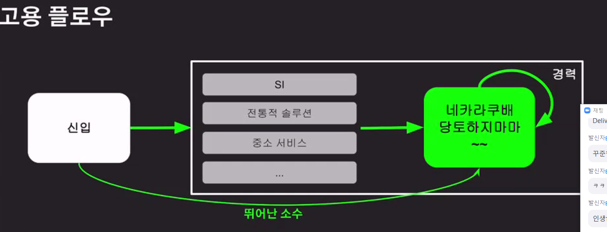

### 2021-11-02

## 이력서 특강
- **회사들의 원하는 역량 수준 샹향 평준화**
    - 네카라쿠배 들어가면 어디든 이직 가능
        - 절대선을 넘는다면 어디든 갈 수 있다!
        - 현재 실력을 올려야 한다!
    - 다만 하나 못들어가면 어디든 못감

- **네카라쿠배토당야하지마마...**
    - 
    - 신입을 많이 뽑지 않아요...
    - 한번에 갈 필요는 없다!
    - 지속적인 노력이면 갈 수 잇어~!
    - Fail Fast

- **나를 채용해야하는 이유?**
    1. 나를 채용해야하는 이뉴는 ~~이기 떄문이다! 답변할 수 있어야 해

- **나를 잘 알리는 방법**
    - 나의 실력이 가장 중요!
        - Continuous
        - 나를 끊임없이 성장!
        - 글쓰기, 말하기, 코딩등으로 표현해야함
    - 나의 실력 과대평가해선 X => 아는것과 모르는것을 정확히
    - 나를 못 보여줘도 X => 준비를 해야해~!
    - 나를 정확히 알고 표현할 수 있어야함!
    - 아는 것과 모르는 것을 정확히 파악해야해!
    - 이력서는 나를 알아가는 "알파와 오메가"
        - 현재 나의 모습은 이래요~
        - 꾸준히 업데이트하여 내가 어떻게 성장중인지를 기록하자

- **이력서는 누가 읽는가?**
    - 사람이 읽는다
        - 읽기 편해야 한다
        - 기본적인 글쓰기 능력은 중요하다!
            - 한문장 길게 X
            - 주어 술어 명확
            - 한문단에는 하나의 주제만!
            - 글쓰기 = 말하기 = 코딩
    - 개발리더가 읽는다
        - 매력적이어야 한다
    - 예시를 통해 보기
        - 인터페이스만 있으면 안대~~~~~ 구현체가 진짜 필요해~~~~~~!
        - 정보를 전달할 수 있어야해! 읽는 사람한테 도움이 되는 정보를 제공해야해!

- **목표는 실력있는 개발자가 되는 것!**
    - 개발리더가 가장 매력적으로 생각하는 것은 무엇일까?
        1. 기본기가 탄탄한가? (1차 면접)
            - 정말 프레임워크, 인프라, 언어자체에 대한 지식이 풍부한가?
        2. 구현 능력이 있는가? (이력서/1차 면접)
            - 결국 구현을 할 줄 아는게 중요
        3. 꾸준한 성장 & 가능성 (이력서/1차 면접)
        4. 인성/태도/커뮤니케이션/협업 (2차 면접)

- **이력서의 구성 (여기가 중요~~~)**
    - 이름/전화번호/이메일
    - 깃헙/블로그 (중요!) 
        - 자기소개가 거짓이 아니라는 증명! => 성실과 열정 증명
        - code push, blog post
        - 새로운 기술 얼마나 관심
        - 따로 만드는 서비스?
    - 자기소개
        - 어떻게 개발을 시작했는가?
        - 나는 왜 개발자가 잘 맞는가?
        - 좋은 개발자가 되기 위해 어떤 노력하는가?
        - 자기소개서가 이력서, 포트폴리오, 면접 등에서 증명되어야 함
        - 경력이 없기에 일상생활을 이용한 은유/직유로 증명
            - ex. 끈기있는 개발자가 될 것이다 -> 기타연주를 전문가 수준까지 연습했다
        - 꾸준하게 리팩터링한 내용을 구체적으로 목록화 할 것!
        - 정보 공유 능력 (문서 작성, 커뮤니케이션 포함)
        - 구성원간 갈등 발견 및 해결
        - Leadership & Ownership
    - 보유기술
        - 화려하지 않고 담백하게 
        - 많은양을 차지하지 않게
        - 메인기술은 볼드처리
    - 경력사항/포트폴리오
        - 설계방법, 구현내용, 성과, 문제해결
        - DevOps는?
            - 적정기술을 활용할 수 있다
            - 빠른 학습후 적용이 가능하다
        - TDD, 리팩터링?
            - 이것도 진실이 중요하다!
            - 말보다는 행동!
            - 내가 실행하면서 느낀점에 솔직하자!
                - 살아있는 나의 이야기를 들려주자~!
    - 학력 사항
        - 학력은 당당하게 기입하세요
    - 교육/스터디/기타활동
        - 무슨 교육 받았고, 왜 받았고 담백하게 쓰기
        - 굳이 감정을 녹일필요는 X

- **중요 사항**
    - 결국 내 것으로 진짜 소화했는가?

- **이력서는 나를 정리하는 최종 산출물**
    - 내가 옳은 방향으로 가고있는지 점검한다
    - 나 자신을 있는 그대로 잘 담아야 한다
    - 그 담긴 것이 개발자로써 매력적이어야 한다
    - 이력서는 나의 장점, 단점, 보완할 점 등을 발견하게 해준다
    - 6개월에 한번씩 이력서를 업데이트 한다
    - 이력서가 면접의 방향성과 범위를 좌우
        - 조금이라도 해본것 다 화려하게 기록 => 면접때 물어보면 다 털림
        - 내가 경험하고 자신있는 경기장으로 끌고 들어와야함
