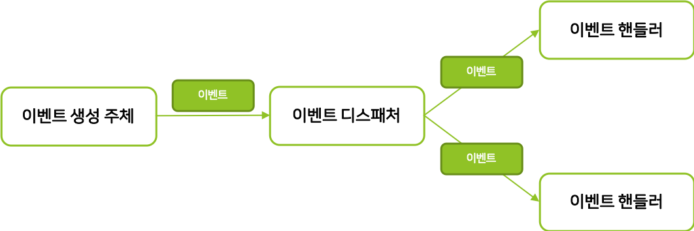

### 2021-11-05

## 의존성 리팩터링 미션
- **도메인 이벤트**
    - 강한 결합 vs 느슨한 결합
        - 외부 서비스가 정상이 아닐 경우 트랜잭션 처리가 애매해짐
        - 외부 서비스 성능에 직접적인 영향을 받는 문제가 있음
        - 도메인 객체에 서비스를 전달하면 X
    - "비동기 이벤트"를 사용하면 두 시스템간의 결합을 크게 낮출 수 있음!

- **이벤트**
    - 이벤트 구성 요소
        - 이벤트가 발생한다 == 상태가 변경됐다
        - 
        - 도메인 모델에서 이벤트 주체 == 엔티티, 밸류, 도메인 서비스
        - 도메인 객체 == 도메인 로직을 실행해 상태가 바뀌면 관련 이벤트 발생
        - 이벤트 핸들러는 이벤트 생성 주체가 발생한 이벤트에 반응
        - 이벤트 생성 주체 <--- 이벤트 디스패처 ---> 이벤트 핸들러
    
    - 이벤트의 구성
        - 과거의 것을 표현하기에 네이밍은 과거 시제로
        - 이벤트 핸들러가 작업을 수행하는데 필요한 최소한의 데이터를 담을 것
    
    - 이벤트 용도
        - 도메인의 상태가 바뀔 때, 후처리를 위한 트리거로 사용가능
        - 이벤트의 두 번째 용도는 다른 시스템 간의 데이터 동기화
    
    - 이벤트 장점
        - 서로 다른 도메인 로직 섞이는 것을 방지
        - 이벤트 핸들러를 통한 용이한 기능 확장
        
    - 비동기 이벤트 처리
        - 로컬 핸들러를 비동기로 실행
        - 메시지 큐 사용
        - 이벤트 저장소, 이벤트 포워더, 이벤트 제공 API

    - 스프링에서는?
        - ApplicationEventPublisher
            - ApplicationEvent 상속
            - ApplicationEventPublisher.publishEvent();
            - ApplicationEventPublisherAware
        - ApplicationListener 상속
            - `@EventListener`
            - `@Order`
            - `@Async (@EnableAsync)`

## 스프링부트 이벤트리스너
- *참고: https://brunch.co.kr/@springboot/422*
- **Overview**
    - 주문을 담당하는 Order에서 결제 로직을 담당
        - 주문 로직과 결제 로직이 섞이게 됨

- **Spring Event(1)**
    - 스프링 4.2 이하
    - ApplicationEvent를 상속받아 구현한 이벤트 객체
    - ApplicationListener 인터페이스를 구현한 이벤트 리스너

- **Spring Event(2)**
    - 스프링 4.2 부터
    - `@EventListener`를 활용한 이벤트 정의
