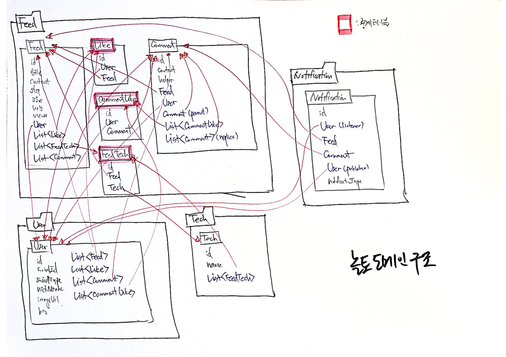
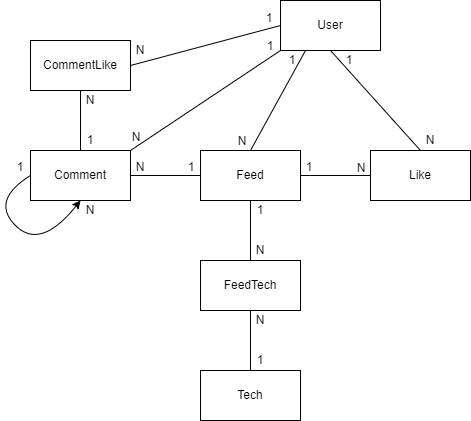
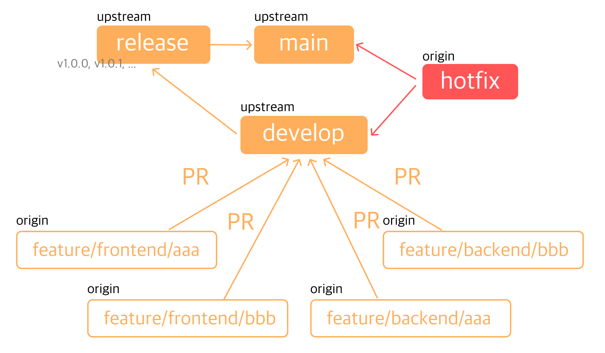

### 2021-11-09 놀토 정리

## 놀토 도메인 구조
- 
- 
- **특징 및 아쉬운 점**
    1. 다대다 관계를 풀어내기 위한 중계 테이블 도입
        - Feed <- Like -> User 
            - 피드와 유저 사이의 좋아요는 다대다
            - 피드에 여러명의 유저가 좋아요를 누를 수 있고, 유저가 여러 피드에 좋아요를 누를 수 있음
            - 이를 Like라는 중계 테이블로 관리
        - Comment <- CommentLike -> User
            - 댓글과 유저 사이의 좋아요는 다대다
            - 댓글에 여러명의 유저가 좋아요를 누를 수 있고, 유저가 여러 댓글에 좋아요를 누를 수 있음
            - 이를 CommentLike라는 중계 테이블로 관리
        - Feed <- FeedTech -> Tech 
            - 피드와 테크 사이의 관계는 다대다. 
            - 이를 FeedTech로 관리

    2. 진짜 너무 많은 양방향...
        - 양방향이 많으면 관리포인트가 늘어남
            - 예상치 못한 동작들이 발생할 수 있음
            - ex. Feed가 지워지면, 거기에 달린 Comment를 cascade 옵션으로 지울라고 했는데...
                - ArgumentResolver에서 User를 조회해서 영속성 컨텍스트가 관리중에 있고, 
                - Feed를 지워도 User에게 남아있어서 못지웠다~
        - Id 참조를 들고 있게 해서 느슨한 결합으로 만들면 어땠을까?
        - 무지성 양방향 매핑을 지웠으면 어땠을까?
        - 단방향 역시 굳이 필요한게 아니면 끊었으면 어땠을까
            - Notification들이 Id 참조만 가지고 있도록
        - Cascade.Persist + OrphanRemoval은 진짜 찐 부모-자식 관계일 때에만 적용해야할 듯

## 놀토 협업 과정
- **Sprint**
    - 2주 동안 스프린트 기간을 잡았음
    - 시작하는 날에 어떤 일을 2주 동안 처리할 지 정리
    - Github에 Milestone을 추가하여 스프린트 달성 현황을 시각화

- **Code & Review**
    - Github에 Issue를 달아놓고 무슨 작업을 할지 명시
    - 주로 페어, 4인으로 협업하여 작업을 진행했음
    - 완성된 기능은 저장소의 develop 브랜치에 PR을 보냄
    - 상호 코드리뷰를 통해 서로의 작업을 이해할 수 있도록 함
    - Zoom 회의를 통해 팀원들 전체가 코드 이해도를 높일 수 있도록 노력함
    - Notion에서 문서화를 통해 팀원들의 이해를 높일 수 있도록 노력함

- **Github 활용**
    - 대시보드 구성하여 이슈/PR 시각화
    - 깃헙과 슬랙 연동을 통해 실시간으로 업데이트 받을 수 있음

## 놀토의 깃 브랜치 전략
- 
- **기본적인 Flow**
    - 각 팀원들이 Fork 해간 repository에서 작업
        - feature/backend/new-feature 등의 브랜치로 작업
    - 작업한 브랜치를 원본 저장소의 develop 브랜치에 PR
        - 코드 리뷰 진행 후, 괜찮으면 Squash And Merge
            - 굳이 세세한 작업 이력을 남길 필요 없다고 판단
            - 깔끔하게 하나의 기능 == 하나의 커밋으로 ㄱㄱ
    - develop에서 release를 따서 Tag 붙임
        - 여기서 QA 진행할라했는데... Develop에 바로 테스트하는 서버를 구축해둬서 그냥 Tag 붙이는 용도로 전락
    - release를 master로 PR
        - 이땐 Create a Merge Commit 으로 커밋
    - master와 develop을 동기화 시켜주기 위해 develop에서 master를 pull 받음...

- **힘들었던 점**
    - develop과 master의 커밋 이력을 똑같이 가저가려 했음
        - 그러다보니 커밋 하나가 잘못 들어가면 master를 밀어버려야하는 불상사 발생
    - 굳이 master와 develop의 커밋 이력이 같아야할까?
        - 그냥 코드만 같으면 되는 것 아닌가?
    - master에 버전별로 커밋 남기는 것은 Squash And Merge의 방식으로 관리해도 좋을 듯 하다!
