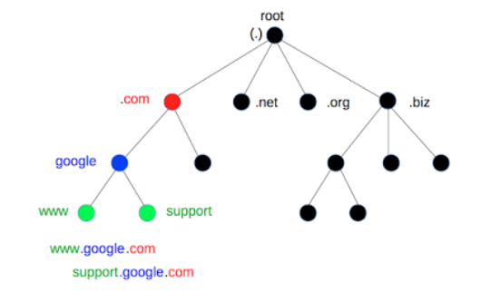
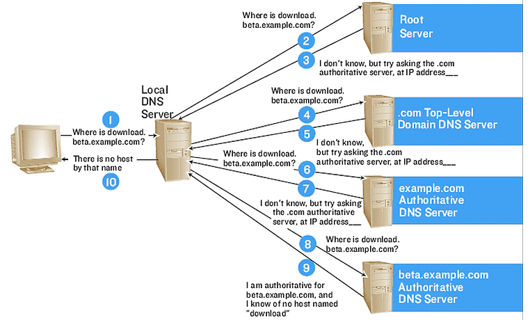
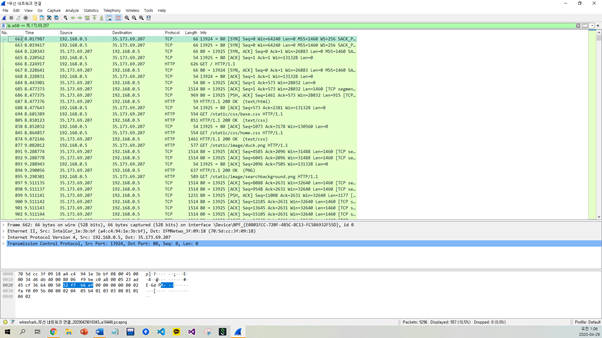

### 2021-11-09

## JPA 순환 참조
- *참고: https://velog.io/@chjh121/JPA-%EC%88%9C%ED%99%98-%EC%B0%B8%EC%A1%B0*
- **문제 상황**
    - 엔티티의 양방향 매핑이 되어있는 상황
    - 해당 엔티티를 직렬화하는 과정에서 무한 참조 발생
    ```java
    @Entity
    public class User {
    
        @Id
        @GeneratedValue(strategy = GenerationType.IDENTITY)
        private Long id;
    
        private String name;
    
        private String email;
    
        private String password;
    
        @OneToMany(fetch = FetchType.LAZY, mappedBy = "user")
        private List<Post> postList;
    }
    
    @Entity
    public class Post {
    
        @Id
        @GeneratedValue(strategy = GenerationType.IDENTITY)
        private Long id;
    
        private String title;
    
        private String content;
    
        private String writer;
    
        @ManyToOne(fetch = FetchType.LAZY)
        private User user;
    }
    ```

- **직렬화 과정**
    - Jackson에서 객체를 직렬화할 때 문제가 발생함!
    1. 요청한 Post 객체 직렬화
    2. Post Entity내의 User를 직렬화
    3. User Entity내의 `List<Post>`를 직렬화

- **해결 방법**
    - `@JsonIgnore` : 해당 필드를 직렬화 대상에서 제거
    - User에 `@JsonManagedReference`를, Post에 `@JsonBackReference`를 추가해주기
    - DTO를 사용하기 <= 추천

## Easy Deploy 로그인 복습하기 (Session)
- **회원가입 + 로그인 과정**
    1. 사용자가 구글 로그인 버튼 누르면 OAuth 로그인 창으로 리다이렉트 `GET /login/google`
    2. 사용자가 로그인 하면, 지정했던 리다이렉트 URL로 GET 요청을 구글에서 코드를 곁들여 보냄 `GET /login/oauth/google`
    3. 받은 Code를 가지고, Google로 부터 AccessToken을 발급받음
    4. 발급받은 AccessToken을 가지고, Google에서 User 정보를 조회해옴
    5. User 정보를 저장하고, 유니크한 SocialId를 반환함
    6. "socialId"를 Key로, socialId를 Value로 Session을 만듦
        ```java
        @GetMapping("/login/oauth/{social}")
        public String loginWithSocial(@PathVariable String social, @RequestParam String code, HttpServletRequest request) {
            String socialId = loginService.loginWithSocial(social, code);
            HttpSession session = request.getSession();
            session.setAttribute("socialId", socialId);
            return "redirect:/";
        }
        ```
    7. 메인페이지로 리다이렉트

- **로그인 이후 유저 권한으로 서비스 사용**
    - ArgumentResolver에서 다음과 같이, 세션을 통해 socialId를 가져옴
        ```java
        @Override
        public User resolveArgument(MethodParameter parameter, ModelAndViewContainer mavContainer,
                                    NativeWebRequest webRequest, WebDataBinderFactory binderFactory) {
            HttpServletRequest request = (HttpServletRequest) webRequest.getNativeRequest();
            HttpSession session = request.getSession();
            Object socialId = session.getAttribute("socialId");
            if (Objects.isNull(socialId)) {
                throw new NotLoggedInException("로그인 사용자가 없습니다.");
            }
            return userRepository.findBySocialId((String)socialId)
                    .orElseThrow(NotLoggedInException::new);
        }
        ```
    - 조회한 User를 Controller의 파라미터로 넣어주고 사용
    
- **같은 socialId로 어떻게 특정 socialId를 가져온거야?**
    - 결국 Session도 쿠키의 일종이잖아요? 다음과 같이 반환되잖아요?
        - JSESSIONID = 고유한값 
    - 사용자의 Http Request를 보면 Cookie: JESSIONID=고유한값 이렇게 요청이 갈거란 말이죠
    - HttpSessions 라는 백엔드 전반에서 공유하고 있는 저장소에 Map<고유값, ("socialId", socialId)> 를 가지고 있다고 볼 수 있어요
    - 그래서 고유한값으로 ("socialId", socialId)를 가져오고, "socialId"를 통해 socialId를 가져올 수 있는 것이죠. 
        ```java
        public class HttpSessions {
            private static final Map<String, HttpSession> SESSIONS = new HashMap<>();
        
            public static void addSession(final String sessionId, final HttpSession httpSession) {
                SESSIONS.put(sessionId, httpSession);
            }
        
            public static HttpSession getSession(final String sessionId) {
                return SESSIONS.get(sessionId);
            }
        
            public static void remove(final String sessionId) {
                SESSIONS.remove(sessionId);
            }
        
            private HttpSessions() {
            }
        }
        
        public class HttpSession {
            private final String sessionId;
            private final Map<String, Object> values = new HashMap<>();
        
            private HttpSession(final String sessionId) {
                this.sessionId = sessionId;
            }
        
            public static HttpSession of(String sessionId) {
                final HttpSession httpSession = new HttpSession(sessionId);
                HttpSessions.addSession(sessionId, httpSession);
                return httpSession;
            }
        
            public void setAttribute(final String name, final Object value) {
                values.put(name, value);
            }
        
            public Object getAttribute(final String name) {
                return values.get(name);
            }
        
            public void removeAttribute(final String name) {
                values.remove(name);
            }
        
            public void invalidate() {
                HttpSessions.remove(this.sessionId);
            }
        
            public String getSessionId() {
                return sessionId;
            }
        }
        ```
        
## DNS는 어떻게 동작하는가?
- *참고: https://hwan-shell.tistory.com/320*
- **DNS란?**
    - 문자를 IP주소로 변환시켜주는 시스템

- **기지국 DNS 서버 (Local DNS Server)**
    - URL에 도메인 이름 입력했을 때, 해당 IP를 찾기 위해 가장 먼저 찾는 DNS
    - LAN선을 통해 인터넷 연결시, 인터넷 사용할 수 있게 각 통신사 (SKT, KT, LG) 에 해당되는 통신사의 DNS 서버가 등록
    - `nolto.app` IP 주소좀 알려줘!
        - 있다면... "해당 IP 주소는 1.1.1.100" 이야!
        - 없다면... "Root DNS 서버에 물어볼께 기다려봐!"

- **루트 DNS 서버 (Root DNS Server)**
    - 
    - 모든 DNS 서버는 Root DNS Server의 주소를 가짐
    - Root DNS는 최상위 DNS 서버로 부터 아래 딸린 node DNS 서버에게로 차례차례 물어봄
    - 여기서, Root DNS Server 목록에도 해당 Domain Name의 IP가 없을 수 있음
        - 없다면 Local DNS에게 이렇게 알려줌
        - "나한테 해당 도메인 주소가 없네. 대신 nolto.app의 주소중 .app의 주소 알고 있으니까, app DNS 주소에게 물어봐바"

- **최상위 도메인 (Top Level Domain)**
    - 다음과 같이 나뉨
        1. 국가 코드 최상위 도메인 (.kr, .jp, .cn)
        2. 일반 최상위 도메인 (.com, .net, .org)
    - nolto.app은 다음과 같이 나뉩니다
        - app: TLD
        - nolto: 2차 도메인
    - 재귀적으로 순환을 반복하여 IP를 찾을때까지 반복
        - 

- **기타**
    - DNS Cache: 힘겹게 찾았으니, 캐싱해둠
    - 프로토콜: DHCP 프로토콜 사용. UDP 기반. 53번 포트 사용

## TCP/IP 
- *참고: https://www.youtube.com/watch?v=BEK354TRgZ8&t=125s*
- **TCP/IP**
    - 인터넷에서 컴퓨터들이 서로 정보를 주고 받는데 쓰이는 프로토콜의 집합
    - 총 4개의 계층
        - Application Layer: 특정 서비스를 제공하기 위해 어플리케이션끼리 정보 주고 받음
            - FTP, HTTP, SSH, Telnet, DNS, SMTP
        - Transport Layer: 송신된 데이터를 수신측 애플리케이션에 확실히 전달하게 함 (포트 번호 사용)
            - TCP, UDP, RTP, RTCP
        - Internet Layer: 수신측까지 데이터를 전달하기 위해 사용 (IP 주소 사용)
            - IP, ARP, ICMP, RARP, OSPF
        - Network Access Layer: 네트워크에 직접 연결된 기기 간 데이터 전송 (MAC 주소 사용)
            - Ethernet, PPP, TokenRing 

- **nolto.app 입력 시 무슨일이 일어날까?**
    - 
    - TCP는 연결지향이라 그전에 연결 수립이 필요!
        - SYN, SYN+ACK, ACK 로 3-way handshaking 필요
        - 이후 소켓으로 연결 수립!

    - HTTP 요청을 보내기 위해선 각각의 레이어에서 다음과 같은 정보를 적음
        1. Application Layer (HTTP) 에서 작성한 HTTP Request가 들어감
        2. Transport Layer (TCP) 에서 시작/목적지 포트번호를 적어줌 
        3. Internet Layer (IP) 에서 시작/목적지 IP번호를 적어줌
            - 목적지 IP 번호는 DNS를 통해 조회해올 수 있음
            - DHCP 프로토콜 (UDP 기반) 을 통해 IP 주소 받음
        4. Network Access Layer (Ethernet)
            - 바로 nolto.app의 MAC주소가 필요하진 않음
            - 우선 우리집 공유기의 MAC 주소부터 알아야 함
                - 해당 공유기로 다른 네트워크와의 연결 가능 (따라서 게이트웨이라고 부름)
            - ARP 프로토콜을 통해서 우리집 공유기의 MAC 주소 알 수 있음
    
    - 라우팅을 거쳐 패킷을 전송
        - *참고: https://www.ibm.com/docs/ko/aix/7.1?topic=protocol-tcpip-routing*
        - 라우트: 패킷을 대상에 전달할 수 있는 호스트의 경로 세그먼트만을 의미
        - 라우트 유형
            - 호스트 라우트: 다른 NW의 특정 호스트에 패킷을 전달할 수 있는 게이트웨이 정의
            - 네트워크 라우트: 특정 NW의 호스트에 패킷을 전달할 수 있는 게이트웨이
            - 디폴트 라우트: 대상에 대한 호스트나 NW 라우트가 다르게 정의되지 않은 경우 사용할 게이트웨이
            - 루프백 라우트: 로컬 네트워크 주소로 전송된 모든 패킷에 대한 디폴트 라우트
            - 브로드캐스트 라우트: 모든 브로드캐스트 패킷에 대한 디폴트 라우트
                - 두 개의 브로드캐스트 라우트가 NW에 IP가 있는 각 서브넷에 지정
                
    - TCP 이후에 연결 종료!
        - SYN, SYN+ACK, ACK 로 3-way handshaking 필요
        - 이후 소켓으로 연결 수립!
