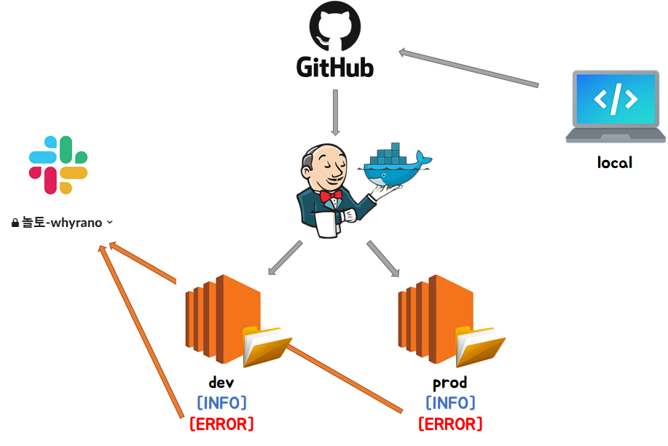

### 2021-11-10 놀토 정리

## 놀토의 예외처리 전략
- **1. 어플리케이션에서 발생하는 최상단 예외를 NoltoException으로 정의**
    ```java
    @Getter
    public class NoltoException extends RuntimeException {
        private final HttpStatus httpStatus;
        private final ExceptionResponse body;
    
        public NoltoException(HttpStatus httpStatus, ErrorType errorType) {
            super(errorType.getMessage());
            this.httpStatus = httpStatus;
            this.body = new ExceptionResponse(errorType.getErrorCode(), errorType.getMessage());
        }
    }
    ```  

- **2. ExceptionResponse를 만들어서 Exception의 body로 errorCode와 message를 줄 수 있도록 설정**
    ```java
    @Getter
    public class ExceptionResponse {
        private String errorCode;
        private String message;
        
        public ExceptionResponse(String errorCode, String message) {
          this.errorCode = errorCode;
          this.message = message;
        }
        
        public static ExceptionResponse of(ErrorType errorType) {
          return new ExceptionResponse(errorType.getErrorCode(), errorType.getMessage());
        }
    }
    ```

- **3. NoltoException을 상속하여 Error_Status_Code를 담은 에러를 만듬**
    ```java
    public class InternalServerErrorException extends NoltoException {
        public static final HttpStatus INTERNAL_SERVER_ERROR = HttpStatus.INTERNAL_SERVER_ERROR;
    
        public InternalServerErrorException(ErrorType errorType) {
            super(INTERNAL_SERVER_ERROR, errorType);
        }
    }
    
    public class NotFoundException extends NoltoException {
        public static final HttpStatus NOT_FOUND = HttpStatus.NOT_FOUND;
    
        public NotFoundException(ErrorType errorType) {
            super(NOT_FOUND, errorType);
        }
    }
    ```

- **4. Enum으로 예외를 관리하기**
    - 예외 생성할 때 생성자로 해당 ErrorType을 넣어줘야함
    - 프론트와 합의함에 따라, errorCode
    ```java
    @Getter
    @RequiredArgsConstructor
    public enum ErrorType {
        DATA_BINDING_ERROR("common-001", "요청값이 잘못되었습니다."),
        INVALID_TOKEN("auth-001", "유효하지 않은 토큰입니다."),
        FEED_NOT_FOUND("feed-001", "존재하지 않는 피드입니다."),
        NOT_SUPPORTED_IMAGE("image-001", "지원하지 않는 이미지 입니다."),
        ALREADY_LIKED("like-001", "이미 좋아요 누른 글 입니다."),
        COMMENT_NOT_FOUND("comment-001", "존재하지 않는 댓글입니다."),
        ALREADY_EXIST_NICKNAME("member-001", "이미 존재하는 닉네임입니다."),
    
        private final String errorCode;
        private final String message;
    }
    ```
  
- **5. ControllerAdvice에서 처리해주기**
    ```java
    @ExceptionHandler(NoltoException.class)
    public ResponseEntity<ExceptionResponse> handleNoltoException(NoltoException e) {
        log.info(e.getBody().getMessage());
        return ResponseEntity.status(e.getHttpStatus()).body(e.getBody());
    }
    ```

## 놀토의 테스트 전략
- **테스트 커버리지**
    - 

- **테스트 전략**
    - Layer별 슬라이스 테스트 + RestAssured를 활용한 통합 테스트

- **컨트롤러 테스트**
    - `@WebMvcTest` + `@MockBean`을 통해 작성
        - `@WebMvcTest`
            - 컨트롤러가 똑바로 동작하는지 확인하기 위함
            - 다음과 같은 내용만 스캔하여 가벼운 테스트 가능
                - `@Controller`, `@ControllerAdvice`, `@JsonComponent`, 
                - Converter, GenericConverter, Filter, HandlerInterceptor, 
                - WebMvcConfigurer, HandlerMethodArgumentResolver
        - `@MockBean`
            - 따라서 구동에 필요한 서비스 클래스등은 모킹해줘야함
    - SpringRestDocs를 활용하기 위함도 있음
        - *참고: https://techblog.woowahan.com/2597/*

- **서비스 테스트**
    - 필요에 따라 다음과 같은 어노테이션 활용
        - `@ActiveProfiles("test")` : yml 테스트 프로퍼티 환경에서 돌리기 위함
        - `@SpringBootTest` : 실제 스프링 구동환경에서 사용될 Bean을 띄워놓고 테스트하기 위함
        - `@Transactional` : 테스트 이후 롤백을 위함
        - `@TestConstructor(autowireMode = TestConstructor.AutowireMode.ALL)` : `@Autowired`가 없어도 주입해주세요
        - `@DirtiesContext(classMode = DirtiesContext.ClassMode.BEFORE_EACH_TEST_METHOD)` : 어플리케이션 컨텍스트를 재구동해야할 경우

- **도메인 단위 테스트**
    - Junit5 기반의 단위 테스트
    - 도메인의 기능들에 대한 테스트케이스 작성

- **리포지토리 테스트**
    - `@DataJpaTest` 활용
    - JPQL이 제대로 동작하는지 확인용도로 주로 씀

- **통합 테스트**
    - 시나리오 기반의 RestAssured 통합테스트
    - 독립적인 테스트 환경을 보장하고자 `@DirtiesContext`를 활용했지만, 새로운 어플리케이션 컨텍스트는 많은 시간 소요
        - 결국 매 테스트 마다 DB 제거를 해주는게 중요하다라고 판단해 개선점 찾아봄
        - DatabaseCleanup이라는 빈을 활용해, 매 테스트마다 DB를 제거해주도록 개선
        - 6분 30초 가량 소요되던 빌드 1분 30초로 단축
        ```java
        @Service
        @ActiveProfiles("test")
        class DatabaseCleanup implements InitializingBean {
        
            @PersistenceContext
            private EntityManager entityManager;
        
            private List<String> tableNames;
        
            @Override
            public void afterPropertiesSet() {
                tableNames = entityManager.getMetamodel().getEntities().stream()
                        .filter(e -> e.getJavaType().getAnnotation(Entity.class) != null)
                        .filter(e -> e.getJavaType().getAnnotation(Table.class) == null)
                        .map(e -> CaseFormat.UPPER_CAMEL.to(CaseFormat.LOWER_UNDERSCORE, e.getName()))
                        .collect(Collectors.toList());
                List<String> tableNamesWithAnnotation = entityManager.getMetamodel().getEntities().stream()
                        .filter(e -> e.getJavaType().getAnnotation(Table.class) != null)
                        .map(e -> CaseFormat.UPPER_CAMEL.to(CaseFormat.LOWER_UNDERSCORE, e.getJavaType().getAnnotation(Table.class).name()))
                        .collect(Collectors.toList());
                tableNames.addAll(tableNamesWithAnnotation);
            }
        
            @Transactional
            public void execute() {
                entityManager.flush();
                entityManager.createNativeQuery("SET REFERENTIAL_INTEGRITY FALSE").executeUpdate();
        
                for (String tableName : tableNames) {
                    entityManager.createNativeQuery("TRUNCATE TABLE " + tableName).executeUpdate();
                    entityManager.createNativeQuery("ALTER TABLE " + tableName + " ALTER COLUMN ID RESTART WITH 1").executeUpdate();
                }
        
                entityManager.createNativeQuery("SET REFERENTIAL_INTEGRITY TRUE").executeUpdate();
            }
        }
        ```
        - 최상단 AcceptanceTest의 `@BeforeEach`에서 databaseCleanup.execute(); 실행
    - 공통된 로직은 AcceptanceTest로 올려버림
    - static 메서드로 여기저기서 쓰일 수 있는 메서드들은 개방해줌

- **아쉬운 점**
    - 서비스 테스트에 클래스 단위로 통째로 `@Transactional`을 쓴 것
        - 서비스 테스트를 슬라이스 테스트로 구현하지 못한 것 같아
        - given, setUp에 대해서 싹 다 객체 엔티티로 관리해버리고 하나의 영속성 컨텍스트에서 관리해줬어
        - 즉, 통합테스트 마냥 쓰다보니 em.flush(), em.clear()를 통해 의도적으로 영속성 컨텍스트 관리해줘야 했었어
        - 테스트하고자 하는 when 절이 생각보다 똑바로 동작안하더라고

## 놀토의 로깅 전략
- **로깅은 Logback을 사용**
    - *참고: https://meetup.toast.com/posts/149*
    - `application.yml`의 설정을 읽어오거나, 특정 profile의 동작을 수행할 수 있다는 장점
        - `logging.file` : 절대 경로로 표현되거나, 현재 경로의 상대 경로로 로그 파일명 지정
        - `logging.file.path` : `logging.file` 없는 경우, 지정된 경로에 `spring.log`로 로그 남김
        - `logging.file.max-size` : 로그 파일이 지정된 임계치 초과하면, 파일명에 인덱스 추가한 후 새로운 파일 작성
        - `logging.file.max-history` : Spring-boot 2.0.0 부터는 로그가 지정된 일 수 넘어가면 자동 삭제
        - `logging.level.*` : path 기반의 logger level 지정
    - 스프링부트에서는 `logback-spring.xml`을 사용해서 Spring이 logback을 구동할 수 있도록 지원해줌

- **application.yml**
    ```yaml
    logging:
      file:
        path: /home/ubuntu/nolto2021
      level:
        org:
          hibernate:
            type:
              descriptor:
                sql:
                  BasicBinder: TRACE
    ```

- **logback-spring.xml**
    ```xml
    <?xml version="1.0" encoding="UTF-8"?>
    <configuration>
    
        <springProperty name="SLACK_WEBHOOK_URI" source="logging.slack.webhook-uri"/>
    
        // 콘솔 로깅
        <springProfile name="console-logging">
            <appender name="LOCAL_CONSOLE_POLICY" class="ch.qos.logback.core.ConsoleAppender">
                <layout class="ch.qos.logback.classic.PatternLayout">
                    <Pattern>%d{HH:mm:ss.SSS} %highlight([%-5level]) [%thread] %cyan([%logger{36}]) - %m%n</Pattern>
                </layout>
            </appender>
        </springProfile>
    
        // 쿼리 로깅 (TRACE 부터)
        <springProfile name="file-sql-logging">
            <appender name="local-file-logger" class="ch.qos.logback.core.rolling.RollingFileAppender">
                <file>${LOG_PATH}/logs/nolto-sql.log</file>
                <rollingPolicy class="ch.qos.logback.core.rolling.SizeAndTimeBasedRollingPolicy">
                    <fileNamePattern>${LOG_PATH}/logs/dateLog/%d{yyyy_MM_dd}_%i.nolto-sql.log
                    </fileNamePattern>
                    <maxFileSize>50MB</maxFileSize>
                    <maxHistory>14</maxHistory>
                    <totalSizeCap>1GB</totalSizeCap>
                </rollingPolicy>
                <encoder>
                    <charset>utf8</charset>
                    <Pattern>%d{HH:mm:ss.SSS} [%-5level] [%thread] [%logger{36}] - %m%n</Pattern>
                </encoder>
            </appender>
            <logger name="org.hibernate.SQL" level="TRACE">
                <appender-ref ref="local-file-logger"/>
            </logger>
            <logger name="org.hibernate.type.descriptor" level="TRACE">
                <appender-ref ref="local-file-logger"/>
            </logger>
        </springProfile>
    
        // INFO 로깅
        <springProfile name="file-info-logging">
            <appender name="INFO_FILE_POLICY" class="ch.qos.logback.core.rolling.RollingFileAppender">
                <filter class="ch.qos.logback.classic.filter.ThresholdFilter">
                    <level>INFO</level>
                </filter>
                <file>${LOG_PATH}/logs/nolto-info.log</file>
                <encoder>
                    <Pattern>%d{HH:mm:ss.SSS} [%-5level] [%thread] [%logger{36}] - %m%n</Pattern>
                </encoder>
                <rollingPolicy class="ch.qos.logback.core.rolling.SizeAndTimeBasedRollingPolicy">
                    <fileNamePattern>${LOG_PATH}/logs/dateLog/%d{yyyy_MM_dd}_%i.nolto-info.log
                    </fileNamePattern>
                    <maxFileSize>50MB</maxFileSize>
                    <maxHistory>14</maxHistory>
                    <totalSizeCap>1GB</totalSizeCap>
                </rollingPolicy>
            </appender>
        </springProfile>
    
        // ERROR 로깅
        <springProfile name="file-error-logging">
            <appender name="ERROR_FILE_POLICY" class="ch.qos.logback.core.rolling.RollingFileAppender">
                <filter class="ch.qos.logback.classic.filter.ThresholdFilter">
                    <level>ERROR</level>
                </filter>
                <file>${LOG_PATH}/logs/nolto-error.log</file>
                <encoder>
                    <Pattern>%d{HH:mm:ss.SSS} [%-5level] [%thread] [%logger{36}] - %m%n</Pattern>
                </encoder>
                <rollingPolicy class="ch.qos.logback.core.rolling.SizeAndTimeBasedRollingPolicy">
                    <fileNamePattern>${LOG_PATH}/logs/dateLog/%d{yyyy_MM_dd}_%i.nolto-error.log
                    </fileNamePattern>
                    <maxFileSize>50MB</maxFileSize>
                    <maxHistory>14</maxHistory>
                    <totalSizeCap>1GB</totalSizeCap>
                </rollingPolicy>
            </appender>
        </springProfile>
    
        // [DEV] ERROR 로그 발생 시, Slack에 전송
        <springProfile name="slack-dev-error-logging">
            <appender name="SLACK" class="com.github.maricn.logback.SlackAppender">
                <webhookUri>${SLACK_WEBHOOK_URI}</webhookUri>
                <layout class="ch.qos.logback.classic.PatternLayout">
                    <pattern>[DEV] %-4relative [%thread] %-5level %class - %msg%n</pattern>
                </layout>
                <colorCoding>true</colorCoding>
            </appender>
            <appender name="ASYNC_SLACK" class="ch.qos.logback.classic.AsyncAppender">
                <appender-ref ref="SLACK"/>
                <filter class="ch.qos.logback.classic.filter.ThresholdFilter">
                    <level>ERROR</level>
                </filter>
            </appender>
        </springProfile>
    
        // [PROD] ERROR 로그 발생 시, Slack에 전송
        <springProfile name="slack-prod-error-logging">
            <appender name="PROD-SLACK" class="com.github.maricn.logback.SlackAppender">
                <webhookUri>${SLACK_WEBHOOK_URI}</webhookUri>
                <layout class="ch.qos.logback.classic.PatternLayout">
                    <pattern>[PROD] %-4relative [%thread] %-5level %class - %msg%n</pattern>
                </layout>
                <colorCoding>true</colorCoding>
            </appender>
            <appender name="PROD_ASYNC_SLACK" class="ch.qos.logback.classic.AsyncAppender">
                <appender-ref ref="PROD-SLACK"/>
                <filter class="ch.qos.logback.classic.filter.ThresholdFilter">
                    <level>ERROR</level>
                </filter>
            </appender>
        </springProfile>
    
        <root level="INFO">
            <springProfile name="console-logging">
                <appender-ref ref="LOCAL_CONSOLE_POLICY"/>
            </springProfile>
    
            <springProfile name="file-info-logging">
                <appender-ref ref="INFO_FILE_POLICY"/>
            </springProfile>
    
            <springProfile name="file-error-logging">
                <appender-ref ref="ERROR_FILE_POLICY"/>
            </springProfile>
    
            <springProfile name="slack-dev-error-logging">
                <appender-ref ref="ASYNC_SLACK"/>
            </springProfile>
    
            <springProfile name="slack-prod-error-logging">
                <appender-ref ref="PROD_ASYNC_SLACK"/>
            </springProfile>
        </root>
    </configuration>
    ```

- **프로파일 환경 별 다른 로깅 전략**
    - Local
        - 매 실행 시 마다 console에 로그 메시지 출력
        - 로그 level은 info
    - Dev, Prod
        - ERROR 레벨 이상의 로그 nolto-error.log
        - INFO 레벨 이상의 로그 nolto-info.log
        - 해당 로그 파일 하루 지나면, dateLog 디렉토리에 날짜와 함께 저장
            - 2021_11_09_0.nolto-info.log
            - 2021_11_09_0.nolto-error.log
        - 어펜더 설정에 따라 14일이 지나면 폐기
        - 50MB 이하의 용량

- **Slack 연동**
    - 런타임에 Error 레벨의 로그 출력시, 지정한 slack 채널의 메시지 보내도록 구현함
    - 

- **고민했던 부분**
    - 처음엔 그냥 에러 로그 한 줄로 남김
        - 그러다보니 그 전 상황들을 파악할 길이 없음
        - 따라서 에러 로그에 대해선 stacktrace를 로그로 남기기로함
            ```
            16:18:39.273 [ERROR] [http-nio-8080-exec-14] [c.w.nolto.exception.ControllerAdvice] - ༼;´༎ຶ ۝ ༎ຶ༽ 에러 메세지: Request method 'GET' not supported%n༼;´༎ຶ ۝ ༎ຶ༽ 𝙒𝙝𝙮𝙧𝙖𝙣𝙤...
            ༼;´༎ຶ ۝ ༎ຶ༽ 에러 로그 시작 ༼;´༎ຶ ۝ ༎ຶ༽
            [org.springframework.web.servlet.mvc.method.RequestMappingInfoHandlerMapping.handleNoMatch(RequestMappingInfoHandlerMapping.java:253)
             org.springframework.web.servlet.handler.AbstractHandlerMethodMapping.lookupHandlerMethod(AbstractHandlerMethodMapping.java:436)
             org.springframework.web.servlet.handler.AbstractHandlerMethodMapping.getHandlerInternal(AbstractHandlerMethodMapping.java:377)
             org.springframework.web.servlet.mvc.method.RequestMappingInfoHandlerMapping.getHandlerInternal(RequestMappingInfoHandlerMapping.java:125)
             org.springframework.web.servlet.mvc.method.RequestMappingInfoHandlerMapping.getHandlerInternal(RequestMappingInfoHandlerMapping.java:67)
             org.springframework.web.servlet.handler.AbstractHandlerMapping.getHandler(AbstractHandlerMapping.java:498)
             org.springframework.web.servlet.DispatcherServlet.getHandler(DispatcherServlet.java:1257)
             org.springframework.web.servlet.DispatcherServlet.doDispatch(DispatcherServlet.java:1039)
             org.springframework.web.servlet.DispatcherServlet.doService(DispatcherServlet.java:963)
             org.springframework.web.servlet.FrameworkServlet.processRequest(FrameworkServlet.java:1006)
             org.springframework.web.servlet.FrameworkServlet.doGet(FrameworkServlet.java:898)
             javax.servlet.http.HttpServlet.service(HttpServlet.java:655)
             org.springframework.web.servlet.FrameworkServlet.service(FrameworkServlet.java:883)
             javax.servlet.http.HttpServlet.service(HttpServlet.java:764)
             org.apache.catalina.core.ApplicationFilterChain.internalDoFilter(ApplicationFilterChain.java:228)
             org.apache.catalina.core.ApplicationFilterChain.doFilter(ApplicationFilterChain.java:163)
             org.apache.tomcat.websocket.server.WsFilter.doFilter(WsFilter.java:53)
             org.apache.catalina.core.ApplicationFilterChain.internalDoFilter(ApplicationFilterChain.java:190)
             org.apache.catalina.core.ApplicationFilterChain.doFilter(ApplicationFilterChain.java:163)
             org.springframework.web.filter.RequestContextFilter.doFilterInternal(RequestContextFilter.java:100)
             org.springframework.web.filter.OncePerRequestFilter.doFilter(OncePerRequestFilter.java:119)
             org.apache.catalina.core.ApplicationFilterChain.internalDoFilter(ApplicationFilterChain.java:190)
             org.apache.catalina.core.ApplicationFilterChain.doFilter(ApplicationFilterChain.java:163)
             org.springframework.web.filter.FormContentFilter.doFilterInternal(FormContentFilter.java:93)
             org.springframework.web.filter.OncePerRequestFilter.doFilter(OncePerRequestFilter.java:119)
             org.apache.catalina.core.ApplicationFilterChain.internalDoFilter(ApplicationFilterChain.java:190)
             org.apache.catalina.core.ApplicationFilterChain.doFilter(ApplicationFilterChain.java:163)
             org.springframework.web.filter.CharacterEncodingFilter.doFilterInternal(CharacterEncodingFilter.java:201)
             org.springframework.web.filter.OncePerRequestFilter.doFilter(OncePerRequestFilter.java:119)
             org.apache.catalina.core.ApplicationFilterChain.internalDoFilter(ApplicationFilterChain.java:190)
             org.apache.catalina.core.ApplicationFilterChain.doFilter(ApplicationFilterChain.java:163)
             org.apache.catalina.core.StandardWrapperValve.invoke(StandardWrapperValve.java:202)
             org.apache.catalina.core.StandardContextValve.invoke(StandardContextValve.java:97)
             org.apache.catalina.authenticator.AuthenticatorBase.invoke(AuthenticatorBase.java:542)
             org.apache.catalina.core.StandardHostValve.invoke(StandardHostValve.java:143)
             org.apache.catalina.valves.ErrorReportValve.invoke(ErrorReportValve.java:92)
             org.apache.catalina.core.StandardEngineValve.invoke(StandardEngineValve.java:78)
             net.rakugakibox.spring.boot.logback.access.tomcat.LogbackAccessTomcatValve.invoke(LogbackAccessTomcatValve.java:91)
             org.apache.catalina.connector.CoyoteAdapter.service(CoyoteAdapter.java:357)
             org.apache.coyote.http11.Http11Processor.service(Http11Processor.java:382)
             org.apache.coyote.AbstractProcessorLight.process(AbstractProcessorLight.java:65)
             org.apache.coyote.AbstractProtocol$ConnectionHandler.process(AbstractProtocol.java:893)
             org.apache.tomcat.util.net.NioEndpoint$SocketProcessor.doRun(NioEndpoint.java:1723)
             org.apache.tomcat.util.net.SocketProcessorBase.run(SocketProcessorBase.java:49)
             java.util.concurrent.ThreadPoolExecutor.runWorker(ThreadPoolExecutor.java:1149)
             java.util.concurrent.ThreadPoolExecutor$Worker.run(ThreadPoolExecutor.java:624)
             org.apache.tomcat.util.threads.TaskThread$WrappingRunnable.run(TaskThread.java:61)
             java.lang.Thread.run(Thread.java:748)]
            ༼;´༎ຶ ۝ ༎ຶ༽ 에러 로그 끝 ༼;´༎ຶ ۝ ༎ຶ༽
            ༼;´༎ຶ ۝ ༎ຶ༽ 𝙒𝙝𝙮𝙧𝙖𝙣𝙤...
            ```

## 놀토 인프라

1. Why replication?
    - Read는 Slave, CUD는 master에서 처리
    - 어노테이션 기반으로 다른 데이터 소스를 사용하도록 설정함
    - 각각 다른 DB를 사용함으로써, 자연 스런 부하분산
    - Read가 아무래도 작업량이 많다보니까, 이걸 scale up 할 수 있는 구조로 설계하였음
        - 데이터 분석을 위한 DB 따로 등등,,,

2. Why load-balancing?
    - 부하 분산을 위한 로드 밸런싱 도입
        - WAS 인스턴스 두 대에서 돌리는 중
    - 상태를 가지는 Redis가 하나 있어서 각각 WAS에 Redis 설치
        - Redis에는 ip, userid에 대해 RefreshToken을 가지고 있음
        - 이를 저장하기 위해 도입함
    - 클라이언트의 ip에 따라 지정된 was에서 처리할 수 있도록 nginx에서 처리해줌
        - ip_hash 옵션 활용
