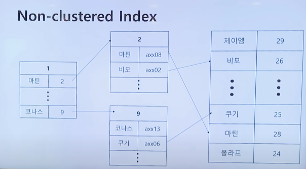
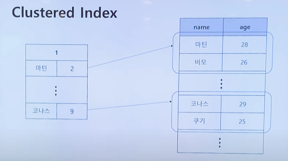
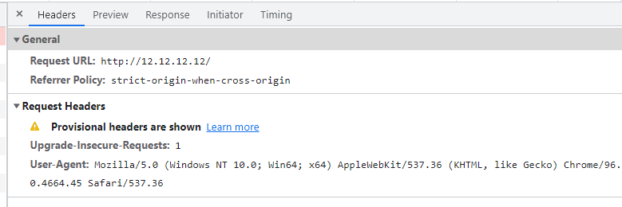
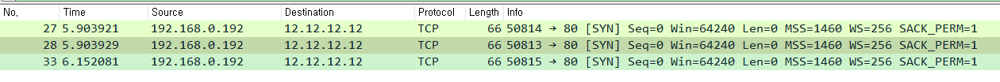

### 2021-11-24

## 템플릿 메서드 패턴
- *참고 1: https://gmlwjd9405.github.io/2018/07/13/template-method-pattern.html*
- *참고 2: https://yaboong.github.io/design-pattern/2018/09/27/template-method-pattern/*
- **개념**
    - 변하지 않는 기능 : 슈퍼 클래스
    - 변경/확장될 기능 : 서브 클래스
    - 전체적으로는 동일하면서 부분적으로는 다른 구문으로 구성된 메서드의 코드 중복 최소화

- **예시**
    ```java
    public abstract class AbstractClass {
        protected abstract void hook1();
        protected abstract void hook2();

        public void templateMethod() {
            hook1();
            hook2();
        }
    }

    public class ConcreteClass extends AbstractClass {
        @Override
        protected void hook1() {
            System.out.println("hook1");
        }

        @Override
        protected void hook2() {
            System.out.println("hook2");
        }
    }

    public class TemplateMethodPatternClient {
        public static void main(String[] args) {
            AbstractClass abstractClass = new ConcreteClass();
            abstractClass.templateMethod();
        }
    }
    ```

## 템플릿 콜백 패턴
- *참고: https://multifrontgarden.tistory.com/101*
- **개념**
    - 전략 패턴과 템플릿 메서드 패턴의 혼합
    - 전략 패턴이 "클래스 레벨"에서의 확장이라면, 템플릿 메서드 패턴은 "메서드 레벨"에서의 확장
    - 외부에서 함수를 주입한다! (JS에서는 자연스러운 흐름)
        - 자바에서는 어쩔 수 없이 객체를 생성해야함
        - 난잡하게 하나하나 다 생성할 수는 없으니 '익명 내부 클래스' 로 쇼부
        - 함수형 인터페이스로 발전 가능함!

- **예시**
    ```java
    @FunctionalInterface
    interface Calculator {
        public int calculation(int num1, int num2);
    }

    public class CalculatorTemplate {
        public int templateMethod(int num1, int num2, Calculator c) {
            return c.calculation(num1, num2);
        }
    }

    public class Test {
        public static void main(String[] args) {
            CalculatorTemmplate ct = new CalculatorTemmplate();
            System.out.println(ct.templateMethod(5, 10, (num1, num2) -> num1 + num2));
            System.out.println(ct.templateMethod(5, 10, (num1, num2) -> num1 * num2));
        }
    }
    ```

## Non-Clustered Index VS Clustered Index
- *참고: https://www.youtube.com/watch?v=js4y5VDknfA*
- **Non-Clustered**
    - 
    - 인덱스의 키 값에는 해당 데이터에 대한 "포인터"가 존재
    - 한 테이블에 여러개가 생성 가능하다
    - 물리적인 테이블의 정렬을 바꾸진 않음! "포인터"만 빠르게 탐색할 수 있도록 트리로 정렬

- **Clustered**
    - 
    - 데이터를 인덱스로 "지정한 컬럼에 맞춰서" 정렬!
        - 테이블 구조에 실제로 영향 미침! (PK)
        - 한 테이블에 하나만 생성 가능
    - 클러스터 키로 검색 시 처리 성능 매우 빠름!

## HTTP 요청 전에 TCP 3-way handshake
- 엄한 곳에 한 번 연결해보자 (12.12.12.12)
    - 여기 80 포트엔 그 무엇도 리스닝하고 있지 않아
- 브라우저 네트워크를 켜서 보면 12.12.12.12 를 치고 결과를 기다리면...
    - 
    - 이런식으로 http://12.12.12.12 에 http request 보내기 전에 3-way handshake를 통한 연결 수립 기다리고 있는데 응답이 없나봐?
- 응답이 없는 걸 눈으로 봐보자
    - 
    - 이렇게 TCP로 내 아무런 포트 -> 12.12.12.12:80 으로 SYN을 보냈지만 돌아오지 않는 ACK...
    - 3-way handshake가 안되면 http 요청도 못 보낸다!
- 만약 TCP 연결이 수립이 되었다면, 해당 소켓을 통해 HTTP 요청!
    - *참고: https://www.techopedia.com/definition/10339/three-way-handshake*
    - A three-way handshake is primarily used to create a TCP socket connection to reliably transmit data between devices. 
    - 3-way handshake를 통해 TCP 소켓 커넥션을 생성함!

## 복습해보는 HTTP 미션
- 웹 서버 입장에서 main 쓰레드가 계속 80포트에 귀 대고 Socket Listening 
```java
public void run() {
    try (ServerSocket serverSocket = new ServerSocket(80)) {
        logger.info("Web Server started {} port.", serverSocket.getLocalPort());
        handle(serverSocket);
    } catch (IOException exception) {
        logger.error("Exception accepting connection", exception);
    } catch (RuntimeException exception) {
        logger.error("Unexpected error", exception);
    }
}
```
- 새로운 Socket 연결이 수립된다면, 쓰레드 풀 중에 하나의 쓰레드 한테 해당 소켓 연결을 맡겨 처리하도록 함
```java
private void handle(ServerSocket serverSocket) throws IOException {
    ExecutorService service = Executors.newFixedThreadPool(200);

    Socket connection;
    while ((connection = serverSocket.accept()) != null) {
        service.submit(new RequestHandler(connection, requestManager));
    }
}
```
- 해당 쓰레드에서 Socket connection의 inputStream/outputStream을 통해 HTTP 요청을 받고, HTTP 응답을 보낼수 있게 함
```java
public void run() {
    log.debug("New Client Connect! Connected IP : {}, Port : {}", connection.getInetAddress(), connection.getPort());

    try (final InputStream inputStream = connection.getInputStream();
         final OutputStream outputStream = connection.getOutputStream()) {

        requestManager.handle(inputStream, outputStream);

    } catch (IOException exception) {
        log.error("Exception stream", exception);
    } finally {
        close();
    }
}
```