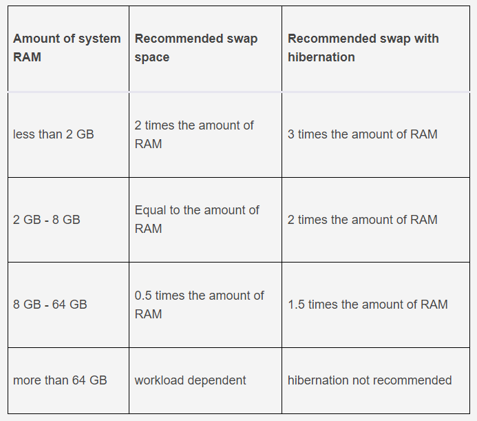

### 2021-12-10

## 리눅스 Swap 공간 추가로 RAM 부족 해결하기
- *참고 1: https://jootc.com/p/201806021161*
- *참고 2: https://opensource.com/article/18/9/swap-space-linux-systems*
- *참고 3: https://aliwo.github.io/swblog/linux/ubuntu/ubuntu-swap2/#*
- *참고 4: https://kibua20.tistory.com/40*
- **문제**
    - 오늘의 CS 1G 램으로 너무 부족해서 계속 시스템 뻗음...
    - Swap 공간을 만들어 해결해보자!

- **리눅스 Swap?**
    - 시스템 메모리가 부족한 경우, 하드 디스크의 일부 공간을 활용하여 작업 계속하도록 돕는 영역
        - RAM이 꽉차서 공간이 필요할 때 Swap 공간을 쓰세요
    - Swap을 통해 RAM에서 처리될 작업이 하드디스크에서 처리되게 할 수 있음
        - 프로그램 실행이나 명령어 처리에서 인터럽트 X
        - 메모리 공간의 부족 방지를 위한 "임시 방편"
    - 커널이 메모리 매니지먼트 프로그램을 통해 메모리 내의 페이지를 확인하고, 가장 최근에 안쓰인 놈 스왑 공간으로 넘겨
        - 커널이 스왑공간으로 내쫓은 영역은 커널이 감시하다가 필요하면 RAM으로 다시 불려들여
    - 그니까 결국 리눅스 컴퓨터가 쓰는 메모리는...
        - RAM + Swap Space ==> Virtual Memory라고 부른다
    - Swap 파티션은 mkswap 커맨드로 만들수 있음

- **절전 모드**
    - RAM에 있는 내용을 SWAP 공간에 쟁여두면 하드디스크니까 안날라가겠지?
        - 안전하게 작업을 저장할 수 있게 됨

- **쓰래싱**
    - 쓰래싱은 RAM과 Swap Space가 모두 full 해지면 발생
        - 시스템이 페이지를 스왑 공간과 메모리 너무 왔다갔다 하느라 실제 해야할 일 처리할 시간이 없음
        - 시스템 느려지고, 반응도 안함
        - CPU로드와 메모리 사용량도 엄청 많고
    - 뜬금없이 Out Of Memory Error 뜨면서 그냥 프로세스 끝낼 수도 있어...

- **Swap space얼마가 적당?**
    - RAM이 KB~MB 였던 때엔 용량의 2배가 국룰
    - 
    
- **Swap Space 초기 할당**
    - micro 같은 용량 쪼들리는 곳엔 갑자기 mysql이 사라지기도해...
        - OOM 떠서 프로세스 꺼버리는데 운나쁜 mysql이 채택받음
    ```shell script
    $ free -h                           # 현재 Swap 사용중인지 검사
    $ df -h                             # 디스크에 공간 충분한지 검사
    $ sudo fallocate -l 1G /swapfile    # Swap 공간 만들기
    $ ls -lh /swapfile                  # Swap 공간 잘 만들었는지 확인
    $ sudo chmod 600 /swapfile          # Swap 공간 권한 바꾸기 (루트가 쓰도록)
    $ sudo mkswap /swapfile             # Swap 공간 마킹하여, swap 사용할 수 있도록 준비
    $ sudo swapon /swapfile             # 실제로 Swap 공간 사용설정하기
    ```

- **Swap space 증가시키기**
    - 우분투 18.04 부턴 파티션 변경없이 편하게 swap file 크기 조절 가능
    - swapfile은 root 폴더 하위에 /swapfile 로 생성되며, 사용 현황은 free로 확인 가능
    ```shell script
    $ sudo swapoff -v /swapfile         # swap 비활성
    $ sudo fallocate -l 8G /swapfile    # swap을 8GB로 조정
    $ sudo chmod 600 /swapfile          # Swap 공간 권한 바꾸기 (루트가 쓰도록)
    $ sudo mkswap /swapfile             # Swap 공간 마킹하여, swap 사용할 수 있도록 준비
    $ sudo swapon /swapfile             # 실제로 Swap 공간 사용설정하기
    ```