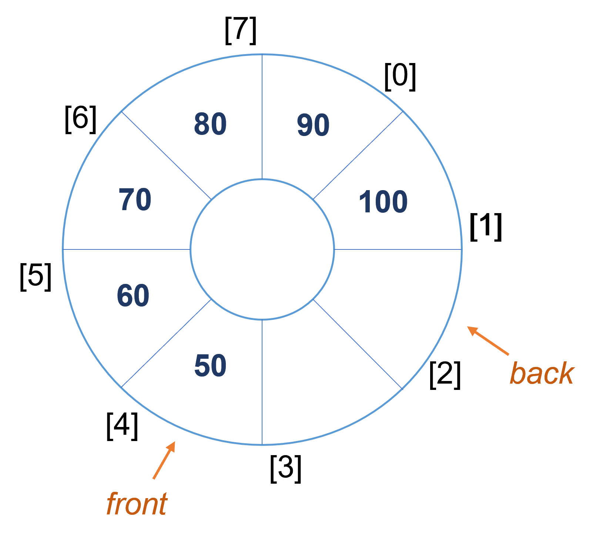

### 2022-01-15

## 데이터 구조 - 원형 큐
1. 저번 뉴스레터에서 살펴본 선형 큐는 한가지 문제점이 있었어요. 
enqueue와 dequeue를 반복하다 보면 큐에 공간이 남아있어도 활용하지 못하는 경우가 발생한다는 것이었는데요. 
공간을 최대한으로 활용하기 어려운 선형 큐의 단점을 원형 큐를 통해 해결할 수 있어요. 

2. 원형 큐는 큐의 한가지 구현 방식으로써, 앞서 살펴본 선형 큐와 같이 **Enqueue**와 **Dequeue** 연산을 지원해요. 
또한 **Front**와 **Back** 두 가지 위치 표식자를 가지는데요. 
Front는 다음으로 제거할 데이터의 위치를, Back은 다음번의 데이터가 들어올 자리를 가리켜요.
원형 큐는 선형 큐보다 Front와 Back 변수를 더 적극적으로 활용하는데요. 
데이터를 저장하는 배열이 마치 원형으로 이루어진 것과 같은 효과를 Front와 Back 변수를 통해 구현할 수 있어요. 
원형 큐를 그림으로 다음과 같이 나타낼 수 있어요. 

3. 저번 뉴스레터에서 봤던 선형 큐의 단점으로 꼽힌 시나리오를 원형 큐에서 해결할 수 있는지 확인해볼까요? 
큐의 사이즈는 총 8칸이라고 가정했어요. 
    - 원형 큐가 비어있는 상태에요. 
    
    - 원형 큐에 10부터 80까지를 차례로 Enqueue 했어요. *(큐가 꽉 차자 Back 변수가 배열의 0번째 index를 가리키는 것을 알 수 있어요! 마치 한 바퀴 돌았으니 다시 처음으로 돌아온거죠)*
    
    - 원형 큐에 총 4개의 원소를 Dequeue 했어요. 
    
    - 원형 큐에 90, 100을 넣어도 큐에 잘 저장되는 것을 알 수 있어요! *(선형 큐와 달리 배열의 앞 index 공간을 잘 활용하는 것을 알 수 있어요!)*
    

4. 다만 원형 큐에서는 큐가 빈 상태와 꽉 찬 상태 모두 front와 back의 값이 같아지는데요. 
따라서 원형 큐에서는 큐가 비었는지 꽉 찼는지를 front와 back 변수만으로는 구별할 수 없어요. 
그래서 원형 큐에는 하나의 또 다른 장치가 필요해요. 
하나의 예시로는 size 변수를 통해 얼마나 많은 원소가 큐에 저장되었는지 관리하는 방법이 있어요. 
size가 0 이라면 큐가 빈 상태이고, size가 배열의 길이와 같다면 큐가 꽉 찬 상태인 것이죠!
