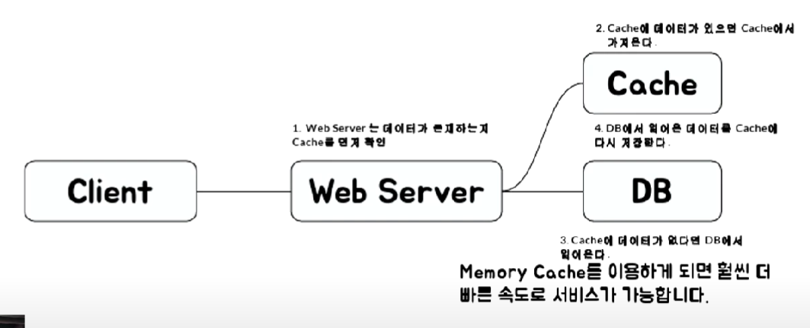

### 2022-01-24

## 우아한 gRedis
- *참고: https://www.youtube.com/watch?v=mPB2CZiAkKM*
- **Redis 소개**
  - In Memory 데이터 구조 저장소
  - 오픈소스
  - Key-Value, sorted-set

- **Caching**
  - 파레토의 법칙으로 인해 자주 쓰는 건 빨리 접근하도록 하자!
  - [#1. Look Aside Cache]
    - 
  - [#2. Write Back]
    - 

- **랭킹 서버**
  - DB에 유저 Score 저장하고 order by로 정렬시켜 가져온다? => 문제 생김
  - 결국 디스크를 사용하기에
  - Redis의 Sorted Set을 이용하면 랭킹 구현이 쉬워짐
    - Replication도 가능

- **Redis의 장점**
  - 자료구조가 Atomic 하기에 Race Condition을 최소화할 수 있음
    - 그래도 잘못짜면 발생함

- **Redis를 어디에 써야하지?**
  - Remote Data Store
    - A서버, B서버, C서버에서 데이터를 공유하고자 할 때
      - QS. 한 대에서만 필요하다면...? 전역 Map 같은걸론 안될까?
        - Redis는 싱글쓰레드로 동작하기에 Atomic을 보장해줌
  - 주로 많이 쓰는 곳들
    - 인증 토큰 등을 저장
    - Ranking 보드로 사용
    - 유저 API Limit
    - Job Queue

- **Redis Collections**
  - String: 키-발류 형태로 저장
  - List
  - Set
  - Sorted Set: 순서를 보장할 수 있는 Set
  - Hash

- **String - 많이 씀**
  - Set & Get
    - 기본 사용법
      - Set <key> <value>
      - Get <key>
    - Set token: 1234567 abcdefg
    - Get token: 1234567
  - Multi Set & Get
    - 기본 사용법
      - mset <key1> <value1> <key2> <value2> ... <keyN> <valueN>
      - mget <key1> <key2> ... <keyN>
    - mset token: 1234567 abcdefg email:123456 joel@naver.com
    - mget token: 1234567 email:123456

- **List**
  - 기본 사용법
    - Lpush <key> <A>
      - key: A
    - Rpush <key> <B>
      - key: A, B
    - Lpush <key> <C>
      - key: C, A, B
    - Rpush <key> <D, A>
      - key: C, A, B, D, A
    - Lpop -> 왼쪽에서 pop
    - Rpop -> 오른쪽에서 pop

- **Set**
  - SADD <key> <value>
  - SMEMBERS <key> : 모든 멤버 돌려줌
  - SISMEMBER <key> <value> : value 존재하면 1, 없으면 0

- **Sorted Set - 많이 씀**
  - ZADD <key> <score> <value> : Value가 이미 있으면 해당 score로 변경
  - ZRANGE <key> <StartIndex> <EndIndex> : Index 범위값 모두 돌려줌

- **Hash**
  - Hmset <key> <subkey1> <value1> <subkey2>...

- **Collection 주의사항**
  - 하나의 컬렉션에 10000개 이하로 유지할 것
  - Expire는 Collection item 개별로 걸리지 않고 전체 Collection에 대해서만 걸림

- **Redis 운영**
  - 메모리 관리를 잘하자!
  - Physical Memory 이상을 사용하면 문제가 발생! (Swap 있으면 그거 써)
  - Swap이 계속 일어나면 성능 뚝뚝 떨어지겠지? 디스크 접근하는거잖아?
  - OOM 조심
  - Maxmemory를 통해 Redis가 쓸 메모리 확보하긴 하는데...
  - 메모리 모니터링 꼭 하세요! (몇기가 메모리 중 얼마나 쓰고 있는지 확인하기)
    - 큰 메모리 인스턴스 하나보다는 인스턴스 여러개가 안전함!
      - 레디스는 fork를 하게 되어있어
      - write가 heavy한 작업이라 메모리를 많이써
