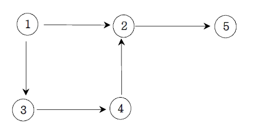
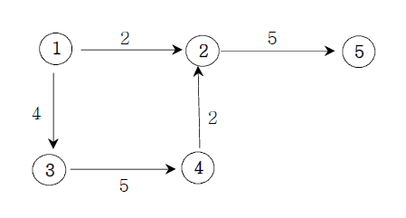

### 2022-02-08

## 알고리즘 문제풀이 - DFS, BFS 기초
- **DFS**
  - 재귀를 통해서 풀 수 있어야함
  - 상태 트리를 잘 생각해서 풀 것
  - 필요하다면 static 변수등을 통해 전역에서 접근할 수 있는 곳에 상태를 기록해 둘 것
  - 경우의 수를 구할 때 DFS를 생각할 것!

- **부분집합 구하기**
  - 경우의 수를 고려하여 상태 트리를 만들자
    - 이게 들어간 경우
    - 이게 들어가지 않은 경우
  - 상태를 기록해두기 위해 static 배열/변수를 만들자

- **BFS**
  - 큐를 통해서 풀 수 있어야 함
  - 최단거리/최소횟수를 구할 때 BFS를 생각할 것!

- **트리의 레이어를 돌아가면서 최단 경로 구하기**
  - 이런거 레이어 별로 탐색하면서 Queue에서 빼서 뚝딱 체크

- **순회**
  - 전위 순회: 부모 -> 왼 -> 오
  - 중위 순회: 왼 -> 부모 -> 오
  - 후위 순회: 왼 -> 오 -> 부모

- **DFS vs BFS**
  - DFS: 모든 경우의 수를 파악해야하는 경우
  - BFS: 최단 거리, 최단 경우의 수

- **그래프와 인접 행렬**
  1. 무방향 그래프
     - 
     - (1-2), (1-3), (2-4), (3-4), (2-5) 
     - 인접 행렬에서는 (1-2) 경우 [1][2], [2][1] 에 1 넣어주기
     - 인접 리스트에서 1->2, 2->1 뚝딱
  2. 방향 그래프
     - 
     - (1-2), (1-3), (2-4), (3-4), (2-5) 
     - 인접 행렬에서는 (1-2) 경우 [1][2] 에 1 넣어주기
     - 인접 리스트에서 1->2 뚝딱
  3. 가중치 그래프
     - 
     - (1-2), (1-3), (2-4), (3-4), (2-5) 
     - 인접 행렬에서는 (1-2)의 경우 [1][2] 에 "2" 넣어주기
     - 인접 리스트에서는 Node를 만들어서 value/가중치 넣어주기
