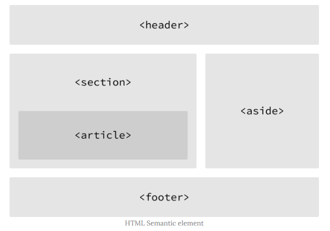

### 2022-03-04

## Google Colab
- *참고: https://luran.me/260*
- **개요**
  - 구글에서 제공하는 Jupyter Notebook

- **시스템 스펙 확인**
  - `cat /proc/cpuinfo`
  - `cat /proc/meminfo`

## NumPy
- **개요**
  - 수학 및 과학 연산을 위한 파이썬 패키지
  - 상당부분 C/Fortran으로 작성되어 빠른 실행속도
  - 데이터 분석 라이브러리인 pandas와 matlotlib의 기반으로 사용됨
  - 기본적으로 **array** 라는 자료를 생성하고 색인, 처리, 연산을 하는 기능

## WEB 코테 준비 - HTML
- *참고: https://poiemaweb.com/*
- **a tag 새로운 창에서**
  - `<a href="link" target="_blank", rel="noopener noreferrer">`
  - rel="noopener noreferrer"를 통해 해킹 방지가 국룰 (성능상 이점도 있다고 함)

- **FORM 태그**
  - `<form action="target_url" method="get">`
    - GET: action의 target_url에 데이터를 쿼리스트링으로 보냄
    - POST: Request Body에 담아 보내는 방식

- **HTML 요소 분리**
  - 

## WEB 코테 준비 - CSS
- **기본 셀렉터**
  ```css
  * { color : red; }  /* 모든 요소에 대해서 적용 */
  p { color : red; }  /* p 태그에 대해서 적용 */
  #p { color : red; }  /* id가 p인 태그에 대해서 적용 */
  .p { color : red; }  /* class가 p인 태그에 대해서 적용 */
  ```

- **가상 클래스 셀렉터**
  ```css
  a:link { color : orange } /*a 요소가 방문한 적이 없는 링크인 경우 */
  a:visited { color : green } /*a 요소가 방문했던 링크인 경우 */
  a:hover { font-weight : bold } /*a 요소에 마우스가 올려진 경우 */
  a:active { font-weight : bold } /*a 요소가 클릭된 경우 */
  ```
  
- **트랜지션(transition)**
  - CSS 프로퍼티 값이 변화할 때 일정 시간에 걸쳐 변화하도록 함
  - 상태 변화에 동반하여 변경되는 CSS 프로퍼티 값에 의한 표시 변화를 부드럽게 하기 위해 애니메이션 속도 조절
  ```css
  div {
    width: 100px;
    height: 100px;
    background: red;
    /* 트랜지션 효과: 모든 프로퍼티의 변화를 2초에 걸쳐 전환한다. */
    transition: all 2s;
  }
  div:hover {
    border-radius: 50%;
    background: blue;
  }
  ```
    - div에서 transition 프로퍼티를 넣어두자
    - div:hover에 넣어두면 이게 발동될 때만 트랜지션 (Off의 경우 바로 그냥 원 상태 복귀)
  - transition의 경우, 다음과 같은 요소에만 발동
    - width / height
    - padding / margin
    - border-color / border-width
    - background-color / background-position
    - color / font-size / font-weight ...

- **애니메이션(animation)**
  - css 애니메이션은 JS 기반의 애니메이션 실행과 비교하여 더 나은 렌더링 성능
    - 비교적 작은 효과는 css 애니메이션
    - 세밀한 제어는 js를 추천
  ```css
  div {
      position: absolute;
      width: 100px;
      height: 100px;
      background-color: red;
      animation-name: move, fadeOut, changeColor;
      animation-duration: 5s; /* 필수 지정값! 없으면 0s 임 */
      animation-iteration-count: infinite;
  }
  
  @keyframes move {
      /* 애니메이션 시작 시점 */
      from { left: 0; }
      /* 애니메이션 종료 시점 */
      to { left: 300px; }
  }
  
  @keyframes fadeOut {
      from { opacity: 1; }
      to { opacity: 0; }
  }
  
  @keyframes changeColor {
      from { background-color: red; }
      to { background-color: blue; }
  }
  ```

## WEB 코테 준비 - JS
- **FetchAPI**
  - `fetch()` : 첫번째 인자로 전달된 데이터를 서버에게 요청하는 함수
  - `fetch().then(익명함수)` : fetchAPI 문서 보면, response 객체를 익명함수의 첫번째 인자로 넘긴다 되어있음
    - 
    - 다음과 같이 response 객체가 응답으로 넘어오게 됨

- **response 객체 다루기**
  - response.status : HTTP 상태코드
  - response.json() : HTTP 응답 바디를 js 객체로

- **연습**
```html
<body>
    <div id="a"></div>
    <input type = "button" value="fetch" onclick="connectServer()">
</body>
<script>
    var div = document.getElementById("a");

    function connectServer() {
        fetch("https://api.cryptohows.xyz/venture-capitals")
            .then((response) => response.json())
            .then((data) => { 
                for(let i=0; i<data.length; i++) {
                    drawInfo(data[i]);
                }
            });
    }

    function drawInfo(data) {
        var id = document.createElement('h5');
        id.textContent = data.id;
        div.append(id);

        var name = document.createElement('h5');
        name.textContent = data.name;
        div.append(name);
        
        var about = document.createElement('h5');
        about.textContent = data.about;
        div.append(about);

        var newLine = document.createElement('hr');
        div.append(newLine);
    }
</script>
```

- **Fetch Form 전송**
```js
function formToServer() {
    var formData = new FormData();
    formData.append("query_string_value_1", value1);
    formData.append("query_string_value_2", value2);
    
    var requestOptions = {
        method: 'POST',
        body: formData
    }
    
    fetch("/upload", requestOptions)
            .then(response => {
                if (!response.ok) {
                    throw Error();
                }
                return response;
            })
            .catch(() => alert("업로드 실패!"));
}
```
