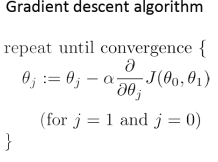
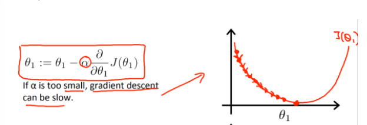

### 2022-05-05

## SVM (Support Vector Machine)
*참고 : https://www.youtube.com/watch?v=qe3A9B76cRI*
*참고 : https://hleecaster.com/ml-svm-concept/*
- **SVM이란?**
  - 분류를 위한 기준 선을 정의하는 모델
  - 분류되지 않은 새로운 점이 나타나면 어느쪽에 속하는 지 정할 수 있도록
  - 

- **최적의 결정 경계 & 마진**
  - 결정 경계는 데이터 군으로부터 최대한 멀리 떨어져있는게 좋다
  - **마진**
    - 결정 경계 <-> 서포트 벡터 사이의 거리
    - 

- **Outlier 얼마나 허용할 것인가**
  - 
  - Hard Margin
    - 아웃라이어를 허용하지 않고 기준을 까다롭게 세운 모양
    - 서포트 벡터와 결정 경계 사이 거리 매우 좁음 (마진 작음)
    - 오버피팅 문제 발생 가능
  - Soft Margin
    - 아웃라이어를 허용하여 너그럽게 잡아둠
    - 서포트 벡터와 결정 경계 사이 거리 멀어짐 (마진 커짐)
    - 언더피팅 문제 발생 가능

## Gradient Descent
*참고: https://angeloyeo.github.io/2020/08/16/gradient_descent.html*
*참고: https://box-world.tistory.com/7*
- **Gradient Descent Algorithm**
  - 1차 미분계수를 이용해 함수의 최소값을 찾아가는 iterative한 방법
    - Step Size를 조정해가며 최소값을 찾아가는 과정!
  - 비용 함수를 J(θ(0),θ(1)) 최소화하는 θ를 구하는 알고리즘
    - θ에 대해 임의의 초기값/시작점 잡음
    - J가 최소가 될 때 까지 θ 값을 갱신 반복하여 최솟값 도달하도록 함
    - 최솟값에 도달했을 때 θ를 확인
    - 
      - Repeat Until Convergence
      - α : learning rate
        - 갱신되는 **θ값의 속도**를 결정
    - 반복적인 갱신을 통해 최종적인 minimum에 도달하는 것

- **미분값 Derivative Term**
  - 해당 지점에서의 기울기
  - α가 양수라면 θ가 반복적으로 갱신되면서 최종적으로 최솟값에 도달
  - θ의 갱신은 기울기 하강/기울기 상승 두가지로 나뉨

- **학습 속도 Learning Rate**
  - Learning Rate가 작다면
    - 
    - 최솟값에 도달하기 위해 굉장히 많은 연산
  - Learning Rate가 크다면
    - 
    - 반대쪽을 오가며 매우 큰거리를 이동하게 됨

- **θ의 수렴 조건**
  - 미분값이 0에 도달하면 Cost Function이 최소

- **최종 수식**
  - 
