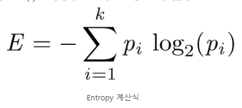
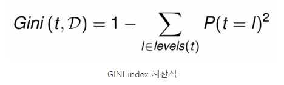
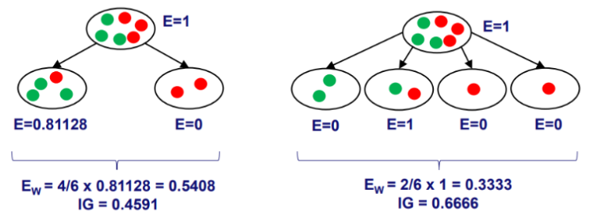

### 2022-05-13

## Decision Tree와 Impurity 지표
- *참고: https://process-mining.tistory.com/42*
- *참고: https://process-mining.tistory.com/106*
- **Decision Tree**
  - 데이터를 이용하여 이를 분류하거나 원하는 어떤 결과값을 예측하는 분석 방법
  - Terminal node가 가장 섞이지 않은 상태로 완전히 분류되는 것
    - 즉 복잡성(entropy)이 낮도록 만드는 것
  - 각 subset의 복잡성이 가장 낮은 방향으로, 가장 덜 섞인 방향으로 decision tree 발전시켜 나가는 것!

- **Impurity**
  - 각 노드들의 복잡성
  - 해당 노드안에서 섞여있는 정도가 높을수록 복잡성이 높고, 덜 섞일수록 복잡성이 낮다
  - 결과 노드 안에서 섞여있는 정도가 낮은 tree 만드는 것이 목표

- **Entropy**
  - 
  - 각 노드의 엔트로피를 다음과 같은 식으로 구할 수 있음
  - 약간 분산의 정도를 수식으로 표현하는 듯
  - 

- **GINI Index**
  - 
  - 

- **Information gain**
  - Impurity 지표를 바탕으로 impurity가 얼마나 개선되었는지를 계산할 수 있는 것이 Information gain
  - Split을 많이 할수록 node의 impurity가 낮아, information gain에서 더 좋은 성능 보임
    - 이를 보완하기 위해 만들어진 개념 Inforamtion Gain Ratio
  - 

- **Information Gain Ratio**
  - 