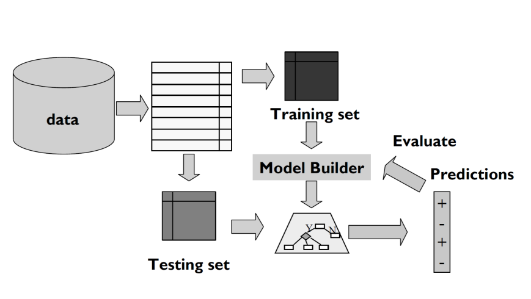
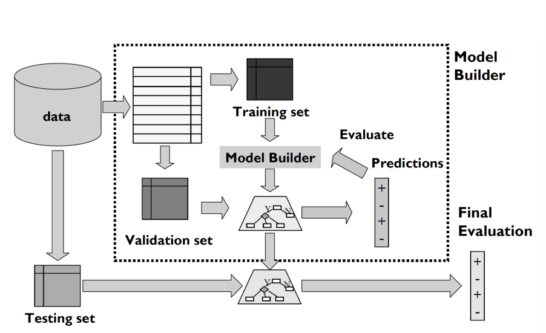
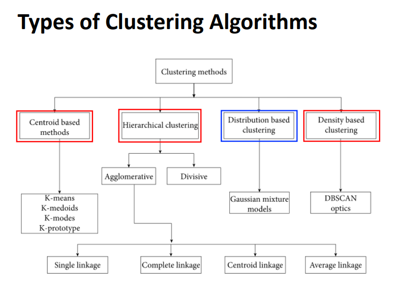

### 2022-05-22

## Data Mining 1. Intro
[Data Mining Process]
1. Understand the domain
2. Create a dataset
    - Select the interesting attributes
    - Data cleaning and pre-process
3. Choose the data mining task and the specific algorithm
    - Supervised learning(Predictive) : some variables to predict other variables
        - Regression
        - Classification
    - Unsupervised learning(Description) : human-interpretable data pattern
        - Clustering
        - Association Rule Discovery
4. Interpret the result and return to step 2

[Regression]
- Given Data input X => Continuous response variable output Y
  - X: 나이, 몸무게, 키
  - Y: 해당 사람의 혈압을 예측

[Classification]
- Given Data input X => Caregorical response variable output Y
  - X: 나이, 몸무게, 키
  - Y: 해당 사람이 5년간 살아남을지 Yes/No

[Clustering]
- Given a set of data points => similarity measure => find clusters

## Data Mining 2. Simple Linear Regression
- Regression Analysis
  - Predictor Variable => Response Variable
  - Independent Variable => Dependent Variable

- 하나의 predictor variable만 있다면 **simple linear regression** 사용
- 두개 이상의 predictor variable => multiple linear regression

- LS(Least Squares) Fit
- LS Estimate
- Maximum Likelihood Estimators (MLE)
- Anlaysis of Variance (ANOVA)

## Data Mining 3. Multiple Linear Regression
- Probabilistic Model
- Goodness of Fit of the Model
- Statistical Inference on betas. 
  1. Mean
  2. Variance
- Prediction of Future Observation
- F-Test for betas

## Data Mining 4. Principal Component Analysis (PCA)
- Linear regression은 independent variable들이 크게 상관관계(Multicollinearity)가 없다는 가정하에 Working
- Dimensionality Reduction을 통해 줄임
  - Feature Selection
  - Feature extraction
- PCA를 통해 Multicollinearity를 해결할 수 있음
  - p 변수들에 대한 n 객체들을 모아, uncorrelated axes로 요약해버림!
    - linear combination of the original p variables로
- 다음과 같은 도구들이 필요함
  - Variance-Covariance Matrix
  - Variance-Covariance Matrix Estimator
  - Variance-Covariance Matrix Estimate
-  
  - 다음과 같이 분산 뚝딱
- Generalization to p-dimensions
- PCA Algebra
- Interpreting Eigenvectors
- PCA의 가정
  - variable의 관계가 Linear 하다는 가정
  - 데이터가 Non-Linear 하다면, principal axes로 꼽힌 축은 효과가 없을 것
- PCA 언제쓰지?
  - 변수들의 관계가 거의 linear 하다거나, 최소한 monotonic 한 경우

## Data Mining 5. Logistic Regression
- 1개의 Predictor를 갖는 Logistic Regression
- p개의 Predictor를 갖는 Logistic Regression
- Nominal/Ordinal Responses를 위한 Logistic Regression 

## Data Mining 6. Linear Disciminant Analysis (LDA)
- LDA란? 
  - 차원 축소 기법중에 하나
- LDA vs PCA
- LDA의 단점

## Data Mining 7. Evaluation
- TestSet 평가
  - 
- Generalized Evaluation
  - 
- 평가하는 다양한 방법
  - 작은 데이터라면, 1/3 테스팅 2/3 트레이닝으로 분류
  - Repeated Holdout Method : 서로 다른 표본을 사용하여 평가 반복
  - Cross-Validation : Overlapping testset 방지
    - 
    - Leave-One-Out Cross-Validation : 가장 데이터를 잘 활용한 경우
      - 
- 평가 기준
  - Predictive Accuracy : 모델이 얼마나 새로운 데이터에 대한 예측을 잘 내놓는지
  - Time & Memory : Computation Cost
  - Robustness : 노이즈에도 불구 얼마나 정확한 모델인지
  - Scalability : 많은 양의 데이터 효율적으로 처리가능한가?
  - Interpretability : 모델이 주는 인사이트를 이해하기 쉬운가?
  - Simplicity : 결정 트리 사이즈, compactness
- Prediction Model
  - Regression
    - 결과값 예시
      - 
    - 평가 지표
      - BIAS : 에러의 산술적 평균
      - MAD : Mean Absolute Deviation (평균의 절대값 분산)
      - MSE : Mean Square Error (가장 선호도 높음)
      - MAPE : Mean Absolute Percentage Error
      - RRSE : Root relative squared error
  - Classification
    - 결과값 예시
      - 
    - 평가 지표
      - Confusion Matrix
        - True Positive, True Negative, False Positive, False Negative
        - Accuracy = (TP + TN) / (TP + TN + FP + FN)
        - Sensitivity = TP / (TP + FN)
        - Specificity = TN / (TN + FP)
        - Precision = TP / (TP + FP)
      - AUC
        - ROC 커브의 아래 영역
      - F-Measure : trade-off between precision and noisy channel

## Data Mining 8. Decision Tree
- 결정 트리 생성 방법
  - Greedy Strategy
    - 언제 스플릿 멈출지 생각하며 특정 분야를 최적화 할 수 있는 것으로 레코드 분리!
  - Multi-way Split, Binary Split
  - 동형으로 많이 분류 안되는, impurity가 높은 기준으로 나누기
- Node Impurity 측정 방법
  - Gini Index
    - 모든 클래스로 분류가 되었을 때 가장 높고, 하나에 모여있을 때 가장 낮고
    - 
    - 
    - 계산 예시
      - 
  - Entropy
    - node의 homogeneity(동종) 측정
    - 
  - Information Gain
    - Split으로 인해 Entropy가 감소한 정도를 측정
    - 
  - Gain Ratio
    - 
  - Misclassification Error

## Data Mining 9. Random Forest
- Decision Tree 
  - 장점
    - Regression과 Classification 모두에 적용 가능
    - 계산 간단
    - 정형적인 분포 가정이 없음
    - 자동 변수 선정
  - 단점
    - Accuracy: 타 알고리즘보다 정확도 낮을 때 있음
    - Instability: 데이타 쪼끔 바꾸면 트리 많이 바뀜
  - Decision Tree 보다 나은 방법이 없을까?
- **Bagging Predictors**
  - Bootstrap Aggregating의 줄임말
  - Classification/Regression 모델을 부트스트랩 샘플에 맞춰, averaging*(regression)*/voting*(classification)*으로 합치기
  - bootstrap sample이 데이터의 대체를 통해 랜덤하게 선택됨
  - base learner에 대한 분산을 줄임
  - 약한 base learner이며, 적은 bias와 높은 분산을 가지고 있는 데이터셋에 가장 효율적
- **Random Forest**
  - 많은 양의 Tree를 만들어 Forest 구성
  - 트레이닝 데이터를 통해 여러가지 independent bootstrap sample 구성
  - Decision Tree의 많은 장점 흡수
    - Regression/Classification 둘다 적용 가능
    - 카테고리성 predictor 다룰 수 있음
    - 연산 간단
    - 자동 variable selection 등등
  - RF Predictor
- **Variance Importance**
- MDI
- MDA

## Data Mining 10. Boosting
- *참고: https://icim.nims.re.kr/post/easyMath/838*
- Ensemble
  - 머신 러닝 알고리즘으로 자체보다는 더 나은 예측 퍼포먼스를 낼 수 있도록 Ensemble 사용
  - 여러개의 머신러닝 모델을 섞어서 결과를 예측하기
  - 이를 Bagging/Boosting을 통해 구현 가능
- Bagging
  - 학습 데이터를 부트스트랩 샘플링을 이용해 추출하고, 개별 모델 학습
  - 데이터를 가지고 첫번째 모델 학습 => 같은 과정 여러번 반복하여 여러개의 개별 학습 모델 만듦 
- Boosting
  - 오분류된 샘플에 더 많은 가중치 주어 학습하는 방식
- Adaboost
- Gradient Boost

## Data Mining 11. k-Nearest Neighborhood
- 개요
  - 패턴 인식에 사용되는 Classification 알고리즘
  - k-Nearest Neighbors는 모든 가능한 케이스를 저장해, similarity measure(distance function) 통해 새로운 케이스를 만들어 냄
  - Parameter가 없는 lazy-learning 알고리즘
- k-NN
  - Object가 다수의 투표로 인해 분류가 된다
  - 해당 Object가 주변에서 가장 흔한 클래스로 지정이 된다
- K-NN Feature Weighting
- Feature Normalization
- Nominal/Categorical Data

## Data Mining 12. Naive Bayes
- 가정
  - 각 feature는 독립적이다. 
  - p(x,y|z) = p(x|z)p(y|z)
  - x is conditionally independent of y given z, if the probability distribution governing x is independent of the value of y, given the value of z
- MNIST 데이터 셋 두둥등장

## Data Mining 13. Support Vector Machine
- Linear Support Vector Machine (Seperable Case)
  - Linear Classifier
- Linear Support Vector Machine (Non-seperable Case)
  - Soft Margin Classification
  - Hard Margin vs Soft Margin
- Nonlinear Support Vector Machine
  - Feature spaces

## Data Mining 14. Clustering
- 개요
  - Clustering: unsupervised learning의 한 종류, 비슷한 데이터 샘플을 찾아 묶어주는 용도
  - 
  - Feature Selection : 클러스터링에 쓸 가장 효과적인 subset 구하기
  - Feature Extraction : Input Feature를 통해 새로운 Feature 생성
  - Inter-pattern Similarity : 패턴 간의 거리 측정
  - Grouping : Group similar patterns in same cluster
- (Dis)similarity Measures
  - Continuous Variable
  - Distance Measure
  - Correlation (Pearson Linear Correlation)
  - Binary Variable
  - Nominal Variable
  - Ordinal Variable
- 
- Hierarchical Clustering
  - Agglomerative(bottom-up)
  - Divisive(top-down)
  - Dendrogram
    - 
  - Single-Link/Complete-Link Method
  - AGNES
  - DIANA
- k-means Algorithm
  1. k개의 cluster 선정
  2. cluster center m1, ... , mk
  3. 각 데이터포인트에 대해 클러스터 센터에 대해 가장 가까운 데이터 포인트 선정
  4. Re-compute cluster center
  5. Re-assignment가 없을때까지 계속
- Clustering Evaluation
- DBSCAN Algorithm

## Data Mining 15. Association Rules
- 개요
  - Market Basket을 통한 유의미한 정보 찾기
    - 고객은 누구인가?
    - 같이 구매하는 경향이 있는 프로덕트는 무엇인가
    - 왜 이 프로덕트들은 같이 구매되는 경향이 있는가? 
- Association Rules
  - Clear and Useful result of market basket analysis
  - The Useful Rule : high quality, actionable information 
  - The Trivial Rule
  - The Inexplicable Rule
- Basic Process
  - Taxonomy
  - Virtual Items
  - Generating Rules
