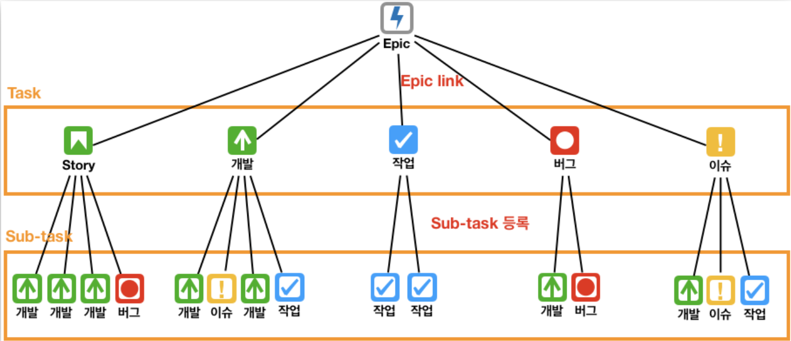

### 2022-06-26

## 스크럼
- *참고 1: http://blog.hwahae.co.kr/all/tech/tech-tech/7407/*
- *참고 2: https://engineering.linecorp.com/ko/blog/user-story-point-in-line-pay-team/*
- *참고 3: https://taes-k.github.io/2019/12/07/sw-jira-scrum/*
- **스크럼**
  - '점진적 개발'이 목표
  - 우리팀의 상황에 맞게끔 스크럼을 점점 변형시켜 나가면서 팀으로 맞추어나감

- **백로그**
  - 개발해야할 기능 혹은 제품에서 요구하는 기능과 우선 순위

- **Jira**
  - 이슈 타입
    - Epic: 여러 스프린트에 걸쳐서 끝나지 않고, 여러 스토리들의 집합
    - Story: '사용자로써 무엇을 하고 싶다'에 대한 유즈케이스
    - Chore: 사용자와는 직접적으로 관계되지 않은 개발
    - Task: 구현에는 직접적으로 관련이 없는 업무
    - Issue: 이슈 사항(서버 다운, 클라우드 계약 등)
    - Bug: 테스트 엔지니어로부터 버그로 리포팅된 타입
  - Epic 예시
    - Epic: 회원가입/로그인
    - Task
      1. (Story) 사내 직원이 어드민 회원가입 할 수 있음
      2. (Task) DB 인프라 신청
    - Sub-Task
      - 1-1. OAuth 권한 신청
      - 1-2. 회원가입 서비스 개발
  - 

- **스크럼**
  1. 제품 백로그 준비
     - PO는 프로젝트 요구사항에 맞추어 Epic들을 생성
     - Epic은 필수기능이라 프로젝트의 진행속도를 나타내는 마일스톤 역할
  2. 릴리즈 계획 수립
     - PO는 1단계에서 생성한 Epic 가지고 프로젝트 릴리즈 계획 수립
  3. 스프린트 계획 수립
     - Task 만들기
       - PO + Scrum Master는 수립된 릴리즈 계획내에 포함된 Epic들을 세부작업 Task로 분할
     - Sprint 만들기
       - Task를 2주 단위의 스프린트로 조합
     - Task 작업
       - 세부 단위로 Sub-Task 작성하여 작업 진행
  4. 스프린트 관리
     - 매일 오전 20분의 스프린트
  5. 스프린트 종료
     - 2주 단위로 스프린트를 종료하도록 함
  6. 백로그 업데이트
     - 스프린트 리뷰 완료 후 백로그 업데이트
  7. 회고

- **라인팀의 스크럼 방식**
  - 스토리 포인트
    - 요구 사항이라고 부르는 시스템의 기능 설명을 사용자 관점에서 이야기 하는 것
    - "사용자에게 가치 있는 것"들만 사용자 스토리 대상으로 간주할 것
  - 스프린트
    - 특정 기간을 정해, 그 기간 단위로 움직이는 것
    - 2주 간격으로 해당 기간동안 수행할 일 계획하고, 수행하고, 회고하고
  - 벨로시티
    - 스프린트 당 얼마나 많은 스토리 포인트를 획득할 수 있는지
    - 스토리 포인트 획득 == 사용자 스토리를 실제 동작하는 기능으로 구현해 전달한 경우