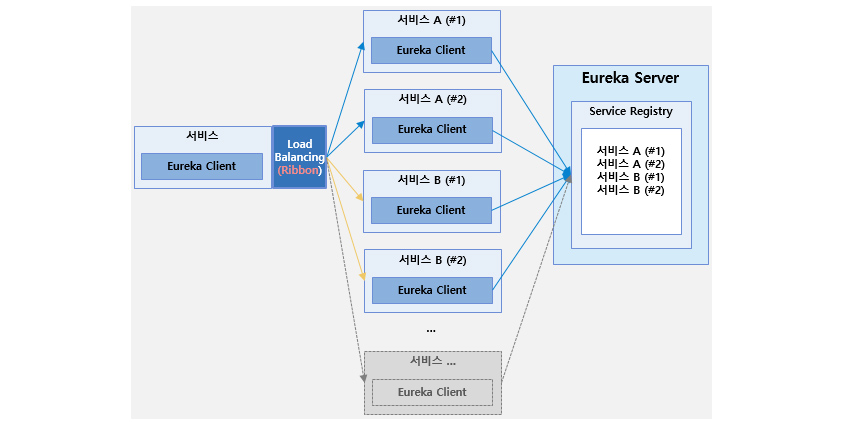
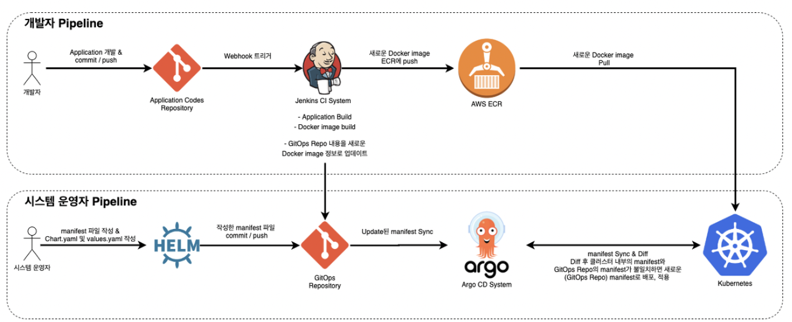

### 2022-06-28

## MSA
- *참고 1: https://www.samsungsds.com/kr/insights/1239180_4627.html*
- *참고 2: https://dudghsx.tistory.com/entry/MSAMicro-Service-Architecture%EB%9E%80-%EB%AC%B4%EC%97%87%EC%9D%B8%EA%B0%80*
- **MSA란?**
  - 경량화되고 독립적인 여러개의 서비스를 조합하여 어플리케이션을 구현하는 방식
    - 모놀리식은 시스템 규모가 커지고 복잡도 증가하면 이해/분석 빡세짐
  - 서비스마다 자체 DB를 가지고 동작 => 개발/빌드/배포까지 효율적으로 수행 가능
    - 개발과 유지관리에 소요되는 시간과 비용 줄일 수 있음
  - MSA의 지향점: 서비스간 느슨한 결합(Loose Coupling)과 높은 응집성(High Cohesion)
  - 도메인 주도 설계(DDD)
    - 도메인: 행위를 포함하여 SW이용자가 다루는 모든 것
  - 전체 서비스를 관리하기 위한 서비스 메쉬 기반의 아우터 아키텍쳐 선정
  - MSA가 갖춰야할 서비스의 주요 기능
    - Configuration Management: 서비스의 빌드/재부팅 없이 설정 사항 반영하기
    - Service Discovery: MSA 기반 서비스 배포시, 서비스 검색 및 등록하기
    - Load Balancing: 서비스 간 부하분산
    - API Gateway: 클라이언트 접근 요청을 일원화
    - Service Security: 마이크로서비스 보안을 위한 심층 방어 메커니즘 (Spring Security)
    - Centralized Logging: 서비스별 로그의 중앙 집중화 (ELK stack)
    - Centralized Monitoring: 서비스별 메트릭 정보의 중앙 집중화
    - Distributed Tracing: 마이크로 서비스간의 호출 추적
    - Build/Deploy Automation: 서비스별 빌드/배포 자동
    - Test Automation: 서비스에 대한 테스트 자동화
    - Image Repository: 컨테이너 기반 서비스 배포를 위한 이미지 저장

- **Eureka**
  - 동적으로 서비스 등록 및 서비스 디스커버리 수행
  - 로드밸런싱을 통해 서비스간 부하 분산 기능 제공
  - 
  - 로직
    - 어플리케이션 서비스 시작시, 유레카 서버의 레지스트리에 상태 정보 등록
    - 각 서비스는 설정된 간격(30초) 마다 하트비트 방식으로 상태 정보를 유레카 서버로 전송해 헬스체크 진행

- **사이드카 프록시 패턴으로 서비스 메쉬 구현**
  - 서비스 모니터링은 시스템 메트릭과 같이 리소스 정보를 공유할 수 있는 구조로 개발

- **데이터 트랜잭션 관리**
  - 모놀리식은 DBMS로 보다 편하게 관리 가능 but MSA needs some solution
  - 2PC (2 Phase Commit)
    - Try Confirm Cancel
    1. 중앙 코디네이터 제어 노드에서 글로벌 트랜잭션 생성하여 대상 서비스들에게 잠금 요청한 후 모든 서비스로부터 응답 받음
    2. 모든 서비스에게 커밋을 전송한 후 서비스로부터 결과를 응답 받음

- **DDD**
  - 비즈니스에 대한 이해가 부족한 상태에서 개발되었던 모놀리식의 개선판
  - 데이터가 아닌 "비즈니스 서비스"가 중심이 되어 설계할 것
  - 각 도메인에서 발생하는 이벤트 작성
    - 비슷한 업무 성격의 이벤트를 묶어 "서브 도메인"으로 편성
      1. Core sub domain: 비즈니스 목적 달성을 위한 핵심 도메인
      2. Supporting sub domain: 코어 도메인을 지원하는 도메인
      3. Generic sub domain: 비즈니스에서 공통적으로 사용되는 도메인
      - 이렇게 묶어서 Entity를 생성
        - 도메인 내부의 모든 엔티티를 Aggregate라고 함
  - 도메인 이벤트를 발생시키는 Command를 정의 => 1개 이상의 Event 발생 가능

- **MSA 설계 시 주의사항**
  - 비즈니스 측면에서 얼마나 관련이 있는가로 묶음
  - DB를 분리하니, Join을 위해 얼마나 많은 자원이 사용되는지
  - 마이크로 서비스간의 통신을 어떻게 설계할 것인가?
    - 계층 분리?
    - api를 통해 직접 연결?
    - 이벤트를 처리하는 방법
    - 논리적인 계층을 어떻게 가져갈 것인가?

- **MSA시 Join은 어떻게?**
  - MSA는 DB가 분리되어있다
    - 따라서 모놀리식 방식처럼 Join을 통해 요청 해결 X
  - example
    - 사용자가 프로그램 목록을 요청
      - 이때 프로그램 데이터와 편성/기획 데이터는 나뉘어져있음 (Join 못함)
    - 편성 컴포넌트를 통해 편성 BFF에 프로그램 목록 데이터를 요청
    - 사용자가 원하는 프로그램을 화면에서 선택
    - 화면의 기획 컴포넌트에 프로그램 데이터가 입력되어 프로그램 데이터 추출
      - 이때 필요한 만큼의 정보만 가져올 것!
  - 병목은 어떻게?
    1. Table 복제
       - 편성 프로그램 기획 목록이 필요할때마다 api 요청 보내지 말고
       - 프로그램 데이터 필요한 만큼만 살짝 복사해두자
       - 그러면 Join으로 쇼부 가능
    2. CQRS + Materialized View
       - CQRS(Command and Query Responsibility Segregation)
         - Command와 Query의 책임 분리
         - Command: 데이터의 상태를 변화시킴
         - Query: 데이터의 상태를 알려줌
         - 코드를 분리/WAS를 분리/DB를 분리
       - Materialized View
         - 마이크로 서비스에 Command 이벤트 발생시, 이벤트 저장 모듈은 이를 구독해 Join된 이벤트를 미리 만들어 둠

## UACC 레포지토리 관리 방식
- **Fan Frontend**
  - 하나의 레포지토리로 관리

- **Admin Frontend**
  - 하나의 레포지토리로 관리

- **Backend**
  - *참고: https://github.com/woowacourse-teams/2021-cvi/tree/main/backend*
  - MSA로 구성했다고 알고있는 레포
  - 확실히 각 엔티티별로의 패키지 분리가 되어있다
  - DB설계는 각각 어떻게 한거지?
  - 멀티모듈을 쓴건가? gradle 서브모듈?
    - *참고: https://angryfullstack.tistory.com/entry/%EB%A7%88%EC%9D%B4%ED%81%AC%EB%A1%9C-%EC%86%8C%ED%94%84%ED%8A%B8-%EC%95%84%ED%82%A4%ED%85%8D%EC%B2%98MSA-3%ED%8E%B8-%EB%A9%80%ED%8B%B0-%EB%AA%A8%EB%93%88Multi-Module*
    - *참고: https://dundung.tistory.com/243*

## UACC Git branch 전략
- *참고: https://techblog.woowahan.com/2553/*
- **Local & Upstream**
  - 
  - Local Repository에서 작업 완료 --푸시--> Origin Repository
  - Origin Repository --PR--> Upstream Repository
  - 이렇게 하는 이유?
    - 이런 워크플로우를 두는 데에는 한 가지 이유가 있었습니다. 
    그 이유는 개발자들의 실험정신(?)을 펼치기 위해서였습니다. 
    모두가 공유하고 있는 Repository에서 실험하기에는 위험이 있다고 생각했고, 
    Forked한 Repository를 두면 부담 없이 원하는 실험들을 해볼 수 있다고 생각했습니다. 
    무엇보다 이런 구조로 가져갔을 때 개발자가 해야 할 작업들이 [중앙집중식 워크플로우](https보다 일이 늘거나 크게 복잡해지지도 않았습니다.

- **이렇게 약속해요**
  1. 작업을 시작하기 전에 JIRA 티켓을 생성
  2. 하나의 티켓은 되도록 하나의 커밋
  3. 커밋 그래프는 단순하게
  4. 서로 공유하는 브랜치의 커밋 그래프는 함부로 변경하지 않을 것
  5. 리뷰어에게 꼭 리뷰를 받을 것
  6. 자신의 PR은 자신이 Merge할 것
  7. 커밋을 순차적으로 만들기 위해서 작업한 커밋이 feature의 최신 상태가 될 수 있도록 rebase 수행

- **Git Flow**
  - master: 제품으로 출시될 수 있는 브랜치
  - develop: 다음 출시 버전을 개발하는 브랜치 (develop 브랜치에 대해 인프라 구축해두면, QA를 여기서 진행해도 됨)
  - feature: 기능을 개발하는 브랜치
  - release: 이전 출시 버전을 준비하는 브랜치 (경험상 develop 브랜치에 대해 인프라 구축을 해두어 실험해볼 수 있다면, release 브랜치는 필요없음)
  - hotfix: 출시 버전에서 발생한 버그를 수정하는 브랜치
  - 

## UACC CI/CD 방식
- *참고: https://junghyeonsu.tistory.com/65*
- 
- **Jenkins (CI)**
  - Jenkins를 통해 새로운 코드를 테스트, 빌드한 파일을 "Docker Image"로 만들어 쿠버네티스 시스템에서 새로운 코드가 돌아가도록 파이프라인 구성
  - 빌드까지의 역할 수행

- **Argo CD (CD)**
  - 쿠버네티스를 위한 "GitOps" 지속적 전달 툴
    - 운영적인 부분을 Git으로 관리하겠다는 뜻
  - 지속적 전달이란 지속적 통합을 통해 테스트되고 빌드된 코드를 지속적으로 전달
  - 쿠버네티스 운영에 관련된 manifest 파일을 관리하는 원격 레포 조회
  - 쿠버네티스로 배포되고 관리됨

- **정리**
  1. Jenkins에서 새로운 코드를 테스트 하고 빌드 => Docker Image 생성
  2. Docker Image를 AWS ECR(Elastic Container Repository)에 저장
  3. 새로운 Docker Image 버전 태그 내용을 GitOps 레포지토리 내용에 업데이트
  4. Argo CD에서는 새로 업데이트된 GitOps 레포의 내용을 감지
  5. 현재 쿠버네티스에 배포된 manifest 내용과 새로 업데이트된 GitOps 레포의 manifest 내용 비교
  6. 업데이트 확인하면 운영자의 조작 혹은 자동 업데이트 수행

## UACC 사업화 전략

