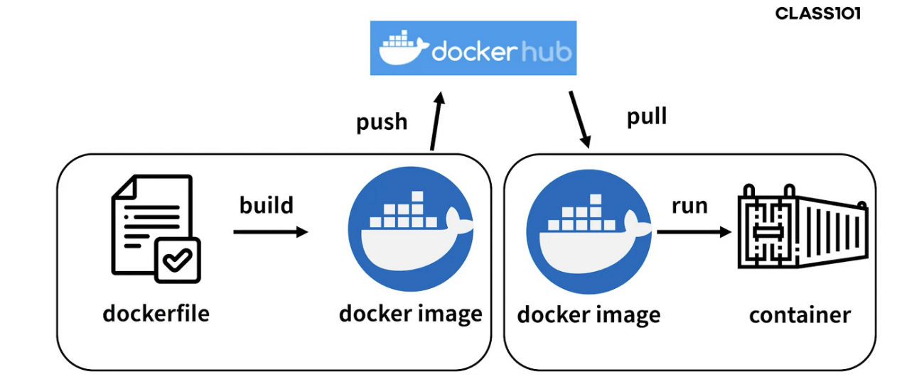

### 2022-06-30

## 도커로 배포하기
- *참고: https://subicura.com/2016/06/07/zero-downtime-docker-deployment.html*
- **어떻게 배포하는 것이 좋은가?**
  - 쉽고 관리하기 편한 방법을 선택하자
  - 자동으로 배포하자
  - 하루에도 여러번 배포하자
  - 배포 중 서비스가 중단되는 일이 없도록 하자
  - 모든 서비스는 도커를 이용해 컨테이너 형태로 표준화하여 배포하자
  - 테스트 서버에 동일한 방법으로 배포하고 테스트하자
  - 시작은 서버 한대지만 나중에 여러대로 확장되었을때를 대비하여 설게를 고민하자

- **Why Docker?**
  - 새로운 서버에 서비스를 동작시키려면 굉장히 많은 작업 필요
  - 백엔드 언어에 귀속되는 다양한 익스텐션 설치 필요
  - 서버 한 대 추가된다고 똑같이 세팅하기가 참으로 어려움
  - 버전 업데이트되면 그것도 그것대로 골때림

- **도커를 통한 배포가 갖는 특징**
  1. 확장성
     - 이미지만 만들어둔다면 컨테이너는 띄우기만 하면 됨
     - 다른 서버로 서비스 옮기거나 새로운 서버에 서비스 하나 더 띄우는건 `docker run` 명령어면 충분
     - 개발서버 띄우기도 편하고 테스트서버 띄우기도 간편
  2. 표준성
     - 도커 사용하지 않는 경우 다른 언어로 만든 서비스들의 배포 방식은 제각각 다르다
     - 컨테이너라는 표준으로 서버를 배포해야 배포 과정이 동일해짐
  3. 이미지
     - 이미지에서 컨테이너를 생성하기에 반드시 이미지 만드는 과정 필요
     - 이미지 저장할 공간 필요
     - 해당 이미지를 distribution에 저장하고 운영서버에서 이미지 불러옴
  4. 설정
     - 설정은 보통 환경변수로 제어
     - `MYSQL_PASS=password`와 같이 컨테이너 띄울때 환경변수 같이 지정
     - 하나의 이미지가 환경변수에 따라 동적으로 설정파일 생성하도록 만들어야 함
  5. 공유자원
     - 컨테이너는 삭제 후 새로 만들면 모든 데이터가 초기화됨
     - 업로드 파일을 외부 스토리지와 링크하여 S3 같은 별도 저장소 필요
     - 세션이나 캐시를 파일로 사용한다면 redis 외부로 분리

## 컨테이너로 배포 vs 프로세스로 배포
- *참고: https://zzang9ha.tistory.com/360*
- **굳이 컨테이너?**
  - 어플리케이션이 동작하는 환경 자체를 개발 환경과 운영 환경을 동일하게 구성 가능
  - 해당 서비스에 대한 트래픽 증가시 보다 효율적으로 서비스 확장하기 좋음

- **도커파일 예시**
```Dockerfile
FROM openjdk:11
EXPOSE 8080
ADD build/libs/msa-0.0.1.jar msa-0.0.1.jar
ENTRYPOINT ["java","-jar","msa-0.0.1.jar"]
```
```Dockerfile
FROM openjdk:8-jdk-alpine
ARG JAR_FILE
COPY ${JAR_FILE} app.jar
COPY application-db.yml /application-db.yml
ENTRYPOINT ["/bin/sh","-c","java -Dspring.config.location=classpath:/application-${IDLE_PROFILE}.yml,/application-db.yml -Dspring.profiles.active=${IDLE_PROFILE} -jar ./app.jar"]
```
- 구축 이후 Build한 이미지를 컨테이너에 올려보자
    ```
    docker run -p 8080:8080 msa-0.0.1
    ```
- 이후에 배포 스크립트를 작성해서 인스턴스에서 돌린다!

- **dockerhub을 통한 배포**
  - 
  - 과정
    - Dockerfile을 build해서 docker image 파일 생성
    - docker image 파일을 dockerhub에 push
    - 서버에서 docker hub에 존재하는 docker image를 pull 해옴
    - docker run 명령어를 통해 docker image 파일 실행
  - 개발환경에서 포장한 컨테이너 그대로 운영서버에서 돌릴 수 있다!

## Rest API vs GraphQL

## Spring에서 GraphQL?

## NFT 컬렉션 발행해보기
