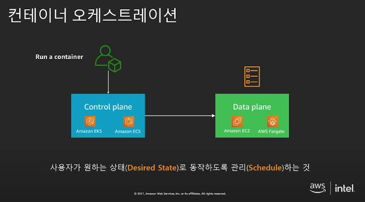

### 2022-08-19

## Predicate

## Fargate & ECS
- *참고: https://aws.amazon.com/ko/about-aws/whats-new/2017/11/introducing-aws-fargate-a-technology-to-run-containers-without-managing-infrastructure/*
- *참고: https://aws.amazon.com/ko/blogs/korea/how-to-choose-aws-container-services/*
- *참고: https://jsonobject.tistory.com/536*
- *참고: https://www.44bits.io/ko/post/container-orchestration-101-with-docker-and-aws-elastic-container-service*
- *참고: https://www.youtube.com/watch?v=wgJYt_VF6yA*
- **Fargate 개요**
  - 기본 인프라 관리할 필요없이 컨테이너를 배포하고 관리할 수 있는 컴퓨팅 엔진
  - 어플리케이션을 쉽게 확장할 수 있음
  - 별도 인스턴스 생성/관리하지 않고 완전한 매니지드 서비스 형태의 도커 컨테이너 상품
  - 어플리케이션을 작업 정의에 패키지화 하고, 필요한 CPU/메모리 지정, 컨테이너에 필요한 네트워킹 및 IAM
  - 모든 설정 완료되면 Fargate에서 자동으로 컨테이너 시작하여 관리
  - 초 단위로 청구되며, 사용한 만큼만 지불하면 됨
  - ECS/EKS 컨테이너 배포/운영은 AWS에 맡기고, 실행하는데 필요한 리소스에 대해서만 비용 지불

- **Fargate vs EC2**
  - 인스턴스 클러스터 관리, 인스턴스 유형 선택, 컨테이너 일정 관리, 클러스터 사용률 최적화
    - 이거 모두 Fargate가 처리해줌

- **ECR**
  - 완전관리형 컨테이너 레지스트리
  - ECS/EKS와 함께 사용

- **ECS**
  - 단순성을 목표로 개발 (Powerful Simplicity)
  - 대규모 컨테이너를 실행하는 aws만의 컨테이너 환경

- **클러스터**
  - ECS의 가장 기본적인 단위. 서비스/태스크 실행되는 공간을 나누는 논리적인 공간
  - Amazon ECS에서 가장 큰 개념
  - 모든 서비스는 특정 클러스터 내에 속하여 작동
  - Amazon ECS 콘솔 접속 => 클러스터 => 클러스터 생성 클릭
    - 클러스터 템플릿 선택: 네트워크 전용 클릭
    - 클러스터 이름: foobar-prod
  - 도커 컨테이너를 실행할 수 있는 가상의 공간
  - ECS 클러스터는 기본적으로 EC2와 같은 컴퓨팅 자원을 포함하고 있지 않은 **논리적인 단위**
    - 컴퓨팅 자원이 없는 빈 클러스터를 만드는 것도 가능
  - 클러스터에 연결된 EC2 인스턴스를 컨테이너 인스턴스라고 부름

- **태스크**
  - ECS에서 컨테이너를 실행하는 최소 단위는 태스크
  - 태스크: 하나 이상의 컨테이너로 구성됨
  - 태스크 디피니션: 태스크 실행시 컨테이너 네트워크 모드, 태스크 역할, 도커 이미지, 실행 명령어, CPU 제한, 메모리 제한 등 다수 설정
    - 한 번 정의해두고 이를 기반으로 특정 설정 변경 가능

- **작업 정의 생성**
  - 쿠버네티스의 Pod와 비슷
  - Amazon ECS => 작업 정의 => 새 작업 정의 생성 => Fargate
    - 작업 정의 이름: foobar
    - 작업 역할: 역할 선택
    - 네트워크 모드: awsvpc
    - 작업 메모리: 선택
    - 작업 CPU: 선택
    - 컨테이너 추가
    - 컨테이너 이름: foobar-api-prod
    - 이미지: url
    - 포트매핑: 8080/TCP
    
- **로그 모니터링**
  - 오케스트레이션 환경에서 모니터링의 대상이 유동적임
  - Amazon Cloudwatch Metrics 수집이 활성화되어 15개월간 수집된 로그 유지

- **서비스**
  - 태스크를 관리하는 단위. 내부적으로 태스크 실행을 위한 스케줄러 가지고 있으면 서비스의 정의한대로 태스크 실행되는 상태 유
  - 클러스터 두가지 방식으로 태스크 실행 가능
    1. 태스크 데피니션으로 직접 태스크 실행
       - 거의 사용 x
    2. 서비스를 정의하는 방법
       - 하나의 태스크 데피니션과 연결됨

- **ALB(Application Load Balancer)**
  - Application Load Balancer는 OSI 모델의 일곱번째 계층인 어플리케이션 계층에서 동작함
  - 요청을 받으면 우선 순위에 따라 리스너 규칙 평가

- **ECS**
  - 
  - Control Plane에 사용자가 어떤 환경으로 구동시키고 싶은지 설정해둠
  - Data Plane에 EC2/Fargate로 호스트 옵션