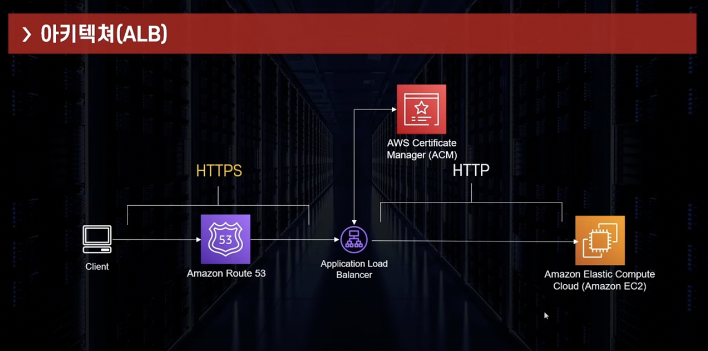
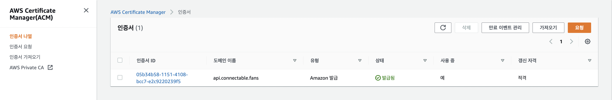

### 2022-11-16

## Connectable Route 53 & ALB 연동
- *참고: https://www.youtube.com/watch?v=WS2n8mkrFaY*
- 

- **AWS Certificate Manager(ACM)을 활용한 SSL 인증서 발급**
  - 
  - 무료로 사용할 수 있음
  - 서울 리전에서 SSL 인증서 발급하였음

- **Application Load Balancer 구축**
  - [Target Group 만들기]
    - prod-connectable-tg 만들어 prod EC2 연결
    - HTTP 프로토콜을 사용하여 소통하도록 설정
  - [Application Load Balancer 만들기]
    - prod-connectable-alb 만들어 target group 연결
    - 리스너를 HTTPS로 설정하며, ACM을 통해 발급한 인증서 설정

- **Route 53에서 A 레코드를 활용해 ALB 연결**
  - api.connectable.fans의 A레코드를 ALB에 연결

- **AWS 인프라 이용의 장점**
  - 무료
  - 유연성
  - AWS 기능 사용 가능

- **VPC 설정**
  - Connectable VPC는 Default: Asia-Pacific-Northeast-2
  - Subnet 역시 Default: ap-northeast-2a ~ ap-northeast-2d