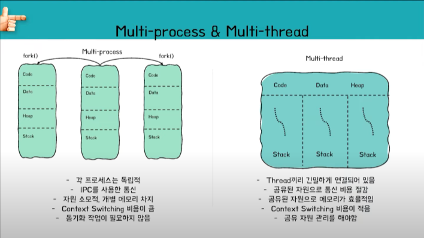

### 2022-01-19

## 운영체제 - 프로세스 스케줄링
- 앞선 뉴스레터에서 프로세스란 **실행 중인 프로그램** 이라고 정의했어요. 
  이때 프로그램이 실행 중이란 것은 프로세스의 명령어가 CPU 코어에서 처리됨을 뜻하는데요. 여기서 한 가지 의문이 생겨요.
  우리는 프로그램을 수십 개씩 실행할 수 있지만, 컴퓨터엔 그만큼의 CPU 코어가 달려있진 않잖아요.
  수십 개의 프로세스들이 어떻게 컴퓨터에서 실행될 수 있는 걸까요? 🤔

- CPU 코어는 한 번에 하나의 프로세스만을 실행할 수 있어요.
따라서 우리가 프로세스들이 동시에 실행된다고 느끼는 것은, 사실 CPU 코어가 실행하는 프로세스를 빈번하게 바꿔주는 것이에요.
CPU 스케줄러가 준비 큐에 있는 프로세스 중 하나를 선택하여 CPU 코어에 할당하고 이를 빠르게 반복하는 것이죠. 
준비 큐? CPU 스케줄러? 생소한 용어가 많이 나왔는데요! 
하나씩 천천히 알아가봐요. 💪

- 앞선 뉴스레터에서 프로세스는 총 5가지 상태 *(생성/실행/준비/대기/종료)* 중 하나를 가진다고 알아봤어요. 
프로세스의 생애 주기를 한 번 같이 따라가 보면서 **준비 큐**와 **대기 큐**의 역할을 알아봐요!

  - 프로그램이 실행되면서 프로세스가 *생성* 상태가 되어요. 
  - 프로세스 실행에 필요한 정보들이 stack/heap/data/code 영역으로써 메모리 공간을 할당받고, 프로세스의 정보를 담은 PCB 블록이 생성되어요. 
  - 프로세스가 *준비* 상태가 되어 **준비 큐**에 들어가요. **준비 큐**에서 CPU 코어에 할당될 순서를 기다려요. 
  - 드디어 프로세스가 기다림 끝에 CPU 코어에 할당되었어요. 이때 프로세스는 *실행* 상태가 되어요. 
  - 프로세스가 실행되던 중 인터럽트(외부 입출력 장치로부터 요청)가 발생했어요.
  - 프로세스는 *대기* 상태로 전환되고, **대기 큐**에 할당되어 인터럽트가 완료되기를 기다려요.
  - 프로세스가 종료되면 *종료* 상태로 전환되어요. 모든 큐에서 제거되고, PCB와 메모리에 할당되었던 자원들이 반환되어요.

- **CPU 스케줄러**의 역할은 **준비 큐**에 있는 프로세스 중 하나를 선택해 CPU 코어에 할당하는 것이에요. 
CPU 스케줄러는 여러 개의 프로세스가 빠르게 번갈아 가며 실행될 수 있도록, 계속해서 CPU 코어에 새로운 프로세스를 할당시켜줘야 해요. 
통상적으로 적어도 100밀리초마다 한 번씩은 새로운 프로세스를 할당한다고 해요.  

- CPU 코어에 새로운 프로세스를 할당할 때, 이전에 실행되던 프로세스가 어디까지 실행되었는지 저장해둬야겠죠? 
이때 저장하는 정보를 **문맥**__*(Context)*__ 이라고 불러요.
문맥은 PCB에 저장되며, CPU 레지스터의 값, 프로세스 상태, 메모리 관리 정보 등을 포함해요. 
이에 따라 CPU 코어에 새로운 프로세스를 할당하는 것을 **문맥 교환**__*(Context Switch)*__ 이라고 불러요. 
프로세스 A에서 프로세스 B로 문맥 전환이 일어난다면, 
프로세스 A의 PCB에 프로세스 A의 현재 문맥을 저장하고, 프로세스 B의 PCB에서 저장된 문맥을 불러와 CPU 코어에서 실행되는 과정을 거치게 되어요!

## Process vs Thread 테코톡
- *참고: https://www.youtube.com/watch?v=1grtWKqTn50&t=138s*
- **키워드**
  - 실행 단위 : CPU 코어에서 실행하는 하나의 단위로 프로세스/스레드를 포괄하는 개념
  - 프로세스 : 하나의 스레드만 가지는 단일 스레드 프로세스
  - 동시성 : 한 순간에 여러가지 일 X, 짧은 전환으로 여러 일을 동시에 처리하는 것 처럼 보이는 것

- **프로그램과 프로세스**
  - 프로그램 -> 프로세스 
    - 필요로 하는 재료들이 메모리에 올라감... code/data/heap/stack 영역으로 나뉘어서 메모리 공간을 확보
    - 해당 프로세스에 대한 정보 담은 PCB 블록이 생성... Pointer, State, PID, Program Counter

- **Process & Thread**
  - 다수 프로세스 동시에 실행하기 위해선 짧은 텀을 반복하면서 전환해서 실행
  - 쓰레드 == 경량화된 프로세스
    - 쓰레드에서는 프로세스의 공유 부분이 존재

- **멀티 프로세스 & 멀티 쓰레드 (처리 방식의 일종... SW에 가까움)**
  - 
  - 멀티 쓰레드의 단점
    - 긴밀한 연결로 인해 하나의 쓰레드에서 문제가 생기면 전체 프로세스가 뇌절
  - 따라서 구글 크롬이 멀티 프로세스로 동작
    - 멀티탭들 간에 영향이 덜 가!

- **멀티 코어 (HW에 가까움)**
  - 동시성: 하나의 코어에서 빨리 여러 프로세스/쓰레드가 번갈아가며 실행
  - 병렬처리: 둘 이상의 코어에서 하나 이상의 프로세스가 한꺼번에 진행되는 것
