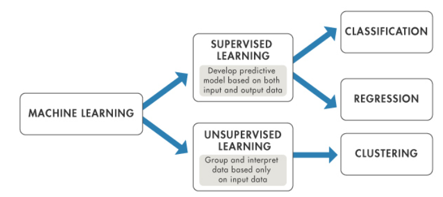
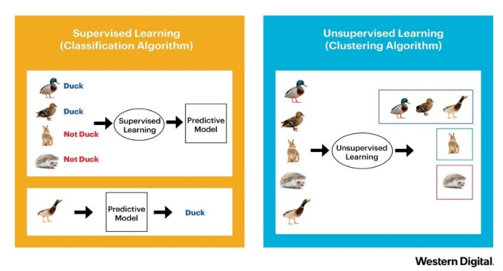

### 2022-03-28

## Supervised Learning VS Unsupervised Learning
- *참고: https://deepinsight.tistory.com/135* 
- 
- 
- **Supervised Learning (지도 학습)**
  - Input Data와 Input Data에 대한 정답에 해당하는 Label 정보를 입력으로부터 받음
  - 주어진 데이터와 Label로부터 모델 학습시켜 새로운 데이터 입력 받아 Label 예측
  - 독립변수를 활용하여 다른 의존 변수를 찾기
  - 모델의 입력값으로 각각의 데이터에 대한 정답이 주어짐
  - 입력과 출력 데이터가 있고, 이를 모델화하여 새로운 데이터에 대해 정확한 출력 예측

- **Unsupervised Learning (비지도 학습)**
  - 오직 Input Data를 기반으로 군집을 찾는 학습을 진행
  - 독립변수 간 관계를 설명
  - 정답이 없는 학습을 모델에게 요구
  - 그 결과, 새로운 데이터 입력으로 주어진다면 분류를 할 수 있게 함
  - 데이터 간 유사도, 패턴, 차이 등으로 데이터를 분류할 학습 진행

## Regression VS Classification VS Clustering
- *참고: https://nexablue.tistory.com/29*
- *참고: https://deepinsight.tistory.com/135*
- **Regression (회기)**
  - 연속적인 숫자, 예측값이 float 형태인 문제 해결
  - ex) 지하철 역과의 거리, 일정 거리 안의 관공서 등 특정 Feature 들로 어떤 지역의 땅 값 예측하기
  - 출력에 연속성이 있음

- **Classification (분류)**
  - Class를 예측하는 것
  - 개/고양이 이미지 예측과 같은 것
  - 예측해야할 대상이 정해져 있음
  - X를 기반으로 Y를 예측, Y는 이산적!
    - X -> Y
  - Binary Classification (이진 분류)
    - 예측해야 할 class가 두가지인 경우
    - ex. 스팸 메일이냐 아니냐
  - Multi-class Classification (다중 분류)
    - 예측해야 할 class가 여러가지인 경우

- **Clustering (군집)**
  - 개체들이 주어졌을 때, 개체들을 몇 개의 부분 그룹으로 나누는 과정
  - 개체들을 그룹들로 나누는 과정에서 클러스터 내부 멤버들 사이는 서로 가깝거나 비슷하게
  - 서로 다른 멤버 간에는 멀거나 비슷하지 않게!
