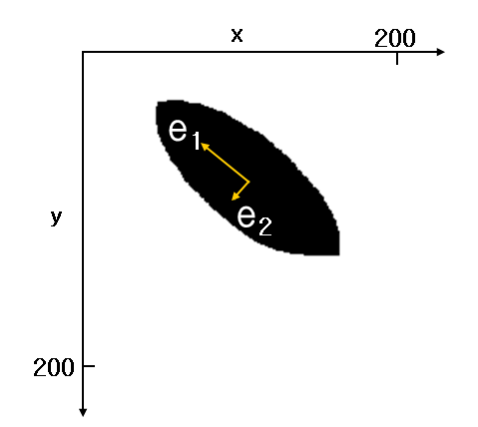
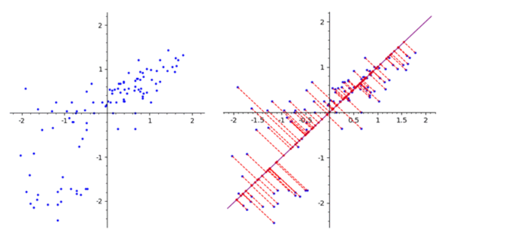
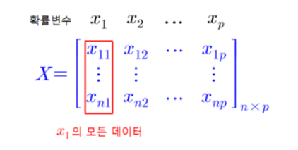
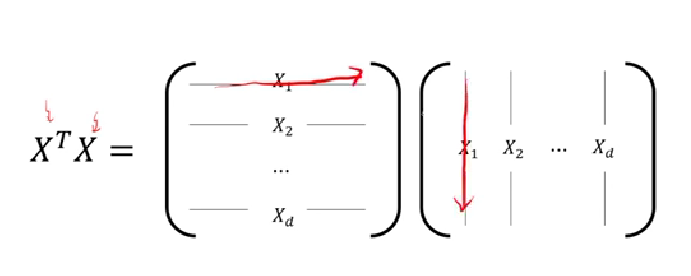
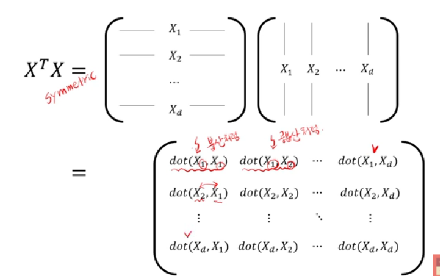
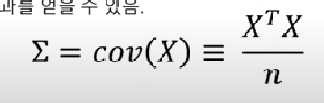
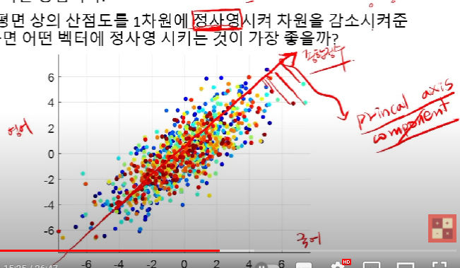
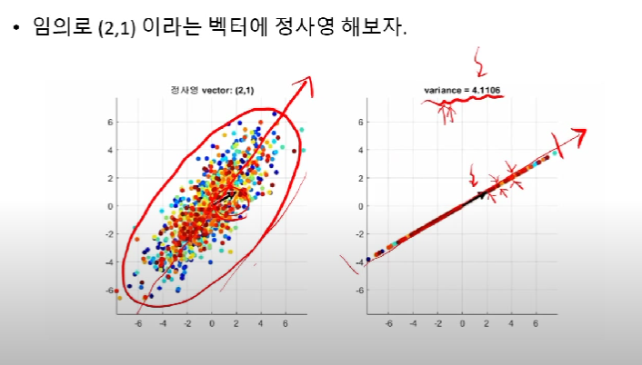
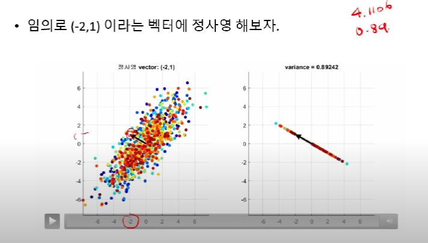
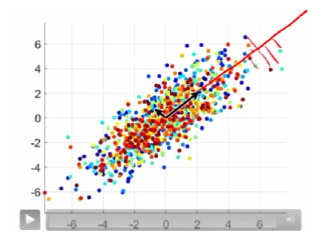

### 2022-04-25

## PCA (Principal Component Ananlysis)
- *참고: https://darkpgmr.tistory.com/110*
- *참고: http://matrix.skku.ac.kr/math4ai-intro/W12/*
- **PCA란?**
  - 분포된 데이터들의 주성분을 찾아주는 방법
  - 데이터 하나하나에 대한 성분을 분석하는 것이 아닌, 여러 데이터들이 모여 하나의 분포를 이룰 때 분포의 주성분 분석
    - 주성분 : 그 방향으로 데이터들의 분산이 가장 큰 방향벡터
  - PCA는 데이터 하나하나에 대한 성분을 분석하는게 아니라, 여러 데이터들이 모여 하나의 분포를 이룰 때 분포의 주성분 분석하는 방법
    - ex. 타원형 분포를 나타내기 위한 e1, e2 벡터
    - 
      - e1 방향을 따라 데이터들의 분산이 가장 큼
      - e1에 수직이면서 그 다음으로 데이터들의 분산이 가장 큰 방향이 e2

- **PCA 설명**
  - 가장 널리 사용되는 차원 축소 기법 중 하나
  - 원 데이터의 분포를 최대한 보존하면서 고차원 공간의 데이터를 저차원 공간으로 변환
  - PCA는 기존의 변수를 조합해 서로 연관성이 없는 새로운 변수인 "주성분 (Principal Component)" 를 만들어 냄
    - 첫 번째 주성분인 PC1이 원 데이터의 분포를 가장 많이 보존
    - 두 번째 주성분인 PC2가 그 다음으로 원 데이터의 분포를 보존
  - 주성분을 구하기 위해서 새로운 축을 찾아야 함 => 이를 "주축" "주방향" 이라고 함
    - 첫 번째 축 찾기(PC1) : 원 데이터를 축 상에 정사영할 경우, 얻어진 데이터들의 분포가 가장 최대가 되도록 지정함
      - 
      - 주어진 2차원 데이터를 첫 번째 축을 찾아 정사영한 그림
      - 이때 정사영 된 데이터가 PC1을 이루게 됨
    - 두 번째 축 찾기(PC2) : 얻어진 데이터들의 분포가 PC1 다음으로 가장 최대가 될 것
      - 이 축 상에 정사영 할 경우, PC1 다음으로 최대
      - PC1과 PC2는 서로 관계가 없도록 수직이 되어야 함
      - 

- **주성분 분석의 계산**
  - 
  - X를 센터링하여 (확률변수의 평균을 조정하여), X~를 반들수 있음
    1. X의 각 열의 평균 구함. 확률변수 xj의 평균은 xj~로 표기
    2. 각 열별로 데이터에서 열의 평균을 뺌 => 이를 행렬 X~라고 지칭

## 공분산 행렬의 의미와 PCA
- *참고: https://www.youtube.com/watch?v=jNwf-JUGWgg*
- **공분산 행렬의 의미**
  - 데이터 구조적 의미 : 각 feature의 변동이 얼마나 닮았나?
    - 행은 samples, 열은 features를 의미
    - 열의 **평균값은 0**이라고 가정. feature들의 평균값은 빼준 상태
    - 
    - 데이터 행렬 X를 이용해 공분산 행렬 구하기
      - 닮은 정도를 보기 위해선 "내적"이 필요함
      - 그 과정은 다음과 같이 행렬의 곱으로 표현 가능
      - 
      - 
    - (X^TX)ij 는 i번째 feature와 j번째 feature의 변동이 닮은 정도를 말해주고 있음
      - 함정은 sample의 수(n) 이 많아질 수록, 그 값이 커진다는 것
      - 이 문제를 방지하기 위해 값을 n으로 나누면 아래와 같은 결과 얻음
      - 
      - 즉 covariance matrix의 i번째 행과 j번째 행은 i번 feature와 j번 feature가 서로 함꼐 변하는 정도를 의미함.
  - 수학적 의미  
    - 선형 변환! => 공분산 행렬은 feature 쌍이 서로 함께 변하는 정도를 의미
    - normal distribution을 shearing 해주는 것

- **PCA**
  - 공분산 행렬의 eigenvector 사용
  - 데이터의 구조를 잘 살려주면서 차원 감소하도록 지원
  - 2차원 평면 상의 산점도를 1차원의 Principal Axis Componenet(주축) 정사영시켜 차원 감소 가능!
    - 
  - 특정 벡터에 정사영을 시켰을 떄 Variance가 클수록 분포를 잘살린 것으로 간주
    - 데이터의 구조를 잘 살려주면서 차원 감소하기 위해선, **정사영 후의 데이터 분포의 분산이 가장 큰 것이 좋다!**
    - 그렇게 하기 위해선, 공분산 행렬을 통해 선형변환 할 때의 주축에 대해 정사영하는 것이 제일 베스트
    - 
    - 
  - 주축에 정사영 시키고 (여기는 퍼지는 방향), PC2는 여기까진 안퍼지는 방향으로 뚝딱 그리세요 (PC1, PC2 직교)
    - 
  - 선형 변환의 주축은 **eigenvector** 라고 부른다
    - Eigenvector를 찾는 것의 의미 : 선형변환을 했을때 크기만 바뀌고, 방향은 바뀌지 않는 벡터?
    - 정사영 후 variance가 가장 큰 결과를 얻기 위해선 eigenvector에 정사영 할 것

## 분산(Variance) & 공분산(Covariance)
- **분산**
  - "평균적인 편차"(표준편차)의 제곱
  - Variance에 루트 씌워주면 표준편차
  - 모든 x의 값에 대해 x와의 평균 차이를 제곱해서 다~ 더한 다음에 x로 나눔 => 분산
- **공분산**
  - "두 변수간" 평균적인 편차의 곱
  - 0에 가까울수록 공동 변화량이 없는 것
  - 절대값이 클수록 공동 변화량이 큰 것

## 고유값(eigenvalue) & 고유벡터(eigenvector)
- *참고: https://rfriend.tistory.com/181*
- 정방행렬 A에 대해서 Ax = 람다x (상수 람다) 가 성립하는 0이 아닌 벡터 x가 존재할 떄, 상수 람다를 행렬 A의 고유값, x를 이에 대응하는 고유벡터라고 지칭함
- 
- 
- 행렬의 곱의 결과가 원래 벡터와 "방향"은 같고, "배율"만 상수 람다 만큼 비례해서 변했다는 것