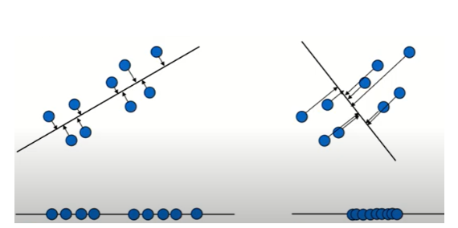

### 2022-05-26

## Clustering vs Classification
- *참고: https://leedakyeong.tistory.com/entry/%EA%B5%B0%EC%A7%91%EA%B3%BC-%EB%B6%84%EB%A5%98%EC%9D%98-%EC%B0%A8%EC%9D%B4-difference-of-clustering-and-classification*
- *참고: https://process-mining.tistory.com/98*
- **Clustering(군집)**
  - 데이터 간의 유사도를 정의하고, 그 "유사도에 가까운 것부터 순서대로 합쳐"가는 방법
  - unsupervised learning의 한 종류
    - 군집의 수, 속성이 안 알려진 경우에 사용
    - k-means 알고리즘, h-cluster 알고리즘 등이 있음
  - 어떤 군집에 들어갈까 예측 X => 그냥 이렇게 나눠질수도 있구나~ 정도
  - 군집은 애초에 라벨이 없기에, **순수 데이터상의 특징으로 유사도를 정의**하여 그룹을 만든다

- **Classification(분류)**
  - 기존에 존재하는 데이터의 카테고리 관계를 파악하고, 새롭게 관측된 데이터의 카테고리를 스스로 판별하는 과정
  - supervised learning의 한 종류
  - 각 개체가 **어떤 그룹에 들어갈까** 예측하는 기법

- **Clustering vs Classification**
  - 군집
    - 각 개체의 범주가 군집의 정보를 모르는 경우
    - 카테고리(라벨)이 없는 경우
    - 데이터 자체의 특성에 대해 알고 싶은 경우
  - 분류
    - 새로운 데이터의 그룹을 예측하기 위해

- **Supervised Learning vs Unsupervised Learning**
  - Supervised Learning
    - 맞춰야 하는 값이 있는 것 (예/아니요/지표 등)
      - ex 1. 어떤 학생이 대학원에 합격할지 여부 판단
      - ex 2. 저 사람이 독신으로 살지 결혼할지
      - ex 3. 지금 집값 7억인데, 내년에 얼마 될 것 같아?
    - Classification(분류)
      - 예측할 값이 Categorical 한 경우
        - Binary Classification: 예/아니요
        - Multi-class Classification: 여러가지 값이 될 수 있음
      - SVM, Logistic Regression 등
    - Regression(회귀)
      - 예측할 값이 Continuous 한 경우
  - Unsupervised Learning
    - 맞춰야 하는 값이 없는 것
      - label 없이 이들의 특성을 종합적으로 파악해서 묶는 과정
      - label이 없는 것에 대한 문제 해결
    - Clustering(군집)
      - 비슷한 것을 묶는 과정
      - K-means, DBSCAN, SOM 등
    - Association Rule(연관 규칙)
      - 어떤 사건이 얼마나 자주 함께 발생하는가
      - 서로 얼마나 연관되어 있는가

## PCA vs LDA
- *참고: https://kjwan4435.tistory.com/85*
- *__참고: https://casa-de-feel.tistory.com/19__*
- **차원 축소**
  - 매우 많은 피쳐로 구성된 다차원의 데이터 세트의 차원을 축소해 새로운 차원의 데이터 세트 생성
  - 피처 선택과 피처 추출로 나눌 수 있음
    - 피처 선택: 특정 피처에 종속성이 강한 불필요한 피쳐 제거
    - 피처 추출: 기존 피처를 저차원의 중요 피처로 압축해서 추출
  - 단순히 데이터를 압축하는 것이 아닌, 차원 축소를 통해 데이터를 더 잘 설명할 수 있도록 하는 것

- **PCA**
  - Unsupervised Learning의 일종
  - 여러 변수 간에 존재하는 상관관계를 통해 주성분을 추출 => 이로써 차원 추출
  - 데이터를 축에 사영했을 때 가장 높은 분산을 가지는 데이터의 축을 찾아 그 축으로 차원 축소
    - 
    - 사영 시 분산이 크다 == 원래 데이터의 분포를 잘 설명할 수 있다. 
      - 정보의 손실 최소화
    - 이렇게 찾은 주축을 첫번째 축, 이에 직각이 되는 벡터를 두번쩨 측으로 선정
      - 직교하는 축에는 첫번째 축에 겹친놈들이 절때 똑같은 곳에 사영될 수 없음
        - 이렇게 찾은 축들에 원본 데이터 투영하면 벡터 축의 갯수만큼 원본 데이터가 차원 축소
  - 독립변수들 사이 상관 관계를 없애 숨은 latent variable 찾아내거나, noise 줄일 때 사용
  - 메트릭
    - PC: 기존 변수들로 이루어진 선형 벡터, 기존의 변수들 설명
    - PC loadings: 기존 변수들과 PC 사이의 correlation 값, 해당 PC로 기존의 변수 얼마나 잘 설명하는 지 %로
    - PC Score: 각각의 PC에 대해 재생성된 observation data
  - 특징
    - Assumption: 독립 변수들 사이에 관계가 linear하다고 가정
    - Objective Function: X^(T)X
    - Parameters: best fitting line parameter 찾기

- **LDA**
  - Supervised Learning
    - Classification과 Dimensional Reduction 까지 동시에 사용하는 알고리즘
    - Classification시 클래스 내의 분산 최소로, 클래스끼리의 분산은 최대로!
    - LDA를 통해 하나의 축으로 변형된 데이터들이... 같은 클래스 내에서는 그 값이 최소로, 다른 클래스에서는 그 값이 차가 크게
  - 입력 데이터 세트를 저차원 공간에 투영해 차원을 축소하지만, 지도학습 분류에서 사용하기 쉽도록 **개별 클래스를 분별할 수 있는 기준을 최대한 유지**하며 차원 축소
  - 입력 데이터의 결정 값 클래스를 최대한으로 분리할 수 있는 축
    - 클래스 간 분산을 최대화, 클래스 내부 분산은 최대한 작게
  - 특징
    - Assumption: 조건적으로 정규 분포 따름
    - Objective Function: mean separability/scatter within class
      - mean separability: 클래스 간의 차이가 얼만큼 나는가?
      - scatter within class: 클래스 내에 분산이 얼마정도인가? 

- **PCA vs LDA**
  - 데이터 클래스의 분산 차이 << 데이터 클래스의 평균 차이 => LDA >> PCA
  - 데이터 클래스의 분산 차이 >> 데이터 클래스의 평균 차이 => PCA << LDA
  - PCA는 입력 데이터의 분산이 가장 큰 축을 찾고, LDA는 입력 데이터의 결정 값 클래스를 최대한 분리할 수 있는 축을 찾음

