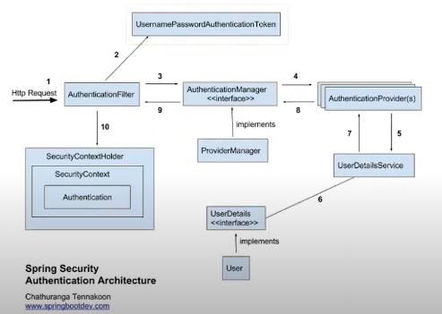

### 2022-07-06

## Spring 릴리즈 버전 접미사
- *참고: https://countryxide.tistory.com/41*
- **M1**
  - Milestone 1
  - 프리 알파 단계에 있는 한 종류. 특정한 집합의 기능이 포함되며 기능 완성되자마자 공개

- **RC**
  - Release Candidate
  - 마지막 제품이 될 가능성이 있는 베타버전. 
  - 상당한 버그가 나타나지 않는다면 출시할 준비 되었음을 의미

- **GA**
  - General Availability
  - 필요한 모든 상업화 활동 완료되어 웹이나 물리 매체 통해 시장 이용 가능

## Spring Security
- *참고 1: https://www.youtube.com/watch?v=aEk-7RjBKwQ*
- *참고 2: https://sjh836.tistory.com/165*
- **스프링 시큐리티**
  - 스프링 기반의 어플리케이션의 보안(인증/권한) 담당하는 프레임워크
  - 스프링 시큐리티 filter 기반으로 동작하기에 spring MVC와 분리되어 관리/동작
  - 보안 용어
    - 접근 주체: 보호된 대상에 접근하는 유저
    - 인증: 현재 유저가 누구인지 확인
    - 인가: 현재 유저가 어떤 서비스, 페이지에 접근할 수 있는 권한이 있는지 검사
    - 권한: 인증된 주체가 어플리케이션의 동작을 수행할 수 있도록 허락되어있는지를 결정

- **스프링 시큐리티의 특징**
  1. 서블릿 API 통합
  2. Spring Web MVC와의 선택적 통합
  3. 인증과 권한 부여를 모두 포괄적이고 확장 가능한 지원
  4. 세션 고정, Clickjacking, 사이트 간 요청 위조(csrf) 등과 같은 공격으로부터 보호
     - 세션 고정: 사용자 로그인 시 항상 일정하게 고정된 세션 ID 값을 사용하는 취약점
     - Clickjacking: 사용자가 클릭하고 있다고 인지하는 것과 다른 어떤 것을 클릭하게 속이는 악의적인 기법
     - CSRF: 사용자가 자신의 의지와 무관하게 공격자가 의도한 행위를 특정 웹사이트에 요청하게 하는 공격 기법

- **스프링 시큐리티의 요청 처리 방법**
  - 
  - Spring Security는 세션-쿠키 방식으로 인증
  1. 유저가 로그인 시도 (HTTP Request)
  2. AuthenticationFilter에서 DB 조회
  3. DB에 있다면 UserDetails로 꺼내 유저의 session 생성
  4. spring security의 인메모리 세션저장소인 SecurityContextHolder에 저장
  5. 유저에게 SessionID와 함께 응답 줌
  6. 이후 요청에서는 요청 쿠키에서 JSESSIONID를 까봐서 검증 후 유효하면 Authentication 쥐여줌

- **로그인 인증 구조**
  - 
  - AuthenticationManager
