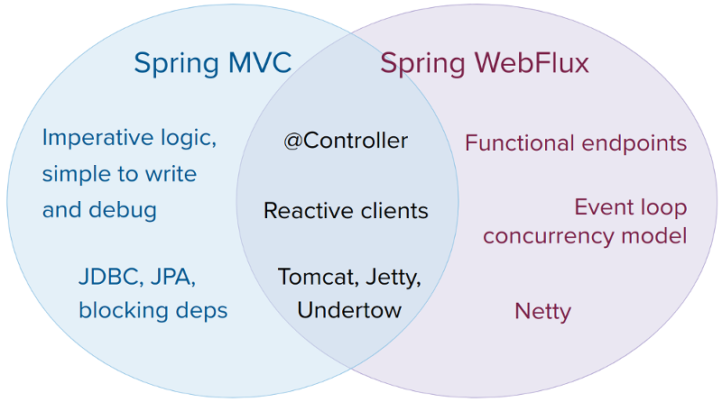
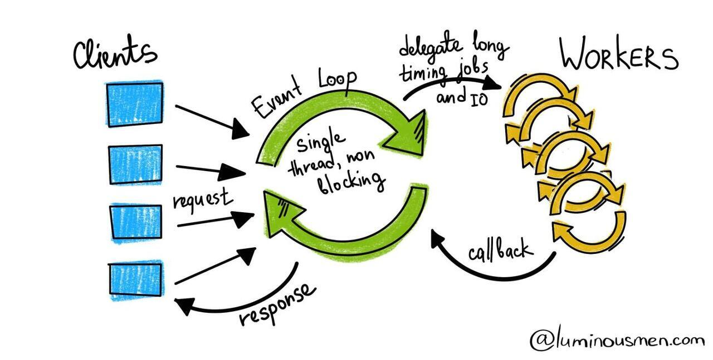

### 2022-07-17

## Spring Webflux 테코톡
- *참고: https://www.youtube.com/watch?v=4x1QRyMIjGU*
- **Spring Framework 5.x**
  - Java 호환 버전 변경 : JDK8부터 지원
  - Kotlin 지원
  - 호환 라이브러리 변경
  - Reactive Programming 지원

- **Spring Reactive & Webflux**
  - 왜 필요한가?
    - 적은 수의 스레드로 동시성을 처리
    - Non-blocking / Functional Programming
  - Spring MVC의 Thread Pool 딜레마
    - CPU, 메모리가 충분하지만 쓰레드가 모자라서 처리율이 저하됨
    - 쓰레드를 과도하게 늘리면 메모리, CPU에 부하가 생겨 성능이 저하
    - 컨텍스트 스위칭이 발생하게 되면 CPU간 전환 => 부하 더 생김
    - 쓰레드 많아진다고 문제 해결되는 것 아님
  - **현대 소프트웨어 환경에서 트래픽 많아지고 있음**
    - 회복탄력성
    - 유연성
    - 반응성 필요!

- **Netflix의 API 아키텍처 재설계**
  - rest service를 최적화 하기 위해 재설계
  - 기존
    - 한명의 유저가 사이트 접속시 여러 api 던짐
    - 네트워크 레이턴시 발생
  - 발전
    - 하나의 네트워크 요청으로 단일화 => Reactive Programming Model
    - 동시성을 가져가면서 스레드의 안정성과 병렬처리를 개발
    - java API를 통해 비동기 처리가 되도록 만들어야 했음
    - 비동기 콜백으로 처리하기 위한 함수형 프로그래밍을 사용하는 반응형 모델을 선택 => rxJava

- **Webflux**
  - 적은 수의 스레드로 한꺼번에 여러 요청 동시성을 처리 with Event Loop!
  - Spring MVC
    - Blocking I/O
    - 스레드를 늘려서 동시성을 처리함
    - 어플리케이션에서 I/O 요청한 후 완료되기 전까지 어플리케이션이 Block 되어 다른 작업 수행 x
    - Block 되는 순간 다른 스레드가 동작함으로써 Block의 문제를 해결하곤 했음
    - 하지만, 컨텍스트 스위칭에 드는 비용이 존재함으로 여러개의 I/O를 처리하기 위해 여러개의 쓰레드 사용하는 것은 비효율적으로 보임
  - Webflux
    - Async Non-Blocking I/O
    - I/O 요청을 한 후 Non-Blokcing I/O와 마찬가지로 즉시 리턴.
    - 데이터 준비 완료된다면 이벤트가 발생하여 알려주거나, 미리 등록해둔 콜백을 통해 이후 작업이 진행됨
    - Blocking이 없기에 자원을 보다 더 효율적으로 사용 가능

- **그러면 Webflux가 Spring MVC보다 무조건 빠른가?**
  - "속도가 빠르다" (X)
  - "적은 리소스로 많은 트래픽을 감당한다" (O)

- **Reactive Programming**
  - Non-blocking I/O에 "Reactive Stream"과 "Backpressure" 곁들임...?
    - Reactive Stream
      - Async, Non-blocking으로 작동하는 Stream
      - 근데 Stream 기능이 무지 많은 것
      - Publisher(웹 클라, DB)에서 변경이 생기면 Subscriber에 변경된 데이터를 Stream으로 전달
      - 이 Stream으로 프로그래밍하는 패러다임이 Reactive Programming
    - Backpressure
      - Subscriber로 들어오는 Stream의 양을 조정
      - 적은 컴퓨팅 자원으로 일을 처리하기 가능한 정도씩만 받기
  - Event 구독 형식으로 특정 이벤트 발생시 다른것도 변환

- **Flux**
  - 0-N 개의 아이템 시퀀스

- **Mono**
  - 0-1 개의 결과
  - 단일 원소에서도 Map, filter 등의 비동기적으로 함수 쓸 수 있음

- **결론**
  - Spring 5에서는 기존의 Servlet Stack과 다른 Reactive Stack을 만들어냄
  - Spring Webflux는 Spring Reactive Stack의 Web Framework 역할을 맡음 (Spring MVC 포지션)
  - Reactive Programming은 컴퓨팅 자원을 효율적으로 운용하기 위해 고안된 프로그래밍 패러다임
  - Reactive Programming은 Async Non-blocking I/O, data stream에 기반해 메서드 체이닝과 람다식으로 구성됨
  - Mono/Flux는 단일 항목이던 복수항목이던 Stream 처럼 사용하되, Reactive 하게 작동 가능
  - 새로운 Functional Endpoint를 통해 함수형 프로그래밍 처럼 Controller 대체 가능
  - 하지만 End-to-End Reactive 해야 의미가 있음. 
    - Spring Security Reactive
    - ReactiveRepository

## Spring Webflux WebClient
- *참고: http://tech.pick-git.com/webflux/*
- **Sync vs Async & Blocking vs Non-Blocking**
  - Synchronous: 작업을 요청한 후 작업의 결과가 나올 때까지 기다린 후 처리
  - Asynchronous: 서로의 시작/종료 시간과 관계없이 별도의 수행 시작/종료 시간을 가지는 것

- **문제점**
  - RestTemplate은 동기적인 Blocking 로직
  - 5개의 Github API를 동기적으로 처리하다보니 5개 API 호출 시간의 총합을 다 합쳐야 완료됨
  - Async + Non-Blocking 개선
    - 병목을 다소 해결할 수 있을 것
  - Spring 5.0 이상에서부터는 RestTemplate Deprecated
  - 모던한 API 기반의 비동기/동기 지원하는 WebClient 쓰세요!

- **Spring WebFlux**
  - Reactive
    - 변화에 반응하는 것을 중심에 두고 만든 프로그래밍 모델
      - I/O 이벤트에 반응하는 네트워크 컴포넌트
      - 마우스 이벤트에 반응하는 UI 컨트롤러
    - 이벤트 드리븐 아키텍쳐와 비슷
    - 옵저버 패턴과 비슷
  - Spring WebFlux는 적은 스레드로 동시처리를 제어하고 적은 하드웨어 리소스로 확장할 수 있는 Non-blocking Web Stack
  - Netty와 같은 Async & Non-Blocking 모델의 네트워킹 프레임워크 사용
  - 
  - Servlet 기반의 멀티스레드에서 이벤트 기반 Reactive
  - 

- **Reactive Streams**
  - Reactor: Spring Webflux가 사용하는 Reactive 라이브러리, Reactive Streams의 구현체
    - Non-Blocking Back Pressure를 통한 비동기 스트림 데이터 처리 표준 제공 명세

- **Back Pressure**
  - Producer의 속도가 Consumer의 속도를 압도하지 않도록 이벤트 속도를 제어하는 것
  - Subscriber가 10개를 처리할 수 있다면 Publisher에게 10개만 요청

- **Refactoring**
```java
@Component
public class GithubContributionCalculator implements PlatformContributionCalculator {

    private final WebClient webClient;

    public GithubContributionCalculator(WebClient webClient) {
        this.webClient = webClient;
    }

    @Override
    public Contribution calculate(String accessToken, String username) {
        Map<ContributionCategory, Integer> bucket = getContributionsViaPlatform(accessToken, username, latch);
        return new Contribution(bucket);
    }

    private Map<ContributionCategory, Integer> getContributionsViaPlatform(String accessToken, String username) {
        Map<ContributionCategory, Integer> bucket = new EnumMap<>(ContributionCategory.class);
        extractStars(accessToken, username, bucket);
        extractCount(COMMIT, "/search/commits?q=committer:%s", accessToken, username, bucket);
        extractCount(PR, "/search/issues?q=author:%s type:pr", accessToken, username, bucket);
        extractCount(ISSUE, "/search/issues?q=author:%s type:issue", accessToken, username, bucket);
        extractCount(REPO, "/search/issues?q=author:%s type:issue", accessToken, username, bucket);

        return bucket;
    }

    private void extractStars(
        String accessToken,
        String username,
        Map<ContributionCategory, Integer> bucket
    ) {
        String apiUrl = generateUrl(username);
        sendGitHubApi(accessToken, apiUrl)
            .bodyToMono(ItemDto.class)
            .subscribe(result -> bucket.put(STAR, result.sum()));
    }

    private void extractCount(
        ContributionCategory category,
        String restUrl,
        String accessToken,
        String username,
        Map<ContributionCategory, Integer> bucket
    ) {
        String apiUrl = generateUrl(restUrl, username);
        sendGitHubApi(accessToken, apiUrl)
            .bodyToMono(CountDto.class)
            .subscribe(result -> bucket.put(category, result.getCount()));
    }

    private ResponseSpec sendGitHubApi(String accessToken, String apiUrl) {
        return webClient.get()
            .uri(apiUrl)
            .headers(httpHeaders -> {
                httpHeaders.setBearerAuth(accessToken);
                httpHeaders.set("Accept", "application/vnd.github.cloak-preview");
            })
            .accept(MediaType.APPLICATION_JSON)
            .retrieve()
            .onStatus(HttpStatus::isError, error -> Mono.error(PlatformHttpErrorException::new));
    }
}
```


