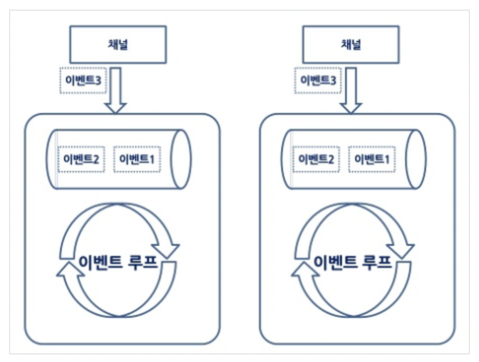

### 2022-09-29

## How Netty uses thread pools?
- *참고: https://sungjk.github.io/2016/11/08/NettyThread.html*
- **개요**
  - 네티는 비동기 이벤트 네트워크 어플리케이션 프레임워크
  - 유지보수를 고려한 고성능 프로토콜 서버와 클라이언트를 안정적/빠르게 개발 가능
  - 동시접속자 수, 퍼포먼스 모두 만족하는 네트워크 프로그램 설계 가능

- **Event-Driven**
  - 일반적인 이벤트 드리븐 어플리케이션은 두가지 방식 중 하나로 동작함
  1. 이벤트 리스너와 이벤트 처리 쓰레드에 기반한 방법
     - 이벤츠를 처리하는 로직을 가진 "이벤트 메서드"를 대상 객체의 "이벤트 리스너"에 등록 
     - 객체에 이벤트 발생 시 "이벤트 처리 쓰레드"에서 등록된 메서드 수행
       - 이때 이벤트 처리 쓰레드는 대부분 단일 쓰레드
  2. 이벤트 큐에 이벤트를 등록하고 이벤트 루프가 이벤트 큐에 접근하여 처리하는 방법
     - 이벤트 루프가 다중 쓰레드일 때 이벤트 큐는 여러개의 쓰레드에서 공유됨
     - 가장 먼저 이벤트 큐에 접근한 쓰레드가 첫번째 이벤트를 가져와서 이벤트를 수행
     - 이벤트 큐에 입력된 이벤트를 처리하고자 이벤트 루프 쓰레드 사용

- **Netty**
  - 단일 쓰레드 이벤트 루프 + 다중 쓰레드 이벤트 루프 모두 사용 가능
  - 
  - 이벤트 루프 쓰레드가 이벤트 큐를 각각 가지고 있어서 이벤트의 수행 순서가 보장됨

- **NIO 기반의 Netty => NioServerSocketChannelFactory 구현함**
  - 2가지 타입의 쓰레드
  1. Boss Threads
     - ChannelHandlers 포트 별로 "접속을 허용해주는" 보스 쓰레드를 가짐
     - 커넥션이 성공적으로 이루어지면 보스 쓰레드는 승인된 채널을 하나의 워커 쓰레드로 전달
  2. Worker Threads
     - 개발자가 명시한 갯수만큼 워커 쓰레드 풀을 유지함
     - 워커 쓰레드는 Non-Blocking 모드에서 채널에 읽기와 쓰기 작업 Non-Blocking 처리 가능

## 인프라 구조에 대한 고민
- **Nginx + WAS를 한 인스턴스에 두는 것**
  - 야 이렇게되면 생각해보자
    - Nginx는 이벤트 기반이라면서?
      - http 요청이 오면 nginx가 커널측에 I/O 발생시켜서 was http 연결 부탁한다고 할거고, nginx 다시 제어권 돌려받아서 그 다음 http 요청 처리하려고 할거야
    - 요청 넘겨받은 WAS는? 
      - Tomcat에 default Thread Pool 200개 만들어뒀겠지? 
      - 이중에 하나 남는게 http 요청을 처리해주러 나설거야. 
    - 응답 뚝딱 다 하면 nginx가 요청한 커널 I/O 끝나는 거고, EventListener 한테 끝났다고 nginx 한테 알려주겠지?
      - 이때 nginx가 응답 클라이언트한테 할거야
  - 그런데 말입니다. 
    - EC2 딱 하나에서 이걸 쓴다고 하면
    - CPU, memory 이런거 싹다 제한걸려있고, 
    - 그러면 쓰레드 많이 만들면 어차피 컨텍스트 스위칭 일어나야 처리가 되는 걸텐데, 
    - 아무리 nginx가 더 빠르게 비동기적으로 요청을 받아들여도 WAS에서 병목이 발생하면 그대로 있다가 응답해야하는거 아니야? 

- **그래서 로드 밸런서로 분리하고 다중 EC2를 쓴거같군**
  - nginx가 앞단에 있고, 뒤에 다른 인스턴스 두 개 띄워서 라운드 로빈 방식으로 트래픽 분산시켜준다고 해보자고
  - nginx는 항상 이벤트 기반으로 비동기적으로 http 요청 뒷단으로 보낼꺼야
    - nginx가 커널측에 I/O 발생시켜서 뒷단의 WAS의 private IP로 http 요청 보낼거고
    - 바로 제어권 가져와서 nginx가 다음 요청 받으려고 대기타고 있을 듯
  - WAS는 각각 200개의 thread pool 생성해두고 동접 200개의 요청을 유연하게 처리할 수 있다고 생각한다면, 
    - WAS가 2개라면 400개의 동접을 처리할 수 있겠네. 물론 각 쓰레드 별로 요청에 대한 응답의 시간이 다르겠지만

- **그래서 쿠버네티스 같은거 쓰나보군**
  - 우선 was같은거 도커라이제이션 해버리면 자바 버전 올리거나, 외부 라이브러리 쓸 때 보다 효율적으로 패키징을 할 수 있겠지? 
    - 놀토할 때 ffmpeg같은 라이브러리로 삽질했던거 기억나지?
    - 서버에서 매번 새로운 버전 깔고, 지우고 롤백하고 이런거 좀 많이 빡셀것이여
    - 도커헙 같은데서 버전관리도 쉽게할 수 있고, 롤백하기도 좋고, 업데이트 하기도 좋겠네 도커를 쓰면
  - 근데 이 도커 컨테이너에 was를 하나 돌린다고 하면 200개의 쓰레드풀, 동접 200개 요청 처리할 수 있다고 생각해보자
    - 그러면 동접 10000개 요청오면 50개의 도커 컨테이너 필요하겠네?
    - 이거 그러면 어떻게 뚝딱 띄우냐? 
    - 쿠버네티스로 트래픽 몰리면 뚝딱 띄워줄 수 있겠네. 
    - nginx 같이 이벤트 루프 기반의 웹서버가 앞단에서 로드 밸런싱해주고, ssl termination 해주고, 하면 보다 빠른 처리가 가능하겠고만

- **의문**
  - 하나의 EC2에 도커 컨테이너 was를 여러개 띄우면 더 많은 동접자를 처리할 수 있는가?
    - 어차피 같은 CPU/memory 하드웨어 자원쓰는거면 그닥 성능향상 없을 것 같기도한데...?
    - 쓰레드 풀 * 2개니까 미리 쓰레드 더 만들어놨으니 좀 더 많이 처리해줄 수 있을라나? 원래 큐에 들어갈 요청들도 딴 컨테이너에서 처리할 수 있으니?
      - 아니 그러면 EC2 하나에 컨테이너 백만개 띄워두는게 이득아닌가?

- **그래서 정리해본 질문**  
스프링부트 실행 파일(jar 파일, 그니까 WAS)을 도커로 컨테이너화 해서 구동시킬때의 질문인데요. 
하나의 EC2에 여러개의 WAS 컨테이너를 포트를 다르게 해서 띄워두고, 앞의 로드밸런서(nginx 등)로 부터 여러개의 포트를 번갈아가면서 요청을 처리하도록 인프라를 설계하면, 더 많은 트래픽을 처리할 수 있나요?

EC2#1          EC2#2  
nginx           WAS  
|-------------EC2#2IP:8080  
|-------------EC2#2IP:8081  
|-------------EC2#2IP:8082

제가 생각해본 답변은 총 3가지 정도 있는거 같아요. 

#1  
보통 WAS 자체에서 쓰레드풀을 미리 만들어 http 요청이 들어오면 잉여 쓰레드를 할당해 http 요청을 처리하도록 지원하는데, 
더 많은 WAS 컨테이너를 동시에 띄워두면 WAS 댓수만큼 쓰레드풀이 더 생성될테니, 
총체적으로는 EC2 자체에서 봤을때는 WAS 컨테이너를 하나만 띄웠을 때 보다는 여러 WAS 컨테이너를 띄우는 것이, 
더 많은 쓰레드를 미리 만들어놔 더 많은 http 요청에 대비할 수 있을 것 같습니다. 
원래 WAS 하나만 구동시켰으면 http 처리를 위해 대기큐에 들어갔어야 할 요청들이 다른 WAS 컨테이너에서 처리가 될 수 있으니 응답성이 좋아질 것 같다?! 라는 생각도 들고

#2  
그렇게 WAS 여러개 구동해서 쓰레드 풀을 많이 만드는게 성능 향상으로 이어진다면, 
그냥 WAS 한대를 구동하되 기존보다 훨씬 많은 쓰레드를 생성하여 쓰레드 풀에 쟁여두도록 설정하면 어차피 똑같은거 아니냐? 라는 생각도 들고

#3  
WAS 컨테이너를 여러개 구동시키던, 한 개의 WAS를 구동하되 쓰레드를 많이 쟁여둔 쓰레드풀을 사용하던, 
결국 해당 쓰레드의 요청을 빠르게 처리하는거는 EC2의 CPU/Memory 성능에 따라 결정이 되는 거 아니냐? 
어차피 EC2에 코어가 2개밖에 안 달려있으면 동시에 처리할 수 있는 쓰레드는 잘해야 2개인데,
쓰레드풀에서 많이 쟁여두는게 그렇게 유의미하지 않을수도 있다~ 라는 생각도 듭니다. 

