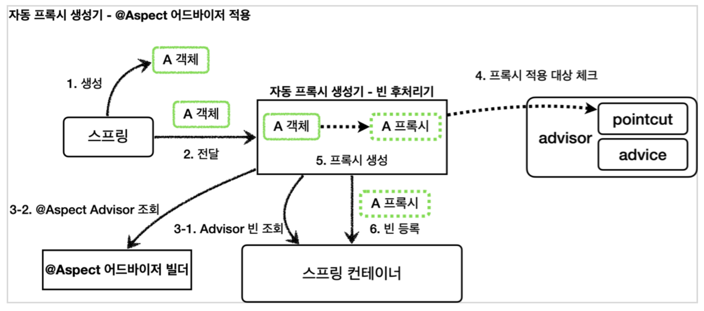
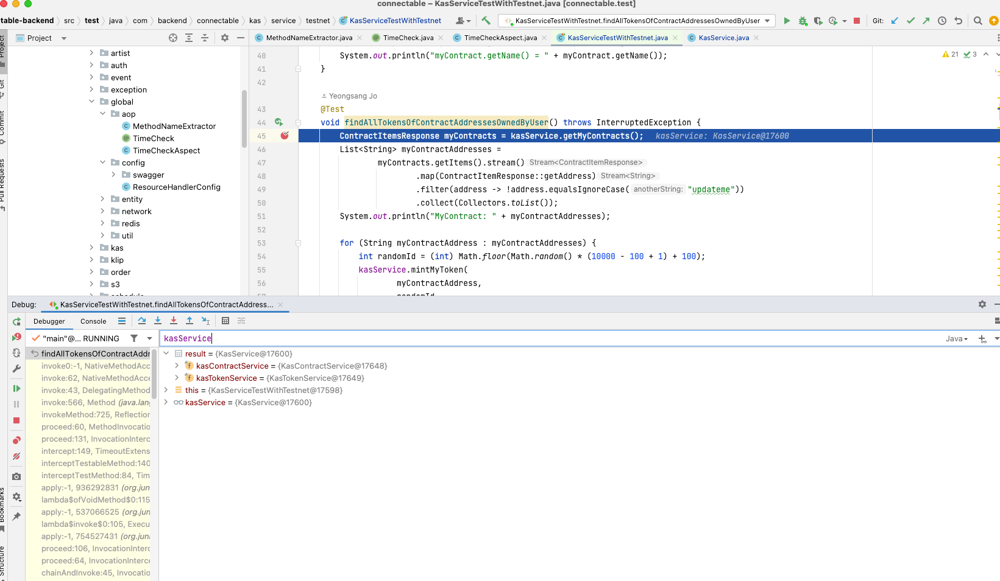
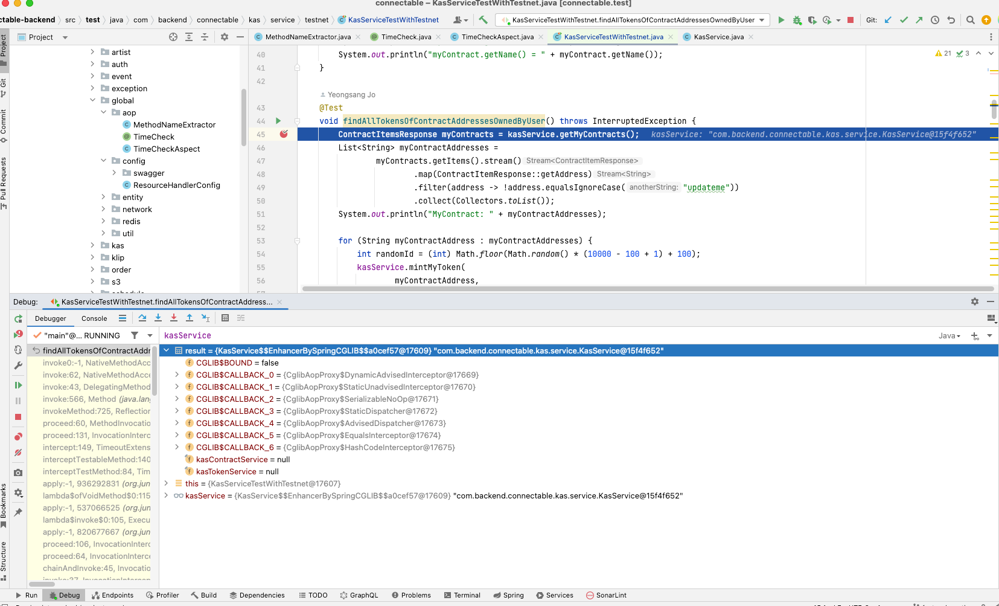
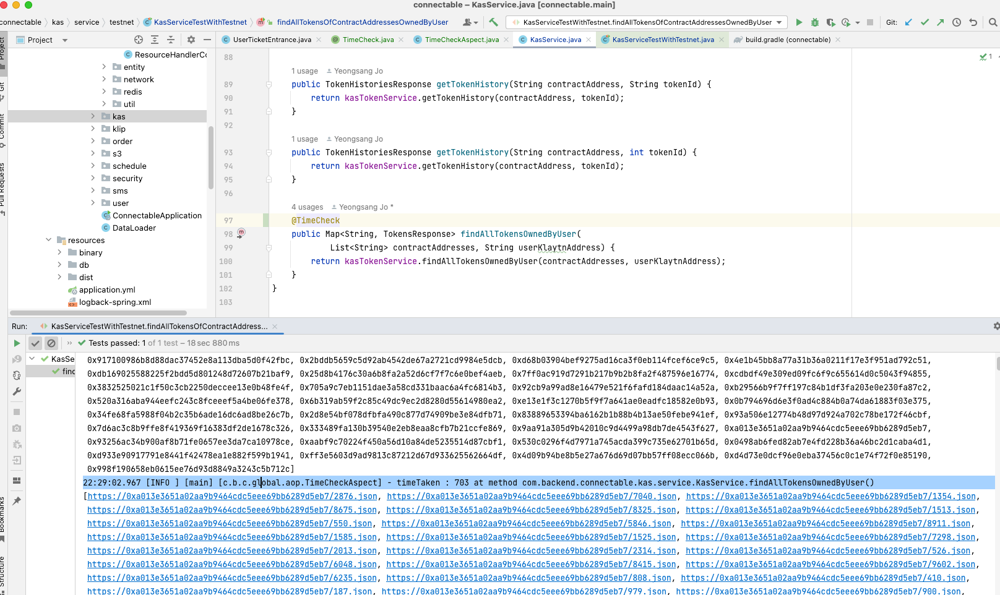
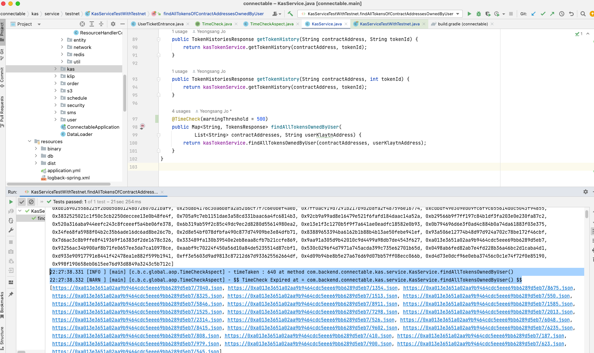

### 2022-10-17

*참고: https://www.inflearn.com/course/%EC%8A%A4%ED%94%84%EB%A7%81-%ED%95%B5%EC줌8B%AC-%EC%9B%90%EB%A6%AC-%EA%B3%A0%EA%B8%89%ED%8E%B8/dashboard*

## 프록시 패턴 & 데코레이터 패턴
- **프록시 패턴 : "접근 제어"가 목적**
  - 권한에 따른 접근 차단
  - 캐싱
  - 지연 로딩

- **데코레이터 패턴 : "새로운 기능 추가"가 목적**
  - 원래 서버가 제공하는 기능에 더해 부가기능 수행

## JDK 동적 프록시
- **특징**
  - 리플렉션 기술을 활용하여 프록시 객체를 동적으로 런타임에 개발자 대신 만들어줌
  - 인터페이스를 기반으로 프록시 생성 -> 인터페이스가 필수!
  - 자바 언어가 기본적으로 제공함

- **구현 방법**
  - **InvocationHandler**를 만들어 필요한 전/후처리 로직 구현
  - Proxy.newProxyInstance(프록시할 객체의 클래스 로더, 프록시할 객체의 타입, 핸들러 로직)
  ```java
  @Test
  void dynamicA() {
      AInterface target = new AImpl();
      TimeInvocationHandler handler = new TimeInvocationHandler(target);
      AInterface proxy = (AInterface) Proxy.newProxyInstance(AInterface.class.getClassLoader(),
          new Class[]{AInterface.class}, handler);
      proxy.call();
      log.info("targetClass = {}", target.getClass());
      log.info("proxyClass = {}", proxy.getClass());
  }
  ```

- **한계**
  - 인터페이스가 필수적임!

## CGLIB 프록시
- **특징**
  - 바이트코드를 조작해 동적으로 클래스를 생성하는 기술을 제공
  - 구체 클래스만 가지고 동적 프록시를 만들 수 있음
  - 스프링 사용시 별도의 외부 라이브러리 필요 없음

- **구현 방법**
  - JdkDynamic의 InvocationHandler 역할을 CGLIB에서는 **MethodInterceptor**가 담당
  - Enhancer : CGLIB은 Enhancer를 통해 프록시 생성
  ```java
  ConcreteService target = new ConcreteService();
  Enhancer enhancer = new Enhancer();
  enhancer.setSuperclass(ConcreteService.class);
  enhancer.setCallback(new TimeMethodInterceptor(target));
  ConcreteService proxy = (ConcreteService) enhancer.create();
  ```
  - 실행은 요렇게
  ```java
  @Test
  void cglib() {
      ConcreteService target = new ConcreteService();
      Enhancer enhancer = new Enhancer();
      enhancer.setSuperclass(ConcreteService.class);
      enhancer.setCallback(new TimeMethodInterceptor(target));
      ConcreteService proxy = (ConcreteService) enhancer.create();
  
      log.info("target = {}", target.getClass());
      log.info("proxy = {}", proxy.getClass());
  
      proxy.call();
  }
  ```

- **한계**
  - 상속을 통한 구현이라 부모 클래스의 생성자 체크할 것
  - final 키워드 붙으면 상속/오버라이딩 불가능

## Spring의 프록시
- **개요**
  - Spring은 동적으로 프록시를 통합하여 편리하게 만들어주는 **ProxyFactory** 제공
  - 인터페이스가 있으면 JDK, 구체클래스만 있다면 CGLIB 활용할 수 있음
  - 그러면 InvocationHandler, MethodInterceptor를 매번 두개 만들어줘?
  - 스프링은 Advice라는 개념을 도입함
    - Advice를 통해 내부적으로 InvocationHandler, MethodInterceptor를 사용한다
    - 
  - 특정 메서드 이름의 조건이 맞을 때만 프록시 부가기능 하려면 **Pointcut**과 같은 방식을 지원해줌!

- **Advice**
  - 프록시에 적용하는 부가 로직
  - CGLIB의 InvocationHandler, Jdk 동적 프록시의 MethodInterceptor와 유사한 개념
  - 아래 인터페이스를 구현하여 사용할 것
  ```java
  package org.aopalliance.intercept;
  
  public interface MethodInterceptor extends Interceptor {
      Object invoke(MethodInvocation invocation) throws Throwable;
  }
  ```
  
- **ProxyFactory**
  - 스프링에서 동적으로 프록시를 만들어주는 기능을 제공
  - ProxyFactory에 Advice 적용해주는 감성
  ```java
  @Test
  void interfaceProxy() {
      ServiceInterface target = new ServiceImpl();
      ProxyFactory proxyFactory = new ProxyFactory(target);
      proxyFactory.addAdvice(new TimeAdvice());
      ServiceInterface proxy = (ServiceInterface) proxyFactory.getProxy();
      log.info("target = {}", target.getClass());
      log.info("proxy = {}", proxy.getClass());
      proxy.save();
  
      assertThat(AopUtils.isAopProxy(proxy)).isTrue();
      assertThat(AopUtils.isJdkDynamicProxy(proxy)).isTrue();
      assertThat(AopUtils.isCglibProxy(proxy)).isFalse();
  }
  ```
  - 인터페이스 타입이 존재하는 인터페이스/구체클래스 타입을 target으로 넘겨주면 jdk 동적 프록시, 
  - 구체클래스 타입을 target으로 넘겨주면 CGLIB으로 프록시 생성
  - 만약 `proxy.setProxyTargetClass(true)` 를 활용하면 무조건 cglib으로 프록시 생성

- **포인트컷, 어드바이스, 어드바이저**
  - 포인트컷: 어디에 부가기능을 적용할지, 어디에 부가기능을 적용하지 않을지 판단하는 "필터링 로직"
  - 어드바이스: 프록시가 호출하는 "부가 기능"
  - 어드바이저: 포인트컷 1개 + 어드바이스 1개
  - `Advisor` knows which `Advice` at which `Pointcut`

- **하나의 프록시 여러 어드바이저**
  - 스프링은 하나의 프록시에 여러 어드바이저를 적용하게 함으로써 동작
    - 어드바이스 마다 프록시를 생성하는 것보다 좋은 성능, 같은 결과
  - 스프링은 AOP를 적용할 때, 최적화를 진행해 지금처럼 프록시는 하나만 만들고, 하나의 프록시에 여러 어드바이저 적용

## 빈 후처리기
- **설명**
  1. 생성: 스프링 빈 대상이 되는 객체 생성
  2. 전달: 생성된 객체를 빈 저장소에 등록하기 전 빈 후처리기에 전달
  3. 후 처리 작업: 빈 후처리기는 전달된 스프링 빈 객체 조작 or 바꿔치기 가능
  4. 등록: 빈 후처리기가 반환한 빈을 등

- **With Proxy**
  - 프록시를 생성하는 부분을 하나로 집중할 수 있음
  - 스프링이 직접 대상을 빈으로 등록하는 경우에도 중간에 빈 등록과정 가로채 빈으로 등록 가능

- **지금 프로젝트에서 빈 후처리기가 어떤 일을 해주는지 기록하기**

## `@Aspect` AOP
- **개요**
  - Spring에서 프록시를 쓰려면? Advisor를 만들어서 스프링 빈으로 등록하면 됨
    - 그럼 자동 프록시 생성기에서 자동으로 처리해줌
    - 스프링 빈으로 등록된 어드바이저를 찾고 스프링 빈들에 자동으로 프록시 등록해줌
  - Spring - `@Aspect`를 활용하여 편리하게 "포인트컷/어드바이스"로 구성되어 있는 어드바이저 생성 기능 지원

- **`@Aspect`를 어떻게 Advisor로 바꿔주는거지?**
  - 자동 프록시 생성기[AnnotationAwareAspectJAutoProxyCreator]는 Advisor를 자동으로 찾아와 필요한 곳에 프록시를 생성하고 적용해줌
    - 자동 프록시 생성기가 `@Aspect`를 찾아 `Advisor`로 변경해주는 역할
  ```java
  @Aspect
  public class LogTraceAspect {
      @Around("execution(* hello.proxy.app..*(..))") // -> Pointcut
      public Object execute(ProceedingJoinPoint joinPoint) { // -> Advice
          // Advice 로직
      }
  }
  ```

- **어드바이저를 기반으로 프록시 생성**
  - 
  1. 생성: 스프링 빈 대상이 되는 객체 생성
  2. 전달: 생성된 객체를 빈 저장소에 등록하기 직전에 빈 후처리기에 전달
  3. Advisor 빈 조회: 스프링 컨테이너에서 Advisor 빈 모두 조회
     - 여기에서 **`@Aspect`** Advisor 조회도 같이!
  4. 프록시 적용 대상 체크
  5. 프록시 생성
  6. 빈 등록

## Spring AOP
- **개요**
  - 횡단 관심사에 따라 부가 기능 적용
  - AspectJ 프레임워크 사용
    - 오류 검사 및 처리
    - 동기화
    - 성능 최적화
    - 모니터링 및 로깅

- **적용 방식**
  - 컴파일 시점
  - 클래스 로딩 시점
  - 런타임 시점

- **용어 정리**
  - 조인포인트 : 어드바이스가 적용될 수 있는 위치. 메서드 실행 시점으로 제한됨
  - 포인트컷 : 어드바이스가 적용될 위치 선별
  - 어드바이스 : 부가 기능 그 자체
    - `@Around` - 메서드 호출 전후에 수행
    - `@Before` - 조인 포인트 실행 이전에 실행
    - `@AfterReturning` - 조인 포인트가 정상 완료 후 실행
    - `@AfterThrowing` - 메서드가 예외를 던지는 경우 실행
    - `@After` - 조인 포인트가 정상/예외에 관계없이 실행
  - 타겟 : 어드바이스를 받는 객체
  - 애스펙트 : 어드바이스+포인트컷의 모듈화 
  - 어드바이저 : 하나의 어드바이스+포인트컷

## KasService에 AOP 적용하기
1. 우선 Aspect 설정 안해주고 그냥 KasService 썼을때는 그냥 Bean 참조 직접 해버림
   - 
2. 근데 Aspect 등록해주고 kasService 메서드에 기입해주면 CGLIB 프록시 만들어냄
   - 
3. 그래서 해당 프록시에서 메서드 호출할 땐 아래의 로직을 거침
```java
// General purpose AOP callback. Used when the target is dynamic or when the proxy is not frozen.
// AOP의 제네럴한 목적을 구현한다. 타겟이 다이나믹하거나, 프록시가 얼려져있지 않으면 해당 로직 사용(?)
private static class DynamicAdvisedInterceptor implements MethodInterceptor, Serializable {

    private final AdvisedSupport advised;

    public DynamicAdvisedInterceptor(AdvisedSupport advised) {
        this.advised = advised;
    }

    @Override
    @Nullable
    public Object intercept(Object proxy, Method method, Object[] args, MethodProxy methodProxy) throws Throwable {
        Object oldProxy = null;
        boolean setProxyContext = false;
        Object target = null;
        // TargetSource에 우리가 정의한 Bean이 들어있음. 매번 동적으로 받아오네?
        TargetSource targetSource = this.advised.getTargetSource();
        try {
            if (this.advised.exposeProxy) {
                oldProxy = AopContext.setCurrentProxy(proxy);
                setProxyContext = true;
            }

            target = targetSource.getTarget();
            Class<?> targetClass = (target != null ? target.getClass() : null);
            // 여기에 내가 정의한 AOP가 있다면 받아짐
            List<Object> chain = this.advised.getInterceptorsAndDynamicInterceptionAdvice(method, targetClass);
            Object retVal;

            if (chain.isEmpty() && CglibMethodInvocation.isMethodProxyCompatible(method)) {
                Object[] argsToUse = AopProxyUtils.adaptArgumentsIfNecessary(method, args);
                retVal = invokeMethod(target, method, argsToUse, methodProxy);
            }
            else {
                // 여기에서 내 로직이 수행됨 찐 객체 찔러서 결과 가져옴
                retVal = new CglibMethodInvocation(proxy, target, method, args, targetClass, chain, methodProxy).proceed();
            }
            // this를 반환하면 래핑, null이 primitive으로 반환되지 않도록 처리
            retVal = processReturnType(proxy, target, method, retVal);
            return retVal;
        }
        finally {
            if (target != null && !targetSource.isStatic()) {
                targetSource.releaseTarget(target);
            }
            if (setProxyContext) {
                AopContext.setCurrentProxy(oldProxy);
            }
        }
    }
```
4. DynamicAdvisedInterceptor에서 MethodInterceptor를 구현하고 있다는건? -> CGLIB을 활용하여 지지고 볶는다는 것
5. this.advised.getTargetSource()를 통해 TargetSource를 받아와 -> 여기서 우리의 Bean을 가져옴
   - 스프링 빈에 둘다 등록되는건가...? 아니지 상속받아서 cglib 객체로 만들어두고 컴포넌트로 방식으로 들고있는거를 Bean으로 등록했을거야
   - 
6. List<Object\> chain = this.advised.getInterceptorsAndDynamicInterceptionAdvice(method, targetClass);
   - 이렇게 내가 정의한 Aspect를 받아올 수 있어
   - 
7. new CglibMethodInvocation()을 통해서 실제로 객체 찔러서 결과 가져옴. 
   - 이후 processReturnType을 통해 타입 변환해주는듯

- **느낀점**
  - 이런식으로 필요한 전처리/후처리를 특정 메서드를 찌를때 수행해줄 수 있음!
  - Transactional 도 이렇게 동작하겠구나!

- **스크린샷**
  - 기본으로 1000ms 넘어가면 warning
    - 
  - 내가 threshold 결정할 수 있음
    - 
