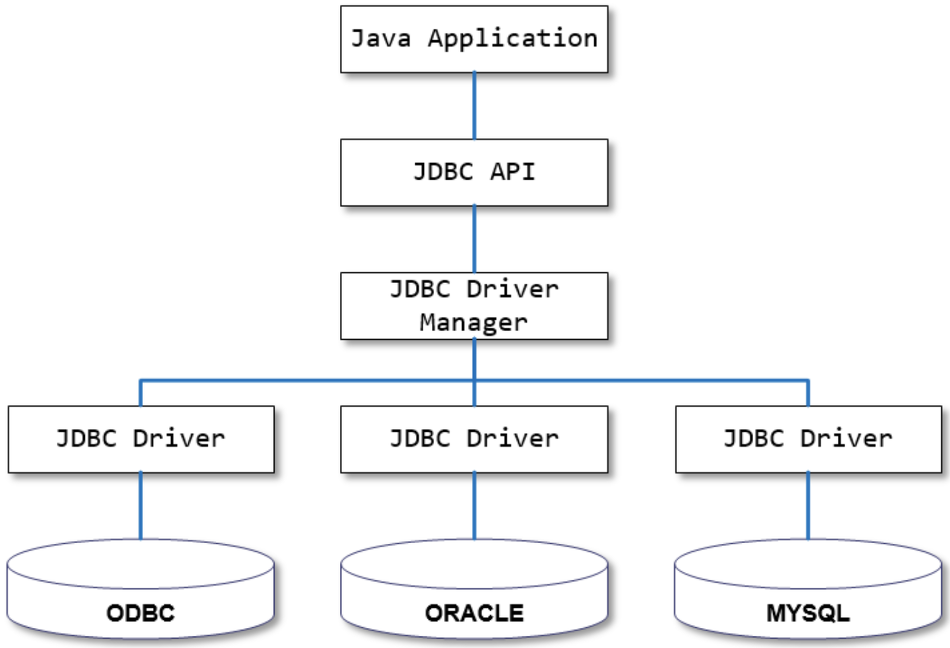

### 2022-11-11

## `@Transactional(readOnly = true)`
- **문제 상황**
  - repository.save() 하는 메서드 로직에 `@Transactional` 을 빼먹은 상황
  - 클래스 단위에는 `@Transactional(readOnly=true)`가 작성되어 있음
  - update 쿼리가 날라가는데 이때 서비스 테스트가 안터짐! => 그냥 쓱 insert 쿼리 날라감

- **뭐가 문제였을까**
  - h2 데이터베이스를 가지고 테스트를 하면 테스트가 통과함
  - 로컬 도커에 mysql을 가지고 테스트를 진행하면 테스트가 터짐
  - `@Transactional(readOnly=true)` 자체가 데이터베이스에 따라 다르게 추상화 되는구나

- **해결 방법**
  - *참고: https://ssisksl77.gitlab.io/code-that-talks/220526-spring-transactional-readonly.html*
  - h2에서는 `@Transactional(readOnly=true)`가 안 먹힌다
  - 원래 readOnly가 쓰여있다고 무조건 write를 막는 것은 아님
  - 트랜잭션 매니저가 readOnly 힌트를 사용하지 않을 수 있음
  - 

- **HibernateJpaDialect**
  - 트랜잭션 시작시 호출되는 함수
    ```java
    @Override
    public Object beginTransaction(EntityManager entityManager, TransactionDefinition definition)
            throws PersistenceException, SQLException, TransactionException {
  
        // EntityManager로 부터 세션을 가져온다
        SessionImplementor session = getSession(entityManager);
  
        if (definition.getTimeout() != TransactionDefinition.TIMEOUT_DEFAULT) {
            session.getTransaction().setTimeout(definition.getTimeout());
        }
  
        // IsolationLevel이 Default인지 확인
        boolean isolationLevelNeeded = (definition.getIsolationLevel() != TransactionDefinition.ISOLATION_DEFAULT);
        Integer previousIsolationLevel = null;
        Connection preparedCon = null;
  
        // IsolationLevel이 Default가 아니거나, 트랜잭션이 readOnly라면
        if (isolationLevelNeeded || definition.isReadOnly()) {
            // 
            if (this.prepareConnection && ConnectionReleaseMode.ON_CLOSE.equals(
                    session.getJdbcCoordinator().getLogicalConnection().getConnectionHandlingMode().getReleaseMode())) {
                preparedCon = session.connection();
                previousIsolationLevel = DataSourceUtils.prepareConnectionForTransaction(preparedCon, definition);
            }
            else if (isolationLevelNeeded) {
                throw new InvalidIsolationLevelException(
                        "HibernateJpaDialect is not allowed to support custom isolation levels: " +
                        "make sure that its 'prepareConnection' flag is on (the default) and that the " +
                        "Hibernate connection release mode is set to ON_CLOSE.");
            }
        }
  
        // Standard JPA transaction begin call for full JPA context setup...
        entityManager.getTransaction().begin();
  
        // Adapt flush mode and store previous isolation level, if any.
        FlushMode previousFlushMode = prepareFlushMode(session, definition.isReadOnly());
        if (definition instanceof ResourceTransactionDefinition && 
                ((ResourceTransactionDefinition) definition).isLocalResource()) {
            // As of 5.1, we explicitly optimize for a transaction-local EntityManager,
            // aligned with native HibernateTransactionManager behavior.
            previousFlushMode = null;
            if (definition.isReadOnly()) {
                session.setDefaultReadOnly(true);
            }
        }
        return new SessionTransactionData(
                session, previousFlushMode, (preparedCon != null), previousIsolationLevel, definition.isReadOnly());
    }
    ```

## PSA (Portable Service Abstraction)
- *참고: https://www.youtube.com/watch?v=P3vzrqADl8I*
- *참고: https://atoz-develop.tistory.com/entry/Spring-%EC%8A%A4%ED%94%84%EB%A7%81-PSA*
- **정의**
  - [추상화 계층]을 사용해서 [어떤 기술을 내부에 숨기고] 개발자에게 편의성을 제공해주는 것!
  - 코드를 거의 변경하지 않고 스프링이 다른 것 쓸 수 있도록 지원
  - 서비스가 추상화 되어있다 == 서비스의 내용을 모르더라도 해당 서비스를 이용할 수 있다는 것
    - JDBC Driver 사용해 DB 접근하더라도 JDBC Driver가 어떻게 구현되어 있는지는 관심 X
    - 핵심적인 요소만 개발자에게 제공하면 됨!

- **예시와 함께 이해하기**
  - Portable Service Abstraction
  - 비즈니스 로직의 수정없이 언제든지 변경할 수 있음!
  - Spring PSA는 확장에는 열려있고 수정에는 닫혀있는 OCP의 대표격!

- **구현 방법**
  - 
  - 여러 서비스를 비즈니스 로직을 수정하지 않고 교체할 수 있도록 하는 것
  - 추상화 계층의 인터페이스인 PlatformTransactionManager 인터페이스를 두고 이를 구현하는 다양한 서비스의 비즈니스 로직을 추상화 해두었다는 것
  - 개발자는 그냥 PlatformTransactionManager를 선언해서 이용하면 되고, 언제든지 이를 구현하는 다른 구현체로 변경 가능
  - 트랜잭션, 톰캣/네티 등도 개발자의 코드는 건들지 않고 이를 구동하는 추상화된 서비스를 통해 구동(PSA)시키기에 뚝딱 처리가능

- **Spring Web MVC**
  - `@Controller`와 `@GetMapping`, `@PostMapping` 만 있으면 요청을 매핑할 수 있는 컨트롤러 역할 수행
  - HttpServlet 상속받아 doGet(), doPost() 같은거 안해도 됨! => 서블릿 사용 기술의 추상화!
  - 심지어 Spring Web MVC 코드는 그대로 두고, 톰캣 말고 완전히 다른 기술 스택으로 실행하는 것도 가능
  - Webflux 의존성을 받아 톰캣 말고 netty 기반의 실행도 가능!

- **Spring Transaction**
  - 스프링 트랜잭션도 PSA로 로직 추상화시켜 혜택 제공받을 수 있다!
    - JDBC: DatasourceTransactionmanager
    - JPA: JpaTransactionManager
    - Hibernate: HibernateTransactionManager
  - 코드는 변경하지 않은채, 실제 동작 구현체는 스프링이 바꿔낄 수 있는 것!

- **Spring Cache**
  - JCacheManager, ConcurrentMapCacheManager, EhCacheCacheManager와 같은 여러가지 구현체 사용 가능
