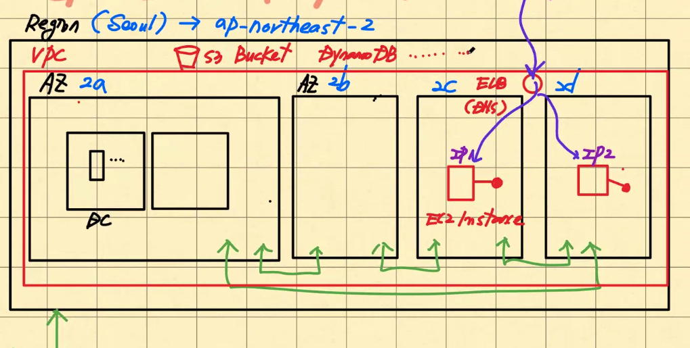
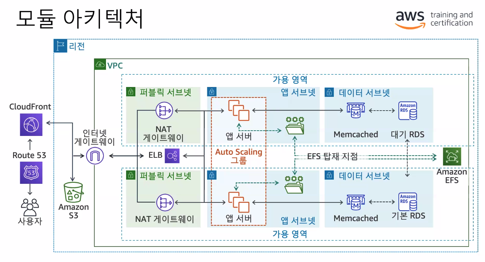
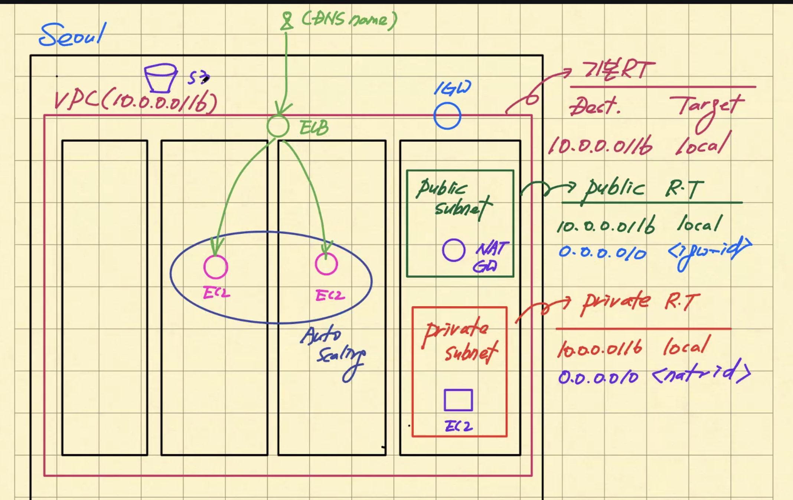
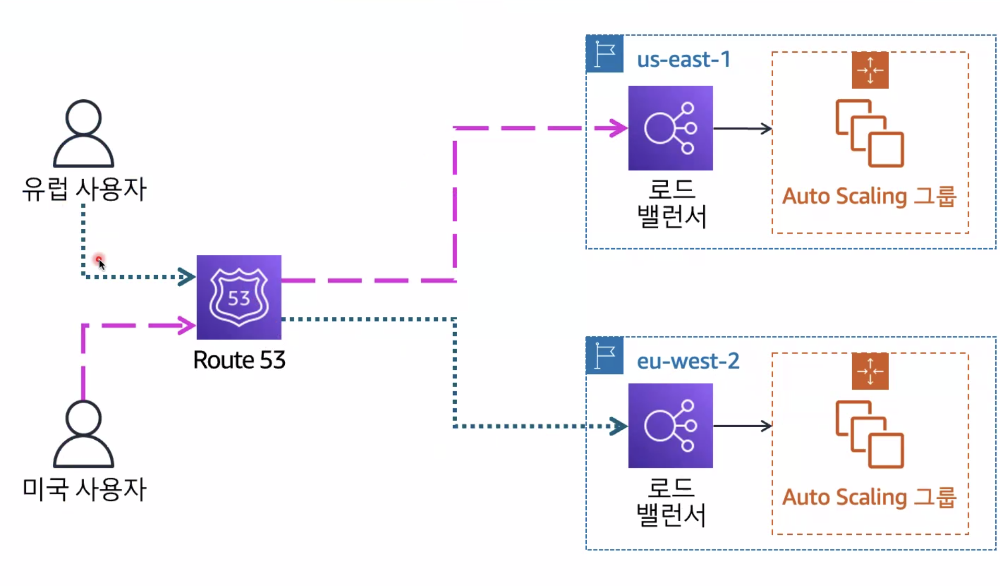
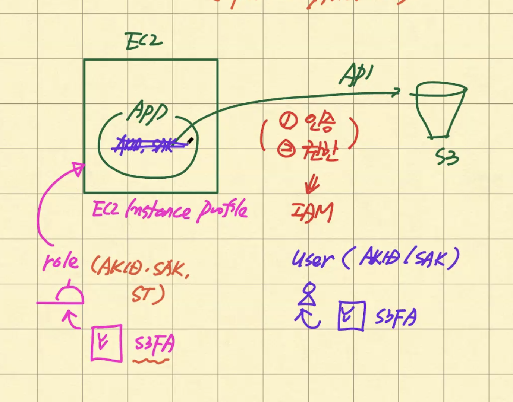
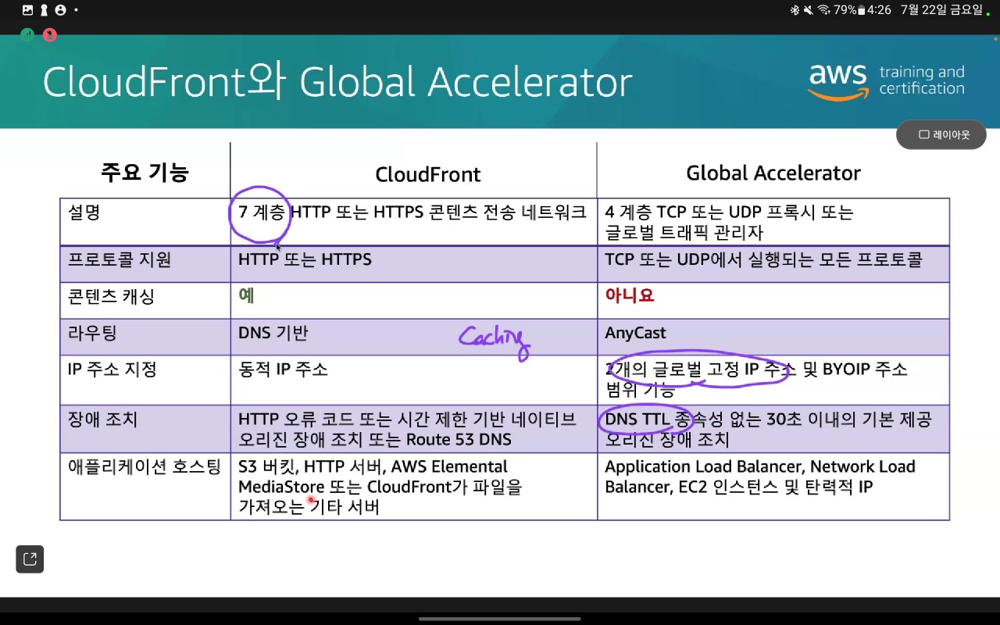
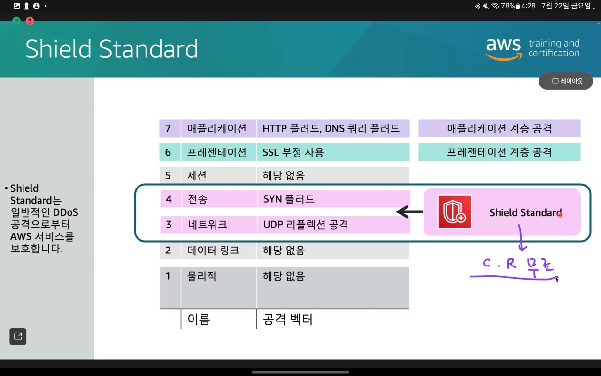
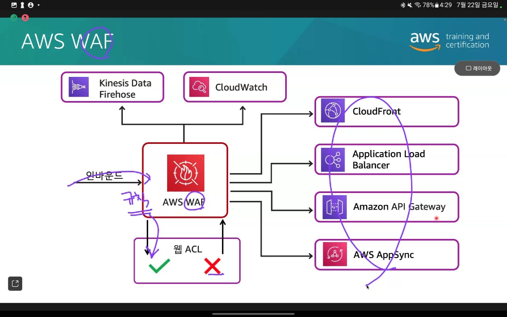
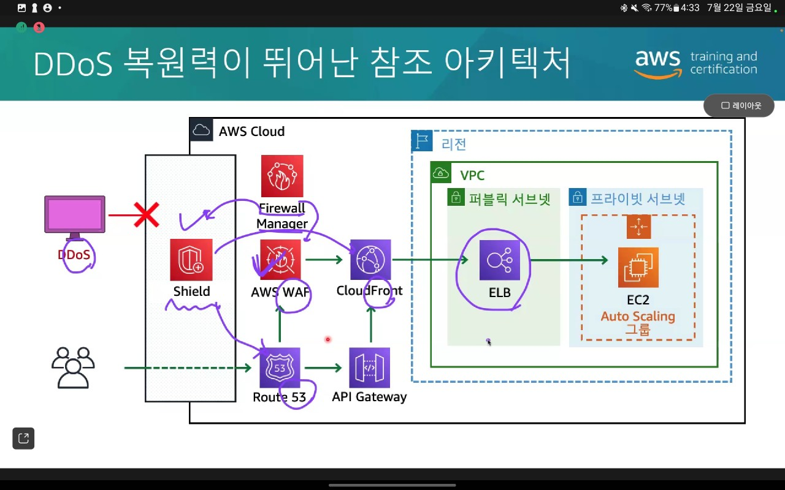

## Architecting on AWS

### 아키텍팅 기본 사항
- **AWS란?**
  - 가상화를 통한 리소스 생성
  - 가상화를 통한 리소스를 생성하는데 이를 서비스 형태로 제공해줌!
    - 서비스 -> 리소스
    - EC2 -> Instance AMI
    - S3 -> Bucket
    - EBS -> Volume snapshot
  - Pay as you go 
  - 인터넷 기반: "VPC <- EC2"로 구성하자!

- **AWS API**
  - REST API
  - COnsole (GUI)
  - CLI, SDK
  - CloudFormation

- **리소스 식별**
  - ResourceId: EC2 에서 많이 사용 (i-xxxxxx, ami-xxxxxx)
  - ARN: Amazon Resource Name (IAM 정책 등에서 사용)

- **Managed Service : AWS가 많은 부분 관리**
  1. Instance 기반 서비스: OS 깔아주고, 필요한 app 깔아주고, volume storage 설치하고 다 묶어서 리소스로 뚝딱 제공 (ex. RDS)
  2. Serverless 서비스: 대부분 공개가 되어있지 않음. 인프라가 어떻게 생겼는지 모르고 그냥 뚝딱 씀. 프로비져닝, 고가용성 -> API 기능만 쓰면 됨 (ex. S3, DynamoDB, Lambda) 

- **Global Infra**
  - 
  - 
  - Region (Seoul) : ap-northeast-2
    - VPC를 만들어주면 여기서 뚝딱
      - AZ (Availablity Zone) : 가용영역 현재 서울에 4개 있음 (2a, 2b, 2c, 2d)
        - ELB : DNS 이름을 여기다가 붙이는 갬성 <- 엔드유저가 여기에만 접근 뚝딱
          - DC (Data Center)
            - 이 안에 EC2
  - Edge Location : 지연시간을 짧게, DDoS 방어 등등 410 개 정도...
    - CloudFront
    - Route 53
    - Global Accelerator
    - WAF
    - Shield

- **AWS Well-Architected Tool**
  - 특정한 리소스를 얼만큼 어떻게 쓰고 싶은지 정하면 서비스 둑딱 보고서로써 정해줌
  - 보안/성능/...
- 실습: AWS API를 사용한 EC2 인스턴스 배포 살펴보기

### 계정 보안
- **Account & User(IAM)**
  - Account: Account ID 생성 (숫자 12개), e-mail/password로 가입 => Root User로 불림
    - Root User는 근데 쓰지 마세요! 
      - 최대 권한 가지고 있고, 권한 제어가 불가능 함
      - MFA를 가지고 인증을 받고 연결해서 쓰세요!
  - User: IAM User 어카운트
    - IAM 서비스는 계정 단위임
      1. User 
         - 영구자격 증명 => 사원증
         - username과 password 세트 => Console
         - accessKey(access key id & secret access key) 만듦 => CLI/SDK/API
      2. Group 
      3. Policy (JSON) 
         - JSON으로 정책 만들어서 권한을 지정할 수 있음
         - identity
         - resource 기반
      4. Role
         - 임시 자격 증명 (만료 기간이 있음) => 방문증
         - 권한을 위임한다
           - IAM, Federation User

- **Organizations**
  - 통합결제/모든기능
  1. Organization
  2. Account
     - management
     - member
  3. OU
  4. Policy
     - scp
     - tag policy

- **IAM**
  - Access Advisor를 통해 어떤 서비스를 언제 접근했는지 확인할 수 있다
  - IAM 권한 경계
    - 계층적 방어를 위해 정책을 사용한다
  - 페더레이션: AWS 서비스 사용하려면 IAM이 있어야 함
    - SAML, OIDC
  - AWS SSO를 통해 한번에 인증할 수 있음
  - AWS Organizations
    - 하위 계정들에 대해 결제를 한번에 진행할 수 있음

### 네트워킹 1
- **VPC**
  - 외부 네트워크와 격리시켜 그 안에 EC2를 만든다
  - VPC 내부의 인스턴스와는 통신 가능
  - VPC 외부(인터넷, 다른 VPC)와는 통신이 불가능
  - 외부와의 통신은 게이트웨이로!
    - VPC 하나당 인터넷 게이트웨이 연결! (in/out 모두 가능)
    - NAT gateway를 통해서는 인터넷으로 나가는 것만 가능! (out만 가능)
  - CIDR를 통해 IP 대역을 설정함
    - 10.0.0.0/16 => 2^16개 사용가능
  - 다중 VPC의 이점
    - 환경별로 VPC를 나눠서 운영할 수 있음

- **IP**
  - IPv4: 8비트 4자리 (32비트)
    - 172.31.0.0/16
      - /prefix: CIDR (Classless Inter Domain Routing)
        - 앞에서 부터 몇 비트가 고정이다
        - 예시에서는 172.31 이 고정이다
        - 0.0 은 유동적이다 (0-255, 0-255) 
        - 이러면 2^16 개가 활용할 수 있어
    - 필수
  - IPv6: 8비트 6자리 (128개)
    - 어라 ip 부족하네?
    - option
  - CIDR
    - 0.0.0.0/0 : 모든 ip
    - 10.22.33.44/32 : 10.22.33.44 특정 ip 지정
    - 10.22.33.0/24 : 10.22.33.* (2^8)
    - 10.22.0.0/16 : 10.22.*.* (2^16)
    - 될 수 있으면 ip를 많이 만들어두세요!
      - 비용 더 나가는 것도 아니니, 큰 범위를 써보세요!
  - 공인 ip 주소: 인터넷을 통해 연결 가능
  - 사설 ip 주소: 인터넷으로 연결 불가능
    - 10.0.0.0/16 => 이거 다 사설!
      - 10.0.*.* - 랜덤하게 할당이 된다
    - 인터넷을 통해서 해당 ip를 접근할 수 없어 -> 필요하면 공인 ip 받으세요
  - Elastic IP : stop -> start 해도 공인 ip 그대로 유지

- **서브넷**
  - 퍼블릭 서브넷 : 인터넷과 통신이 가능하다
  - 프라이빗 서브넷 (앱 서브넷, 데이터 서브넷) : 인터넷과 통신이 불가능하다
  - CIDR로 나눈 IP를 서브넷으로 나누어 소통할 수 있도록 분리/Grouping 함
  - 서브넷을 통해 VPC 분리하기
    - CIDR/22 => 32bit 중에서 22bit 고정 => 2^10개의 ip를 나눠쓸 수 있다 (1024개)
      - 서브넷1~서브넷4 각각 251개씩
      - 256개가 아닌 이유는 5개는 AWS가 내부적으로 쓰고 있어서 못씀

- **게이트웨이**
  - 인터넷 게이트웨이 (in/out 모두 가능하게)
    - 기본적으로 수평 확장되고 중복되며 고가용성
  - 인터넷 게이트웨이를 만들면 리소스id가 생겨
  - NAT 게이트웨이 (EIP 필수!)
    - 퍼블릭 서브넷 <-> 프라이빗 서브넷
    - 프라이빗 서브넷에 다음과 같은 정보 추가
      - 0.0.0.0/0 - nat-02031

- **라우팅 테이블**
  - 경로 규칙을 설정할 수 있음 (나 어디로 이동할거야!)
  - VPC에서는 암시적 라우터가 있음
  - 라우팅 테이블
    - 대상위치 - 대상
    - 172.31.0.0/16 - local
    - 0.0.0.0/0 - igw-12345
    - ::/0 - igw-12345
    - 찾아가고자 하는 경로의 가장 가까운 경로로 가려고 함
  - 서브넷 당 라우팅 테이블을 따로따로 만드는 것이 좋음!
    - 서브넷 당 라우팅 테이블을 만들어서 연결하는 감성
    - 172.31.0.0/16 - local => 삭제 안되고 고정 => VPC 내부에서는 통신이 무조건 통신이 가능하다는 뜻
  - 퍼블릭 라우팅 서브넷
  - 프라이빗 라우팅 서브넷
    - 인터넷 게이트웨이에 대한 정보 필요 X

- **가상 방화벽**
  - NACL (Network ACL)
    - 상태 비저장
    - 허용되어 있음
  - 보안그룹 리소스당
    - 상태 저장
    - 들어오는게 차단되어 있음 (허용 규칙 필수)
    - 허용 규칙만 허락해준다고 생각하면 됨

- **VPC 심층 방어**
  - 인터넷 게이트웨이 <-> 라우팅 테이블 <-> 네트워크 ACL <-> 퍼블릭 서브넷 <-> 보안 그룹 <-> 인스턴스

- **사용자 지정 보안 그룹 규칙**
  - 인바운드
    - 0.0.0.0/0 - 80,443
  - 아웃바운드
    - db 연결

- **가용 영역**
  - 웹 보안 그룹
    - 인바운드 규칙
      - 443 허용
      - 소스: 0.0.0.0/0
  - 앱 보안 그룹
    - 인바운드 규칙 
      - 80 허용
      - 소스: 웹 티어
  - 데이터 보안 그룹
    - 인바운드 규칙
      - 3306 허용
      - 소스: 앱 티어

### ToDo
- 팀원들에게 IAM을 만들어서 할당하기
- VPC 만들어보기

### 컴퓨팅 서비스
- **AWS 컴퓨팅의 진화**
  - 물리적 서버 -> 가상화 -> 컨테이너화 -> 서버리스 -> 서버리스 컨테이너화 -> 특화 프로세서

- **EC2 인스턴스**
  - t3.micro등의 사양: cpu, network, memory 등 결정
  - AMI
    - 인스턴스 볼륨 템플릿
    - 시작 권한
    - 블록 디바이스 매핑
  - 이점
    - 반복 가능
    - 재사용 가능
    - 복구 가능
  - EC2 백업은 AMI로 뚝딱 => S3에 aws가 저장해줌
  - 최신 유형 쓰는거 권장합니다
    - https://aws.amazon.com/ko/ec2/instance-types
  - c5n.xlarge
    - 인스턴스패밀리_인스턴스세대_속성.인스턴스크기
  - 인스턴스 수명 주기
    - 보류 중 -> 실행 중 -> 재부팅 중 -> 중지 중 -> 중지 됨
      - -> 종료 중 -> 종료 됨
  - 인스턴스 메타데이터
    - 사용자의 AMI -> EC2 인스턴스 실행
    - instance-id/mac/public-hostname/public-ipv4/local-hostname/local-ipv4
  - 구매 옵션
    - 예약 인스턴스 : 온디맨드 요금 대비 1년/3년 약정
    - Savings Plans: EC2 예약 인스턴스와 비슷한 할인 이지만 더 높은 유연성으로 1년/3년 약정 (lambda도 지원)
    - 스팟 인스턴스: 온디맨드 요금 대비 최대 90% 할인으로 Amazon EC2 용량 확보
    - 온디맨드 인스턴스: 장기 약정 없이 시간단위로 컴퓨팅 용량 구입
  - 인스턴스 유형을 선택해서 만들면, 서버가 랜덤하게 선택되고, 원하는 크기만큼의 가상화를 해서 인스턴스가 제공받아짐
  - 인스턴스 유형에 따라 스토리지에 따라 제공되는 것이 있음
  - stop이 되면 회수되었다가, start하면 또 랜덤하게 만들어짐 -> 이게 ip가 바뀌는 이유
  - 볼륨 영구적 저장을 위해서는 EBS를 쓰세요

- **Amazon EBS**
  - 볼륨이 EC2 인스턴스와 돌깁적으로 지속
  - 가용 영역 내에서 정의됨 
  - 99.999% 가용성
  - 네트워크를 통해 인스턴스의 볼륨을 연결해줌 (유실되지 않도록)
  - 인스턴스에 따라 볼륨 여러개 붙일 수 있음

### 스토리지
- **AWS 데이터 빌딩 블록**
  - 데이터 이동
  - 데이터 보안 및 관리
    - S3/EFS: 3개의 AZ에 걸쳐서 중복 저장됨

- **스토리지**
  - Block(EC2): EBS, 파일을 스토리지에 저장, ~16TB, EC2의 디스크
  - File(EC2): EFS, FSx, 트리구조, 무제한, AZ레벨의 서비스 (3개 AZ에 저장), 파일을 공유해서 저장
  - Object(http, https): S3, S3 Glacier, 파일의 키/메타데이터 등을 오브젝트로 저장, 무제한, AZ레벨의 서비스 (3개 AZ에 저장), 정적 데이터
    - AWS에서도 S3 많이 씀... 빅데이터, AMI 등등

- **EBS**
  - EBS + EC2 => AutoScaling

- **S3**
  - 버전 관리
    - 동일한 버킷에 여러 객체 버전을 유지할 수 있음
    - 객체를 이전 버전 또는 특정 버전으로 복원 가능
    - 데이터 보존 또는 보호를 위해 S3 객체 잠금을 사용함
    - 지워져도 soft delete
  - 스토리지 클래스 for 비용 절감
    - 저장용량에 따른 비용이 다 있어
    - 액세스 비용도 있어 (API 호출에 따라 비용 발생)
    - 수명 주기 정책도 도입할 수 있음
  - S3 Glacier 아카이브 및 저장소
    - 감사 아카이브
    - 감사 저장소
    - 저장소 잠금
  - 이벤트 알림
    1. API가 객체를 생성
    2. 적절한 컨텐츠를 결정하기 위해 객체가 필터링 됨
    3. 조정 분석을 위해 객체를 제출
    4. 버킷에 객체를 추가함
  - S3 멀티파트 업로드
    - 개별 조각에서 객체를 재생성할 수 있도록, 조각조각 나누어서 객체 전달 & 저장
  - 비용 요소
    - 다음에 대해 사용한 만큼만 지불
      - 다른 리전 또는 인터넷으로 전송
    - 다음에 대해선 지불 필요 없음
      - 동일 리전의 EC2, CloudFront로 전송

- **EFS**
  - 확장 가능하고 탄력적인 파일 시스템을 위해 EFS 선택
  - NFSv4 프로토콜을 사용하여 연결
  - EC2 인스턴스 전체의 파일 시스템에 동시에 액세스

- **Snowball**
  - Snow Family -> 우리 회사에 데이터 센터가 있는데, 이걸 AWS로 옮겨야 해. 
    - 많은 데이터들을 옮겨올라면 오래 걸리겠지? 
    - 디바이스가 데이터센터로 가는거야 연결 뚝딱 해서 다 전달해서 AWS 데이터 센터로 오는 것 => s3에 저장
  - Snowcone
  - Snowball
  - Snowmobile

- **VPC 복습**
  - 
  - VPC Endpoint: S3 버킷에 대해 인터넷을 통해 접근하는 것이 아닌 aws 네트워크로 접근 가능
    - NAT, 인터넷 게이트웨이 없어도 S3 접근이 가능함
  - VPC를 만들어 우리의 "안전한" 서버를 구축해보자
    - 인터넷 상에 EC2 만들어두면 공격당하기 딱 좋음
    - VPC의 CIDR 지정 (10.0.0.0/16)
    - 서브넷을 상세로 만들자!
      - 라우팅 테이블에 기본적으로 10.0.0.0/16 만 매핑되어 있기에 VPC 내부에서만 통신 가능
      - 따라서 public 서브넷으로 바꾸려면 인터넷 게이트웨이 정보를 매핑해주자
        - 0.0.0.0/0 igw-id
      - private 서브넷으로는 외부 못나가
        - public 서브넷에 NAT 게이트웨이 생성
        - private 서브넷에 해당 NAT 매핑
        - 0.0.0.0/0 nat-id
        - NAT는 가용영역 별로 이중화 시키는 것을 추천
  - VPC Endpoint
    - Gateway Endpoint: S3, DynamoDB => Route Table
    - Interface Endpoint: S3 => ENI (Private IP)

- **Transit Gateway**
  - Route Table
  - on-premise 트래픽 전송

### 데이터베이스 서비스
- **AWS 데이터베이스 서비스**
  - amazon redshift: 데이터웨어
  - amazon elastiCache: 캐싱
  - 

- **RDS**
  - 다중 AZ 배포
    - 다른 가용 영역의 대기 DB 인스턴스에 데이터를 복제
    - 읽기 전용 시나리오에서는 사용되지 않음
    - 기본 DB 인스턴스, 대기 DB 인스턴스
    - endpoint(write) - 동기
    - endpoint(read) - 비동기
  - 읽기 전용 복제본
    - Read Replica를 적용하여 다음으로 복제 가능

- **DynamoDB(NoSQL)**
  - Serverless
  - 3AZ에 걸쳐서 저장
  - 완전관리형 NoSQL
  - 임시 데이터 (온라인 장바구니 등)
  - 테이블
    - 어트리뷰트 K-V
    - 복합 기본키: 파티션 키, 정렬 키
      - 고르게 분포할 수 있는 파티션 키(PK)를 잡아주세요!
    - 필수 키 값 액세스 패턴, 파티션 키가 데이터 분산을 결정, 정렬 키가 다양한 쿼리 기능을 제공
    - Primary Key: 중복 x
      - partition key
  - 처리량: 서버리스다 보니 API 액세스별로 비용 발생
  - 일관성 옵션
    - 강력한 일관성: 읽기 용량 단위 1 사용
    - 최종 일관성: 읽기 용량 단위 0.5 사용
  - 일관성 보다는 성능에 초점을 맞추는 경우에 NoSQL을 쓰세요
    - 글로벌 테이블 지원: 리전 간 복제를 자동화
  - 테이블이 key-value 속성으로 되어있음 -> 아이템이라고 칭함 (key-value)

- **Aurora**
  - 설치형 EC2 DB
  - 스토리지는 3개의 가용영역에 분산된 수백개의 스토리지 노드에 스트라이프 됨
  - 3개의 가용 영역에서 각각 2개의 사본을 유지함
  - 각 오로라 디비 클러스터는 최대 15개의 오로라 복제본을 가질 수 있음
  - 오로라 디비 클러스터
    - 스토리지는 3개의 가용 영역에 분산된 수백개의 스토리지 노드에 스트라이프됨
    - 3개의 가용 영역에서 각각 2개의 사본을 유지
    - 각 오로라 디비 클러스터는 최대 15개의 오로라 복제본을 가질 수 있음
  - 하나의 클러스터에 대해...
    - Instance -> primary/replica
    - Endpoint -> writer/reader

### 모니터링 및 스케일링
- **아키텍처 모니터링 및 크기 조정**
  - Auto Scaling 그룹
  - ELB - Auto Scaling과 함께 쓴다

- **Cloudwatch**
  - 지표 및 로그를 거의 실시간으로 수집
  - 모니터링 데이터를 한 위치에서 액세스
  - 지표라고 하는 것을 쓴다 -> CPU 백분율, 읽기 처리량, 쓰기 처리량 -> 값들이 수집이 되어서 임계치를 설정할 수 있음 -> 임계치 미만으로는 경보 울림
  - 지표와 경보!
  - 로그 유형

- **경보 구성 요소**
  - 네임스페이스/지표/타임스탬프/측정기준
  - AWS-EC2/CPUUtilization/dateTime/InstanceID

- **CloudWatch Events 및 EventBridge**
  - 메시지를 보내 환경에 대응
  - 함수를 활성화하거나 작업을 시작
  - 상태 정보를 캡쳐

- **로드밸런서**
  - 로드밸런서 
    - 로드밸런서가 어디에 있느냐에 따라 크게 두가지 분류
      - Internet Facing: Public Subnet
      - Internal: Private Subnet
    - 어떤 트래픽을 분산시켜주느냐에 따라서 써야할 로드밸런서가 달라짐
      - ALB(L7), NLB(L4), GWLB(L3)
  - (규칙)리스너 -- (규칙)리스너(규칙)
  - ALB(L7), NLB(L4), GWLB(L3), CLB(X)
  - internet-facing, internet
  - listener - protocol(port), 규칙
  - target group - ec2, ecs/eks, on-premise

- **ELB 기능**
  - 자동으로 트래픽을 여러 대상에 분산
  - 고가용성을 제공
  - 보안기능을 통합
  - 상태확인을 실행

- **Auto Scaling**
  - AWS Auto Scaling
    - EC2, DynamoDB, Aurora 등 여러 서비스에 걸쳐 짧은 간격으로 여러 리소스에 대한 어플리케이션 스케일링 제공
  - Amazon EC2 Auto Scaling
    - Amazon EC2 Auto Scaling을 사용해 어플리케이션의 로드를 처리할 수 있는 적절한 수의 EC2 인스턴스를 유지할 수 있음
  - 확장/축소
    - 수직: Scale Up/Down
    - 수평: Scale In/Out
  - Auto Scaling 그룹
    - 어디서, 얼마나 필요한가? 
    - VPC 및 서브넷
    - 로드 밸런서
    - 정의
      - 최소 인스턴스
      - 최대 인스턴스
      - 원하는 용량
    - 예약 온디맨드
  - 시작 템플릿(컴퓨팅 용량 등), 그룹 구성 요소(네트워크/min-max), 언제 얼마동안 필요한가
  - 고려사항
    - 여러 유형의 오토 스케일링을 결합할 수 있음
    - 아키텍처에서 다른 유형의 스케일링이 필요할 수 있음
    - 일부 아키텍처의 경우 둘 이상의 지표를 기준으로 스케일링 해야함
    - 조기에 빠르게 스케일 아웃하고 시간이 지남에 따라 천천히 스케일 인
    - Amazon EC2 Auto Scaling이 인스턴스를 시작/종료시 사용자 지정 작업을 자동화

- **VPC**
  - 
  - Seoul Region
    - VPC(10.0.0.0/16) => 기본 라우팅 테이블 dest-target
      - Public Subnet => 서브넷마다 라우팅 테이블을 만들어주는 것을 추천 + 연결해주기
        - public r.t
        - 10.0.0.0/16 - local
        - 0.0.0.0/0 - igw-id
      - Private Subnet => 서브넷마다 라우팅 테이블을 만들어주는 것을 추천 + 연결해주기
        - private r.t
        - 10.0.0.0/16 - local
        - 0.0.0.0/0 - nat-id
  - VPC endpoint를 만들수도 있음
  - On-premise와 소통하기 위해 On-premise는 CGW, VPC에는 VGW
  - Transit Gateway
    - VPC/VPN/Direct Connect 게이트웨이/Transit Gateway 피어링

- **Route 53**
  1. 도메인 이름을 IP주소로 확인
  2. 도메인 이름을 등록 또는 이전
  3. 대기 시간, 상태 확인 및 기타 기준에 따라 요청을 라우팅
  - 
  - ALB: Round Robin
  - NLB: Hash Algorithm

### 자동화
- **배포 자동화(Infrastructure as Code)**
  - AWS Elastic Beanstalk
    - EC2 정도만 자동화 해줌, VPC/IAM 이런거는 못함
    - 인프라를 프로비저닝하고 운영
    - 사용자 대신 어플리케이션 스택을 관리
    - 생성된 모든 것을 표시
    - 어플리케이션을 자동으로 스케일 업 및 스케일 다운
  - AWS CloudFormation
    - 한땀한땀 만들자
  - AWS Systems Manager
    - patch를 쉽게 
 
- **AWS CloudFormation** 
  - Infrastructure as Code -> JSON, YAML
  - IaC
    - 아키텍처 템플릿 -> CloudFormation 엔진 -> 아키텍처 스택 -> VPC/Subnet/SG/EC2
    - 스택 삭제시 이로 만들어진것도 모두 삭제
    - 복제/재배포 및 용도 변경
    - 인프라 및 어플리케이션에서 버전 관리 제어
    - 드리프트를 탐지
    - 장애 발생 시 서비스를 마지막 양호한 상태로 롤백
  - 스택
    - 하나의 유닛으로 관리할 수 있는 AWS리소스 모음
    - 하나의 유닛으로 리소스 생성 및 삭제 가능
    - 중첩 스택 및 교차 스택 지원
  - 변경 세트
    - 원래 스택 --(변경 세트 생성)--> 변경 세트 --(변경 세트 보기)--> 변경 세트 --(변경 세트 구현)--> CloudFormation

- **여러 템플릿 사용**
  - 프론트: 웹 인터페이스, 관리자 인터페이스, 분석 대시보드
  - 백엔드: 고객, 캠페인, 제품, 마케팅 자료, 분석
  - 공유: 데이터베이스, 일반 모니터링 또는 경보, 서브넷, 보안 그룹
  - 기본 네트워크: VPC, 인터넷 게이트웨이, VPN, NAT 게이트웨이
  - 아이덴티티: IAM 사용자, 그룹, 역할

- **CDK(Cloud Development Kit)**
  - 지원되는 언어를 사용하여 템플릿을 생성
  - 자동 완성 및 인라인 문서를 지원
  - 동일한 기본값 및 재사용 가능한 클래스
  - 다양한 환경을 프로비저닝

- **AWS Systems Manager**
  - 똑같은 ec2 인스턴스 몇백대 만들었어,,, 근데 patch도 해야하고, 실행하거나 해야한단 말이지? 수동으로 하기 쉽지가 않아
  - 각 ec2에 에이전트 만들어두고 적용
  - 한꺼번에 처리하기 

### 서버리스
- **마이크로 서비스**
  - 모놀리식의 문제
    - 데베 하나 씀 => 하나의 모듈에서 바꿔버리면 딴 모듈 뇌절
    - 배포주기 길어짐
    - 각 기능 모두 같은 언어 필수
  - 마이크로 서비스
    - A 모듈을 만들때 가장 좋은 언어로 서비스-데베 뚝딱
    - B 모듈을 만들때 가장 좋은 언어로 서비스-데베 뚝딱
    - 따로따로 배포
    - 같은 기능이 필요하다면 API 호출 뚝딱
      - http 기반의 restapi
      - api 게이트웨이 
    - 배포주기가 짧아짐
    - VM(EC2), Container(ECS/EKS), Serverless(Lambda)를 통해서 msa를 손쉽게 적용할 수 있음
    - 실행환경
      - App
      - Runtime
      - OS
      - KVM
    - 호출시 
      - runtime
      - memory -> cpu/network 비례
      - timeout
      - role
  - 모놀리식 (3tier)
    - user -> web->app->db
  - msa
    - user -> A->B->C->D->db

- **ec2 s3 마이크로서비스**
  - 
  - EC2 App --(API with 인증/권한 IAM)--> S3

- **솔루션**
  - API Gateway
  - Amazon SQS: 1:1 message 전달 polling
  - Amazon SNS: 1:N message 자동 전달 (구독자)
  - Kinesis
  - Step Functions

- **Amazon SNS**
  - 구독자에게 알려준다
    - Email
    - SMS
    - 모바일 푸시 알림
    - http/https
    - aws lambda
    - amazon sqs
    - kinesis data firehose
  - 특성
    - 게시된 단일 메시지
    - 회수 옵션이 없음
    - http 또는 https 요청
    - 표준 또는 FIFO 주제

- **Amazon Simple Queue Service**
  - 비동기식 처리를 사용
    - Loosely Coupled
  - 작업 대기열
  - 버퍼링 및 배치 작업
  - 요청 오프로딩
  - 오토 스케일링
  - 긴폴링
    - 전체 샘플링해서 max => 10개 대기

- **Lambda (Serverless)**
  - 직접 호출
  - 예약
  - 이벤트
  - call => function 
    - cloudwatch
      - metrics
      - logs
    - x-ray
      - trace
      - runtime-7가지
      - memory-> cpu, network비례
      - timeout
      - role+알파

- **EC2 vs Lambda**
  - EC2: 언제든지 비용이 발생 at Running status
  - Lambda: S3, DynamoDB, SQS, SNS

- **서버리스**
  - 프로비저닝하거나 관리할 인프라가 없음
  - 종량제 요금
  - 내장된 보안, 고가용성 보장
  - 람다, 파게이트, API Gateway, S3, DynamoDB, AUrora, Kinesis, Step Functions

- **API Gateway**
  - 통합 API 프론트엔드 생성
  - 백엔드에 DDoS 보호 및 제한 기능 제공
  - 백엔드에 대한 요청을 인증 및 권한 부여
  - 서드 파티 개발자에 의해 api 사용을 조절, 측정 및 수익화
  - 샘플 아키텍쳐
    - POST /write => lambda1
    - GET /list => lambda2
    - DELETE / => lambda3
    - makes serverless architecture

- Amazon SNS 및 Amazon SQS
  - Amazon SNS
    - 메시지 지속성: 아니요
    - 전송 메커니즘: 푸시
    - 생산자 및 소비자: 게시자 및 구독자
    - 배포 모델: 일대다
  - Amazon SQS
    - 메시지 지속성: 예
    - 전송 메커니즘: 폴링
    - 생산자 및 소비자: 
    - 배포 모델: 일대일

- **Kinesis**
  - 실시간 데이터 수집 및 분석을 위한 서비스
  - Amazon Kinesis Data Streams
    - 분석을 위해 데이터 스트림을 수집 및 저장
    - 생산자가 데이터 레코드를 스트림에 제출
    - "샤드"가 시퀀스 지정된 실시간 데이터를 보관
    - 소비자가 샤드에서 데이터를 읽어 처리
    - 출력은 서비스를 사용하여 저장할 수 없음
  - Amazon Kinesis Data Firehose
    - 데이터 스트림을 AWS 데이터 스토어에 로드
    - 데이터 생산자가 데이터를 전송
    - AWS로 로드하기 전에 데이터를 일괄 처리하고 압축
    - Kinesis Data Firehose가 대상에 씀
    - 데이터 분석 및 비즈니스 인텔리전스
  - Amazon Kinesis Data Analytics
    - SQL 또는 Apache Flink로 데이터 스트림을 분석
  - Amazon Kinesis Video Streams
    - 분석을 위해 비디오 스트림을 수집 및 저장

- **Step Functions**
  - 시작 -> StartState(lambda#1) -> FinalState(lambda#2) -> 종료
  - 실제 코드가 바뀌는게 아니라 실행 순서만 바꿔줌으로써 유연성 제공
  - JSON 형태로 만들어 람다 연결

### 컨테이너
- **마이크로서비스**
  - 해당하는 기능을 독립 서비스로 구성한 어플리케이션
    - 자율 개발을 지원
    - 전문화가 가능
  - 마이크로서비스 아키텍팅
    - 하나로 모든 것을 충족한다는 방식 따르지 않아! 언어, 인프라 각각 달라도 상관이 없어요!
      - example.com/users -> Lambda
      - example.com/topics -> EC2
      - example.com/messages -> ECS
  - 문제는...
    - 어디서 문제가 발생했는지 찾기가 쉽지가 않아
    - AWS X-Ray: 현대적 어플리케이션 분석 & 디버깅
      - 데이터 수집
      - 트레이스 기록
      - 서비스 맵 확인
      - 문제 분석

- **컨테이너**
  - 장점
    - 반복 가능
    - 독립적 환경
    - VM보다 더 빠른 가동/중단 속도
      - VM은 하드웨어 가상화 with hypervisor
    - 이동성
    - 확장성
  - 컨테이너와 가상 머신
    - 가상 머신은 격리되어 있지만 동일한 OS 및 바이너리/라이브러리를 공유하지 않음
    - 컨테이너는 격리되어 있지만 OS를 공유하고 필요한 경우 바이너리/라이브러리를 공유

- **Container**
  - Container Image
    - (App Code/Runtime/Config/Library) => Image로 만들어두고 => 이를 기반으로 컨테이너 만들기
    - 여러개로 재사용 가능, 백업도 가능
    - Dockerfile을 만들어 DockerCLI
    - 이렇게 만든 이미지 DockerHub나 ECR에 업로드
    - Qs) AMI/Snapshot은 aws가 관리하는 S3에 저장
  - Container Image --(Docker CLI)--> Container--> EC2
    - 여전히 EC2 쓰는것은 똑같아 배포 방식 뚝딱 다 만들어야해
      - CPU/Memory/Network 다 필요하자나!
    - 인프라 설정 싫어! 그러면 서버리스 써야겠지? => Fargate
      - 컨테이너 전용 서버리스 서비스
  - App Container - Log Container 인프라 설계
    - 컨테이너 묶어서 관리하자! 오케스트레이션! ECS!
      - ECS -> Task, k8s -> Pod 하고 EC2에 배치
        - [App Container] [Log Container]
  - EKS 
    - EC2에 많은 사람들이 쿠버네티스 설치해서 쓰더라...
    - 그럴거면 AWS가 관리포인트 줄어들게 해서 제공해줄게!

- **Amazon ECR**
  - 컨테이너 이미지를 저장해줌

- **Amazon ECS**
  - 컨테이너 만들어서 배포해줌
  - EC2 만들거나 Fargate에서 컨테이너 시작

- **쿠버네티스**
  - 클러스터는 노드라고 하는 일련의 작업자 머신으로 컨테이너화된 어플리케이션 실행
  - 컨트롤 플레인
    - api 서버
    - 스케줄러
    - 컨트롤러 관리자
    - etcd
  - 데이터 플레인
    - 작업자 노드
      - 포드
      - 컨테이너 런타임 엔진
      - kubelet
      - kube-proxy
  - EKS => 쿠버네티스 

- **AWS Fargate**
  - VPC도 필요없어 다 관리해줘 aws가!

- 

### 엣지 서비스
- **엣지 서비스 아키텍처**
  - 쉴드 스탠다드
  - AWS WAF (L7)
    - API 설정
  - 엣지 서비스는 IP를 계속 변경시킨다
  - DDoS 공격을 방어하는 서비스를 제공한다
  - 온프레미스에 장비가 들어감

- **AWS 엣지 정의**
  - AWS 리전
  - AWS 엣지 로케이션
    - 410개 이상이 제공됨 => 늘어나는 속도가 매우 빠름
  - AWS 아웃포스트

- **Amazon CloudFront**
  - 글로벌 컨텐츠 전송 네트워크
  - 와프와 쉴드 통합
  - 정적/동적 컨텐츠 캐싱
  - 내장된 보안 기능
  - 유료/무료 회원 구분해서 엔드포인트에서 어디로 라우팅 시킬지 지정할 수도 있음

- **CloudFront 캐싱**
  1. 요청이 최적의 엣지 로케이션으로 라우팅됨
  2. 캐시되지 않은 콘텐츠가 오리진으로부터 검색
  3. 오리진 컨텐츠가 캐싱을 위해 클라우드 프론트 엣지 로케이션으로 전송됨
  4. 데이터가 사용자에게 전송

- **CloudFront 구성**
  - 오리진 선택
    - s3 버킷
    - elb 로드 밸런서
    - 사용자 지정 오리진
      - ec2 인스턴스
      - 온프레미스 서버
  - 배포 생성
    - 캐시 동작 정의
      - 경로 패턴
      - 프로토콜 정책
      - http 메서드
      - 서명된 url
      - 캐시 정책
  - 선택 사항
    - 함수 연결
    - 와프 웹 acl 연결
    - 사용자 지정 도메인 이름 추가

- **CloudFront 구성 요소: 오리진**
  - CloudFront
    - S3 버킷
    - 로드밸런서 => 캐싱도 안되는데 왜쓰냐면...
      - CloudFront 만 인터넷에 개방되고 (쉴드가 내장되어 있어서 더 안전, l3/l4 디도스 방어 가능)
      - 로드밸런서부터는 aws 네트워크
      - 동적 컨텐츠를 저장해 캐싱은 안되지만, 보안상의 이유로 권장됩니다!
    - 사용자 지정 오리진

- **Global Accelerator**
  - 어플리케이션을 이용하기 위해 수많은 네트워크를 거칠 수 있음
  - 어플리케이션을 오가는 경로가 서로 다를 수 있음
  - 각 홉이 성능에 영향을 미치며 위험을 초래함

- **참고 자료**
  - 
  - 
  - 

- **DDoS 복원력이 뛰어난 아키텍처**
  - 

- **Outposts 솔루션**
  - Outposts를 사용하여 AWS를 사용
