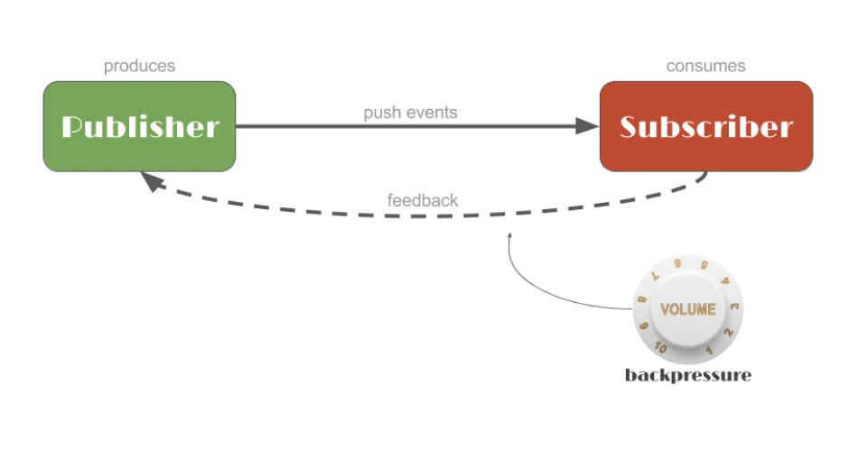
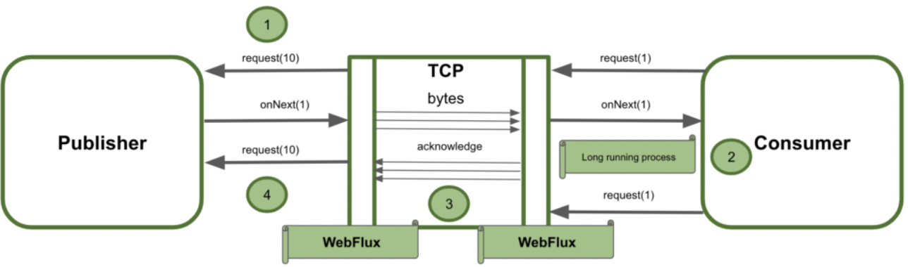

## Reactor
- *참고: http://www.reactive-streams.org/*
- *참고: https://github.com/reactive-streams/reactive-streams-jvm*
- *참고: https://tech.io/playgrounds/929/reactive-programming-with-reactor-3/Intro*

### 개요
- **특징**
  - 선언적 + 비동기/논블로킹 프로그래밍 방식
  - Consumer에게 Event를 Push하면 이를 비동기/논블록 방식으로 처리
  - Callback + Future의 대체

- **표준**
  - 다음과 같은 Interface를 구현해 사용할 것
  1. Publisher
    ```java
    // Subscriber를 전달하여 Event를 발생시킴
    public interface Publisher<T> { 
        void subscribe(Subscriber<? super T> s);
    }
    ```
  2. Subscriber
    ```java
    // Subscription을 받아 실제 이벤트 실행하도록 함
    public interface Subscriber<T> {
        void onSubscribe(Subscription s);
        void onNext(T t);
        void onError(Throwable t);
        void onComplete();
    }
    ```
  3. Subscription
    ```java
    // Subscription이 등록이 되면 request를 통해 Data 몇개 처리할 수 있도록 BackPressure 설정
    public interface Subscription {
        void request(long n);
        void cancel();
    }
    ```
  4. Processor 
    ```java
    public interface Processor<T, R> extends Subscriber<T>, Publisher<R> {
    }
    ```
  - 
    - Publisher가 데이터를 제공해줌 -> 해당 데이터가 이벤트로 발행됨
    - Publisher는 subscribe를 통해 Subscriber에게 이벤트를 등록하기 전까진 아무것도 안함
    - Subscriber는 해당 이벤트를 subscribe하게되면 비동기적으로 이를 처리하게 됨
      - Kas를 한번 봐볼까? Consumer 함수형 인터페이스를 subscribe()에 전달하게 되면 Mono 내부에서 다음 로직이 실행됨
      - 안에서 LambdaMonoSubscriber가 생성되는 것을 알 수 있음
      ```java
      public final Disposable subscribe(
           @Nullable Consumer<? super T> consumer,
           @Nullable Consumer<? super Throwable> errorConsumer,
           @Nullable Runnable completeConsumer,
           @Nullable Context initialContext) {
           return subscribeWith(new LambdaMonoSubscriber<>(consumer, errorConsumer, completeConsumer, null, initialContext));
      }
      ```

### Flux & Mono
- **Flux**
  - Publisher의 구현체
  - O~N개의 T타입을 보낼 수 있음
    - onNext() -> onComplete()/onError()
  - 팩터리 메서드로 생성, 인스턴스 메서드로 비동기 파이프라인 구축

- **Mono**
  - Publisher의 구현체
  - 0~1개의 T타입 보냄

### StepVerifier
- Publisher를 Subscribe 테스트하여 원하는 대로 동작하는지를 검증함
- VirtualTime 등을 통해 시간이 지난 것 역시 가상으로 테스트할 수 있음

### Transform
- map을 활용해 해당 Publisher의 데이터들을 바꿔줄 수 있도록 구현
- flatMap을 활용하면 Publisher<U\>를 반환하여 보다 더 비동기적 처리 구현

### Merge
- 여러개의 Publisher를 조합해 Flux를 만든다
  - flux1.mergeWith(flux2)
  - flux1.concat(flux2)
  - Flux.concat(mono1, mono2)

### BackPressure
- 
- Subscriber안에서 어느정도의 데이터를 받을지 지정할 수 있음 -> 이를 BackPressure
  - 송신측의 데이터양을 수신측에서 감당할 수 있을 만큼 받을것!
  - BackPressure를 직접 정의하여 (Subscription의 request(n)) 몇개를 한큐에 받을지 지정할 수 있음

### 궁금증
- **Flux가 Publisher면, 이를 처리해주는 Worker Thread는 누구지?**
  - Flux가 비동기적인 로직이 없으면 그냥 main 쓰레드에서 동기적으로 동작하네?
  ```java
  public static void main(String[] args) throws InterruptedException {
      String currentThread = Thread.currentThread().getName();
      System.out.println("currentThread = " + currentThread);
      Flux<Integer> flux = Flux.range(0, 5);
      flux.doOnNext(v -> {
          System.out.println(v);
          System.out.println(Thread.currentThread().getName());
      }).subscribe();
  }
  
  /*
  currentThread = main
  0
  main
  1
  main
  2
  main
  3
  main
  4
  main
   */
  ```
  - Flux가 직접 비동기적인 로직을 물고 있으면 비동기 쓰레드에서 동작함. 
  ```java
  public static void main(String[] args) throws InterruptedException {
      String currentThread = Thread.currentThread().getName();
      System.out.println("currentThread = " + currentThread);
      Flux<Long> flux = Flux.interval(Duration.ofMillis(100)).take(4);
      flux.doOnNext(v -> {
          System.out.println(v);
          System.out.println(Thread.currentThread().getName());
      }).subscribe();
  
      Thread.sleep(200);
  }
  
  /* 결과
  currentThread = main
  0
  parallel-1
  1
  parallel-1
   */
  ```

- **Kas 모듈에서 Event 처리해주는 Thread는 별도인가?**
  - 아래 코드를 실행해보자
  ```java
  public Map<String, TokensResponse> findAllTokensOwnedByUser(List<String> contractAddresses, String userKlaytnAddress) {
      Map<String, TokensResponse> tokensResponses = new ConcurrentHashMap<>();
      CountDownLatch countDownLatch = new CountDownLatch(contractAddresses.size());
  
      String outThread = Thread.currentThread().getName();
      System.out.println("outThread = " + outThread);
  
      for (String contractAddress : contractAddresses) {
          Mono<TokensResponse> tokensResponseMono =
                  findTokensOwnedByUser(contractAddress, userKlaytnAddress);
          tokensResponseMono.subscribe(
                  tokensResponse -> {
                      String innerThread = Thread.currentThread().getName();
                      tokensResponses.put(contractAddress, tokensResponse);
                      countDownLatch.countDown();
                      System.out.println("innerThread = " + innerThread);
                  });
      }
  
      try {
          countDownLatch.await();
          return tokensResponses;
      } catch (InterruptedException e) {
          throw new ConnectableException(
                  HttpStatus.INTERNAL_SERVER_ERROR, ErrorType.ASYNC_HANDLING_ERROR);
      }
  }
  ```
  - 메인 쓰레드에서 벗어나 Subscription은 별도의 쓰레드에서 처리되는 것을 알 수 있음
  ```
  outThread = main
  innerThread = reactor-http-nio-3
  innerThread = reactor-http-nio-6
  innerThread = reactor-http-nio-2
  innerThread = reactor-http-nio-8
  innerThread = reactor-http-nio-7
  innerThread = reactor-http-nio-4
  innerThread = reactor-http-nio-1
  innerThread = reactor-http-nio-4
  innerThread = reactor-http-nio-7
  innerThread = reactor-http-nio-5
  ```

- **WebClient에서는 BackPressure를 어떻게 지정하지?**
  - *참고: https://www.baeldung.com/spring-webflux-backpressure*
  - WebFlux는 TCP 흐름제어를 통해 백프레셔를 구현한다. 
  - 하지만 Consumer가 받을 수 있는 만큼 logical element를 핸들하지 않음
    - WebFlux는 TCP를 통해 이벤트 전송/수신 하기 위해 이벤트를 바이트로 변환
  - Spring WebFlux는 이상적으로 백프레셔 조절하지 않는다. 
    - Consumer/Publisher 각각 같은 방식으로 조절
  - 
