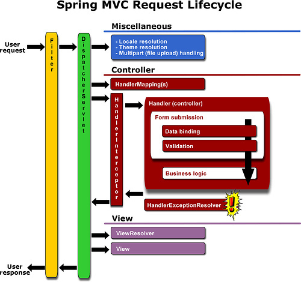
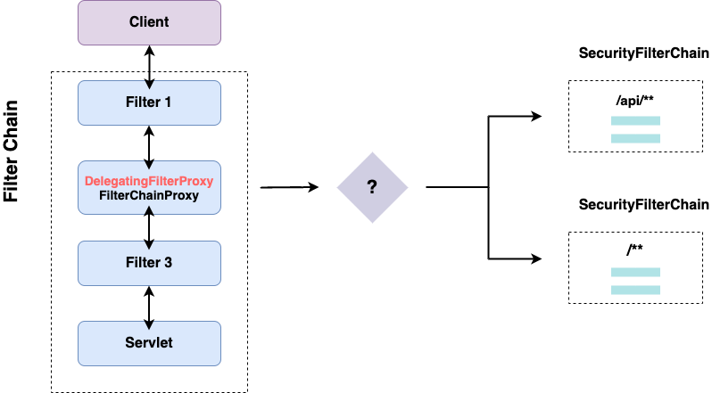
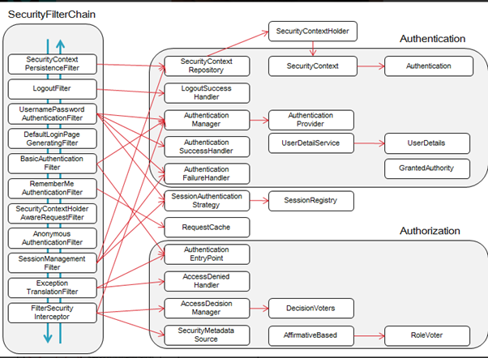
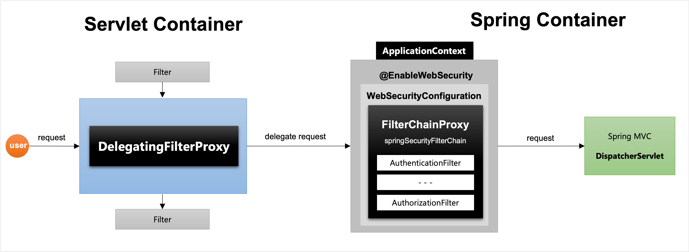
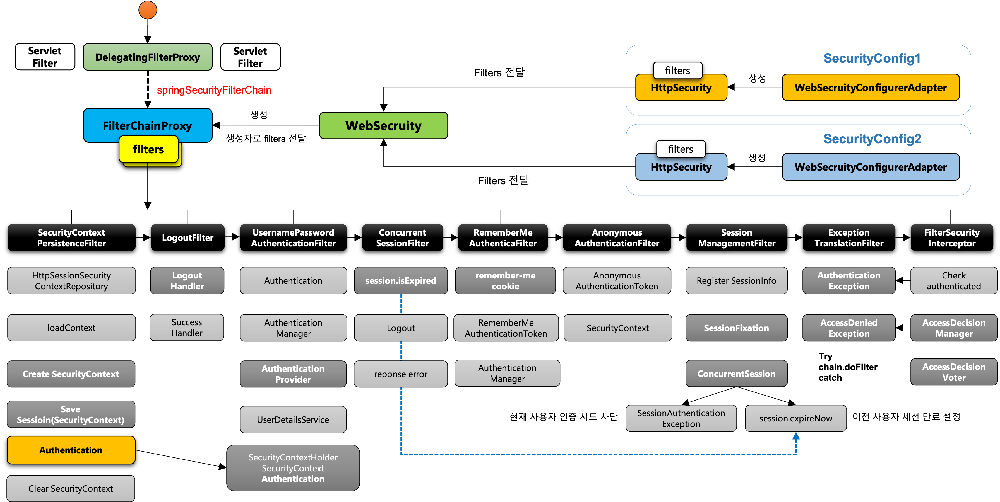

## Spring Security

### 인증과 인가
- *참고: https://www.okta.com/kr/identity-101/authentication-vs-authorization/*
- **인증 (Authentication)**
  - 사용자의 신원을 검증하는 행위
  - 비밀번호/일회용 핀/인증 앱/생체인식
  - 자격 증명 확인
  - 내가 누군지 식별하고, 입증하는 과정

- **인가 (권한 부여) (Authorization)**
  - 사용자에게 특정 리소스나 기능에 액세스할 수 있는 권한을 부여
  - 액세스 제어나 클라이언트 권한을 서로 대체하여 사용되기도 함
  - 권한 허가/거부
  - 인증이 완료된 사용자의 권한을 설정하는 과정

### Spring Security가 뭔데? 
- *참고: https://spring.io/projects/spring-security*
- *참고: https://jiwondev.tistory.com/203?category=891823*
- **개요**
  - 강력하고, 커스텀이 가능한 인증/인가 프레임워크
  - 특징
    - 인증/인가 확장 지원
    - Session Fixation, Clickjacking, CSRF 등에 대한 보호
    - 서블릿 API 통합
    - Spring Web MVC와 통합

- **서블릿 & 필터**
  - 인증/인가 담당 코드를 기존의 서비스 로직과 작성하는 것은 좋지 않음 => 관심사의 분리 필요함
  - 서블릿 2.3 부터 필터라는 개념이 도입되었고, 필터에서 Request/Response 조작 할 수 있었음
    - 요청이 서블릿에 도달하기 전에 (Spring에서는 DispatcherServlet) 필터체인을 거치면서 인증/인가 뚝딱
  - 스프링에서 필터
    - 스프링부트에서는 implements Filter를 통해 필터 객체를 구현하자!

- **스프링 인터셉터**
  - 인터셉터는 스프링 MVC에서만 제공하는 기능
  - Dispatcher Servlet에서 컨트롤러에 가기전에 실행됨 
  - 요청 흐름도
    - HTTP 요청 => WAS => 필터 => 서블릿(Dispatcher Servlet) => 스프링 인터셉터 => 컨트롤러
  - preHandle/postHandle/afterCompletion 요청으로 처리

- **서블릿 vs 인터셉터**
  - WebApp 전역적으로 처리해야하는 기능은 **필터**로!
  - 클라이언트에 들어오는 디테일한 처리는 **인터셉터**로!
  - 

- **그러면 스프링이 필터는 어떻게 건드리는거임?**
  - 스프링에서 "DelegationFilterProxy"를 통해 ApllicationContext와 서블릿 요청을 연결한다
  - DelegationFilterProxy를 통해 스프링 빈으로 구현한 필터를 등록 => 이는 서블릿 표준 필터처럼 동작함!
    - 

- **그래서 다시,,, Spring Security란?**
  - 스프링을 기반으로 한 보안 프레임워크
  - 자체적으로 세션 체크, 리다이렉트하던것을 추상화하여 구현
  - 스프링 의존성을 없애기 위해 Filter 기반 동작
  - Spring MVC, 비즈니스 코드와 무관하게 동작할 수 있음
  - Security Filter Chain을 통해서 개발자들이 직접 만들어야할 필터 중 10개 이상을 기본으로 제공해줌
    - 

### Spring Security 아키텍쳐


- *참고: https://jiwondev.tistory.com/244*
- *참고: https://jiwondev.tistory.com/245*
- *참고: https://jiwondev.tistory.com/246*
- **Servlet Container**
  - Request를 받고 Filter 여러개를 거치게 됨
  - 그 중 DelegatingFilterProxy에서 스프링 스큐리티의 설정들이 처리가 됨
    - 요 필터가 Spring Container 측에 위임이 됨
    - 이렇게 하는 이유는 스프링의 기술 (IoC/AOP) 등이 인가/인증 처리에 필요하기 때문
    - Spring Bean에게 요청을 위임하여 Spring Filter를 태움
      - 서블릿 필터는 스프링에서 정의된 빈을 주입해서 사용할 수 없음
      - 특정 이름을 가진 스프링 빈을 찾아 그 빈에게 요청을 위임
        - springSecurityFilterChain 이름으로 생성된 빈을 ApplicationContext에서 찾아 요청을 위임
          1. springSecurityFilterChain의 이름으로 생성되는 필터 빈
             - WebAsyncManagerIntegrationFilter
             - SecurityContextPersistenceFilter
             - HeaderWriterFilter
             - CsrfFilter
             - LogoutFilter
             - UsernamePasswordAuthenticationFilter
             - DefaultLoginPageGeneratingFilter
             - DefaultLogoutPageGeneratingFilter
             - ConcurrentSessionFilter
             - RequestCacheAwareFilter
             - SecurityContextHolderAwareRequestFilter
             - AnonymousAuthenticationFilter
             - SessionManagementFilter
               - 하나의 계정당 몇개의 세션까지 허용할 것인가? 
               - 계정당 3대만 사용가능 이런 정책 보다 쉽게 가능
             - ExceptionTranslationFilter
             - FilterSecurityInterceptor
          2. DelegatingFilterProxy로 부터 요청을 위임받고 실제 보안 처리
          3. 스프링 시큐리티 초기화 시 생성되는 필터들을 관리하고 제어
             - 스프링 시큐리티 초기화 시 생성되는 필터들을 관리하고 제어
             - 설정 클래스에서 API 추가 시 생성되는 필터
          4. 사용자의 요청을 필터 순서대로 호출하여 전달
          5. 사용자 정의 필터를 생성하서 기존의 필터 전/후로 추가 가능
             - 필터의 순서를 잘 정의할 것
          6. 마지막 필터까지 인증/인가 예외 발생 안하면 보안 통과
        - 실제 보안 처리 x

- **Spring Container**
  - Application Context 안에서 구동
  - `@EnableWebSecurity`를 통해 구동
  - WebSecurityConfigurerAdapter에서 모든 초기화가 진행됨
    - FilterChainProxy에서 springSecurityFilterChain 진행
      - FilterChainProxy가 요청을 filter들에게 전달하면서 실제 인증/인가 처리
    - HttpSecurity
      - 인증 API
        - http.formLogin()
        - http.logout()
        - http.csrf()
        - http.httpBasic()
        - http.SessionManagement()
        - http.RememberMe()
        - http.ExceptionHandling()
        - http.addFilter()
      - 인가 API
        - http.authorizeRequest()
        - .antMatchers("/admin")
        - .hasRole(USER)
        - .permitAll()
        - .authenticated()
        - .fullyAuthenticated()
        - .access(hasRole(USER))
        - .denyAll()
  - SecurityContext / SecurityContextHolder
    - SecurityContext
      - Authentication 객체가 저장되는 보관소로 필요시 언제든지 Authentication 객체를 꺼내어 쓸 수 있도록 제공되는 클래스
      - ThreadLocal에 저장되어 아무곳에서나 참조될 수 있도록 설계됨
        - 어차피 인증/인가를 거친 쓰레드가 계속 서블릿 안으로 들어가서 Rest 처리할 거니까 해당 쓰레드의 변수로 넣어두는 듯!
      - 인증이 완료되면 HttpSession에 저장되어 어플리케이션 전반에 걸쳐 전역적인 참조가 가능
    - SecurityContextHolder
      - SecurityContext 객체 저장방식
        - MODE_THREADLOCAL: 스레드당 SecurityContext 객체를 할당. 기본값
        - MODE_INHERITABLETHREADLOCAL: 메인 스레드와 자식 스레드에 관하여 동일한 Security Context 유지
        - MODE_GLOBAL: 응용 프로그램에서 단 하나의 SecurityContext 저장
      - SecurityContextHolder.clearContext(): SecurityContext 기존 정보 초기화



### Spring Security 예외처리
- *참고: https://blog.naver.com/PostView.nhn?blogId=qjawnswkd&logNo=222303477758*
- **개요**
  - Spring Security는 인증/인가 실패시 FilterSecurityInterceptor가 2가지의 예외를 발생시킴

- **인증/인가 예외처리 방식**
  1. 인증
    - 인증 예외가 생기면 **AuthenticationException**을 호출시킴
    - AuthenticationEntryPoint 인터페이스로 커스텀이 가능함
    ```java
    @Component
    @RequiredArgsConstructor
    public class JwtAuthenticationEntryPoint implements AuthenticationEntryPoint {
        private final ObjectMapper objectMapper;
        
        @Override
        public void commence(HttpServletRequest request, HttpServletResponse response, AuthenticationException authException) {
            sendErrorResponse(response, "인증 실패");
        }
        
        private void sendErrorResponse(HttpServletResponse response, String message) {
            response.setCharacterEncoding("utf-8");
            response.setStatus(HttpStatus.UNAUTHORIZED.value());
            response.setContentType(MediaType.APPLICATION_JSON_VALUE);
            response.getWriter().write(objectMapper.writeValueAsString(Response.builder()
                .status(HttpStatus.FORBIDDEN.value())
                .message(message)
                .build()));
        }
    }
    ```
  2. 인가
    - 인가 예외가 생기면 **AccessDeniedException**을 호출시킴
    - AccessDeniedHandler 인터페이스로 커스텀 가능
    ```java
    @Component
    @RequiredArgsConstructor
    public class JwtAccessDeniedHandler implements AccessDeniedHandler {
        private final ObjectMapper objectMapper;
        
        @Override
        public void handle(HttpServletRequest request, HttpServletResponse response, AccessDeniedException accessDeniedException) {
            sendErrorResponse(response, "권한이 없습니다");
        }
        
        private void sendErrorResponse(HttpServletResponse response, String message) {
            response.setCharacterEncoding("utf-8");
            response.setStatus(HttpStatus.FORBIDDEN.value());
            response.setContentType(MediaType.APPLICATION_JSON_VALUE);
            response.getWriter().write(objectMapper.writeValueAsString(Response.builder()
                .status(HttpStatus.FORBIDDEN.value())
                .message(message)
                .build()));
        }
    }
    ```

- **설정 등록**
  - SpringConfig에서 exceptionHandling() 뒤에 장착해둘 것!
    ```java
    @Override
    protected void configure(HttpSecurity http) {
        http.httpBasic().disable()
            .csrf().disable()
            .sessionManagement()
            .sessionCreationPolicy(SessionCreationPolicy.STATELESS)
            .and()
            .addFilterBefore(new JwtFilter(jwtProvider, objectMapper), UsernamePasswordAuthenticationFilter.class)
            .exceptionHandling()
            .accessDeniedHandler(jwtAccessDeniedHandler)
            .authenticationEntryPoint(jwtAuthenticationEntryPoint);
    }
    ```