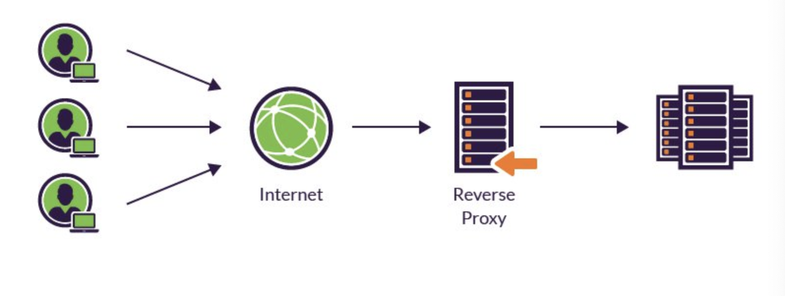

### 2023-09-11

## Proxy
*참고: https://coding-start.tistory.com/342*
*참고: https://bcp0109.tistory.com/194*
- **Proxy**
  - 클라이언트가 자신을 통해 다른 네트워크 서비스에 간접적으로 접속할 수 있게 해주는 컴퓨터 시스템이나 응용 프로그램
  - 클라 <-> 서버의 중계기로, 통신을 대리로 수행
  - 프록시 서버 주우 일부는 프록시 서버에 요청된 내용을 캐시를 활용해 저장
    - 캐시안에 있는 정보를 요구하는 요청은 프록시가 반환하게 설계할 수도 있음

- **Proxy with HTTP...**
  - 클라이언트 <--> 프록시 서버 <--> 서버
  - 클라의 모든 HTTP 요청 받아 서버로 전달
  - 프록시 서버가 클라이언트를 대신하여 서버에 접근하는 역할
  - 프록시 서버는 주로 보안을 위해 사용됨
    - 모든 웹 트래픽 흐름속에서 중개자 역할
    - 요청/응답 필터링
    - 회사 내부망에서 외부로 요청 보낼 때 이게 신뢰할만한 요청인지를 확인
      - 회사 내부정책에서 인가한 서버만 접속 가능토록

- **Proxy Server 종류**
  - Caching Proxy Server
    - 이전 클라 요청/응답 저장했다가 동일한 요청 들어오면 저장된 컨텐츠 전송
    - 높은 트래픽 대응 가능
    - 비용 절감도 가능
  - Web Proxy
    - 웹 트래픽에 초점이 맞춰짐
    - Web Cache
    - 서로 다른 컨텐츠에 대한 변환
  - Forward Proxy
    - 클라가 인터넷에 직접 접근하지 않고, 포워드 프록시 서버가 요청을 받고 -> 인터넷 연결하고 -> 결과를 클라에게 전달
    - Caching 해둬서 자주 사용하는 데이터는 요청 보내지 않고 가져올 수 있어 성능 향상 가능
    - 
  - Reverse Proxy
    - 클라에서 데이터 요청하면, 리버스 프록시가 요청을 받고 -> 내부 서버에서 데이터 받고 -> 그 결과를 클라에게 전달 
    - 로드 밸런싱, 서버 확장에 유리
    - 
  - ex)Nginx도 프록시서버라고 볼 수 있음. 캐시/포워드 프록시/리버스 프록시 가능

## Gateway
- **Gateway**
  - 컴퓨터 네트워크에서 서로 다른 통신망, 프로토콜을 사용하는 네트워크 간의 통신을 가능하게 하는 컴퓨터나 소프트웨어를 일컫는 용어
  - 다른 네트워크로 들어가는 입구 역할을 하는 네트워크 포인트
  - 다른 네트워크 간의 통로의 역할을 하는 장치
  - 게이트웨이 지날때 마다 트래픽 증가하기에 속도 느려질수도
  - 공항 게이트웨이 같은 감성
  - 네트워크 상 다른 통신망/통신프로토콜 적절히 변환해주는 역할

- **Gateway 특징**
  - 클라 <-> 서버간 통신 중개자 역할을 수행하긴 하지만, 용도가 조금 다름
  - HTTP 프로토콜을 다른 프로토콜로 변환하기 위해 사용
  - 게이트웨이는 언제나 리소스를 자기가 들고 있는 것 마냥 행동
  - HTTP <-> FTP 등의 프로토콜 변환도 지원

## 전용선