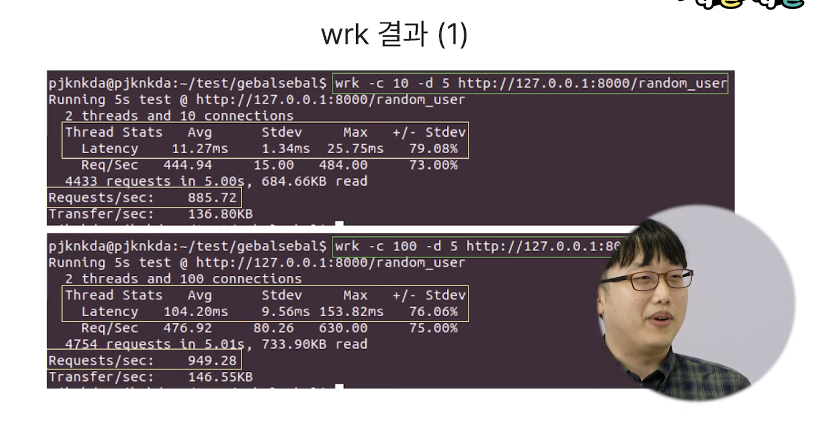
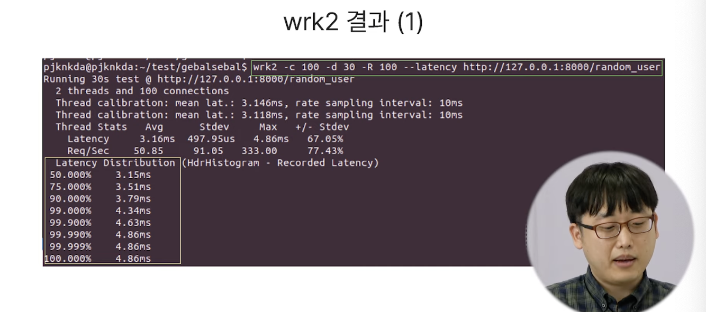
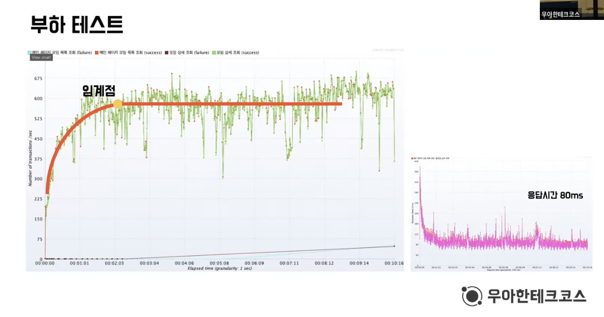
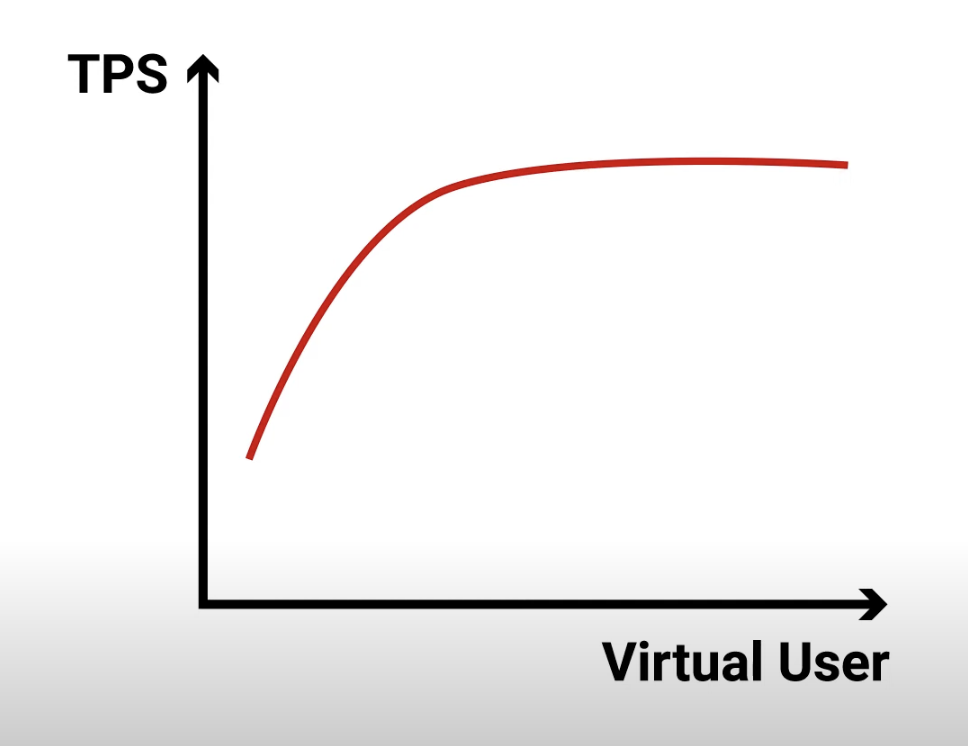

### 2023-09-12

## 성능테스트
*참고: https://www.youtube.com/watch?v=IcSdPhxCn9Y*
*참고: https://techblog.woowahan.com/2572/*
*참고: https://www.youtube.com/watch?v=Ovcy02QFt9c*
*참고: https://www.youtube.com/watch?v=JJJ4LReZ5q4*
*참고: https://www.whatap.io/ko/blog/63/*
*참고: https://www.youtube.com/watch?v=UqZBqs1Yle8*
- **성능**
  - Latency : 클라의 입장에서 완료까지 얼마나 걸리는가
    - 차들이 빠르게 지나다닐 수 있어
  - Throughput: 서버의 입장에서 시간당 얼마나 요청을 처리할 수 있는가
    - 도로가 넓어서 차들이 많이 지나다닐 수 있어

- **wrk이라는 파이썬 툴...**
  - [wrk] => 얼마나 처리할 수 있는가? + 그때 Latency는 얼마인가? (서버가 몇 명의 Request를 처리할 수 있는가?)
    - 
    - .png)
    - Scenario #1
      - 10개의 Connection, 5초의 Duration
      - 평균 10ms의 응답속도 (Latency)
    - Scenario #2
      - 100개의 Connection, 5초의 Duration
      - 평균 100ms의 응답속도 (Latency)
    - Scenario #3
      - 100개의 Connection, 5초의 Duration with latency 분포도
      - 99%가 몇 ms 걸렸는지 파악 가능
    - 해당 정보는 서버의 한계치를 알 수는 있으나, 동시에 숫자를 몇 명 받을 수 있냐에 대한 정보는 줄 수 없음
  - [wrk2] => 얼마나 처리하는지를 고정하고 + 그때 Latency는 얼마인가? (몇 명의 Request가 발생한 경우, 한 명 당 얼마나 쾌적한가?)
      - 
      - .png) 
    - Scenario #1
      - 100개의 Connection, 1초에 100개씩 Request: 3~4ms의 응답시간 (Latency)
    - Scenario #2
      - 100개의 Connection, 1초에 1000개씩 Request: 930ms~1000ms 응답시간 (Latency)
    - Request 10배 밀도 -> 성능은 300배 느려짐

- **성능테스트**
  - 부하 테스트: 병목 현상 확인하고 "목표치까지 개선"하는 것이 목적
    - 
  - 스트레스 테스트: "과부하 상태에서 어떻게 동작"하고 확 인하고 개선하는 것이 목적

- **Little's Law**
  - Concurrent User = TPS X (Response Time + Think Time)
  - Virtual User = TPS X (Response Time + Think Time)
  - Ramp Up Test : 서서히 사용자를 늘리는 구조
    - 
  - 네트워크 환경 자체에서 병목이 발생하면 사실 좋은 환경에서 테스트가 되고 있다고 보기 어려워
    - Think Time 자체가 늘어나는 형식의 테스트 결과를 받는다면, 환경이 잘못되어있다고 봐야함

- **성능테스트 과정**
  1. 성능테스트 시나리오 구상
     - 시스템의 어느 부분에 어떻게 부하를 줄 것인지 결정
     - 부하 상황에서 시스템의 동작 예측
     - 테스트에 필요한 데이터를 준비할 것
  2. 테스트 환경 구축
     - 서버 수, 서버 스펙 결정
     - Scale Up? Scale Out?
  3. 성능테스트 생성 및 수행 
     - 준비된 시나리오에 따라 실제 요청 발생
  4. 테스트 결과 지표 관측 및 기록
     - 부하 상황에서 모니터링 보드 지표 관측 및 기록
  5. 테스트 결과 분석
     - 요청을 잘 처리 하는지
     - 시스템이 기대하던 대로 동작하였는지

- **성능테스트 과정을 보다보면...**
  - 자동화가 가능한 부분 (파이프라인 구조) : 2. 테스트 환경 구축 -> 3. 성능테스트 생성 및 수행 -> 4. 테스트 결과 지표 관측 및 기록
  - 개발자의 노력이 필요한 부분 : 1. 성능테스트 시나리오 구상, 5. 테스트 결과 분석

- **성능테스트를 통해...**
  - 다양한 시나리오에 대한 테스트를 수행하고 기록하여 자산으로 남길 것
  - 장애 상황에 대해 기록하고, 시뮬레이션을 해둘 것
