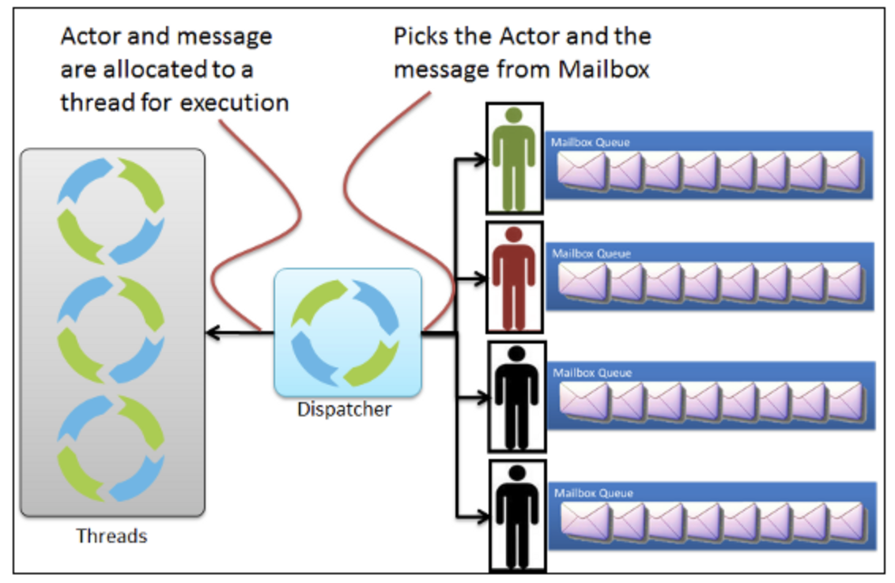

### 2023-09-26

## 레디스 병목
*참고: https://geekcoders.tistory.com/entry/%EB%A0%88%EB%94%94%EC%8A%A4-%EC%9A%B4%EC%98%81-%EC%8B%9C-%EA%B3%A0%EB%A0%A4%EC%82%AC%ED%95%AD*
- **임계점**
  - 좋은 서버라도 장치 한 대의 성능에 한계가 분명함
  - [CPU]
    - 데이터 저장/조회에 단일 스레드 
    - 멀티코어 성능 최대한 끌어내기 위해 인스턴스 여러개 실행하는 것도 방법
      - ex) 8코어 시스템에 레디스 인스턴스 8개
  - [메모리]
    - 인메모리에 데이터를 저장하기에 메모리 크기 지정이 성능과 밀접한 관련있음
    - redis.config의 maxmemory
    - 스왑 영역이 충분치 않으면 메모리 동작 중인 프로세스 제거해 메모리 영역 확보
    - 스왑 영역을 레디스가 사용하게 되면 성능 수백배 느려짐
  - [네트워크]
    - 복제 위한 마스터/슬레이브 간 데이터 전송과 네트워크 단절에 의한 데이터 

## Akka Dispatcher 성능 튜닝
*참고: https://helloino.tistory.com/93*  
*참고: https://blog.naver.com/kbh3983/221142958800*  
*참고: https://doc.akka.io/docs/akka/current/typed/dispatchers.html*  
- **개요**
  - 대부분의 성능이 I/O (Network, File)로 인해 느려진다
  - Akka Dispatcher를 통해 성능 튜닝을 할 수 있다

- **디스패처란?**
  - 쓰레드 풀에서 실행 가능한 쓰레드를 가져다가 처리할 메시지와 함께 액터에 전달하여 액터가 동작하도록 하는 엔진
  - 디스패처 설정을 통해 디스패처가 사용할 쓰레드 풀 관련 설정, 메일박스 설정 할 수 있음
  - 어떻게 쓰레드와 메일박스를 처리할지에 따라 디스패처 종류도 나뉨
    - Default Dispatcher
      - 
      - 디폴트 디스패처가 액터와 메일박스로 부터 메시지를 고름
      - 액터와 메시지가 쓰레드에 실행을 위해 할당됨
    - Pinned Dispatcher
      - 
      - 핀드 디스패처가 액터와 메일박스로 부터 메시지를 고름
      - 액터와 메시지가 지정된 쓰레드에 실행을 위해 각각 할당됨
    - Balancing Dispatcher
      - 
      - 모든 액터가 같은 메일 박스 사용
      - 밸런싱 디스패처가 메일박스에서 메시지를, 액터를 고름
      - 액터와 메시지가 쓰레드에 실행을 위해 할당됨

- **Default Dispatcher**
  - actor-system이 가지고 있는 기본 Dispatcher
  - 대부분 케이스 성능이 좋은 fork-join-executor를 사용

- **Dispatcher 종류**
  - Dispatcher : ThreadPoolExecutor로는 fork-join-executor, thread-pool-executor가 있음
  - Pinned Dispatcher : Actor 1개당, 하나의 Thread-pool을 제공하는 디스패처. File, Network I/O에서 활용

- **Actor Dispatcher 세팅**
  ```
  my-dispatcher {
    type = Dispatcher                 # 이벤트 기반의 디스패처
    executor = "fork-join-executor"   # fork-join-executor를 ExecutionSerivce로 사용할게요
    fork-join-executor {              # Fork-Join pool 설정하기
      parallelism-min = 2             # 최소 쓰레드 수
      parallelism-factor = 2.0        # 병렬 쓰레드 (가능한 프로세서 * 팩터 수치)
      parallelism-max = 10            # 최대 쓰레드 수
    }
    throughput = 100                  # 다른 액터로 넘어가기 전에 처리할 메시지 최대 갯수. 1이 가장 균등 분배
  }
  ```
  
- **코드 레벨 셋업**
  ```
  ActorRef myActor = system.actorOf(Props.create(MyActor.class), "myactor")
  ActorRef myActor = system.actorOf(Props.create(MyActor.class).withDispatcher("my-dispatcher"), "myactor3")
  ```
  ```
  akka.actor.deployment {
    /myactor {
      dispatcher = my-dispatcher
    }
  }
  ```
  
- **서비스 로직이 Blocking인 경우 + 병목이라면...**
  - Blocking...
    - I/O 로직 (네트워크, File I/O)
    - 외부 서비스와의 연동 (REST API)
    - DB 접근 (MySQL)
  - 이 경우, default-dispatcher를 사용한다면...
    - Blocking 처리하고 있는 Actor가 하나의 Thread Pool 차지하기에 다른 Actor가 실행되지 않는 문제 발생할 수 있음
  - **따라서 => Blocking 되는 서비스 로직은 다른 디스패처를 사용하자**
  - **Blokcing이 있는 Actor 자체를 다른 Dispatcher로 활용**

### 복습해보는 Akka...
