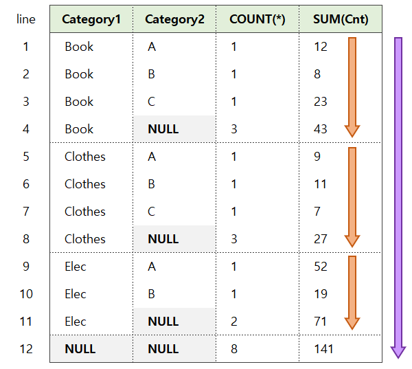

### 2023-10-17

## MySQL ROLLUP
*참고: https://prinha.tistory.com/entry/MySQL-WITH-ROLLUP-%ED%95%AD%EB%AA%A9%EB%B3%84-%ED%95%A9%EA%B3%84%EC%97%90-%EB%8C%80%ED%95%9C-%EC%A0%84%EC%B2%B4-%ED%95%A9%EA%B3%84-%EA%B5%AC%ED%95%98%EA%B8%B0*
*참고: https://yahwang.github.io/posts/31*
*참고: https://johoonday.tistory.com/195*
- **개요**
  - SQL에서 소계, 합계 계산에 유용한 기능 제공
  - 그룹별로 합계를 한 번에 구할 때 사용
  - GROUP BY 절과 함께 사용되는 총합 또는 층간 합계 함수
  - GROUP BY를 사용하면 GROUP BY 뒤에 나오는 칼럼별로 합계를 구해주는데, 항목별 합계에 전체 합계가 같이 나오게 하는 것
  - GROUP BY에서 선택한 기준에 따라 합계가 구해짐
  - ROLLUP을 통해 GROUP들의 각각의 분류에 대한 Data를 확보할 수 있음

- **TIPS**
  - `COALESCE`를 활용하면 원하는 텍스트를 넣을 수 있음
    - ROLLUP은 집계한 기준값을 NULL로 대체하는데
    - MySQL에서는 IFNULL로 대체 가능함

- **예시 1**
  1. WITH ROLLUP
    ```mysql
    SELECT SUBSTRING(address, 1, 2) as region, gender, COUNT(*)
    FROM member
    GROUP BY region, gender WITH ROLLUP
    ORDER BY region ASC, gender DESC;
    ```
  2. HAVING 컬럼 IS NOT NULL
    ```mysql
    SELECT SUBSTRING(address, 1, 2) as region, gender, COUNT(*)
    FROM member
    GROUP BY region, gender WITH ROLLUP
    HAVING region IS NOT NULL
    ORDER BY region ASC, gender DESC;
    ```

- **예시 2**
  ```mysql
  CREATE TABLE price (
      Category1 VARCHAR(10),
      Category2 VARCHAR(10),
      Cnt INT
  );
  
  INSERT INTO price VALUES
        ('Book', 'A', 12),
        ('Book', 'B', 8),
        ('Book', 'C', 23),
        ('Clothes', 'A', 9),
        ('Clothes', 'B', 11),
        ('Clothes', 'C', 7),
        ('Elec', 'A', 52),
        ('Elec', 'B', 19);
  
  SELECT Category1, Category2, COUNT(*), SUM(Cnt)
  FROM price
  GROUP BY Category1, Category2 WITH ROLLUP;
  ```
  - 

- **MySQL ROLLUP 적용 전/후, COALESCE 적용**
  - 적용 전 : `SELECT country, product, sum(profit) FROM sales GROUP BY country, product;`
    ```
    |  country  |    product      |  sum(profit)  |
    ------------------------------------------------
    |  FINLAND  |    Computer     |     1500      |
    |  FINLAND  |    Phone        |     110       |
    |  INDIA    |    Calculator   |     150       | 
    |  INDIA    |    Computer     |     1200      |
    |  USA      |    Calculator   |     125       |
    |  USA      |    Computer     |     4200      |
    |  USA      |    TV           |     250       |
    ```
  - 적용 후 : `SELECT country, product, sum(profit) FROM sales GROUP BY country, product WITH ROLLUP;`
    ```
    |  country  |    product      |  sum(profit)  |
    ------------------------------------------------
    |  FINLAND  |    Computer     |     1500      |
    |  FINLAND  |    Phone        |     110       |
    |  FINLAND  |    NULL         |     1610      |
    |  INDIA    |    Calculator   |     150       | 
    |  INDIA    |    Computer     |     1200      |
    |  INDIA    |    NULL         |     1350      |
    |  USA      |    Calculator   |     125       |
    |  USA      |    Computer     |     4200      |
    |  USA      |    TV           |     250       |
    |  USA      |    NULL         |     4275      |
    |  NULL     |    NULL         |     7535      |
    ```
  - COALESCE 적용
    ```mysql
    SELECT COALESCE(country, "ALL countries") as country,
           COALESCE(product, "ALL products") as product,
           sum(profit) FROM sales GROUP BY country, product WITH ROLLUP;
    ```
    ```
    |  country        |    product         |  sum(profit)  |
    --------------------------------------------------------
    |  FINLAND        |    Computer        |     1500      |
    |  FINLAND        |    Phone           |     110       |
    |  FINLAND        |    ALL products    |     1610      |
    |  INDIA          |    Calculator      |     150       | 
    |  INDIA          |    Computer        |     1200      |
    |  INDIA          |    ALL products    |     1350      |
    |  USA            |    Calculator      |     125       |
    |  USA            |    Computer        |     4200      |
    |  USA            |    TV              |     250       |
    |  USA            |    ALL products    |     4275      |
    |  ALL countries  |    ALL products    |     7535      |
    ```
  
