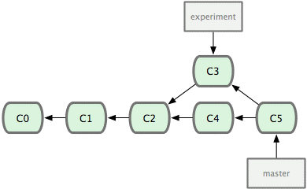

### 2023-06-12

## Git pull/merge/rebase
*참고: https://unordinarydays.tistory.com/161*
- **git pull**
  - git pull == git fetch + git merge

- **git merge**
  - 통상적인 merge는 history가 가시적이긴 하더라도 branch가 많아질수록 알아보기 어려움
  - 

- **git rebase**
  - master 브랜치를 Fast-Forward 시킴
  - master 브랜치 포인터는 최신 커밋으로 이동
  - 

### ExecutionContext
*참고: https://hamait.tistory.com/768*
- **개요**
  - 쓰레드 관련한 작업을 도와드려요!
    - 자바에서도 Executor와 ExecutorService를 제공하는데...
      - Executor: Runnable 타입을 내부 쓰레드풀을 이용해 실행
      - ExecutorService: Executor의 서브 인터페이스, 라이프사이클 관리 + Future + Callable
    - 스칼라에서는 이를 보강한 ExecutionContext를 제공
  - ExecutionContext는 스칼라의 low-level 동시성 도구
    - future, callback, concurrent 작업을 잘 처리하기 위함
    - 기저에 있는 thread pool 및 execution 리소스를 관리하여 제어된 방식으로 태스크가 수행되게 하기 위함

- **ExecutionContext**
  1. 두 개의 추상메서드가 있어요: execute, reportFailure
  ```scala
  trait ExecutionContext {
    def execute(runnable: Runnable): Unit
    def reportFailure(@deprecatedName("t") cause: Throwable): Unit
  }
  ```
  2. ExecutorContext에는 Java Executor/ExecutorService에서 ExecutorContext 인스턴스를 만들 companion 객체가 있다
  3. ExecutorContext companion 객체에서 내부적으로 ForkJoinPool 인스턴스 사용하는 global 기본 시랭 컨텍스트 포함

- **특징**
  1. Execution Model
     - `ExecutionContext`는 어떻게 태스크가 수행되는지를 정의함
     - 쓰레드 관리 및 태스크 시작/수행 작업을 추상화 시킴
  2. Thread Pool
     - `ExecutionContext`를 통해 쓰레드풀을 관리할 수 있어
     - Worker Thread를 제공해 동시적으로 태스크 처리할 수 있도록 지원
  3. Asynchronous Operation
     - `ExecutionContext`를 통해 async operation을 효율적으로 쓸 수 있어
     - 넌블러킹 방식 쌉가넝
  4. Task Execution
     - `ExecutionContext`는 `execute`라는 메서드를 가지고 있어
       - `Runnable`을 통해 태스크 수행
     - `ExecutionContext`는 schedules & runs
  5. Implicit ExecutionContext
     - 스칼라는 `ExecutionContext`를 implicit을 통해 은근 슬쩍 가져올 수 있게 도와줌
     - 명시적으로 뭘 해야할지 쓸 필요 없이 이걸로 복잡한 쓰레드 관리 뚝딱
  6. Custom ExecutionContext
     - 물론 커스텀도 가능
  7. ExecutionContext 라이브러리
     - 많은 스칼라 라이브러리들이 `ExecutionContext`를 통해서 비동기적 연산을 처리해

### ExecutionContext.Implicits.global
- **import scala.concurrent.ExecutionContext.Implicits.global**
- **개요**
  - 비동기(async)/동시(concurrent) operation 처리하기 위함
  - Scala standard library

- **ExecutionContext**
  - concurrent env 매니징 하기 위함
  - async 동작이나, future, task 스케줄링을 처리하기 위함

- **global ExecutionContext**
  - `global`은 디폴트 비동기적 실행 환경을 만들어줌
  - Scala 코드의 전방위적으로 쓰여 동시성 제어를 쉽게 도와줌
  - ExecutuinoContext

- **많이 쓰이는 이유**
  1. Simplicity
    - 간단하자나. 따로 셋업도 필요없고
    - 생성/관리 코드 명시적으로 하나 쓸 필요 없어
  2. Convenience
    - 한줄의 코드로 임포트만 해서 쓸 수 있어. 스칼라 내장 라이브러리 포함 코드라 
  3. Compatibility
    - 많은 라이브러리가 이거를 잘 활용할 수 있도록 지원해
  4. Good Defaults
    - 비동기 처리하기 딱 적당한 디폴트 값으로 지정이 되어 있어
