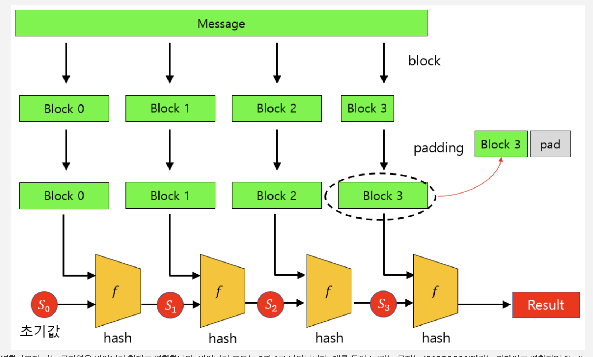

### 2023-06-14

## SHA-256 + Salt
*참고: https://steemit.com/kr/@esjung/sha-256-salt*
*참고: https://st-lab.tistory.com/100*
*참고: https://velog.io/@postlist/JAVA-SHA-256-%EC%95%94%ED%98%B8%ED%99%94-salt-%EC%82%AC%EC%9A%A9*
*참고: https://www.convertstring.com/ko/Hash/SHA256*
*참고: https://losskatsu.github.io/blockchain/sha256/#4-sha-256-%EA%B3%BC%EC%A0%95*

- **암호화와 해싱**
  - 암호화: 양방향
  - 해싱: 단방향
    - 요건 복호화가 안대요!

- **단방향 해시 함수**
  - 수학적 연산에 의해 원본 데이터를 매핑시켜 완전히 다른 암호화된 데이터로 변환시키는 것
  - 다이제스트: 해시에 의해 암호화된 데이터
    - 
  - 단방향 해시 함수의 종류들
    - SHA, SHA-256
    - MD
    - HAS
    - WHIRLPOOL

- **단방향 해시 함수 깨는 방법**
  1. 동일한 메시지는 동일한 다이제스트
     - 솔트 없이 돌린 대표적인 SHA256 암호화문은 이런 사이트에서 해독이 가능할수도 (https://crackstation.net/)
     - sha-256 rainbow table
  2. 브루트포스
     - 물론 힘든데 가능은 함
     - 생일 문제(https://namu.wiki/w/%EC%83%9D%EC%9D%BC%20%EB%AC%B8%EC%A0%9C) 보면 직관보다 겹칠 수 있는 해시 암호화 값이 우리 생각보단 흔할 수도 있다는...?

- **단방향 해시 함수 보완**
  1. 해시 함수 여러번 수행
     - SHA256 N번 돌려!
  2. Salt
     - 해시 함수 돌리기 전에 원문에 임의의 문자열을 덧붙이는 것
     - 사용자마다 다른 Salt를 뒤에 붙이는데...?
     - 가장 효과적인 방법
       - 각 사용자별 고유의 솔트를 가질 것
       - 솔트의 길이는 32비트 이상될 것

- **Salt**
  - 단방향 해시 함수에서 다이제스트 생성할 때 추가되는 바이트 단위의 임의 문자열
  - Salting: 원본 메시지 + 임의 문자열 ==> 다이제스트
    - ex) 원본 "hello" + 임의 문자열 솔트 ("9sd9fxcjv13djf") ==> 다이제스트

- **인증 로직**
  - 비밀번호 생성
    1. 임의의 Salt 값 생성 후 디비에 저장
    2. SHA-256(Salt + 패스워드) 해싱된 값을 디비에 기록
  - 비밀번호 인증
    1. SHA-256(입력받은 비밀번호 + 디비에 저장된 Salt 값)과 유저 DB 해시값이 동일하면 인증 성공

- **SHA-256**
  - 단방향 알고리즘의 한 종류
  - 해시값을 이용한 암호화 방식 중 하나
  - 256비트로 구성되며 64자리 문자열을 반환
  - 
  - 과정
    1. 전처리 - 문자열 패딩하고 작은 블록으로 나눔
    2. 해시 계산 - 여러 연산을 이용해 256비트의 해시값 계산
  - 자세한 과정
    1. 변환하고자 하는 문자열을 바이너리 형태로 변환
    2. 바이너리 데이터를 512비트의 블락으로 나눔
    3. 512비트를 32비트로 자름
    4. 압축 함수 64회 반복
    5. 각 블럭별로 해시값 구하고 결합...
    6. 최종적으로 나온 256비트의 해시값
  - 해시 충돌 사례가 없다네 ㄷㄷ
