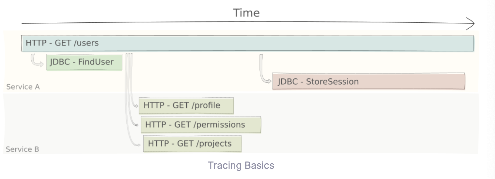

### 2023-08-21

## Sentry with logback
*참고: https://zorba91.tistory.com/311*
- **필자의 상황**
  - `Sentry.capture()` 를 통해 확인하고 싶은 부분만 메서드로 선언해서 보는 방식
  - 전역적으로 센트리를 적용하고자 했음

- **Sentry 공홈에서 추천하는 적용방식 4가지**
  - *참고: https://docs.sentry.io/platforms/java/configuration/*
  1. `sentry.properties`: `dsn={dsn}`
  2. 시스템 환경변수 적용
  3. 자바 시스템 프로퍼티에 적용: `java -Dsentry.dsn={clientKey} -jar app.jar`
  4. 코드상으로 적용

- **자바 시스템 프로퍼티 vs 시스템 환경변수**
  - 자바 시스템 프로퍼티: 자바 커맨드 라인에 의해 세팅
    - 이를 사용하는 프로세스에서만 해당 변수에 접근 가능
    - `-Dpropertyname=value`
  - 시스템 환경변수: OS에 세팅. 모든 프로세스에서 접근 가능
    - 런타임에 세팅되지 않음

- **해보기**
  - gradle에 디펜던스 넣기
    ```
    compile 'io.sentry:sentry-logback:1.7.30'
    compile 'io.sentry:sentry-spring-boot-starter:1.7.30'
    ```
  - logback-spring.xml에 추가하기
    ```xml
    <?xml version="1.0" encoding="UTF-8" ?>
    <configuration>
        <appender name="Console" class="ch.qos.logback.core.ConsoleAppender">
            <encoder>
                <pattern>%d{HH:mm:ss.SSS} [%thread] %-5level %logger{36} - %msg%n</pattern>
            </encoder>
        </appender>
        
        <appender name="Sentry" class="io.sentry.logback.SentryAppender">
            <filter class="ch.qos.logback.classic.filter.ThresholdFilter">
                <level>ERROR</level>
            </filter>
            <encoder>
                <pattern>%d{HH:mm:ss.SSS} [%thread] %-5level %logger{36} - %msg%n</pattern>
            </encoder>
        </appender>
        
        <root level="INFO">
            <appender-ref ref="Console" />
            <appender-ref ref="Sentry" />
        </root>
    </configuration>
    ```
    
## SDK
*참고: https://doozi0316.tistory.com/entry/SDK-API%EC%9D%98-%EA%B0%9C%EB%85%90%EA%B3%BC-%EC%B0%A8%EC%9D%B4%EC%A0%90*
*참고: https://reinvite.tistory.com/116*
*참고: https://change-words.tistory.com/entry/API-SDK-%EC%B0%A8%EC%9D%B4*
- **SDK**
  - Software Development Kit
    - 다른 프로그램을 추가하거나 연결할 수 있는 커스텀 앱을 제작할 수 있는 기능을 제공하는 도구
  - API, IDE, 문서, 라이브러리, 코드 샘플, 기타 유틸리티, 디버깅 프로그램 포함
  - SDK는 프로그램 및 응용 프로그램 개발의 복잡성을 줄이는 강력한 기능 집합
  - 미리 만들어진 도구를 제공함으로써 개발 과정을 쉽게
  - examples
    - iOS SDK: iOS 어플리케이션을 만드는데 필요한 모든 도구가 제공됨
    - JDK: 자바 개발자를 대상으로 한 오라클에서 제공하는 도구
    - Andriod SDK: 안드로이드용 앱 개발을 위한 도구

- **SDK vs API**
  - SDK: 망치, 팬치, 니퍼 등이 들어있는 하나의 공구박스
    - "좋아요 기능 만들기 위해 필요한 재료 다 드립니다. 원하는 대로 만들어보쇼"
  - API: 그 중 망치만을 의미
    - "좋아요 기능 만들어놨으니 연동해서 쓰셔요"
  - SDK는 API의 한계를 넘어서서 독자적으로 원하는 개발 가능
    - SDK >> API

## kamon
*참고: https://github.com/kamon-io/Kamon*
*참고: https://kamon.io/*
*참고: https://kamon.io/docs/latest/core/tracing/*
*참고: https://kamon.io/docs/latest/guides/how-to/log-trace-id-and-context-info/*
- **개요**
  - 개발자를 위한 관찰 툴
    - akka, play 등에 많이 쓰이는갑네
  - 기존의 로깅은 전반적인 응답 시간을 보여주는데 어려움을 겪는다
    - DB가 순차적으로 or 병렬적으로 시행되기에
  - 해결방법은 로깅을 보완하여 level, trace 뚝딱

- **TraceID**
  - logback-common.xml 에 kamon.TraceIDConverter 로 traceID를 기록한다
  - 메인 빌딩 블록은 `Span`으로 간주
  - `Span`
    - 하나의 오퍼레이션으로 충분한 정보를 가져 어떠한 트레이스가 어디에 속해있는지를 알 수 있게 지원한다. 
    - 하나의 Request에 대해 온전하게 파악할 수 있는 Span을 만들어보자 
      - 하나의 Request는 복합적으로 구성 가능
      - 
      - `val span = Kamon.spanBuilder("find-users").start()` => `span.finish()`

- **logback**
  - `logback.xml`
  ```xml
  <?xml version="1.0" encoding="UTF-8"?>
  <configuration scan="false" debug="false">
    <conversionRule
            conversionWord="traceID"
            converterClass="kamon.instrumentation.logback.tools.TraceIDConverter"/>
  
    <conversionRule
            conversionWord="spanID"
            converterClass="kamon.instrumentation.logback.tools.SpanIDConverter"/>
  
    <conversionRule
            conversionWord="contextTag"
            converterClass="kamon.instrumentation.logback.tools.ContextTagConverter"/>
  
    <conversionRule
            conversionWord="contextEntry"
            converterClass="kamon.instrumentation.logback.tools.ContextEntryConverter"/>
  
    <!-- the rest of your config... -->
  
  </configuration>
  ```
  - Trace and Span Identifier: TraceID랑 SpanID를 뚝딱 기록해두자
  ```xml
  <configuration scan="false" debug="false">
    <!-- all conversion rules from above -->
  
    <appender name="STDOUT" class="ch.qos.logback.core.ConsoleAppender">
      <encoder>
        <pattern>%d | %traceID %spanID | %m%n</pattern>
      </encoder>
    </appender>
  
    <root level="DEBUG">
      <appender-ref ref="STDOUT" />
    </root>
  </configuration>
  ```

## slf4j vs log4j vs logback vs log4j2
*참고: https://shplab.tistory.com/entry/log4j-vs-logback-vs-log4j2*
*참고: https://stackify.com/compare-java-logging-frameworks/*
- **로깅이 해결할 문제**
  1. 로그 메시지는 어플리케이션 내부적으로 수행하는 작업을 이해하는데 필요한 정보를 제공할 것
  2. 로그 메시지 작성은 어플리케이션 성능에 영향을 주지 않을 것
  3. 다른 배포 환경/상황에 맞는 로깅을 남길 수 있을 것
  - 다행히도 2/3 번에 대한 이슈는 로깅 프레임워크가 최대한 해결해준다!

- **slf4j**
  - Simple logging facade for Java
  - 자체적인 로깅 프레임워크 X => 그저 logger 추상체!
    - logback, log4j2와 같은 로깅 프레임워크의 인터페이스
    - 코드 일정하게 유지하면서 뚝딱 다른 구현체로의 전환 지원

- **log4j**
  - 오래된 로깅 아파치 자바 기반 로깅 프레임워크
  - xml, properties 로 구성 가능
  - 2015년 부터 deprecated
  - 로그 레벨로 appender와 logger 정의

- **logback**
  - log4j 이후 출시된 널리 사용되는 자바 로깅 프레임워크
  - slf4j의 구현체로 동작하며, SpringBoot의 경우 이게 spring-boot-starter-logging의 기본으로 채택
  - 향상된 정책 및 기능으로 로그 레벨 변경등에 대해 서버 재시작 없는 자동 리로딩 지원
  - 3가지 파트 구성
    - logback-core: 로깅 프레임워크의 핵심 기능 제공
    - logback-classic: 추가 기능 제공
    - logback-access: HTTP 액세스 로그 작성하도록 서블릿 컨테이너와 통합

- **log4j2**
  - logback 처럼 필터링과 자동 리로딩 지원
  - MultiThread 환경에서 Async Logger의 경우 다른 로깅 프레임워크보다 처리량이 훨씬 많고 대기시간 짤븡ㅁ
  - Lazy evaluation 지원함

## Play는 Servlet Container를 쓰는가? (with GPT)
- **답변**
  - 아니. 플레이는 서블릿 컨테이너 안써.
  - 자체적으로 고유한 빌트인 HTTP request를 쓴단다 (for async + non-blocking)
    - 1.x 버전에서는 Netty를 썼어
      - 비동기, 이벤트 드리븐 프레임워크라 많은 병렬처리가 가능했어
    - 2.x 버전에서는 여전히 Netty를 쓰는데
      - Akka HTTP의 개념도 가져왔어. 
      - 개발자들이 선택할 수 있게 되었어

- **Netty**
  - 하이 퍼포먼스, 비동기, 이벤트 드리븐 프레임워크
  - 확장가능, 효율적인 네트워크 어플리케이션
  - Netty가 HTTP 요청 플레이가 핸들링할 수 있도록 도와줘
    1. Event Loop & Channel
       - 넌블러킹 방식으로 들어오는 커넥션은 채널로 연결
       - 이벤트 루프가 채널 관리
    2. Channel Pipeline
       - 채널 파이프라인을 통해 데이터가 파이프라인을 통해 간다
       - 태스크 수행(디코딩, 어플리케이션 로직, 인코딩)을 파이프라인 안에서 한다
    3. HTTP Request Handling
       - 채널 파이프라인에서 1차적으로 HTTP 메세지 파싱, 헤더 파싱, 컨텐츠 파싱, 알맞은 응답 만들어주도록 대기
    4. Play Framework Integration
       - 플레이는 네티와 결합하기 위해, 자체적 채널 파이프라인을 제공
       - 이 핸들러는 인입되는 요청에 따라 알맞은 컨트롤러와 액션을 태우도록 플레이에서 작성됨
       - 플레이는 비동기 넌블럭킹 방식으로 네티와 궁합이 찰떡
    5. Asynchronous Execution
       - 이벤트 인입된게 시간 걸리는 거라면 (DB 쿼리, 외부 API 호출) => 핸들러는 워크를 다른 쓰레드에게 위임할 수 있어
       - 이벤트 루프는 그 사이 다른 이벤트를 받아서 처리하도록 지원
    6. Non-Blocking I/O
       - Netty는 non-blocking I/O를 통해 read/write 과정에서 쓰레드 블럭 안함
       - 데이터가 딱 준비댓을때만 뚝딱 쓰레드에 알려줘서 효율적으로