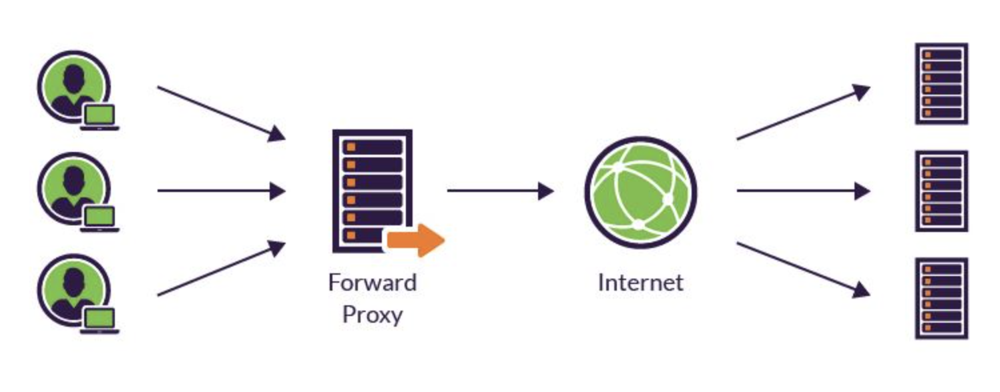

### 2023-09-11

## Proxy
*참고: https://coding-start.tistory.com/342*
*참고: https://bcp0109.tistory.com/194*
- **Proxy**
  - 클라이언트가 자신을 통해 다른 네트워크 서비스에 간접적으로 접속할 수 있게 해주는 컴퓨터 시스템이나 응용 프로그램
  - 클라 <-> 서버의 중계기로, 통신을 대리로 수행
  - 프록시 서버 주우 일부는 프록시 서버에 요청된 내용을 캐시를 활용해 저장
    - 캐시안에 있는 정보를 요구하는 요청은 프록시가 반환하게 설계할 수도 있음

- **Proxy with HTTP...**
  - 클라이언트 <--> 프록시 서버 <--> 서버
  - 클라의 모든 HTTP 요청 받아 서버로 전달
  - 프록시 서버가 클라이언트를 대신하여 서버에 접근하는 역할
  - 프록시 서버는 주로 보안을 위해 사용됨
    - 모든 웹 트래픽 흐름속에서 중개자 역할
    - 요청/응답 필터링
    - 회사 내부망에서 외부로 요청 보낼 때 이게 신뢰할만한 요청인지를 확인
      - 회사 내부정책에서 인가한 서버만 접속 가능토록

- **Proxy Server 종류**
  - Caching Proxy Server
    - 이전 클라 요청/응답 저장했다가 동일한 요청 들어오면 저장된 컨텐츠 전송
    - 높은 트래픽 대응 가능
    - 비용 절감도 가능
  - Web Proxy
    - 웹 트래픽에 초점이 맞춰짐
    - Web Cache
    - 서로 다른 컨텐츠에 대한 변환
  - Forward Proxy
    - 클라가 인터넷에 직접 접근하지 않고, 포워드 프록시 서버가 요청을 받고 -> 인터넷 연결하고 -> 결과를 클라에게 전달
    - Caching 해둬서 자주 사용하는 데이터는 요청 보내지 않고 가져올 수 있어 성능 향상 가능
    - 
  - Reverse Proxy
    - 클라에서 데이터 요청하면, 리버스 프록시가 요청을 받고 -> 내부 서버에서 데이터 받고 -> 그 결과를 클라에게 전달 
    - 로드 밸런싱, 서버 확장에 유리
    - 
  - ex)Nginx도 프록시서버라고 볼 수 있음. 캐시/포워드 프록시/리버스 프록시 가능

## Gateway
- **Gateway**
  - 컴퓨터 네트워크에서 서로 다른 통신망, 프로토콜을 사용하는 네트워크 간의 통신을 가능하게 하는 컴퓨터나 소프트웨어를 일컫는 용어
  - 다른 네트워크로 들어가는 입구 역할을 하는 네트워크 포인트
  - 다른 네트워크 간의 통로의 역할을 하는 장치
  - 게이트웨이 지날때 마다 트래픽 증가하기에 속도 느려질수도
  - 공항 게이트웨이 같은 감성
  - 네트워크 상 다른 통신망/통신프로토콜 적절히 변환해주는 역할

- **Gateway 특징**
  - 클라 <-> 서버간 통신 중개자 역할을 수행하긴 하지만, 용도가 조금 다름
  - HTTP 프로토콜을 다른 프로토콜로 변환하기 위해 사용
  - 게이트웨이는 언제나 리소스를 자기가 들고 있는 것 마냥 행동
  - HTTP <-> FTP 등의 프로토콜 변환도 지원

## VPN
*참고: https://www.cloudflare.com/ko-kr/learning/access-management/what-is-a-vpn/*
- **VPN**
  - 사용자가 사설망에 연결된 것 처럼 인터넷에 액세스 할 수 있도록 하는 인터넷 보안 서비스
  - 인터넷 통신 암호화 + 익명성 제공
  - 인터넷 검열 우회, 원격 작업을 위해 기업 내부 네트워크에 연결하는 것

- **VPN의 작동 방식**
  - 인터넷 연결시 flow
    - 사용자 <--> ISP <--> 인터넷
    - 이때...
      - 사용자의 IP주소 노출
      - 사용자 장치와 웹서버 간 전송되는 데이터 암호화X
      - 데이터 염탐, 경로상 공격 등이 가능
  - VPN을 사용하면!?
    - (VPN 클라이언트 <-> ISP <-> VPN 서버) <-> 인터넷
      - () 괄호 안에는 암호화된 연결

- **VPN과 성능**
  - VPN이 모두 동일하게 생성 X
  - VPN 서비스에 사용자가 생성한 부하를 처리할 수 있는 서버 용량이 없다면 사용자 인터넷 연결속도 느려짐
  - VPN이 액세스 하려는 사용자, 웹 서버 모두 멀리 떨어져도 이동시간으로 인해 속도 느려짐

## 전용선

## cURL
*참고: https://inpa.tistory.com/entry/LINUX-%F0%9F%93%9A-CURL-%EB%AA%85%EB%A0%B9%EC%96%B4-%EC%82%AC%EC%9A%A9%EB%B2%95-%EB%8B%A4%EC%96%91%ED%95%9C-%EC%98%88%EC%A0%9C%EB%A1%9C-%EC%A0%95%EB%A6%AC*
- **cURL?**
  - CLI에서 REST API 테스트하고 싶으면 curl 명령어를 써보세요
  - HTTP, HTTPS, FTP, LDAP, SCP, TELNET, SMTP, POP3 등 다양한 프로토콜을 테스트해볼 수 있음
  - 보통 특정 서버에서 빠르게 방화벽 예외 상태 테스트하거나
  - REST 서비스 테스트를 위해 사용되는 편

- **cURL 설치**
  - Linux, MacOS는 curl 기본 탑재

- **cURL 명령어 옵션**
  - URL 앞에서는 curl 옵션을 사용하자
    - 찾아보면서 하시고...
  - short 형식, long 형식 두개가 있음
    - `-k`, `--insecure` : SSL 인증서 없이 https 연결
    - `-D`, `--dump-header` : HTTP 헤더 파일에 기록 덤프
    - `-d`, `--data` : HTTP POST 요청 데이터 입력
    - `-X`, `-request` : 요청시 사용할 메소드의 종류 (GET, POST, PUT, PATCH, DELETE)

- **예시**
  - GET
  `$ curl -X GET www.example.com`
  - POST
  ```
  $ curl -d '{"key1":"value1", "key2":"value2"}' \
  -H "Content-Type: application/json" \
  -X POST http://localhost:8000/data
  ```

## 메시지큐
