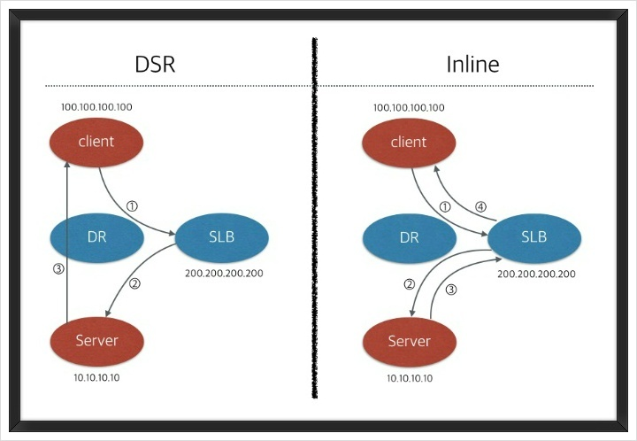

### 2023-09-19

## Server Load Balancing (SLB) + Global Server Load Balancing (GSLB)
*참고: https://leopit.tistory.com/20*  
*참고: https://travelc.tistory.com/82*  
- **SLB**
  - 서버의 로드 밸런싱을 해내기 위함
    - VIP로 여러대의 서버를 바인딩
    - VIP로 들어오는 트래픽들은 연결된 서버로 분배
  - 서버 로드 밸런싱의 줄임말로 LB, L4, L7 모두 다 맞음
    - L4: 전송 계층, TCP/UDP 프로토콜 레벨
    - L7: 응용 계층, http/https/websocket 어플리케이션 자체를 의미
  - SW, HW, 컨테이너화 된 것도 존재
  - 특정 서버가 죽어있다면, 고유의 Health Check 기능을 통해서 자동으로 서비스에서 서버를 제외함

- **사용자의 SLB 사용 플로우**
  1. Client가 DNS를 통해 도메인 주소의 IP를 얻어옴 (SLB의 VIP)
  2. VIP로 접속 시도
  3. 해당 VIP의 SLB는 SLB 방식에 따라 Client의 요청을 서버로 분배

- **SLB 고려사항**
  - 단일 서버의 부하를 분산
  - 하나의 서버로 받던 부하를 여러 서버로 부하 분산
  - Fail-Over: Active/Standby
  - Fault-tolerance; Active/Active

- **SLB의 구성**
  - LB를 이중화하여 구성할 수 있다 (Fail-Over 구조)
    1. Active/StandBy LB를 구축한다
    2. 클라이언트는 Active LB에 요청을 보낸다
    3. Active LB가 특정 이유로 뇌절한다
       - ex) 네트워크 케이블이 끊어져 패킷을 받을 수 없는 경우
    4. 자동적으로 StandBy LB로 제어가 넘어가도록 한다
    5. 기존 StandBy -> Active, Active -> StandBy로 역할 변경

- **L4 SLB의 동작방식**
  - 2가지 SLB Mode가 있음
    -  
    1. DSR(Direct Server Return)
       - Client -> L4 -> Server -> Client
       - Client request는 SLB로 인입
       - Server response는 SLB를 거치지 않고 직접 Client로 전달
       - L4 경유하지 않고 Client로 바로 응답해 장비 부하를 줄임
       - Client IP를 보존하여 서버로 요청이 인입되어 ACL로 제어 가능
         - 출발지/목적지 IP주소를 변조하지 않음
       - `clientIp = request.getRemoteAddr();`
    2. Inline(Proxy)
       - Client -> L4 -> Server -> L4 -> Client
       - 프록시 형태처럼 request/response가 모두 SLB를 통해 전달된다
       - Client IP 주소가 변경이 된다
       - `clientIp = request.getHeader("X-Forwarded-For")`

- **GSLB**
  - 구성단위: 도메인
  - 도메인에 여러개의 서버 IP/VIP를 바인딩하는 형태
  - 도메인으로 들어오는 질의에 대해 GSLB에서 서버 IP/VIP를 응답
  - 도메인에 **GSLB의 또 다른 도메인이 CNAME으로 등록되어 있음**
  - 트래픽 흐름도
    1. 클라이언트가 연결할 도메인 주소를 입력한다
    2. 도메인 DNS 질의를 통해 GSLB 도메인 주소가 획득된다
    3. GSLB 도메인 DNS 질의를 통해 GSLB 메서드에 따라 VIP/서버 IP를 응답
    4. 클라이언트는 GSLB의 도메인 질의를 통해 얻어온 VIP/서버 IP 접속

- **GSLB를 통해...**
  - 흐름도
    1. RoundRobin과 같이 LB Method 적용해 SLB 죽었는지 체크
    2. 위치(topology) 기반으로 요청/응답 다르게
       - 지역/나라/대륙 기반으로 다른 IP 응답 가능
       - Disaster Recovery의 개념으로도 활용됨
       - 최소 IDC, 데이터센터 레벨에서의 LB라고 보면 됨
    3. Ratio를 줘서 비율적으로 처리 가능
  - 장점
    - DNS + SLB 의 장점을 모두 사용할 수 있다!
      - DNS: 헬스체크 안대!
      - 캐싱되어 있기때문에, 바로바로 내려가지도 않아!
      - 