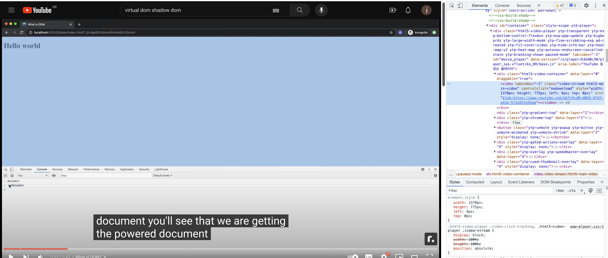
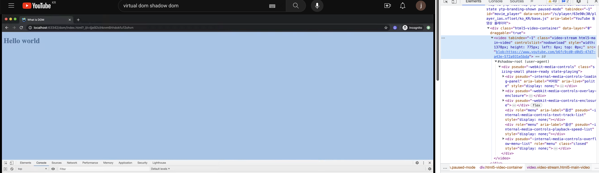

### 2023-11-22

## DOM (Document Object Model)
*참고: https://dev.to/lyndsiwilliams/real-dom-virtual-dom-shadow-dom-whats-the-difference-32ni*
*참고: https://www.youtube.com/watch?v=7Tok22qxPzQ*
*참고: https://wit.nts-corp.com/2019/03/27/5552*
- **DOM**
  - HTML tree 웹사이트는 `document`로 지칭됨
  - dot notation을 통해서 접근 가능함
    - `document.head` => `<head></head>`
    - `document.body` => `<body></body>`
  - DOM이 바뀌었을 경우, 전체 DOM을 동시에 변경함 => 굉장히 비싼 연산이라 Virtual DOM 등장
  - HTML 문서의 구조화된 표현
    - 브라우저가 페이지에 무엇을 렌더링할지 결정하기 위해
    - 혹은 자바스크립트 프로그램이 페이지의 컨텐츠/구조/스타일을 수정하기 위해 사용됨
  - DOM은 싹 다 글로벌임
    - document.queryS

- **Virtual DOM**
  - virtual DOM은 메모리에 있고, 진짜 DOM과 싱크를 맞추고 있음
  - 리액트의 경우
    1. 진짜 DOM을 JS로 컴파일해 Virtual DOM (vDOM) 만듦
    2. vDOM은 자기를 복사해 Virtual DOM 2(vDOM2)를 만듦
    3. 업데이트가 일어나면 vDOM2에 먼저 반영
    4. 리액트는 vDOM2와 vDOM 비교 => 여기서 vDOM은 진짜 DOM이랑 동일
    5. 리액트가 진짜 DOM이 변경되어야 한다고 판단하면 딱 업데이트 쳐줘야할 DOM만 변경해줌

- **Shadow DOM**
  - 숨겨진 DOM 트리인데, 진짜 DOM 트리에 착붙
  - 이건 진짜 오로지 shadow DOM만이 혼자 컨트롤함 (https://developer.mozilla.org/en-US/docs/Web/API/Web_components/Using_custom_elements)
  - video 태그 같은 건데... 이게 그냥 video 태그인데 사실 그 안에 플레이버튼, 시간 표시, 음량 조절, 등등 별에별게 다 있자나?
    - 누군가는 이걸 구현해줬을거란 말이지?
    - 그게 Shadow DOM이야
    - 크롬 > Settings > Preferences > Elements > Show user agent shadow DOM
  - 
  - 

## Virtual DOM
*참고: https://www.youtube.com/watch?v=PN_WmsgbQCo*
#### 1. 브라우저의 동작
- **브라우저 렌더링 과정**
  1. DOM tree 생성 : 렌더 엔진이 HTML을 파싱해 DOM 노드로 이루어진 트리 생성
  2. render tree 생성 : css 파일과 inline 스타일을 파싱, DOM + CSSOM = 렌더 트리 생성
  3. Layout(reflow) : 각 노드들의 스크린에서의 좌표에 따라 위치 결정
  4. Paint(repaint) : 실제 화면에 그리기

- **DOM 조작의 비효율성**
  - 다만! 특정 인터렉션으로 인해 DOM이 변화가 생기면 2번. render tree 생성부터 다시!!!
    - 인스타에서 좋아요 누름
    - 배민 장바구니에서 메뉴 삭제
    - 유튜브에서 댓글 등록

#### 2. Virtual DOM의 등장
- **Virtual DOM의 등장** 
  - 실제 DOM과 같은 속성을 가지고 있으나 (class, id 등)
  - 실제 DOM과 같은 API를 가지고 있진 않음 (getElementById, createElement 등)
  - 데이터 변경 시...
    - 전체 UI는 Virtual DOM에 렌더링
    - Virtual DOM에 있던 내용과 업데이트 후 내용을 비교해서 실제 DOM에 적용 (위에 vDom, vDom2 비교해서 바뀐거만 착붙 얘기하는 듯)
    - 전체 실제 DOM을 바꾸지 않고 필요한 부분의 UI 업데이트 뚝딱

- **Virtual DOM의 동작 원리**
  - 사실 DOM 처럼 생겼는데, js object에 불과해
    - 요렇게 생겼다고 생각했던 html은 사실
      ```html
      <ul id="items">
        <li>Item 1</li>
        <li>Item 2</li>
      </ul>
      ```
    - 그저 요런 js야
      ```js
      let domNode = {
        tagName: "ul",
        attributes: { id: "items" },
        children: [
          {
            tagName: "li",
            textContent: "Item 1",
          },
          {
            tagName: "li",
            textContent: "Item 2",
          },
        ]
      }
      ```
  - 메모리에서 도니까 비용도 적고
  - 모든 변화 한번에 묶어서 한큐에 뚝딱 적용
  - **Virtual DOM: DOM fragment의 변화를 묶어서 적용한 다음, 기존 DOM에 던져주는 과정**

#### 3. React의 Virtual DOM
- 리액트에게 Virtual DOM이란... "UI의 가상적인 표현을 메모리에 저장하고, ReactDOM과 같은 라이브러리에 의해 실제 DOM과 동기화"
- **JSX & React의 Virtual DOM**
  - js 확장 문법으로 html 처럼 생겼지만 js object 작성의 또다른 방법
  ```jsx
  function component() {
      return (
          <div className='kakao'>
            <h1>Hello!</h1>
          </div>
      );
  }
  
  // 바벨이 JSX를 React.createElement 호출로 컴파일
  
  function component() {
      return React.createElement("div", {
          className: 'kakao'
      }, React.createElement('h1', null, "Hello!"))
  }
  ```
  ```js
  // 요것도 내부적으로 결국
  const element = {
    type: 'div',
    props: {
      className: 'kakao',
      children: [
          type: 'h1',
          children: "Hello"
      ]
    }
  }
  ```
  - 리액트가 `ReactDOM.render(element, document.getElementById('kakao'))` 이렇게 꽂아줄 때 변경됨!

- **diffing 알고리즘**
  - virtual DOM이 업데이트되면, React는 virtual DOM을 업데이트 이전의 vDOM 스냅샷과 비교하여 정확히 어떤 vDOM이 바뀌었는지 검사
