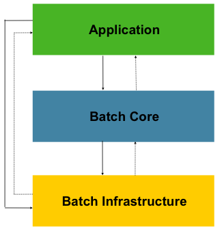
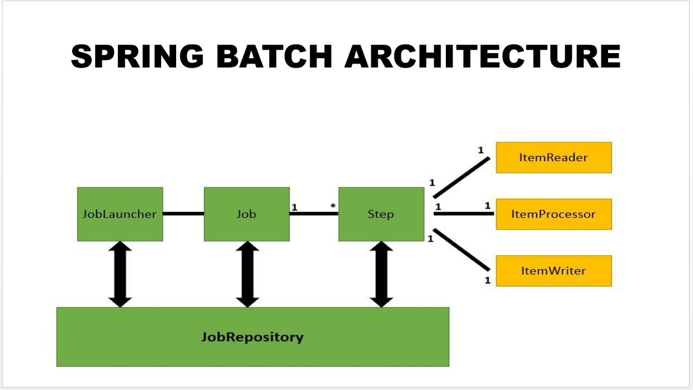

### Spring Batch
*참고: https://devbksheen.tistory.com/284*  
*참고: https://jojoldu.tistory.com/324*  
*참고: https://jojoldu.tistory.com/325*  
*참고: https://www.inflearn.com/course/%EC%98%88%EC%A0%9C%EB%A1%9C-%EB%B0%B0%EC%9A%B0%EB%8A%94-%ED%95%B5%EC%8B%AC-%EC%8A%A4%ED%94%84%EB%A7%81-%EB%B0%B0%EC%B9%98/dashboard*  

#### 배치 프로젝트란?
- **정해진 시간마다 데이터 가공이 필요한 경우 써보자!**
  - 가끔 집계를 위해 하루에 한번 수행되어야 하는 작업들
  - 어디서 부터 실패한지 기록해둬 그 다음부터 집계할 수 있도록
  - 같은 파라미터로 함수 실행했으면, 중복 실행이라고 알려줘 2배 데이터 뻥튀기 되는 것 막도록
  - Quartz와 함께 같이 사용될 수 있음

- **배치 어플리케이션의 조건**
  - 대용량 데이터 : 대량의 데이터를 가져오거나, 전달하거나, 계산하는 등의 처리
  - 자동화 : 심각한 문제 해결 외는 사용자 개입없이 실행될 것
  - 견고성 : 잘못된 데이터를 충돌/중단 없이 처리할 것
  - 신뢰성 : 무엇이 잘못되었는지 추적할 수 있을 것 (로깅, 알림)
  - 성능 : 지정한 시간 안에 처리 완료하거나 다른 어플리케이션 방해하지 않도록 수행

- **배치 작업이 필요한 예시**
  - 이메일 쿠폰 발송
  - 가맹점 정산
  - 거래 명세서 생성
  - 추천 시스템 데이터 작업
  - 대용량의 비즈니스 데이터를 복잡한 작업으로 처리해야하는 경우
  - 특정한 시점에 스케쥴러를 통해 자동화된 작업이 필요한 경우 (ex. 푸시알림, 월별 리포트)
  - 대용량 데이터의 포맷을 변경, 유효성 검사 등의 작업을 트랜잭션 안에서 처리 후 기록해야하는 경우

### Spring Batch
- **스프링 배치로 작업이 필요한 이유**
  - 엔터프라이즈 시스템 운영에 있어 대용량 일괄 처리의 편의를 위해 설계된 가볍고 포괄적인 배치 프레임워크
    - Accenture의 배치 노하우 + Spring 프레임워크의 철학 (DI, AOP, 서비스 추상화)
  - 풍부한 기능 제공
    - Spring Batch는 로깅/추적, 트랜잭션 관리, 작업 처리 통계, 작업 재시작, 건너뛰기, 리소스 관리 등 대용량 레코드 처리에 필수적인 재사용 기능 제공
    - 최적화 및 파티셔닝 기술을 통해 대용량/고성능 일괄 작업을 가능하게 지원
  - 일관성 있는 코드
    - 기존 서비스가 스프링 프레임워크라면 호환이 가능함

- **Reader & Writer**
  - Reader: 데이터를 읽어오는 모듈
  - Writer: 데이터를 쓰는 모듈
    - Database => JDBC, Hibernate, JPA
    - File: Flat file, XML

#### 스프링 배치 아키텍쳐
- **아키텍쳐 살펴보기**
  - 
  - [Application]
    - 스프링 배치 사용해 개발자가 작성한 모든 배치 작업과 사용자 정의 코드
    - 개발자는 Application 계층의 비즈니스 로직에 집중!
  - [Batch Core]
    - 배치 작업 시작하고 제어하는데 필요한 핵심 런타임 클래스 포함
    - 배치의 동작과 관련된 것은 Batch Core에 있는 클래스를 이용하여 제어
  - [Batch Infrastructure]
    - 개발자와 어플리케이션에서 사용하는 일반적인 Reader, Writer, RetryTemplate

- **배치 Job이 돌아가려면...**
  - 
  - [JobRepository]
    - 다양한 배치 수행과 관련된 "수치 데이터"와 "잡의 상태"를 유지 및 관리
    - 관계형 데이터베이스를 사용하여 스프링 배치 내의 대부분의 주요 컴포넌트가 공유
    - 실행된 Step, 현재 상태, 읽은 아이템 및 처리된 아이템 수 등이 모두 JobRepository에 저장
  - [Job]
    - 배치 처리 과정을 하나의 단위로 만들어 표현한 객체
    - 여러 Step 인스턴스를 포함하는 컨테이너
    - Job이 실행될 때 스프링 배치의 많은 컴포넌트는 탄력성을 제공하기 위해 상호작용함
  - [JobLauncher]
    - Job 실행하는 역할 -> `Job.execute` 호출
    - 일반적으로 직접 다룰 필요 x
    - Job의 재실행 가능 여부 검증, 잡의 실행 방법, 파라미터 유효성 검증 등 수행
  - [Step]
    - 배치에서 일반적으로 상태를 보여주는 단위 (Tasklet, Chunk)
    - Tasklet
      - Step이 중지될 때까지 execute 메서드가 계속 반복해서 수행하고 수행할 때마다 독립적인 트랜잭션이 얻어짐
      - ex) 초기화, 저장 프로시저 실행, 알림 전송
    - Chunk
      - 한 번에 하나씩 데이터(row)를 읽어 Chunk라는 덩어리를 만든 뒤, Chunk 단위로 트랜잭션을 다루는 것
      - Chunk 단위로 트랜잭션 수행하기에, 실패할 경우 Chunk 만큼 롤백
      - ItemReader, ItemProcessor, ItemWriter 3개 주요 부분으로 구성
        - ItemReader/ItemProcessor: 데이터 1건씩 다뤄짐
        - ItermWriter: Chunk 단위로 처리

#### 스프링 배치 사용 예제
https://github.com/joelonsw/hello-batch
