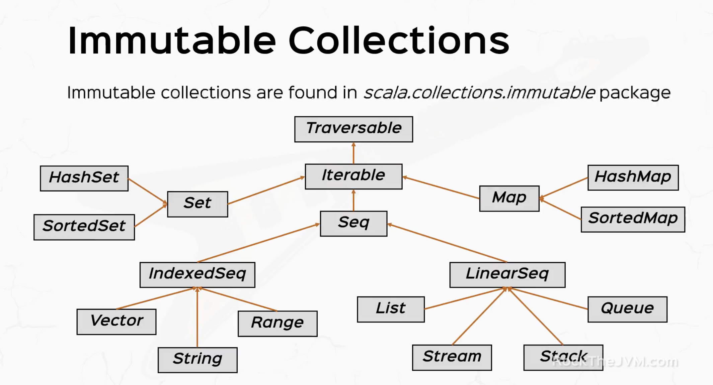
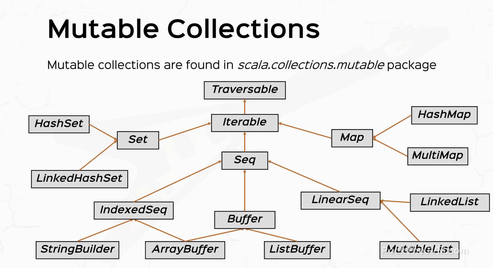

# Scala 2 for Beginners
*참고: https://rockthejvm.com/courses/1462300*

### Scala At Light Speed - 복습
- [Basics](https://github.com/joelonsw/TIL/blob/master/2023-02/2023-02-28.md#basics)
- [OOP](https://github.com/joelonsw/TIL/blob/master/2023-02/2023-02-28.md#object-oriented)
- [FP](https://github.com/joelonsw/TIL/blob/master/2023-03/2023-03-02.md#functional-programming)
- [Pattern Matching](https://github.com/joelonsw/TIL/blob/master/2023-03/2023-03-02.md#pattern-matching)
- [Advanced](https://github.com/joelonsw/TIL/blob/master/2023-03/2023-03-03.md#advanced)

## The Absolute Basic
### Expressions
- **개요**
  - Everything in scala is an Expression
    - IF는 Expression
    - Code Block도 Expression

- **Expressions vs Instructions**
  - Instruction: 실행되는 것 (Java) - do sth
  - Expressions: 평가되는 것 (Scala) - give me the value of sth

- **Side Effect**
  - 함수의 리턴값이 아닌 값에 대한 상태를 변화시키는 것을 의미함
    - 변수 조작, 파일/DB 읽기, 콘솔에 출력하기 등등을 의미함 (주로 Unit 반환)
  - 함수형 프로그래밍에서 프로그램이 어떻게 돌아가는지 추론을 어렵게 만들기에 권장되지 않음
  - 함수형 프로그램에서는 함수의 행위가 오로지 input에 대해서만 영향을 받아야함
  - 사이드 이펙트가 발생해야하는 경우가 있음 ex) 데이터베이스에 읽기/쓰기
    - 굉장히 작은, 잘 정제된 코드 부분에서 접근하도록 해야하며, 프로그램 전체에 영향을 미치지 않도록 해야함
    - monad를 사용하여 많은 라이브러리들이 이를 캡슐화하도록 지원하고 있음
    - purely functional 하도록 유도

### Functions
- 함수 실행은 Expression 평가와 같다
- 파라미터가 없다면 그냥 함수 이름만 써서 실행시킬 수 있음
- **반복문이 필요하다면, 재귀함수를 쓰세요!**

### Type Inference
- 컴파일러는 우리가 빠뜨린 자료형의 타입을 알아서 써줘
- 컴파일러는 우리가 빠뜨린 함수의 반환 타입을 알아서 써줘
- 대신 재귀함수를 쓸 때는 함수의 반환 타입을 알려주세요 => 모를 수 있거든요

### Recursion
- 반복문이 필요하다면 꼬리 재귀(tailrec)을 사용하세요!!
- **tailrec**
  - 재귀를 써도 스택 오버플로우가 안 터지는 방법
  - 꼬리 재귀를 쓰면 새로운 스택 위에 쌓지 않아
    - don't need to save intermediate result
    - evaluated stack frame => current stack frame (No need for extra stack frame)
  - 꼬리 재귀가 되려면 재귀 함수를 마지막 expression으로 사용하세요!!!!
  ````scala
  def factorial(n: Int): Int = {
    def factHelper(x: Int, accumulator: Int): Int =
      if (x <= 1) accumulator
      else factHelper(x - 1, x * accumulator)
    
    factHelper(n, 1)
  }
  ````

### Call By Name & Call By Value
- **Call By Value**
  - 파라미터로 넘어가는 "값" 그 자체!
  - 그 값을 아무리 호출해도 넘겨받은 값을 사용하게 됨
  - 파라미터로 넘길 때 값을 평가해서 "값"을 줌

- **Call By Name**
  - 파라미터로 넘어가는 "Expression"
  - 해당 "Expression"을 호출할 때마다 평가된다!
  - 파라미터로 넘길 때 호출할 "Expression"을 넘겨줌
    - 따라서 호출이 되어야 평가를 하고 값을 반환함

```scala
def calledByValue(x: Long): Unit = {
  println("by value: " + x)
  println("by value: " + x)
}

def calledByName(x: => Long): Unit = {
  println("by name: " + x)
  println("by name: " + x)
}

calledByValue(System.nanoTime())
calledByName(System.nanoTime())

/*
* by value: 12345
* by value: 12345
* by name: 12378
* by name: 12401
* */
```

### Default and Named Arguments
- 파라미터에 이름 붙이고, default value를 줄 수 있음
- 함수 호출시 `파리미터 이름 = 값` 형식으로 쓰자!

### String Operations and Interpolations
- **S-Interpolations**
  ```scala
  val name = "David"
  val age = 12
  val greeting = s"Hello, my name is $name and I am $age years old"
  val anotherGreeting = s"Hello, my name is $name and I will be turning ${age + 1} years old"
  println(anotherGreeting)
  ```

- **F-Interpolations**
  ```scala
  val speed = 1.2f
  val myth = f"Eat with $speed%2.2f burgers with minute"
  println(myth)
  ```

- **Raw-Interpolations**
```scala
println(raw"This is a \n newline")
/*
* This is a \n newline
* */

val escaped = "This is a \n newline"
println(raw"$escaped")
/*
* This is a
*  newline
* */
```

## OOP in Scala
### OO Basics
- **개요**
  - constructor의 `val`을 붙여야 멤버변수로써 활용 가능
  - 그냥 클래스 내부에서 `val`을 붙여도 멤버변수로 활용 가능
  - multiple constructor 활용 가능 => 너무 많다면 default parameter가 대안이 될 수 있음
  ```scala
  class Person(name: String, val age: Int) {
    val x = 2 // 멤버 변수로 활용 가능. 접근 가능
    
    // multiple constructor, default parameter도 대안이 될 수 있음
    def this(name: String) = this(name, 0)
    def this() = this("Joel", 25)
  }
  ```

- **TIPS**
  - 불변성을 고려하여 만들자! (상태 패턴이랑 비슷해보이기도 함!)
  ````scala
  class Counter(val count: Int) {
    def inc = new Counter(count + 1)
    def dec = new Counter(count - 1)
  }
  ````

### Method Notations
- **개요**
  - 다양한 기호들이 메서드의 이름으로 사용될 수 있음 => 가독성 향상 가능
  - prefix, infix, postfix 방식으로 메서드가 여기저기에 낄 수 있도록 syntatic sugar 제공
  - 파라미터가 0개/1개라면 보다 유연하게 호출할 수 있음

- **예시**
  ```scala
  class Person(val name: String, favoriteMovie: String) {
    def likes(movie: String): Boolean = (movie == favoriteMovie)
    def +(person: Person): String = this.name + " +++++ " + person.name
    def unary_! : String = "supports prefix!" // unary_* 하되, 띄어쓰기 하고 : 붙이기
    def isAlive: Boolean = true
    def apply(): String = "My name is " + this.name
  }
  
  val joel = new Person("Joel", "Shall we dance?")
  
  // 메서드가 호출될 때, 어떻게 정의되어 있는가에 따라 prefix, infix, postfix가 될 수 있음
  println(!joel) // prefix
  println(joel likes "Shall we dance?") // infix
  println(joel isAlive) // postfix
  ```

### Scala Objects
- **개요**
  - 스칼라는 class-level functionality, 즉 자바의 static 변수가 없음 => object를 통해서 대신할 수 있음
  - Scala Object는 싱글턴으로 기능함

- **Companions**
  - class와 object의 이름이 같으면, Companions라고 칭한다
  ```scala
  object Person {
    // class-level functionality
    val N_EYES = 2
    def canFly: Boolean = false
    def apply(mother: Person, father: Person): Person = new Person("Baby")
  }
  
  class Person(val name: String) {
    // instance-level functionality
  }
  ```
  
- **Companions 왜 필요한데?**
  1. Code Organizations: 오브젝트와 클래스에 필요한 코드를 그룹핑 시켜 이해하기 좋은 코드를 만들자
  2. Convenience: 클래스를 생성하는 팩토리 메서드를 오브젝트에 넣자. `apply()` syntatic sugar 쓰면 더 좋고
  3. Static Methods: 정적 메서드 사용하듯 사용할 수 있음. 간결하고 읽기 쉽게!
  4. Implicit Conversions: 다른 이름과 대표값이 있을때 변환을 쓱 하는데 지원
  5. Sharing state: 클래스가 공통적으로 공유하는 상태를 오브젝트에 만들자!

### Abstract Class and Inheritance
- **오버라이딩 방지**
  1. final members
  2. final classes
  3. sealed classes

- **trait**
  - constructor에 파라미터 가지면 안댐
  - 여러개의 trait 받아서 클래스 생성 가능

### Anonymous Classes
  ````scala
  abstract class Animal {
    def eat: Unit
  }
  
  val funnyAnimal: Animal = new Animal {
    override def eat: Unit = println("~~~")
  }
  ````

### Generics
- **개요**
  - 자바의 제네릭과 비슷한 느낌이 많이 든다
  - 다만 Covariance, Invariance, Contravariance 등의 컨셉이 자바와 다름
  - 제네릭의 한정자 super와 extends 는 <: 등으로 상한/하한 표현 가능

### Case Classes
- **개요**
  1. CC에서는 파라미터가 필드다
  2. CC는 toString을 오버라이딩 해둔다
  3. equals & hashCode가 필드가 같으면 같다
  4. CC는 copy()를 보다 쉽게 지원 (새로운 인스턴스 생성)
  5. CC는 companion object를 가진다. (apply() 가 호출되어 constructor 대체)
  6. CC는 serializable
  7. CC는 패턴 매칭에서도 자주 쓰임
  ```scala
  case class Person(name: String, age: Int)
  
  // 1. class parameters are fields
  val jim = new Person("Jim", 34)
  println(jim.name)                     // Jim
  
  // 2. sensible toString
  println(jim)                          // Person(Jim,34)
  
  // 3. equals and hashCode
  val jim2 = new Person("Jim", 34)
  println(jim == jim2)                  // true
  
  // 4. handy copy method
  val jim3 = him.copy(age = 45)
  println(jim3)                         // Person(Jim,45)
  println(jim == jim3)                  // false
  
  // 5. Case Class have companion objects
  val thePerson = Person
  val mary = Person("Mary", 23)
  
  // 6. CC are serializable
  // 7. CC can be used in pattern matching
  ```

### Handling Exceptions
- **Exception 던지기**
  - `val aWeirdValue: String = throw new NullPointerException`

- **Exception 잡기**
  ```scala
  def getInt(withExceptions: Boolean): Int =
    if (withExceptions) throw new RuntimeException
    else 50
  
  try {
    getInt(true)
  } catch {
    case e: RuntimeException => println("Runtime Exception")
  } finally {
    println("finally")
  }
  ```

- **Exception 정의하기**
  - 자바와 비슷!
  ```scala
  class MyException extends Exception
  val exception = new MyException
  
  throw exception
  ```

### Packaging and Imports
- 자바와 비슷
```scala
import playground.{PrinceCharming, Cinderella => Princess}
import java.util.Date
import java.sql.{Date => SqlDate}

object PackagingAndImports extends App {
  val princess = new Princess // 임포트 해온 친구가 Cinderella 인데, 이를 Princess 이름으로 사용
  
  val date = new Date
  val sqlDate = new SqlDate(2023, 3, 7)
  
}
```

## FP in Scala
### What's a Function?
- **개요**
  - JVM에서 함수를 일급 시민으로 쓸 수는 없을까?
  - JVM은 OOP 기반으로 설계 되어있음 => 함수형을 JVM 위에서 구동시키기 위해서는 함수형을 OOP 위에 구현시키려는 노력이 필요했음

- **Function_x**
  - trait `Function_1` ~ `Function22` 까지 (1~22는 파라미터 갯수) 인스턴스화 시켜서 이를 사용토록
  - 이를 람다식으로 표현할 수 있도록 Syntatic Sugar 제공
  - 모든 스칼라의 Function은 JVM 위에서 동작한다는 것을 명심!

### Anonymous Functions
- **개요**
  - 익명 클래스 처럼, 익명 함수를 만들어보자
  - 그냥 trait, abstract class를 변수에서 new 인스턴스화로 박아버리듯, 함수도 그렇게 람다식으로 박아버리자
  ```scala
  val doubler: Int => Int = x => x * 2
  val adder: (Int, Int) => Int = (x, y) => (x + y)
  val justDoSth: () => Int = () => 3
  
  println(justDoSth) // 이러면 함수 자체를 출력
  println(justDoSth()) // 함수 실행을 원한다면 ()를 써주세요!
  ```

- **Syntatic Sugar**
  - `_`를 활용해 함수에서 넘겨받은 매개변수를 표현할 수 있다
  ```scala
  val niceIncrementer: Int => Int = _ + 1 // x => x + 1
  val niceAdder: (Int, Int) => Int = _ + _ // (a, b) => a + b
  ```

### HOF and Curries
- **Higher Order Function(HOF)**
  - 함수를 파라미터로, 리턴값으로 쓰는 경우, 이를 HOF라고 부른다
  - 함수 합성, 중첩 등이 가능해진다. 

- **Curried Functions**
  - 함수의 재사용성을 높이기 위해 함수 자체를 반환하는 함수
  - *참고: https://itprogramming119.tistory.com/entry/Javascript-%EC%BB%A4%EB%A7%81Currying-%ED%95%A8%EC%88%98%EB%9E%80*
  ```scala
  val superAdder: Int => (Int => Int) = (x: Int) => (y: Int) => (x + y)
  val addThree = superAdder(3)
  println(addThree(10))
  ```

### Collections Overview
- 
- 

### Sequences
- **Seq**
  ````scala
  val aSequence = Seq(1, 2, 3, 4)
  println(aSequence)
  println(aSequence.reverse)
  println(aSequence(2))
  println(aSequence ++ Seq(5, 6, 7))
  println(aSequence.sorted)
  ````

- **Ranges**
  ```scala
  val aRange: Seq[Int] = 1 to 10
  aRange.foreach(println)
  (1 to 10).foreach(println("Hello"))
  ```

- **List**
  - Singly-Linked List
  - O(1): head, tail, isEmpty
  - o(n): 그 외 다수의 random access
  - 앞 순서 변경에 강함
  ```scala
  val aList = List(1, 2, 3)
  println(aList.mkString("-|-")) // 1-|-2-|-3
  val prepend = 42 :: aList
  val append = 30 +: aList :+ 100
  val apple5 = List.fill(5)("apple")
  ```

- **Vector**
  - 트리 기반의 데이터 구조
  - 트리의 노드는 32개의 element까지 수용할 수 있다
  - Vector는 효율적인 random access, tail operation 보장 *O(logN)*
  - head insertion/deletion 느림
  - 뒷 순서 변경에 강함

- **Array**
  - `Array.ofDim[T](n1, n2, ...)`
  - multidimensional array of type T 생성
  - `Array.ofDim[Int](3)`는 Int 타입의 3칸짜리 1차원 배열 `(0, 0, 0)`
  - `Array.ofDim[String](3)`는 String 타입의 3칸짜리 1차원 배열 `(null, null, null)`
  - 배열은 안의 요소 변경할 수 있음
  ```scala
  val numbers = Array(1, 2, 3, 4)
  numbers(2) = 0
  ```

### Tuples & Maps
- **Tuples**
  ```scala
  val aTuple = Tuple2(2, "helloScala")
  println(aTuple._1)
  println(aTuple.copy(_2 = "goodbye Java"))
  println(aTuple.swap)
  ```

- **Maps**
  ```scala
  val aMap: Map[String, Int] = Map()
  val aPhoneBook = Map(("Jim", 55), ("Joel" -> 25)).withDefaultValue(-1)
  println(aPhoneBook)
  println(aPhoneBook.contains("Joel"))
  println(aPhoneBook.contains("JIII")) // 원래 에러 던지는데 withDefaultValue로 방어적 코드 작성
  ```

### map, filter, flatMap
- **개요**
  - list, array, set을 조작하는 HOF
  - 스칼라 FP, 간결하고, 효율적인 코드 작성 도와줌

- **map**
  - 주어진 함수를 각 요소별로 수행시켜서, 기존 컬렉션을 새로운 같은 사이즈의 컬렉션으로 반환
  - 여기서 새로운 컬렉션은 기존 컬렉션의 요소별 함수 수행 값
  ```scala
  def map[B](f: A => B): List[B]
  
  val numbers = List(1, 2, 3, 4, 5)
  val doubledNumbers = numbers.map(n => n * 2)
  println(doubledNumbers) // List(2, 4, 6, 8, 10)
  ```

- **filter**
  - 기존 컬렉션에서 해당 predicate를 만족하는 새로운 컬렉션을 반환
  ```scala
  def filter(p: A => Boolean): List[A]
  
  val numbers = List(1, 2, 3, 4, 5)
  val evenNumbers = numbers.filter(n => n % 2 == 0)
  println(evenNumbers)
  ```
  
- **flatMap**
  - map과 비슷하나!
  - 컬렉션을 반환하는 함수를 적용시키고, 이를 flattening 시켜 하나의 컬렉션으로 만들어버림
  ```scala
  def flatMap[B](f: A => List[B]): List[B]
  
  val words = List("Hello", "world")
  val letters = words.flatMap(word => word.toList)
  println(letters) // List(H, e, l, l, o, w, o, r, l, d)
  ```

### Options
- **개요**
  - 값을 가질수도, 가지지 않을수도 있는 컨테이너
  - Null 값을 핸들링하기 위함이며, type-safe way한 방식으로 다루기 위함
  - FP에서 성공할수도, 실패할수도 있는 계산을 수행할 때 많이 사용
    - 실패 == null 이라는 공식에서 벗어나, Option 타입을 돌려주자
    - Option
      - 실패 == None
      - 성공 == Some(value)
  ```scala
  object Option {
    // ~~
  }
  
  sealed abstract class Option[+A] extends IterableOnce[A] with Product with Serializable {
    def get: A
  }
  
  final case class Some[+A](value: A) extends Option[A] {
    def get: A = value
  }
  
  case object None extends Option[Nothing] {
    def get: Nothing = throw new NoSuchElementException("None.get")
  }
  ```

- **예시**
  ````scala
  def findItem(list: List[Int], target: Int): Option[Int] = {
    val index = list.indexOf(target)
    if (index == -1) None else Some(index)
  }
  
  val result = findItem(List(1, 2, 3), 2)
  result match {
    case Some(index) => println(s"Item found at index $index")
    case None => println("Item not found")
  }
  ````

- **Option의 메서드**
  - [orElse]: `if (isEmpty) alternative else this`
  - [flatMap]: `if (isEmpty) None else f(this.get)`

- **예시**
  ```scala
  val config: Map[String, String] = Map(
    "host" -> "182.12.34.3",
    "port" -> 80
  )
  
  class Connection {
    def connect = "Connected"
  }
  
  object Connection {
    val random = new Random(System.nanoTime())
    
    def apply(host: String, port: String): Option[Connection] =
      if (random.nextBoolean()) Some(new Connection)
      else None
  }
  
  val host = config.get("host")
  val port = config.get("port")
  val connection = host.flatMap(h => port.flatMap(p => Connection.apply(h, p)))
  ```

### Try
- **개요**
  - 성공/실패에 대해 값을 가질 수 있도록 Try
  ```scala
  import scala.util.{Try, Success, Failure}
  
  def divide(dividend: Int, divisor: Int): Try[Int] = {
    Try(dividend / divisor)
  }
  
  val result = divide(10, 2)
  
  result match {
    case Success(value) => println(s"The result is: ${value}")
    case Failure(exception) => println(s"An exception occurred: ${exception}")
  }
  ```
