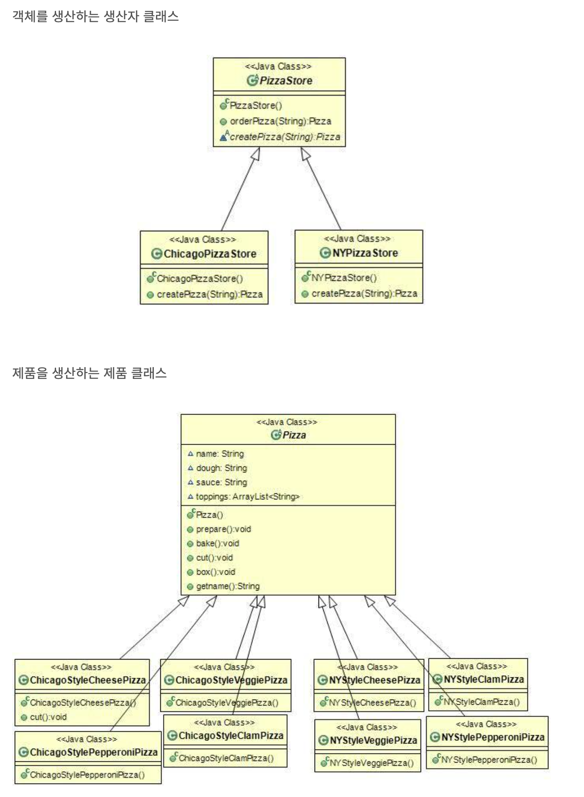

### 2024-01-16

## 팩토리 패턴
*참고: https://jusungpark.tistory.com/14*
*참고: https://inpa.tistory.com/entry/GOF-%F0%9F%92%A0-%ED%8C%A9%ED%86%A0%EB%A6%AC-%EB%A9%94%EC%84%9C%EB%93%9CFactory-Method-%ED%8C%A8%ED%84%B4-%EC%A0%9C%EB%8C%80%EB%A1%9C-%EB%B0%B0%EC%9B%8C%EB%B3%B4%EC%9E%90*
- **팩토리 패턴이란?**
  - 팩토리 메서드 패턴: 클래스의 인스턴스를 만드는 일을 서브 클래스에게 만드는 것
  - 추상 팩토리 패턴: 인터페이스를 이용하여 서로 연관된, 또는 의존하는 객체를 구상 클래스 지정 없이 생성

- **팩토리 메서드 패턴 예시**
  - 피자를 만드는 피자가게 예시
  - 등장 클래스 
    - Pizza
    - PizzaStore
  - 
  - 특징
    - 팩토리 메서드 패턴

- **팩토리 메서드 패턴 설명**
  - 객체 생성을 공장 클래스로 캡슐화... 대신 생성하도록 하는 생성 디자인 패턴
    - `new` 연산자 말고, 
    - 제품 객체 도맡아 생성하는 공장 클래스 만들고
      - 이를 상속하는 서브 공장 클래스의 메서드에서 여러 제품 객체 생성의 책임을 가짐

- **팩토리 메서드 패턴 구조**
  - 
  1. Creator: 최상위 공장 클래스. 팩토리 메서드 추상화해 서브 클래스가 구현할 수 있도록
    - 객체 생성 처리 메서드(someOperation): 객체 생성에 관한 전처리, 후처리를 템플릿화한 메서드
    - 팩토리 메서드(createProduct): 서브 공장 클래스에서 재정의할 객체 생성 추상 메서드
  2. ConcreteCreator: 각 서브 공장 클래스. 이에 맞는 제품 객체 반환하도록 생성 추상 메서드 재정의
  3. Product: 제품 구현체의 추상화
  4. ConcreteProduct: 제품 구현체

## JS 진영 Package Manager, Task Runner, Module Bundler
**[Package Manager]**  
- 프로젝트 의존성 관리
- package 설치/업데이트/제거 쉽게 도와줌
- 마치 필요한 식재료를 식료품점에서 가져오듯, 필요한 js 라이브러리 착착 가져오기 좋음
- ex) npm, yarn

**[Task Runner]**  
- 일반적인 태스크(minification, compilation, linting, testing 등)에 대해 자동화 시켜놓는 도구
- ex) Grunt, Gulp

**[Module Bundler]**  
- 여러개의 JS 모듈을 하나/소수의 파일로 결합 -> 그래서 브라우저에서 돌아갈 수 있도록
  - Http request를 줄이는 등의 역할 가능
- js 문법 변형도 담당할 때 있음 (TS -> JS, ES6+ -> older)
- ex) Webpack, Rollup, Parcel

## Gruntfile
*참고: https://junistory.blogspot.com/2017/06/grunt.html*
*참고: https://ux.stories.pe.kr/69*
- **개요**
  - JS Task 기반 빌드 툴
  - Node.js 기반의 패키지 

- **프로젝트 생성**
  - `package.json`
    - 프로젝트 정보/버전/설치된 js 패키지 등 전반적인 내용 관리
  - `gruntfile.js`
    - 어떤 패키지를 어떤 옵션으로 언제 실행할 것인가에 대한 기록
    - 명령어: `grunt`, `grunt serve`, `grunt build`

- **설치**
  - Grunt 설치
    - 로컬 프로젝트에 설치하는 개념
    - `-g` 옵션 없음
    - `npm install grunt --save-dev`
  - Grunt로 사용할 다양한 패키지 설치
    - Grunt가 명령을 내릴 다양한 패키지들의 설치 필요 (플러그인)

- **gruntfile.js의 구조와 사용법**
    ```javascript
    module.exports = function(grunt) {
        // 1. 프로젝트의 구성
        grunt.initConfig({
            pkg: grunt.file.readJSON('package.json'),
            uglify: {
                build: {
                    src: 'src/<%= pkg.name %>.js',
                    dest: 'build/<%= pkg.name %>.min.js'
                }
            }
        });
        
        // 2. 사용한 플러그인 로딩 (npm 설치 선행)
        grunt.loadNpmTasks('grunt-contrib-uglify');
        
        // 3. 실행 명령어 (명령창에서 grunt 명령으로 실행)
        grunt.registerTask('default', ['uglify']);
    };
    ```
    1. 프로젝트 구성
       - 외부에서 실행할 수 있게 되어있음
       - 이에 따라 `node.js` 명령어창에서 명령어로 cli 실행 가능해짐]
       - Task(플러그인) 를 하나하나 명시하고 구성을 정의
         - 파일 참조, 처리, 처리 결과물 저장 등
    2. 사용한 플러그인 로딩
       - 플러그인 불러옴
    3. 실행 명령어
       - 플러그인을 순서대로 실행시키는 명령어 뭉치 작성
       - 순서대로 실행됨
         - `grunt.registerTask('default', ['concat', 'uglify', 'cssmin']);`
         - concat -> uglify -> cssmin
