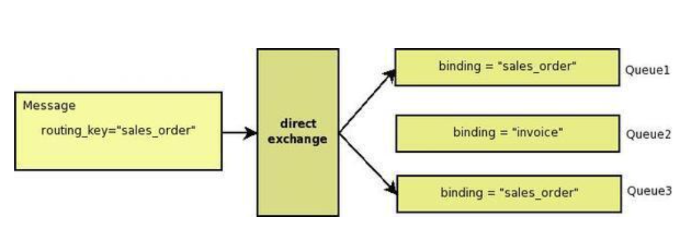
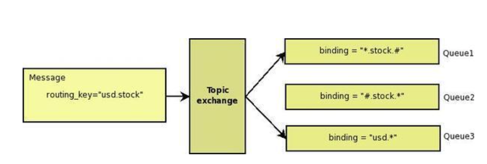
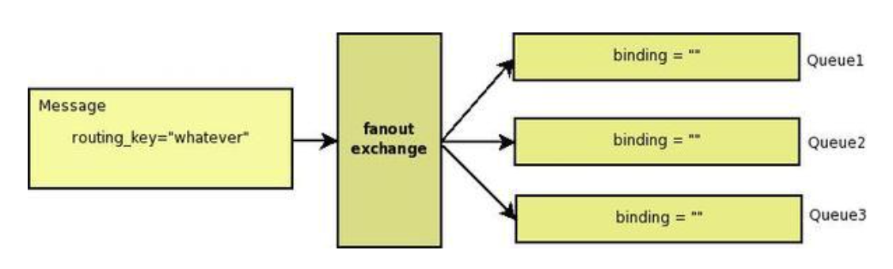
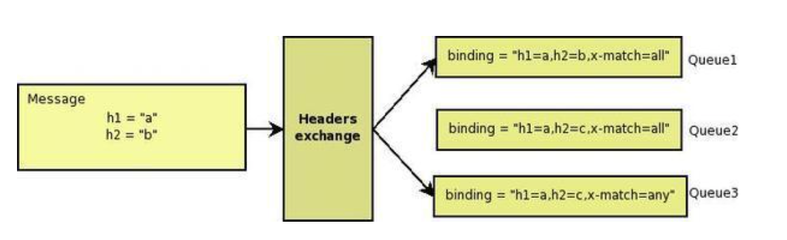

### 2024-04-29

## scp, rsync
*참고: https://madplay.github.io/post/scp-rsync*
*참고: https://mycup.tistory.com/390*
- **scp**
    - secure copy의 약자
    - 로컬 호스트 <-> 원격 호스트 간의 파일을 전송하는 수단
    - ssh(secure shell)을 통한 파일 전송 방식, ftp 클라이언트 설치 없이도 파일 송수신 가능
    - 로컬 -> 원격
      - `scp 파일경로/파일명 계정명@타겟서버명:도착경로/파일명`
    - 원격 -> 로컬
      - `scp 계정명@서버명:파일경로/파일명 도착로컬경로`
    - 옵션
      - `r`: 하위 폴더 모두 복사하는 recursive
      - `p`: 권한/속성 유지하는 preserve
      - `c`: 압축 실시하는 compress
    - 보안때매 openssh 8.0 부터는 deprecated 라네..?

- **rsync**
    - remote synchronization 
    - 원격에 있는 파일과 디렉터리를 복사하고 동기화하는 방식
      - 변경된 파일들이 있다면 변경된 파일의 씽크를 맞춰줌
    - 로컬 -> 원격
      - `rsync [옵션] [대상] [서버로그인아이디@도메인(아이피):목적지폴더]`
    - 원격 -> 로컬
      - `rsync [옵션] [서버로그인아이디@도메인(아이피):대상] [목적지폴더]`
    - 최초에 모든 파일/폴더 복사하고 이후 변경된 파일만 복사
      - 차이가 발생한 부분만 복사하기에 보다 더 효율적이라고 함

## AMQP
*참고: https://ram2ram2.tistory.com/3*
*참고: https://brightstarit.tistory.com/44*
*참고: http://heowc.tistory.com/35*
- **메시지 큐 개요**
    - 메시지 지향 미들웨어 (MOM): 분산 시스템간 메시지를 주고받는 기능을 지원하는 소프트웨어나 하드웨어 인프라
    - 메시지 큐 (MQ): MOM을 구현한 시스템
    - 브로커 (Broker): Message Queue 시스템
    - 용어정리
      - Producing: 메시지를 전송하기
      - Producer: 메시지를 전송하는 프로그램
      - Queue: Mailbox. RabbitMQ 시스템 내 위치, Consumer 대신 RabbitMQ가 보관하는 메시지 버퍼!

- **AMQP**
  - 이전에는 대부분 플랫폼 종속적인 MQ 제품들이 많았음
    - 다른 기종이 메시지를 교환하기 위해서는 메시지 포맷 컨버젼을 위한 메시지 브릿지 필요
    - 혹은 시스템 자체를 통일 시켜야하는 불편함
  - AMQP의 목적: 이를 보완하고자! 서로 다른 시스템간에 최대한 효율적인 방법으로 메시지를 교환하기 위한 MQ 프로토콜
  - 인스턴스가 데이터 서로 교환시 사용하는 방법
  - MQ의 오픈소스 프로토콜 -> AMQP
    - 이중 하나 RabbitMQ
  - 벤더에 종속되는 것을 방지하고자 AMQP는 하기 조건을 충족
    - 모든 broker는 똑같은 방식으로 동작할 것
    - 모든 client들은 똑같은 방식으로 동작할 것
    - 네트워크상으로 전송되는 명령어들의 표준화
    - 프로그래밍 언어 중립적일 것

- **AMQP 구성요소/라우팅 알고리즘**
  - Exchange: Producer 로 부터 수신한 메시지를 큐에 분배
  - Queue: 메시지를 메모리/디스크에 저장했다 Consumer에게 전달
  - Binding: Exchange & Queue의 관계 정의
    - Exchange Type
      - Direct: Exchange:Queue = 1:1 관계
      - Fanout: Exchange에 바인딩된 모든 Queue에 메시지 전달. 1:N. 브로드캐스트 용도
      - Topic: Exchange에 바인딩 된 Queue 중에서 메시지의 라우팅 키가 패턴에 맞는 Queue에게 모두 메시지를 전달
    - Headers: 라우팅 키 대신 메시지 헤더에 여러 속성들을 더해 속성들이 매칭되는 큐에 메시지 전달
  - 
    - [Exchange]
      - Publisher로 부터 수신한 메시지를 적절한 큐/다른 exchange로 분배하는 라우터의 기능
      - 각 queue/exchange는 binding을 사용해 exchange에 바인드 되어 있고, exchange는 수신한 메시지를 binding에 따라 queue/exchange에 라우팅
      - 브로커는 여러개의 exchange type 인스턴스 가질 수 있음
      - exchange type은 메시지를 어떤 방법으로 라우팅 시킬지 결정할 수 있다. 
      - binding은 실제로 어떤 메시지를 어떤 큐에 보낼지 결정하는 라우팅 테이블
    - [Queue]
      - 메모리/디스크에 메시지 저장하고, consumer에게 전달하는 역할
    - [Binding]
      - Exchange <-> Queue 관계를 정의한 라우팅 테이블
    - [Routing Key]
      - Publisher에서 송신한 메시지에 포함되는 것으로, 일종의 가상 주소
      - Exchange에서 이걸 보고 어떤 큐로 라우팅할지 결정
    - [Standard Exchange Type]
      - 대부분의 MQ에서 가능한 여러 상황에 대해 정의한 표준 라우팅 알고리즘
      1) Direct Exchange
         - 메시지의 라우팅 키를 1:N으로 매칭
         - 
      2) Topic Exchange
         - 와일드 카드를 통해 메시지를 큐에 매핑
         - 
      3) Fanout Exchange
         - 모든 메시지를 모든 큐로 라우팅
         - 
      4) Headers Exchange
         - key-value로 정의된 헤더에 의해 라우팅 결정
         - Queue에 정의된 x-match:all/any로 라우팅 받을지 결정
         - 

- **RabbitMQ**
  - AMQP를 구현한 오픈소스 메시지 브로커 소프트웨어
  - Producer로 부터 메시지를 받아 Consumer에게 라우트 하는 것이 주된 역할
  - 장점
    1. 실시간 모니터링 및 관리 용이
    2. 다양한 언어 지원
    3. 클러스터링 가능
  - 단점
    1. Window OS에서는 Erlang, OpenSSL 설치 필요
